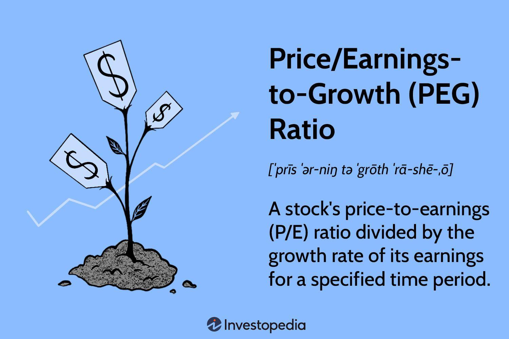

Understanding the true value of a stock is crucial for making informed investment decisions. Stock valuation employs a variety of methods to ascertain the intrinsic value of equities, offering insights into whether a stock is overvalued or undervalued. Among the various metrics used by investors, the PEG (Price/Earnings to Growth) ratio stands out as an essential tool. This metric enhances the traditional P/E ratio by incorporating expected earnings growth, providing a more nuanced perspective of a company's valuation relative to its growth potential.

Simultaneously, algorithmic trading has revolutionized the stock market, facilitating the rapid execution of trades with minimal human intervention. By using computer algorithms, traders can process vast amounts of data to make real-time investment decisions, reducing errors and emotional biases. This article examines how the integration of stock valuation, particularly the PEG ratio, with algorithmic trading practices can optimize investment strategies. Through this combination, investors can refine their analytical approaches and capitalize on market opportunities more efficiently.



## Table of Contents

## Understanding Stock Valuation

Stock valuation is a critical process used by investors to determine whether a stock is overvalued or undervalued, aiding in informed investment decisions. This evaluation is conducted using various methods that aim to estimate the intrinsic value of an equity. 

One widely used technique is the **Discounted Cash Flow (DCF) analysis**, which involves estimating the present value of a company’s expected future cash flows. The formula for DCF is:

$$

\text{DCF} = \sum \left( \frac{C_t}{(1 + r)^t} \right)
$$

where $C_t$ is the cash flow in year $t$, and $r$ is the discount rate. By comparing the DCF result with the current market price, investors can decide if a stock is over or undervalued.

Another method is **Comparative Analysis**, which involves comparing a company's valuation metrics, such as P/E ratios, with those of similar companies in the same industry. This approach helps investors gauge how a stock is valued relative to its peers.

**Intrinsic Value Assessment** compiles various qualitative and quantitative factors, including financial performance, market conditions, and a company's growth prospects. This comprehensive approach provides a holistic view of the stock's value beyond mere financial statements.

Investors are often drawn to stocks that trade below their intrinsic value as these present potential for significant returns. By assessing a stock's financial performance and market outlook, investors can identify opportunities that may not be apparent at first glance. Incorporating value investing principles—buying undervalued stocks with strong fundamentals—can enhance portfolio performance, emphasizing patience and long-term growth.

These valuation methods help investors focus on equities with sound business models trading at discounts, particularly valuable in volatile markets.

## Decoding the PEG Ratio

The PEG ratio, or Price/Earnings to Growth ratio, refines the traditional Price-to-Earnings (P/E) ratio by incorporating the company's earnings growth rate. This adjustment offers a more nuanced view of a stock's valuation by relating its market price to its growth potential. By evaluating how a stock's price compares to its earnings growth, the PEG ratio provides investors with a clearer picture of whether a stock is overvalued or undervalued relative to its growth prospects.

A lower PEG ratio can indicate that a stock is undervalued considering its expected earnings growth, making it a potentially attractive investment opportunity. Conversely, a higher PEG ratio may suggest that the stock's price is high relative to its growth expectations, signaling a potential overvaluation. The formula for calculating the PEG ratio is straightforward:

$$
\text{PEG Ratio} = \frac{\text{P/E Ratio}}{\text{Earnings Growth Rate}}
$$

Where:
- The P/E ratio is the current share price divided by the earnings per share (EPS).
- The earnings growth rate is the projected annual growth rate of the company's earnings.

For example, if a company has a P/E ratio of 20 and an annual earnings growth rate of 10%, the PEG ratio would be:

$$
\text{PEG Ratio} = \frac{20}{10} = 2
$$

In this case, a PEG ratio of 2 suggests that investors are paying twice the company's growth rate per unit of earnings. Understanding the PEG ratio can help investors identify stocks that not only exhibit promising growth prospects but are also valued reasonably in relation to their growth rate. By blending valuation and growth considerations, the PEG ratio serves as a useful tool for making informed investment decisions.

## The Role of Algorithmic Trading

Algorithmic trading employs computer algorithms to swiftly execute trades at high speeds and volumes, revolutionizing how trading occurs in financial markets. It leverages mathematical models and quantitative analysis to identify trading opportunities, systematically analyzing historical data, price movements, and market trends to make informed decisions. This approach minimizes human intervention, significantly reducing errors and emotional biases that typically affect manual trading.

The central advantage of [algorithmic trading](/wiki/algorithmic-trading) is its ability to process multiple market data points simultaneously, thereby enabling traders to make precise investment decisions. Algorithms can analyze vast amounts of data in real-time, providing a significant competitive edge over traditional trading methods. For example, algos can be programmed to detect [arbitrage](/wiki/arbitrage) opportunities, execute pair trades, or track market index trends, optimizing the timing and accuracy of trades.

The advent of [artificial intelligence](/wiki/ai-artificial-intelligence) (AI) and [machine learning](/wiki/machine-learning) has further enhanced algorithmic trading's capabilities. These technologies empower algorithms to learn from historical data, adapt to changing market conditions, and improve decision-making processes. Machine learning techniques, such as supervised learning with methods like random forests or [reinforcement learning](/wiki/reinforcement-learning), allow algorithms to predict price movements more accurately. The evolving nature of AI ensures that trading strategies remain robust and dynamic, adapting to new data and refining predictive models over time.

In essence, algorithmic trading integrates complex computational algorithms and advanced data analysis, offering substantial improvements in trading efficiency, accuracy, and speed. The continuous evolution of AI and machine learning technologies promises ongoing advancements, making it an indispensable tool in modern financial markets.

## Integrating PEG Ratio with Algo Trading

Integrating the PEG ratio into algorithmic trading strategies allows investors to efficiently identify undervalued [growth stocks](/wiki/growth-stocks). This integration combines [fundamental analysis](/wiki/fundamental-analysis) with quantitative techniques, streamlining the process of value investing by automatically filtering stocks based on specific PEG ratio thresholds and other variables.

To implement this approach, algorithms can be constructed to assess stock data in real-time, calculating the PEG ratio and comparing it against predefined criteria. The PEG ratio $\text{PEG} = \frac{\text{P/E Ratio}}{\text{Earnings Growth Rate}}$ is a more nuanced metric than the P/E ratio alone because it accounts for the expected growth of a company, providing a dynamic measure of value that is particularly useful in fast-paced trading environments.

For those utilizing programming languages such as Python, building a basic framework to assess the PEG ratio might look like this:

```python
def calculate_peg_ratio(pe_ratio, earnings_growth_rate):
    if earnings_growth_rate == 0:
        return float('inf')  # handle division by zero
    return pe_ratio / earnings_growth_rate

def filter_stocks_by_peg(stocks_data, peg_threshold):
    undervalued_stocks = []
    for stock in stocks_data:
        peg = calculate_peg_ratio(stock['pe_ratio'], stock['earnings_growth_rate'])
        if peg < peg_threshold:
            undervalued_stocks.append(stock)
    return undervalued_stocks

# Sample data format: [{'ticker': 'AAPL', 'pe_ratio': 15, 'earnings_growth_rate': 10}, ...]
stocks_data = [{'ticker': 'AAPL', 'pe_ratio': 15, 'earnings_growth_rate': 10}, 
               {'ticker': 'GOOG', 'pe_ratio': 20, 'earnings_growth_rate': 15}]
result = filter_stocks_by_peg(stocks_data, peg_threshold=1.5)
print(result)
```

This Python snippet demonstrates how an algorithm could filter stocks based on their PEG ratio, identifying those potentially undervalued. By leveraging real-time market data, traders can use automated systems to execute trades aligning with their investment strategy, quickly acting on favorable PEG ratio indicators.

The shift towards algorithmic solutions not only boosts efficiency but also increases accuracy in decision-making, which is pivotal in today’s high-frequency trading environment. By reducing human error and emotional biases, such systems enable a disciplined approach to capturing value-driven investments, complementing traditional investment analysis with a robust, data-driven methodology.

## Conclusion

The fusion of PEG ratio-derived stock valuation and algorithmic trading offers significant potential for optimizing investment strategies. By combining insights from market valuation with sophisticated trading techniques, investors can achieve a more nuanced analysis of stock opportunities. This integration facilitates not only the identification of undervalued growth stocks but also the execution of trades with precision and speed, taking advantage of real-time data.

To maximize the benefits of this approach, it is essential to focus on careful setup and continuous monitoring of trading algorithms. Proper calibration ensures that these systems can respond effectively to market fluctuations and capture potential investment opportunities as they arise. Additionally, a disciplined approach to algorithm design helps in mitigating risks associated with rapid trades and fluctuating market conditions.

Moreover, the dynamic nature of financial markets necessitates that investors remain informed and adaptive. As new trends and technologies emerge, the capability to integrate updated methodologies into existing systems can provide a competitive edge. Thus, maintaining flexibility in investment strategies and staying abreast of market developments are crucial for leveraging the combined power of PEG ratio analysis and algorithmic trading effectively. This approach promises enhanced efficiency in capitalizing on value-driven opportunities in increasingly complex markets.

## References & Further Reading

[1]: Bergstra, J., Bardenet, R., Bengio, Y., & Kégl, B. (2011). ["Algorithms for Hyper-Parameter Optimization."](https://papers.nips.cc/paper/4443-algorithms-for-hyper-parameter-optimization) Advances in Neural Information Processing Systems 24.

[2]: ["Advances in Financial Machine Learning"](https://www.amazon.com/Advances-Financial-Machine-Learning-Marcos/dp/1119482089) by Marcos Lopez de Prado

[3]: ["Evidence-Based Technical Analysis: Applying the Scientific Method and Statistical Inference to Trading Signals"](https://www.amazon.com/Evidence-Based-Technical-Analysis-Scientific-Statistical/dp/0470008741) by David Aronson

[4]: ["Machine Learning for Algorithmic Trading"](https://github.com/stefan-jansen/machine-learning-for-trading) by Stefan Jansen

[5]: ["Quantitative Trading: How to Build Your Own Algorithmic Trading Business"](https://books.google.com/books/about/Quantitative_Trading.html?id=j70yEAAAQBAJ) by Ernest P. Chan