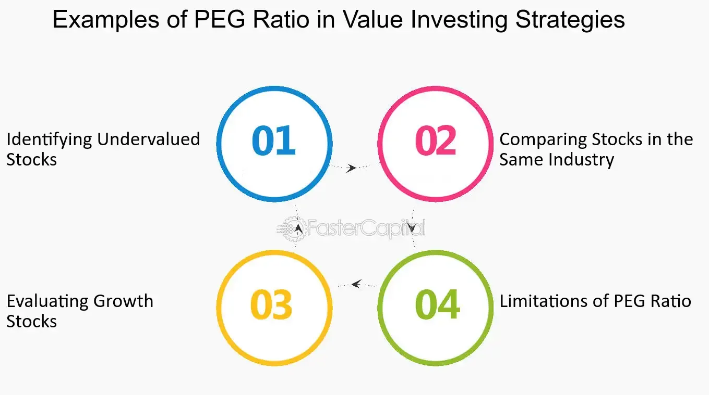

## Table of Contents

## What is the PEG ratio and how is it calculated?

The PEG ratio is a way to measure how much you pay for a company's growth. It stands for Price/Earnings to Growth ratio. This ratio helps investors see if a stock is a good buy by comparing its price to its earnings growth. A lower PEG ratio might mean the stock is undervalued and could be a good investment.

To calculate the PEG ratio, you start with the P/E ratio, which is the stock price divided by the earnings per share. Then, you divide that P/E ratio by the expected earnings growth rate. For example, if a company has a P/E ratio of 15 and its earnings are expected to grow by 5% each year, the PEG ratio would be 15 divided by 5, which equals 3. A PEG ratio of less than 1 is often seen as a sign that the stock might be undervalued.

## Why is the PEG ratio important for identifying value stocks?

The PEG ratio is important for finding value stocks because it tells us if a stock's price is fair when we think about how fast the company is growing. A low PEG ratio can show that a stock might be a good deal. It's like getting a big discount on something that's still growing well. This helps investors spot stocks that others might not see as valuable yet, but could be worth more in the future.

When looking at stocks, the PEG ratio helps us compare them better. Some companies might have high P/E ratios, which could make them seem expensive. But if their growth is also high, the PEG ratio can show that they're actually a good value. By using the PEG ratio, investors can find stocks that are growing fast but are still priced reasonably, which is key to finding value stocks.

## How does the PEG ratio differ from the P/E ratio?

The PEG ratio and the P/E ratio are both used to figure out if a stock is a good buy, but they look at different things. The P/E ratio, or Price to Earnings ratio, tells you how much you're paying for each dollar of a company's earnings. It's calculated by dividing the stock's price by its earnings per share. A lower P/E ratio might mean the stock is cheaper, but it doesn't tell you about the company's growth.

The PEG ratio, or Price/Earnings to Growth ratio, goes a step further by adding in the company's expected growth rate. You find the PEG ratio by dividing the P/E ratio by the expected earnings growth rate. This helps you see if a stock is a good value when you think about how fast the company is growing. A PEG ratio under 1 can mean the stock is undervalued, even if its P/E ratio is high, because the company is growing quickly.

## What is considered a good PEG ratio for a value stock?

A good PEG ratio for a value stock is usually less than 1. This means the stock might be undervalued because its price is low compared to how fast the company is growing. If a company has a PEG ratio below 1, it could be a smart buy because you're getting growth at a good price.

But, what's considered "good" can change depending on the industry and the economy. Sometimes, a PEG ratio a bit higher than 1 can still be okay if the company is in a fast-growing industry or if the economy is doing well. It's always important to look at other things too, like how stable the company is and what's happening in the market, to make sure the PEG ratio gives you a full picture.

## Can the PEG ratio be used effectively for all types of companies?

The PEG ratio can be a helpful tool for many types of companies, but it works best for companies that are growing steadily and predictably. For these companies, the PEG ratio helps investors see if the stock's price is a good deal when you think about how fast the company is growing. If a company is expected to grow a lot, a higher P/E ratio might be okay because the PEG ratio shows that the price is still fair for the growth.

However, the PEG ratio might not be as useful for companies that don't have steady growth or for companies in industries that change a lot. For example, if a company's earnings go up and down a lot, it can be hard to guess the growth rate right. Also, the PEG ratio might not work well for companies that are losing money or are very new because their growth can be hard to predict. So, while the PEG ratio is a good tool, it's best to use it with other ways to look at a company's value.

## How does growth rate impact the PEG ratio and its interpretation?

The growth rate is really important when we look at the PEG ratio because it helps us see if a stock's price is a good deal. The PEG ratio is found by dividing the P/E ratio by the expected growth rate. If a company is growing fast, its PEG ratio will be lower, which can mean the stock is a good value even if its P/E ratio is high. For example, if a company has a P/E ratio of 20 and is expected to grow by 10% each year, its PEG ratio would be 2. But if another company has the same P/E ratio of 20 but is expected to grow by 20% each year, its PEG ratio would be 1. This shows that the second company might be a better value because it's growing faster.

But, we have to be careful with the growth rate because it's just a guess about the future. If the growth rate we use is too high or too low, the PEG ratio won't give us a good picture of the stock's value. Also, some companies might have growth rates that go up and down a lot, which makes it hard to use the PEG ratio. So, while the growth rate is key to the PEG ratio, it's best to use it along with other ways to check if a stock is a good buy.

## What are the limitations of using the PEG ratio in stock valuation?

The PEG ratio can be a helpful tool for figuring out if a stock is a good buy, but it has some problems. One big problem is that the growth rate used in the PEG ratio is just a guess about the future. If the guess is wrong, the PEG ratio won't show the right value of the stock. Also, some companies have growth rates that go up and down a lot, which makes it hard to use the PEG ratio because it's based on a steady growth rate.

Another issue is that the PEG ratio might not work well for all types of companies. For companies that are losing money or are very new, it's tough to predict their growth. The PEG ratio also might not be the best for companies in industries that change a lot because their growth can be hard to guess. So, while the PEG ratio can be useful, it's important to use it with other ways to look at a company's value to get a full picture.

## How can the PEG ratio be combined with other financial ratios to better identify value stocks?

The PEG ratio can be a great tool for finding value stocks, but it works even better when you use it with other financial ratios. One good ratio to use with the PEG ratio is the P/E ratio. The P/E ratio shows how much you're paying for each dollar of the company's earnings. By looking at both the PEG and P/E ratios, you can see if a stock is cheap not just because it's growing fast, but also because its price is low compared to its earnings. Another helpful ratio is the price-to-book (P/B) ratio, which tells you how much the stock costs compared to the company's net assets. A low P/B ratio can mean the stock is a good deal because you're paying less for what the company owns.

Another important ratio to consider is the debt-to-equity (D/E) ratio, which shows how much debt the company has compared to its equity. A high D/E ratio can mean the company is risky because it has a lot of debt. By looking at the PEG ratio along with the D/E ratio, you can see if a stock is a good value but also if it's too risky. Finally, the return on equity (ROE) ratio can help too. ROE tells you how well the company is using the money its shareholders have put in. A high ROE with a low PEG ratio can mean the company is growing well and using its money smartly, making it a strong value stock. By combining the PEG ratio with these other ratios, you get a fuller picture of whether a stock is a good buy.

## What are some real-world examples of using the PEG ratio to identify value stocks?

Imagine you're looking at two companies, Company A and Company B. Company A has a P/E ratio of 15 and is expected to grow its earnings by 10% each year. Its PEG ratio would be 15 divided by 10, which equals 1.5. Company B, on the other hand, has a P/E ratio of 20 but is expected to grow its earnings by 25% each year. Its PEG ratio would be 20 divided by 25, which equals 0.8. Even though Company B has a higher P/E ratio, its lower PEG ratio suggests it might be a better value because it's growing faster for the price.

Now, let's look at another example. Suppose you're interested in a tech company that has a P/E ratio of 30. At first glance, that might seem expensive. But if this company is expected to grow its earnings by 40% each year, its PEG ratio would be 30 divided by 40, which equals 0.75. This PEG ratio under 1 could mean the stock is undervalued, considering its high growth rate. By comparing the PEG ratio with other financial ratios like the P/B ratio or ROE, you can get a fuller picture of whether this tech company is a good value stock.

## How does industry variation affect the application of the PEG ratio?

The PEG ratio can work differently depending on the industry because different industries grow at different speeds. For example, tech companies might grow really fast, so a PEG ratio of 1.5 might still be good for them. But for a slower-growing industry like utilities, a PEG ratio of 1.5 might be too high. So, when you use the PEG ratio, you need to think about what's normal for the industry you're looking at.

Also, some industries change a lot, which can make it hard to guess how fast they'll grow. For example, the healthcare industry can have big changes because of new laws or new medicines. This makes it tough to use the PEG ratio because the growth rate might not be right. So, while the PEG ratio can help you find value stocks, you need to be careful and look at the whole picture, including what's going on in the industry.

## What advanced techniques can be used to adjust the PEG ratio for more accurate stock valuation?

To make the PEG ratio more accurate for figuring out if a stock is a good buy, you can use something called the adjusted PEG ratio. This takes into account not just the expected growth rate, but also how risky the company's earnings are. If a company's earnings go up and down a lot, it's riskier, so you might want to use a lower growth rate in your PEG calculation. This helps you see if the stock is really a good value, even if it looks like it's growing fast.

Another way to adjust the PEG ratio is to look at the company's long-term growth rate instead of just the next year or two. Sometimes, a company might have a high growth rate for a short time, but it might not last. By using a longer-term growth rate, you can get a better idea of whether the stock is a good value over time. This can help you make smarter choices about which stocks to buy, especially if you're planning to hold onto them for a while.

## How has the effectiveness of the PEG ratio in identifying value stocks changed over time?

The PEG ratio has been a useful tool for finding value stocks for a long time, but how well it works has changed over the years. In the past, when information about companies was harder to get, the PEG ratio was a big help because it gave investors a quick way to see if a stock was a good deal when thinking about its growth. But now, with so much more data and better ways to look at companies, the PEG ratio is just one of many tools investors use. It's still helpful, but it's not as special as it used to be because there are now more ways to check if a stock is undervalued.

Today, the PEG ratio can be less effective because the markets are more complex. Companies and industries change faster, making it harder to guess future growth rates right. Also, with more investors using the PEG ratio, stocks that look good based on this ratio might already be priced higher, meaning they're not as much of a bargain as they used to be. So, while the PEG ratio can still help find value stocks, it's best to use it with other ways of looking at a company's value to get the full picture.

## What is the role of the PEG Ratio in stock analysis?

The Price/Earnings-to-Growth (PEG) ratio is a crucial metric in stock analysis, offering a more comprehensive view of a company's valuation by incorporating future growth prospects. The traditional Price-to-Earnings (P/E) ratio provides a snapshot of how much investors are paying for each dollar of earnings, but it does not account for the growth rate of those earnings. This is where the PEG ratio proves advantageous.

The PEG ratio is calculated using the formula:

$$
\text{PEG Ratio} = \frac{\text{P/E Ratio}}{\text{Earnings Growth Rate}}
$$

The earnings growth rate is typically expressed as a percentage. For instance, if a company has a P/E ratio of 15 and an expected annual earnings growth rate of 10%, the PEG ratio would be:

$$
\text{PEG Ratio} = \frac{15}{10} = 1.5
$$

This equation highlights how the PEG ratio incorporates growth, setting it apart from the simpler P/E ratio. A PEG ratio below 1.0 may indicate that a stock is undervalued, as it suggests that the market is not fully pricing in the expected growth. Conversely, a PEG ratio above 1.0 could imply that a stock is overvalued relative to its growth potential.

The usefulness of the PEG ratio is especially pronounced when comparing companies within the same industry, where growth rates can vary significantly. For example, a company with a low P/E ratio but high growth rate may have a more attractive PEG ratio compared to a competitor with a higher P/E ratio and slower growth trajectory.

When employing the PEG ratio in analysis, investors should be mindful of the reliability of earnings growth estimates. These projections can be influenced by numerous factors, including economic conditions, industry trends, and management effectiveness. Therefore, while the PEG ratio can be an informative tool, it should be used in conjunction with other financial analysis methods to provide a more holistic view of a stock's potential value.

## References & Further Reading

[1]: Greenwald, B. C., Kahn, J., Sonkin, P. D., & Van Biema, M. (2001). ["Value Investing: From Graham to Buffett and Beyond"](https://www.amazon.com/Value-Investing-Graham-Buffett-Beyond/dp/0471463396). Wiley Finance.

[2]: Fabozzi, F. J., Focardi, S. M., & Kolm, P. N. (2010). ["Quantitative Equity Investing: Techniques and Strategies"](https://www.semanticscholar.org/paper/Quantitative-Equity-Investing%3A-Techniques-and-Fabozzi-Focardi/1c49a2a53919f7e65cb96f16691b8ff726fd3cd7). Wiley.

[3]: Lopez de Prado, M. (2018). ["Advances in Financial Machine Learning"](https://www.amazon.com/Advances-Financial-Machine-Learning-Marcos/dp/1119482089). Wiley.

[4]: Damodaran, A. (2012). ["Investment Valuation: Tools and Techniques for Determining the Value of Any Asset"](https://books.google.com/books/about/Investment_Valuation.html?id=5SRHAAAAQBAJ). Wiley Finance.

[5]: Jansen, S. (2020). ["Machine Learning for Algorithmic Trading: Predictive models to extract signals from market and alternative data for systematic trading strategies with Python, 2nd Edition"](https://www.amazon.com/Machine-Learning-Algorithmic-Trading-alternative/dp/1839217715). Packt Publishing.

[6]: Chan, E. P. (2009). ["Quantitative Trading: How to Build Your Own Algorithmic Trading Business"](https://github.com/ftvision/quant_trading_echan_book). Wiley Trading.

[7]: Hou, K., Xue, C., & Zhang, L. (2015). ["Digesting Anomalies: An Investment Approach"](https://academic.oup.com/rfs/article/28/3/650/1574802). The Review of Financial Studies, 28(3), pp. 650-705.

[8]: Shreve, S. E. (2004). ["Stochastic Calculus for Finance I: The Binomial Asset Pricing Model"](https://link.springer.com/book/10.1007/978-0-387-22527-2). Springer.

[9]: Nagpal, S. (2020). ["Behavioral Finance and Investor Psychology: An Introduction to Monetary Decision-Making"](https://www.abacademies.org/articles/behavioral-finance-the-psychology-behind-financial-decisionmaking.pdf). Springer.