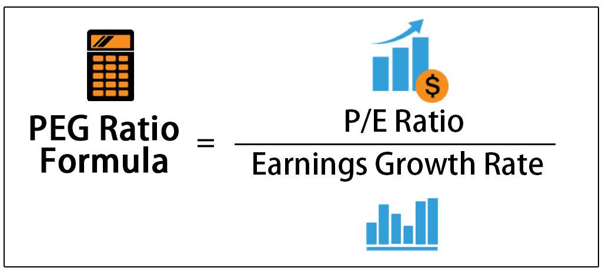

In today's dynamic financial landscape, investors are increasingly focused on identifying undervalued stocks with promising growth potential. Key concepts such as value stocks, stock analysis, the Price/Earnings-to-Growth (PEG) ratio, and algorithmic trading have become essential tools in this pursuit. Understanding and integrating these elements into an investment strategy can equip investors with the ability to make informed decisions, thereby optimizing their portfolios for maximum returns.

Value stocks are typically characterized by low price-to-earnings (P/E) ratios and are perceived to be trading below their intrinsic value. Investors in search of value stocks aim to exploit market inefficiencies, hoping to achieve significant returns as the market corrects these undervaluations. To effectively identify these stocks, a comprehensive stock analysis is essential, involving a review of financial statements and industry trends.



The PEG ratio builds upon the traditional P/E ratio by incorporating expected earnings growth rates, offering a more comprehensive view of a stock's valuation. A PEG ratio below 1.0 may suggest that a stock is undervalued relative to its growth potential, providing a quantitative metric for investors seeking nuanced insights.

Algorithmic trading further enhances the application of these concepts by employing computational models to automate trading decisions. Algorithms use predefined criteria, such as PEG and P/E ratios, to swiftly identify and trade stocks that meet specific valuation benchmarks. This approach minimizes emotional biases, ensuring data-driven, disciplined investment strategies. With the rise of accessible trading platforms, algorithmic trading is no longer the purview of institutional investors alone but is increasingly available to retail investors, democratizing these advanced techniques.

This article aims to provide insights into the intersection of value stocks, stock analysis, and algorithmic trading, highlighting their role in stock valuation. Whether you are an individual investor or a financial professional, understanding these nuanced tools and strategies is vital for navigating today's complex financial markets.

## Table of Contents

## Understanding Value Stocks

Value stocks are equities that are perceived by investors to be trading below their intrinsic value—their true worth based on financial analysis and factual data rather than market price. Typically, these stocks exhibit lower price-to-earnings (P/E) ratios compared to [growth stocks](/wiki/growth-stocks), which reflects a market valuation that may not fully recognize their earnings potential. For an investor seeking value stocks, the primary goal is to identify companies that have been underestimated by the market. Such a mispricing provides the opportunity for greater returns when the market eventually adjusts and recognizes the stock's true value.

A thorough analysis of financial statements serves as one of the cornerstone activities in effectively identifying value stocks. This includes examining balance sheets, income statements, and cash flow statements to assess a company's financial health and performance capabilities. Key financial metrics that are often scrutinized include the price-to-book (P/B) ratio, which compares a company's market value to its book value, and the dividend yield, which measures the dividends paid out to shareholders relative to the stock price. A low P/B ratio might indicate that the stock is undervalued, while a high dividend yield can be attractive to investors looking for steady income in addition to potential valuation recovery.

Consistent earnings are another critical indicator when evaluating a stock's intrinsic value. Companies that exhibit stable and recurring earnings demonstrate resilience and operational strength, which can be a compelling sign of undervaluation if their market price does not reflect this consistency. Investors may also analyze industry trends to understand broader economic factors that could impact company performance and, consequently, stock value.

Value investing requires patience and adherence to a long-term investment horizon. It is not uncommon for the market to take extended periods to correct any mispricing. During this time, changes in company performance, industry dynamics, or investor perception can result in price modifications. Thus, value investors often exercise a strategy that involves buying and holding undervalued stocks over the long term, waiting for the market to align with their valuation assessment.

In practical terms, investors might employ financial models or software tools to simulate various scenarios and project future performance. Python, for example, is a popular language for financial modeling:

```python
def calculate_intrinsic_value(earnings, growth_rate, discount_rate):
    return earnings * (1 + growth_rate) / (discount_rate - growth_rate)

# Example calculation
earnings = 5.0 # hypothetical earnings per share
growth_rate = 0.04 # 4% annual growth
discount_rate = 0.06 # 6% discount rate
intrinsic_value = calculate_intrinsic_value(earnings, growth_rate, discount_rate)
print(f"The intrinsic value per share is ${intrinsic_value:.2f}")
```

Using such models can aid investors in determining whether a stock is truly a value stock by comparing estimated intrinsic values with market prices.

## Stock Analysis: The Role of the PEG Ratio

The Price/Earnings-to-Growth (PEG) ratio is a crucial metric in stock analysis, offering a more comprehensive view of a company's valuation by incorporating future growth prospects. The traditional Price-to-Earnings (P/E) ratio provides a snapshot of how much investors are paying for each dollar of earnings, but it does not account for the growth rate of those earnings. This is where the PEG ratio proves advantageous.

The PEG ratio is calculated using the formula:

$$
\text{PEG Ratio} = \frac{\text{P/E Ratio}}{\text{Earnings Growth Rate}}
$$

The earnings growth rate is typically expressed as a percentage. For instance, if a company has a P/E ratio of 15 and an expected annual earnings growth rate of 10%, the PEG ratio would be:

$$
\text{PEG Ratio} = \frac{15}{10} = 1.5
$$

This equation highlights how the PEG ratio incorporates growth, setting it apart from the simpler P/E ratio. A PEG ratio below 1.0 may indicate that a stock is undervalued, as it suggests that the market is not fully pricing in the expected growth. Conversely, a PEG ratio above 1.0 could imply that a stock is overvalued relative to its growth potential.

The usefulness of the PEG ratio is especially pronounced when comparing companies within the same industry, where growth rates can vary significantly. For example, a company with a low P/E ratio but high growth rate may have a more attractive PEG ratio compared to a competitor with a higher P/E ratio and slower growth trajectory.

When employing the PEG ratio in analysis, investors should be mindful of the reliability of earnings growth estimates. These projections can be influenced by numerous factors, including economic conditions, industry trends, and management effectiveness. Therefore, while the PEG ratio can be an informative tool, it should be used in conjunction with other financial analysis methods to provide a more holistic view of a stock's potential value.

## How Algorithmic Trading Uses the PEG Ratio

Algorithmic trading revolutionizes investment strategies by automating decision-making processes using predefined rules and large datasets. Among the metrics commonly employed in these automated systems are the Price/Earnings-to-Growth (PEG) and Price/Earnings (P/E) ratios. These ratios serve as crucial inputs in the algorithms designed to evaluate and select stocks based on their intrinsic and relative value.

Advanced computational models enable algorithms to rapidly analyze massive quantities of financial data, pinpointing stocks that meet specific valuation criteria. This analytical capability facilitates the swift execution of trades, enhancing precision and maximizing potential returns. Such speed and accuracy are unattainable through manual trading, providing a competitive edge to algorithmic traders.

One of the key advantages of [algorithmic trading](/wiki/algorithmic-trading) is its ability to eliminate emotional biases that often plague human investors. Emotional decision-making can lead to inconsistent trading patterns and suboptimal outcomes. By relying solely on data-driven insights, algorithmic strategies establish a disciplined approach to investing. This objectivity ensures that trading decisions are based on quantitative factors rather than subjective judgments or market sentiments.

The proliferation of algorithmic trading has empowered a diverse array of investors, from large institutional entities to individual retail investors. With the advent of accessible platforms and advanced technologies, sophisticated trading strategies that were once exclusive to major financial firms are now available to a broader population. These platforms provide users with the tools and infrastructure needed to implement complex algorithms, democratizing access to powerful investment techniques.

Algorithmic trading platforms often include features that facilitate the utilization of the PEG ratio in stock analysis. For instance, algorithms can be scripted to identify stocks with a PEG ratio below a prescribed threshold, indicating potential undervaluation relative to expected earnings growth. Such scripts may look like the following Python code snippet:

```python
# Example python code to filter stocks by PEG ratio
import pandas as pd

# Sample dataframe with stock data
data = {'Stock': ['A', 'B', 'C', 'D'],
        'Price': [100, 200, 50, 300],
        'Earnings': [10, 20, 5, 15],
        'Growth_Rate': [0.10, 0.15, 0.05, 0.20]}

df = pd.DataFrame(data)

# Calculate P/E and PEG ratios
df['PE_Ratio'] = df['Price'] / df['Earnings']
df['PEG_Ratio'] = df['PE_Ratio'] / df['Growth_Rate']

# Filter stocks with PEG ratio below 1.0
undervalued_stocks = df[df['PEG_Ratio'] < 1.0]

print(undervalued_stocks)
```

This code calculates the P/E and PEG ratios for a set of stocks and filters those deemed undervalued based on a PEG ratio criterion. By automating these calculations, traders can swiftly react to emerging market opportunities.

Ultimately, the fusion of algorithmic trading with financial metrics like the PEG ratio offers a streamlined method for navigating market complexities. This integration not only enhances trading efficiency but also provides a robust framework for making informed and objective investment decisions, catering to the evolving needs and capabilities of modern investors.

## Real-World Applications and Case Studies

Numerous investment firms have leveraged the power of PEG ratio-based algorithmic trading strategies to enhance their portfolio management techniques. By integrating quantitative metrics like the PEG ratio, these strategies provide a nuanced approach to stock valuation, aiding in the identification of undervalued stocks with substantial growth potential.

The application of algorithmic trading, coupled with the PEG ratio, allows for data-driven decision-making. Algorithms process vast datasets to uncover patterns and insights that are not readily apparent through traditional analysis. For instance, by setting predefined criteria, such as a PEG ratio below 1.0, trading algorithms can systematically scan the market to identify stocks that may be undervalued relative to their growth prospects.

Case studies have shown that firms employing such strategies can achieve optimized returns while managing risk effectively. One such example involved an investment firm that implemented algorithmic trading techniques focusing on small-cap stocks with PEG ratios indicating undervaluation. The firm relied on historical data to backtest and refine its algorithms, ensuring robustness across various market conditions. This rigorous approach enabled the firm to capitalize on market corrections and achieve above-average returns.

Backtesting is a critical component in the development of these algorithms. It involves simulating the algorithm's performance on historical data to assess its viability and adaptability. Successful [backtesting](/wiki/backtesting) allows firms to fine-tune their trading strategies, minimizing risk and maximizing returns by identifying potential pitfalls and areas for improvement.

These case studies highlight the significant role of data-driven insights and advanced technologies in modern investment practices. By integrating sophisticated algorithms with quantitative metrics like the PEG ratio, investment firms can achieve a competitive edge, ensuring more informed and strategic decision-making processes. This synthesis of technology and finance is transforming the way investment portfolios are managed, providing a template for future innovation in the financial sector.

## Conclusion

Understanding and utilizing value stocks, stock analysis through Price/Earnings-to-Growth (PEG) ratios, and algorithmic trading are crucial components of a comprehensive investment strategy. These elements collectively provide a robust framework for evaluating potential investments, thereby aiding investors in making informed decisions. Value stocks, often undervalued by the market, present opportunities for substantial returns. However, solely relying on metrics like P/E and PEG ratios may present an incomplete picture, as these ratios need to be assessed in conjunction with broader financial analyses and a thorough understanding of market conditions.

Algorithmic trading represents a significant advancement in investment strategies. By implementing data-driven methods, investors can markedly enhance the accuracy and objectivity of their decision-making processes. The automation offered by algorithmic trading systems minimizes emotional biases and ensures a disciplined approach, leveraging advanced computational capabilities to react promptly to market dynamics.

Mastering these tools and concepts is essential for investors aiming to navigate the complexities of today's fast-paced financial markets. The effective integration of value stock analysis, PEG ratios, and algorithmic trading can optimize investment outcomes by identifying lucrative opportunities while managing risk. As financial markets evolve, ongoing education and adaptation to new technological advancements remain crucial. Investors who commit to continuous learning and embrace emerging technologies are better positioned to achieve long-term investment success, thereby maintaining a competitive edge in an ever-changing market landscape.

## References & Further Reading

[1]: Greenwald, B. C., Kahn, J., Sonkin, P. D., & Van Biema, M. (2001). ["Value Investing: From Graham to Buffett and Beyond"](https://www.amazon.com/Value-Investing-Graham-Buffett-Beyond/dp/0471463396). Wiley Finance.

[2]: Fabozzi, F. J., Focardi, S. M., & Kolm, P. N. (2010). ["Quantitative Equity Investing: Techniques and Strategies"](https://www.semanticscholar.org/paper/Quantitative-Equity-Investing%3A-Techniques-and-Fabozzi-Focardi/1c49a2a53919f7e65cb96f16691b8ff726fd3cd7). Wiley.

[3]: Lopez de Prado, M. (2018). ["Advances in Financial Machine Learning"](https://www.amazon.com/Advances-Financial-Machine-Learning-Marcos/dp/1119482089). Wiley.

[4]: Damodaran, A. (2012). ["Investment Valuation: Tools and Techniques for Determining the Value of Any Asset"](https://books.google.com/books/about/Investment_Valuation.html?id=5SRHAAAAQBAJ). Wiley Finance.

[5]: Jansen, S. (2020). ["Machine Learning for Algorithmic Trading: Predictive models to extract signals from market and alternative data for systematic trading strategies with Python, 2nd Edition"](https://www.amazon.com/Machine-Learning-Algorithmic-Trading-alternative/dp/1839217715). Packt Publishing.

[6]: Chan, E. P. (2009). ["Quantitative Trading: How to Build Your Own Algorithmic Trading Business"](https://github.com/ftvision/quant_trading_echan_book). Wiley Trading.

[7]: Hou, K., Xue, C., & Zhang, L. (2015). ["Digesting Anomalies: An Investment Approach"](https://academic.oup.com/rfs/article/28/3/650/1574802). The Review of Financial Studies, 28(3), pp. 650-705.

[8]: Shreve, S. E. (2004). ["Stochastic Calculus for Finance I: The Binomial Asset Pricing Model"](https://link.springer.com/book/10.1007/978-0-387-22527-2). Springer.

[9]: Nagpal, S. (2020). ["Behavioral Finance and Investor Psychology: An Introduction to Monetary Decision-Making"](https://www.abacademies.org/articles/behavioral-finance-the-psychology-behind-financial-decisionmaking.pdf). Springer.