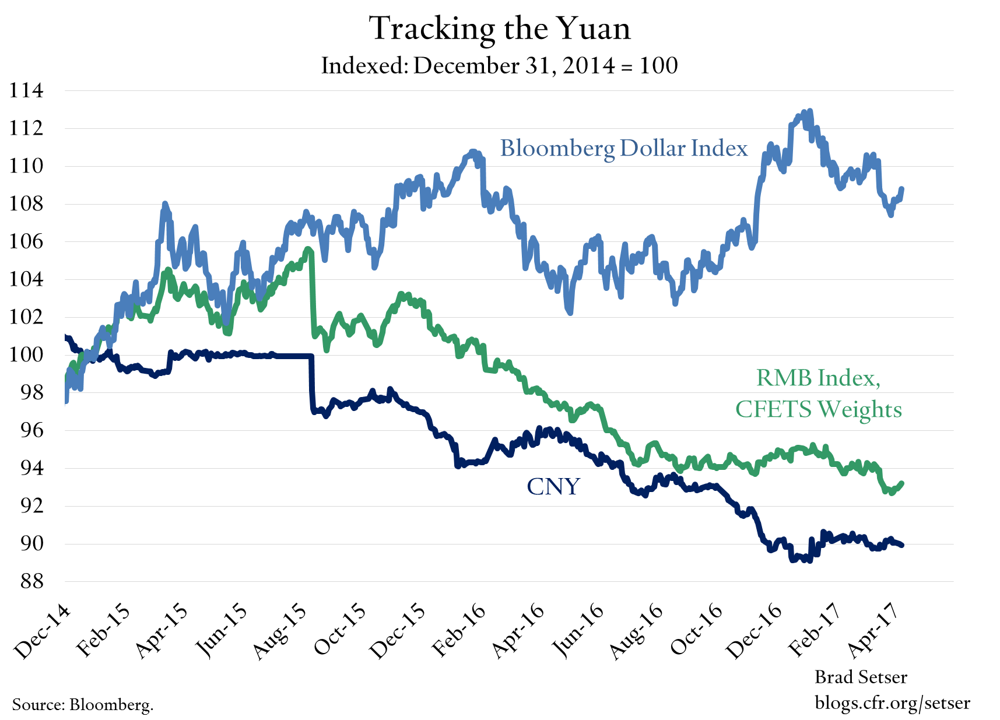

## Table of Contents

## What is the Chinese Yuan?

The Chinese Yuan, also known as the Renminbi, is the official currency of the People's Republic of China. It is used every day by people in China to buy things like food, clothes, and other goods. The symbol for the Yuan is ¥, and it is often written as CNY. The Yuan is managed by China's central bank, called the People's Bank of China.

The Yuan is important not just in China but around the world because China is a big country with a lot of trade. Many countries do business with China, so they need Yuan to buy Chinese products. The value of the Yuan can change, and this can affect the price of things that are traded between China and other countries. The Chinese government tries to keep the Yuan stable to help its economy grow.

## What does 'pegging' a currency mean?

When a country 'pegs' its currency, it means they fix the value of their money to another country's money or to something like gold. For example, if China pegs the Yuan to the US dollar, they decide that one Yuan will always be worth a certain amount of US dollars. This helps make the value of the Yuan more predictable and can make it easier for people to do business with China.

Pegging a currency can be good because it can make trade easier and help control inflation. But it can also be hard to keep the peg in place. If the economy changes a lot, the country might have to use a lot of its money to keep the peg, which can be tough. Sometimes, countries have to change or remove the peg if it becomes too hard to maintain.

## Why does China peg the Yuan to the US dollar?

China pegs the Yuan to the US dollar to make trade easier. Since the US dollar is used a lot around the world, pegging the Yuan to it helps Chinese businesses know how much their products will cost in other countries. This makes it simpler for them to sell things like toys, electronics, and clothes to people in the US and other places. It also helps keep the prices of these products steady, which is good for both buyers and sellers.

Another reason is to control inflation. Inflation is when prices go up over time. By pegging the Yuan to the US dollar, China can help keep its own prices from going up too fast. This is important because if prices rise too quickly, it can make life harder for people in China. So, pegging the Yuan helps the Chinese government keep the economy stable and protect its people from big price changes.

## How has the peg of the Chinese Yuan evolved over time?

The Chinese Yuan's peg to the US dollar has changed a lot over time. At first, in the 1990s, China set a strict peg where one Yuan was always worth about 8.28 US dollars. This made trade easier and helped control inflation. But as China's economy grew bigger and more important in the world, this strict peg started to cause problems. It was hard for China to keep the Yuan's value the same when the US dollar's value changed a lot.

In 2005, China decided to change the way it pegged the Yuan. Instead of a strict peg, they started using a "managed float" system. This meant the Yuan's value could move a little bit each day, but the Chinese government still had control over it. They did this to make the Yuan's value more flexible and to help China's economy grow even more. Since then, the Yuan has been allowed to change more, but the government still steps in to keep it stable when needed.

## What are the economic benefits of pegging the Yuan for China?

Pegging the Yuan to the US dollar helps China's economy in many ways. One big benefit is that it makes trade easier. When the Yuan is pegged to the dollar, Chinese businesses know how much their products will cost in the US and other countries that use the dollar. This makes it simpler for them to sell things like toys, clothes, and electronics. It also helps keep prices steady, which is good for both buyers and sellers. If the Yuan's value stays the same, businesses can plan better and make more money.

Another benefit is that pegging the Yuan helps control inflation. Inflation is when prices go up over time. By keeping the Yuan's value tied to the US dollar, China can stop its own prices from going up too fast. This is important because if prices rise quickly, it can make life harder for people in China. So, pegging the Yuan helps the Chinese government keep the economy stable and protect its people from big price changes. This stability can help China's economy grow stronger over time.

## What are the potential drawbacks of pegging the Yuan?

One big problem with pegging the Yuan is that it can be hard to keep the peg in place. If the economy changes a lot, China might have to use a lot of its money to keep the Yuan's value the same. This can be tough and might make it harder for China to do other important things with its money. Also, if the US dollar's value changes a lot, it can make it even harder for China to keep the Yuan pegged to it. This can cause problems for China's economy.

Another drawback is that pegging the Yuan can stop China from making its own money policies. When the Yuan is pegged to the US dollar, China has to follow what the US does with its money. This can be a problem if what's good for the US isn't good for China. For example, if the US raises its interest rates, China might have to do the same, even if it's not the best thing for its own economy. This can make it harder for China to grow and take care of its people.

## How does the pegging of the Yuan affect international trade?

When China pegs the Yuan to the US dollar, it makes international trade easier. Businesses in China know how much their products will cost in countries that use the dollar. This helps them sell things like toys, clothes, and electronics to people in the US and other places. It also keeps prices steady, which is good for both buyers and sellers. If the Yuan's value stays the same, businesses can plan better and make more money. This can help China's economy grow and make it easier for other countries to buy Chinese products.

But pegging the Yuan can also cause problems for international trade. If the US dollar's value changes a lot, it can be hard for China to keep the Yuan's value the same. This can make it tough for China to do business with other countries. Also, if the US changes its money policies, like raising interest rates, China might have to do the same. This can be bad for China's economy if it's not what China needs. So, while pegging the Yuan can help with trade, it can also make things more complicated and harder to manage.

## What role does the People's Bank of China play in maintaining the peg?

The People's Bank of China, which is China's central bank, is very important for keeping the Yuan pegged to the US dollar. They watch the value of the Yuan every day and make sure it stays close to the value they want. If the Yuan starts to go up or down too much, the People's Bank of China steps in. They might buy or sell US dollars to change the Yuan's value and keep it stable. This helps make sure that the Yuan stays at the right level, which is good for China's economy and for trade with other countries.

Sometimes, keeping the peg can be hard work. The People's Bank of China has to use a lot of money to buy or sell US dollars. This can be tough, especially if the US dollar's value changes a lot. But the People's Bank of China tries its best to keep the Yuan stable. They do this because a stable Yuan helps control inflation and makes it easier for Chinese businesses to sell things to other countries. So, the People's Bank of China plays a big role in making sure the peg works well and helps China's economy grow.

## How does the Yuan's peg impact global currency markets?

When China pegs the Yuan to the US dollar, it can affect the whole world's money markets. Because China is a big country with a lot of trade, what happens to the Yuan can change how other countries' money works. If the Yuan stays stable, it can make other countries' money more predictable too. This is good for businesses all over the world because they can plan better and know how much things will cost. But if China has to use a lot of money to keep the Yuan's value the same, it can make other countries' money move around more. This can make it harder for businesses to plan and can cause more ups and downs in the world's money markets.

The peg can also affect how much people want to buy and sell different kinds of money. If the Yuan is pegged to the US dollar, people might want to buy more US dollars because they know the Yuan will stay the same. This can make the US dollar's value go up. But if the US dollar's value changes a lot, it can be hard for China to keep the Yuan's value the same. This can make people less sure about buying and selling money, which can cause more changes in the world's money markets. So, the Yuan's peg can make the world's money markets more stable or more unpredictable, depending on what's happening.

## What are the implications of the Yuan's peg on China's monetary policy?

When China pegs the Yuan to the US dollar, it affects how China can use its own money policies. Pegging the Yuan means China has to follow what the US does with its money. For example, if the US raises its interest rates, China might have to do the same, even if it's not good for China's economy. This can make it hard for China to do what's best for its own people. It can also stop China from making its own decisions about money, like how much money to print or how to control inflation.

But pegging the Yuan also helps China in some ways. It makes the Yuan's value more predictable, which helps control inflation. If the Yuan's value stays the same, prices in China don't go up too fast. This is good for people in China because it makes life more stable. It also helps Chinese businesses know how much their products will cost in other countries, which makes trade easier. So, while pegging the Yuan can limit China's money policies, it also helps keep the economy stable and helps with trade.

## How do other countries view the pegging of the Chinese Yuan?

Other countries have mixed feelings about China pegging the Yuan to the US dollar. Some countries think it's good because it makes trade easier. When the Yuan's value stays the same, businesses in other countries know how much Chinese products will cost. This helps them plan better and can make it easier to buy things from China. Countries that do a lot of business with China, like the US and many in Europe, can benefit from this stability.

But some countries worry that pegging the Yuan gives China an unfair advantage. They think China can keep the Yuan's value low on purpose to make its products cheaper and sell more of them. This can hurt businesses in other countries because they have to compete with cheaper Chinese goods. Some countries, especially those with big economies like the US, have asked China to let the Yuan's value change more freely. They believe this would make trade fairer for everyone.

## What future scenarios could lead to changes in the Yuan's peg?

Changes in the Yuan's peg could happen if China's economy grows a lot more. As China gets bigger and more important in the world, it might want to let the Yuan's value change more freely. This could help China make its own money policies without having to follow what the US does. If China's leaders think this would be better for their people and their economy, they might decide to change the peg. This could make the Yuan's value go up or down more, which could affect trade and prices in China.

Another thing that could change the Yuan's peg is if there are big problems in the world's money markets. If the US dollar's value changes a lot, it can be hard for China to keep the Yuan's value the same. If this happens, China might have to use a lot of money to keep the peg, which can be tough. If it gets too hard, China might decide to let the Yuan's value change more. This could make the world's money markets more unpredictable, but it might also help China deal with big changes better.

## References & Further Reading

[1]: Krugman, P. (1995). ["Currencies and Crises."](https://mitpress.mit.edu/9780262611091/currencies-and-crises/) MIT Press.

[2]: Katz, L. F. (2019). ["The Market for Forex Trading: The Role of Algorithms."](https://scholar.google.com/citations?user=MAqEdFMAAAAJ) Journal of Financial Markets.

[3]: Hull, J. C. (2018). ["Options, Futures, and Other Derivatives (9th Edition)."](https://edisciplinas.usp.br/pluginfile.php/5278790/mod_resource/content/1/Hull%20J.C.-Options%2C%20Futures%20and%20Other%20Derivatives_9th%20edition.pdf) Pearson Education Limited.

[4]: People's Bank of China. ["Monetary Policy Report."](http://www.pbc.gov.cn/en/3688229/3688353/3688356/5188141/5463528/index.html) People's Bank of China official website.

[5]: Obstfeld, M., & Rogoff, K. (1995). ["The Mirage of Fixed Exchange Rates."](https://pubs.aeaweb.org/doi/pdfplus/10.1257/jep.9.4.73) Journal of Economic Perspectives.

[6]: Ma, G. & McCauley, R. N. (2011). ["The Evolving Renminbi Regime and Implications for Asian Currency Stability."](https://papers.ssrn.com/sol3/papers.cfm?abstract_id=1699782) Bank for International Settlements.

[7]: Jansen, Stefan. ["Machine Learning for Algorithmic Trading."](https://github.com/stefan-jansen/machine-learning-for-trading) 

[8]: Chan, Ernest P. ["Quantitative Trading: How to Build Your Own Algorithmic Trading Business."](https://github.com/ftvision/quant_trading_echan_book) 

[9]: De Prado, Marcos L. ["Advances in Financial Machine Learning."](https://www.amazon.com/Advances-Financial-Machine-Learning-Marcos/dp/1119482089)

[10]: Aronson, David R. ["Evidence-Based Technical Analysis: Applying the Scientific Method and Statistical Inference to Trading Signals."](https://www.amazon.com/Evidence-Based-Technical-Analysis-Scientific-Statistical/dp/0470008741)