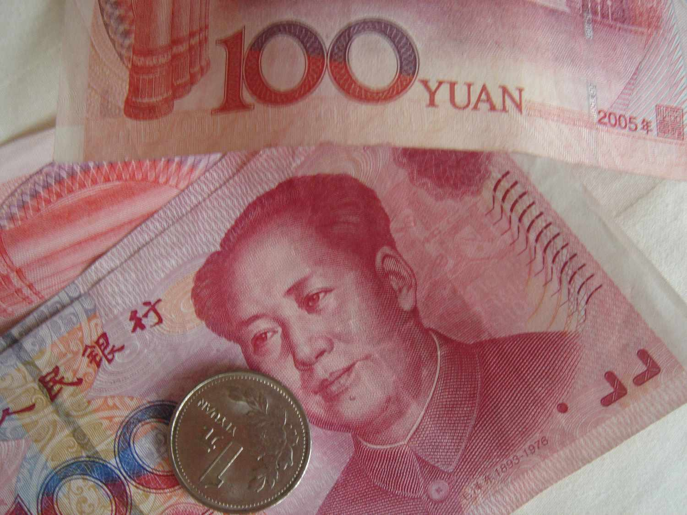

The Chinese Yuan (CNY) plays a crucial role in the global economy as China's currency underpins the economic activities of the world's second-largest economy. As China has emerged as a key player in international trade, the Yuan has gained prominence as a pivotal currency in global financial markets. The Yuan's significance is further highlighted by China's vast export economy and its substantial influence on worldwide supply chains, making the currency an important factor in global economic stability and growth.

Currency pegging is a monetary policy wherein a country maintains its currency's exchange rate at a fixed rate relative to another currency, often a leading currency like the U.S. dollar or a basket of currencies. Historically, currency pegs have been adopted to stabilize exchange rates, facilitate international trade, and mitigate the risks of currency fluctuations. By fixing its currency's value, a country can reduce volatility in its export prices and create a more predictable economic environment for businesses and investors.



Algorithmic trading, a method of executing trades using pre-set rules or algorithms, has revolutionized modern financial markets. This trading strategy leverages computational power to analyze vast datasets, identify trading opportunities, and execute orders at speeds and precisions beyond human capabilities. In currency markets, algorithmic trading can influence price discovery, market liquidity, and volatility, thus playing a critical role in the contemporary financial landscape.

The purpose of this article is to explore how the valuation of the Yuan is influenced by its currency peg and the ramifications of algorithmic trading. We will examine the mechanics of China's currency strategy, its effects on the global economy, and the emerging challenges and opportunities presented by algorithmic trading in currency markets. Through this analysis, we aim to shed light on the intricate dynamics of currency management and its implications for global financial systems.

## Table of Contents

## What is Currency Pegging?

Currency pegging, also known as a fixed exchange rate system, is a monetary policy mechanism wherein a country's currency value is tied or pegged to another major currency or a basket of currencies. This ensures stability in exchange rates, reducing foreign exchange risk and promoting trade and investment. Historically, currency pegs have been used to provide monetary stability in economies still developing their financial infrastructure or those experiencing high volatility. A notable example was the Bretton Woods system, established in 1944, which pegged world currencies to the U.S. dollar, which itself was convertible into gold.

The mechanics of currency pegging involve a central bank committing to buy or sell its currency at a fixed rate relative to the pegged currency. When the market value of the currency deviates from the desired exchange rate, the central bank intervenes by either increasing or decreasing the supply of its currency. For example, if the domestic currency depreciates, the central bank can use its reserves to purchase it, thereby increasing demand and raising its value back to the peg.

China's currency pegging strategy, initially established in 1994, primarily tied the Renminbi (Yuan) to the U.S. dollar. This fixed exchange rate helped stabilize China's economy, making its export-driven economy more competitive by eliminating currency-related trade uncertainties. The practice allowed Chinese goods to remain attractively priced on the global market, fostering economic growth and industrial expansion.

In 2005, China transitioned to a more flexible exchange rate mechanism by pegging the Yuan to a basket of currencies instead of solely the U.S. dollar. This basket included major currencies, providing a more balanced reflection of China's global trade partners and diversifying risk. The People's Bank of China, China's central bank, manages this peg, allowing the Yuan to fluctuate within a narrow range around the basket's value. This strategic move aimed to grant China greater monetary policy autonomy and facilitate gradual integration into the global financial system while still retaining some control over exchange rate [volatility](/wiki/volatility-trading-strategies).

## The Chinese Yuan’s Currency Peg

China's currency strategy involves maintaining a peg for the Yuan (CNY) for several strategic reasons tied to both domestic economic policy and international trade relations. This currency peg system, historically linked to the U.S. dollar but now associated with a basket of global currencies, provides a mechanism for China to stabilize its currency amidst fluctuating international markets and enhance its economic growth.

One primary reason for maintaining this peg is to ensure the competitiveness of Chinese exports. By controlling the value of the Yuan, China can keep its export prices stable and often lower relative to its competitors. This strategy supports China's manufacturing base by making Chinese goods more attractive on the global market, thus driving export-led economic growth. A stable and often undervalued Yuan translates into more predictable and lower costs for international buyers, fostering long-term trade relationships.

The currency peg also plays a crucial role in global trade and economic relations as it provides predictability to international market participants about China’s future economic policies. For global investors and trading partners, the stabilization of the Yuan through a peg reduces the risks associated with foreign exchange volatility. This reduction in volatility not only promotes foreign investment but also enhances confidence in trading arrangements. 

Moreover, by pegging its currency, China can strategically manage its foreign exchange reserves, ensuring they are sufficiently robust to withstand international financial shocks. This capability allows China to respond flexibly to global economic changes without sudden and destabilizing shifts in its exchange rates. In doing so, the currency peg serves as a tool for macroeconomic management, allowing China to adjust its monetary policy to align with its broader domestic economic objectives, like controlling inflation and managing employment levels.

The competitiveness gained through the currency peg raises critical dialogue regarding trade imbalances. Critics argue that by artificially managing the Yuan’s value, China may contribute to persistent trade surpluses, which can strain economic relations with trade partners who may see this as an unfair trade practice. Nevertheless, China's pegging strategy comprises not only safeguarding its economic interests but also a delicate balancing act in international diplomacy, aimed at maintaining stable economic growth while managing its position in the complex tapestry of global trade networks.

## Yuan Valuation and Economic Implications

The People's Bank of China (PBOC) plays a pivotal role in maintaining the currency peg of the Chinese Yuan (CNY). It operates primarily by intervening in the foreign exchange market to set a controlled exchange rate. This process usually involves buying or selling Yuan in exchange for foreign currencies, especially during periods of excessive volatility. By doing so, the central bank ensures that the Yuan remains within a predetermined range against a basket of currencies, which includes the U.S. dollar, euro, and others. This practice has significant implications for China's economy, affecting everything from trade balances to investment flows.

The valuation of the Yuan is integral to China's economic strategy. By keeping the Yuan's value pegged at a competitive level, the PBOC enhances China's trade surplus. A weaker Yuan makes Chinese exports cheaper and more attractive on the global market while making imports more expensive. This dynamic fosters a favorable environment for Chinese manufacturers and contributes to a significant trade surplus. The persistent trade surplus provides China with a steady influx of foreign currency reserves, which act as a buffer against economic instability and strengthen the nation's financial position globally.

Yuan valuation fluctuations, although managed, can have various economic implications. When the PBOC adjusts the peg, even minor fluctuations can result in significant changes in capital flow. For instance, a lowered Yuan value can stimulate an increase in export-driven industries, potentially boosting employment and GDP growth. Conversely, an overvalued Yuan could harm export competitiveness, adversely affecting economic growth.

The pegged exchange rate setup presents both benefits and challenges. For China, this system supports its export-driven economic model by ensuring price stability in international markets. It allows Chinese goods and services to remain competitively priced, supporting economic growth and maintaining employment. For China's trading partners, however, the benefits are mixed. While consumers in import-reliant countries can access a wide range of affordable products, industries competing with Chinese imports may face significant pressure, leading to calls for tariffs or other protective measures.

The pegged rate generates a complex web of economic relations. Countries with substantial trade deficits with China may argue that the controlled Yuan inflates their deficits by making Chinese goods unfairly cheap. Such tensions can lead to trade disputes or weaken diplomatic ties, as trade partners advocate for a more flexible Yuan valuation that reflects true market dynamics.

In conclusion, the People's Bank of China's management of the Yuan's currency peg significantly influences both national and global economic landscapes. It ensures China's competitive edge in the international market, though not without sparking debate and tension among global trade partners. The ongoing balance between a controlled Yuan valuation and economic neccessities continues to shape China's strategies and global economic interactions.

## Algorithmic Trading and the Yuan

Algorithmic trading, characterized by the use of complex algorithms to execute trades based on predefined criteria, plays a significant role in modern financial markets, including currency exchanges. In currency markets, where precision and speed are paramount, [algorithmic trading](/wiki/algorithmic-trading) systems analyze a plethora of data to capitalize on market inefficiencies. Its application in the currency markets is vast, covering areas such as order execution, [arbitrage](/wiki/arbitrage), and [market making](/wiki/market-making).

In the context of the Chinese Yuan (CNY), algorithmic trading systems must account for the currency's unique characteristics, particularly its managed exchange rate mechanism. China's Yuan is not fully allowed to float freely but is pegged to a basket of foreign currencies, with the People's Bank of China (PBoC) setting a daily reference rate around which the Yuan can trade within a limited band.

### Analyzing and Responding to the Yuan’s Fixed Exchange Rate

Algorithms designed for trading the Yuan need to incorporate the daily reference rate set by the PBoC and track the currency's movement within its established band. Such algorithms are optimized to detect patterns and anomalies around this fixed exchange rate system. Typically, these algorithms will use historical data, real-time market information, and macroeconomic indicators to forecast short-term fluctuations and identify arbitrage opportunities. Python, with libraries like NumPy, pandas, and scikit-learn, is often used to develop these algorithms due to its powerful data processing capabilities.

Here's a basic Python example to illustrate how one might programmatically track exchange rate movements:

```python
import numpy as np
import pandas as pd

# Hypothetical historical exchange rate data
exchange_rate_data = pd.DataFrame({
    'date': pd.date_range(start='2023-01-01', periods=10),
    'CNY_rate': np.random.normal(loc=6.5, scale=0.02, size=10)  # Assume normal distribution of rates
})

# Function to calculate moving average and identify deviations
def moving_average(data, window_size):
    return data.rolling(window=window_size).mean()

exchange_rate_data['moving_avg'] = moving_average(exchange_rate_data['CNY_rate'], window_size=3)
exchange_rate_data['deviation'] = exchange_rate_data['CNY_rate'] - exchange_rate_data['moving_avg']

# Detect and respond to deviations
for index, row in exchange_rate_data.iterrows():
    if abs(row['deviation']) > 0.01:  # Threshold for action
        print(f"Significant deviation on {row['date']}: {row['deviation']}")
```

### Impact of Algo Trading on Yuan Valuation and Financial Markets

Algorithmic trading impacts the valuation of the Yuan by increasing market efficiency and [liquidity](/wiki/liquidity-risk-premium). By executing trades with speed and precision, algo trading reduces transaction costs and narrows the bid-ask spread, easing price discovery. The influx of algorithmic trading in the Yuan market can lead to significant short-term fluctuations as traders respond to economic data releases or PBoC announcements.

However, given the Yuan's controlled exchange rate, algorithmic trading faces limitations compared to free-floating currencies. The intervention by Chinese authorities can reduce the room for price discovery, as the central bank has occasionally conducted open market operations to maintain currency stability, thereby mitigating the potential volatility from algorithmic trading.

In conclusion, algorithmic trading provides both opportunities and challenges in context of the Yuan, with its capacity to facilitate efficient trade execution and influence currency valuations while operating within the bounds set by Chinese monetary policy. As the global market continues to evolve, algorithmic strategies will increasingly incorporate cross-market analyses and adaptive learning to effectively navigate the unique environment presented by the pegged Chinese Yuan.

## Challenges and Opportunities

Maintaining a currency peg presents numerous challenges in today's volatile global market. A fixed exchange rate system like China's necessitates careful management of domestic monetary policies to counterbalance external macroeconomic shifts. One primary challenge is the need for substantial foreign exchange reserves to sustain the peg, which can burden a nation's economy. For example, during periods of economic downturn or political instability, a country may find it difficult to maintain its currency peg without depleting valuable reserves. Furthermore, a pegged currency can lead to imbalances in trade and constrain the central bank's ability to implement independent monetary policies, potentially leading to inflationary pressures if domestic conditions are not aligned with the external economic environment [1].

Despite these challenges, algorithmic trading (algo trading) presents significant opportunities for investors and policymakers. Algorithms, which include a set of rules and procedures for making trading decisions, can analyze vast datasets more efficiently than human traders, offering a strategic advantage in [forex](/wiki/forex-system) markets. In the context of a pegged exchange rate system like that of the Yuan, algo trading can facilitate more accurate predictions and swift responses to minor fluctuations within the allowable trading bands set by the central bank. This enhanced market insight aids in optimizing trading strategies, managing risks, and potentially improving liquidity conditions [2]. For policymakers, algo trading data can inform better decision-making regarding interventions and adjustments to the currency peg, providing a buffer against unforeseen economic shocks.

Looking towards the future, China's currency policy may evolve to accommodate global economic dynamics and internal financial reforms. As China's economic landscape grows more complex and interconnected, there could be gradual shifts towards a more flexible exchange rate system. One potential scenario is the widening of the trading band within which the Yuan can fluctuate, allowing for more market influence in setting the currency's value while retaining some level of state oversight. Concurrently, advancements in algorithmic trading are expected to continue evolving, with innovations in [machine learning](/wiki/machine-learning) and data analytics enhancing trading accuracy and strategy development. These advancements could further transform the financial markets by offering more sophisticated pricing models and risk management tools, potentially reducing the systemic risk associated with maintaining a fixed exchange rate in volatile conditions [3].

In sum, while maintaining a currency peg presents inherent challenges, particularly in a volatile global market, algorithmic trading offers both investors and policymakers opportunities to improve market efficiency and adaptability. As China navigates future economic scenarios, it may explore adjustments to its currency policy to harness the full potential of these advancements while maintaining economic stability and competitiveness.

[1] Krugman, P. (1995). Currencies and Crises. MIT Press.
[2] Katz, L. F. (2019). The Market for Forex Trading: The Role of Algorithms. Journal of Financial Markets.
[3] Hull, J. C. (2018). Options, Futures, and Other Derivatives (9th Edition). Pearson Education Limited.

## Conclusion

The examination of the Chinese Yuan's currency peg elucidates its fundamental role in China's economic strategy. The peg, primarily anchored to a basket of currencies, stabilizes China's currency exchange rates, allowing for predictable trade conditions and fostering a conducive environment for export competitiveness. This stability is crucial for a nation heavily reliant on manufacturing and exports as key economic drivers.

Algorithmic trading adds an additional layer of complexity. By rapidly analyzing market data and executing trades based on programmed strategies, algorithmic systems interact with the Yuan's fixed exchange rate, potentially amplifying responses to economic indicators and policy changes. As a result, China's currency policies remain crucial in moderating the impacts of global capital flows influenced by these high-frequency trading mechanisms.

Strategically, China's currency management is paramount to its economic prowess. A well-managed peg supports export-driven growth, crucial in maintaining the trade surplus that contributes to China’s economic expansion. However, this strategy is not without its challenges. Rigid currency pegs limit monetary policy autonomy, which could pose risks in volatile financial environments where market pressures might necessitate flexibility.

Looking forward, China must weigh the balance of sustaining economic competitiveness against the potential influences of algorithmic trading. The evolution of trading technologies and their integration into global currency markets require adaptive policy measures to harness opportunities while mitigating risks. As such, the interplay between the Yuan's pegged valuation and algorithmic trading stands as a pivotal element in shaping future economic strategies, ensuring that China's currency policies align with its long-term economic objectives.

## FAQs

**What is the main purpose of currency pegging?**

Currency pegging aims to stabilize a country's exchange rate by fixing its currency's value to that of another major currency or a basket of currencies. This stability enhances predictability in international trade and investment. By maintaining a consistent exchange rate, countries can reduce the risk of exchange rate volatility, which in turn can lower inflation rates and interest rates, boost foreign direct investment, and facilitate trade flows. For example, China pegs its currency, the Yuan (CNY), to a basket of currencies to ensure competitive export pricing, thereby supporting its economic growth and international trade relations.

**How does algorithmic trading affect currency valuation?**

Algorithmic trading impacts currency valuation by executing trades based on predefined strategies without human intervention. These algorithms can rapidly process large volumes of data, including market trends and economic indicators. They react instantly to changes in currency values, exchange rate predictions, and market sentiment, thereby influencing currency prices and liquidity. For instance, when an algorithm detects a change in the Yuan's value due to economic news, it can immediately execute buy or sell orders, impacting the Yuan's valuation and potentially amplifying market movements. The high-speed nature of these transactions often increases market efficiency but can also lead to short-term volatility.

**Is algorithmic trading beneficial for long-term economic stability?**

Algorithmic trading can contribute to long-term economic stability by increasing market efficiency, enhancing liquidity, and reducing transaction costs. Its ability to process and analyze vast datasets provides more accurate pricing and transparency in financial markets. However, it may also pose risks, such as exacerbating market volatility during periods of instability or causing systemic risks due to over-reliance on algorithmic systems. The long-term benefits depend on appropriate regulations and safeguards to manage these potential risks, ensuring that algorithm trading enhances market stability rather than undermining it. The balance between leveraging technological advancements and maintaining financial market integrity is crucial for sustainable economic growth.

## References & Further Reading

[1]: Krugman, P. (1995). ["Currencies and Crises."](https://mitpress.mit.edu/9780262611091/currencies-and-crises/) MIT Press.

[2]: Katz, L. F. (2019). ["The Market for Forex Trading: The Role of Algorithms."](https://scholar.google.com/citations?user=MAqEdFMAAAAJ) Journal of Financial Markets.

[3]: Hull, J. C. (2018). ["Options, Futures, and Other Derivatives (9th Edition)."](https://edisciplinas.usp.br/pluginfile.php/5278790/mod_resource/content/1/Hull%20J.C.-Options%2C%20Futures%20and%20Other%20Derivatives_9th%20edition.pdf) Pearson Education Limited.

[4]: People's Bank of China. ["Monetary Policy Report."](http://www.pbc.gov.cn/en/3688229/3688353/3688356/5188141/5463528/index.html) People's Bank of China official website.

[5]: Obstfeld, M., & Rogoff, K. (1995). ["The Mirage of Fixed Exchange Rates."](https://pubs.aeaweb.org/doi/pdfplus/10.1257/jep.9.4.73) Journal of Economic Perspectives.

[6]: Ma, G. & McCauley, R. N. (2011). ["The Evolving Renminbi Regime and Implications for Asian Currency Stability."](https://papers.ssrn.com/sol3/papers.cfm?abstract_id=1699782) Bank for International Settlements.

[7]: Jansen, Stefan. ["Machine Learning for Algorithmic Trading."](https://github.com/stefan-jansen/machine-learning-for-trading) 

[8]: Chan, Ernest P. ["Quantitative Trading: How to Build Your Own Algorithmic Trading Business."](https://github.com/ftvision/quant_trading_echan_book) 

[9]: De Prado, Marcos L. ["Advances in Financial Machine Learning."](https://www.amazon.com/Advances-Financial-Machine-Learning-Marcos/dp/1119482089)

[10]: Aronson, David R. ["Evidence-Based Technical Analysis: Applying the Scientific Method and Statistical Inference to Trading Signals."](https://www.amazon.com/Evidence-Based-Technical-Analysis-Scientific-Statistical/dp/0470008741)