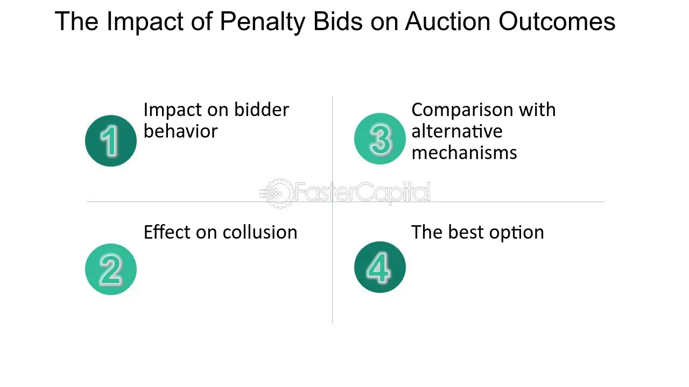

## Table of Contents

## What is a penalty bid mechanism?

A penalty bid mechanism is a way to encourage people to do what they promised in an auction. In an auction, people bid to buy something, like a house or a piece of art. If someone wins the auction but then decides not to buy it, they might have to pay a penalty. This penalty is meant to make sure people think carefully before they bid and stick to their promise if they win.

The penalty bid can be a set amount of money or a percentage of the bid. For example, if someone bids $100,000 on a house and then backs out, they might have to pay a penalty of $5,000. This helps keep the auction fair and makes sure that the seller can trust the bids they receive. It also discourages people from bidding just to see how high the price will go without intending to buy.

## How does a penalty bid mechanism work?

A penalty bid mechanism is used in auctions to make sure that people who win the auction actually buy the item they bid on. When someone places a bid, they agree to buy the item if their bid is the highest. If they win the auction but then decide not to buy it, they have to pay a penalty. This penalty is like a fine that reminds people to be serious about their bids.

The penalty can be a fixed amount of money or a percentage of the bid. For example, if someone bids $100,000 on a house and then changes their mind, they might have to pay a penalty of $5,000. This rule helps keep the auction fair and trustworthy. It makes sure that the seller can rely on the bids they get, and it stops people from bidding just for fun or to drive up the price without planning to buy.

## Why was the penalty bid mechanism introduced?

The penalty bid mechanism was introduced to make sure that people who win an auction actually buy the item they bid on. Before this rule, some people would bid high prices just to see how much others would pay, without really wanting to buy the item. This was not fair to the seller or to other bidders who were serious about buying. So, the penalty bid mechanism was created to stop this from happening.

The main reason for introducing the penalty bid mechanism is to make auctions more trustworthy and fair. When people know they might have to pay a penalty if they back out, they think more carefully before bidding. This helps sellers feel confident that the highest bidder will actually buy the item, and it makes the whole auction process more reliable for everyone involved.

## What are the benefits of using a penalty bid mechanism?

Using a penalty bid mechanism in auctions helps make sure that people who win the auction actually buy the item. This is good for sellers because they can trust that the highest bidder will follow through with the purchase. When people know they might have to pay a penalty if they back out, they think more carefully before bidding. This makes the auction more fair and stops people from bidding just to see how high the price will go without planning to buy.

The penalty bid mechanism also makes auctions more reliable for everyone involved. Bidders are more likely to be serious about their bids, which means the auction results are more trustworthy. This can lead to better prices for sellers because serious bidders are more likely to bid higher amounts. Overall, the penalty bid mechanism helps create a fair and efficient auction process where everyone can trust the outcome.

## Can you explain the process of implementing a penalty bid mechanism in an auction?

To implement a penalty bid mechanism in an auction, the auctioneer first needs to clearly explain the rules to everyone who wants to bid. They tell the bidders that if they win the auction but then decide not to buy the item, they will have to pay a penalty. This penalty can be a fixed amount of money or a percentage of the bid. The auctioneer makes sure everyone understands these rules before the bidding starts.

During the auction, people place their bids as usual. If someone wins the auction with the highest bid, they are expected to buy the item. If they decide not to buy it, the auctioneer will enforce the penalty. The winner will have to pay the penalty, which could be, for example, $5,000 if they bid $100,000 on a house. This rule makes sure that bidders think carefully before they bid and are more likely to follow through with their purchase if they win.

## What are the potential drawbacks or criticisms of penalty bid mechanisms?

Some people think that penalty bid mechanisms can be too harsh. If someone bids on something but then can't buy it because of unexpected problems, like losing their job, they might have to pay a big penalty. This can be really hard for them. Also, some people might be scared to bid at all because they are worried about the penalty, even if they really want the item. This can make the auction less fun and less competitive.

Another criticism is that penalty bid mechanisms might not be fair to everyone. Rich people might not care about the penalty as much because they can afford to pay it. But for someone who doesn't have a lot of money, the penalty could be a big problem. This means that the auction might not be as fair as it should be, because people with more money can take more risks.

## How do penalty bid mechanisms affect bidder behavior?

Penalty bid mechanisms make people think more carefully before they bid. When someone knows they might have to pay a penalty if they win the auction but then don't buy the item, they are more likely to be serious about their bid. This means they will only bid if they really want the item and are sure they can buy it. It stops people from bidding just to see how high the price will go without planning to buy.

On the other hand, penalty bid mechanisms can also make some people scared to bid at all. If the penalty is too high, people might be afraid to take the risk, even if they really want the item. This can make the auction less exciting and less competitive because fewer people might want to bid. So, while penalty bid mechanisms can make bidders more serious, they can also make some people too cautious to participate.

## In what types of auctions are penalty bid mechanisms most commonly used?

Penalty bid mechanisms are most commonly used in real estate auctions. When people bid on houses or land, the prices can be very high. If someone wins the auction but then decides not to buy the property, it can cause big problems for the seller. So, to make sure people are serious about their bids, real estate auctions often use penalty bid mechanisms. This helps sellers feel more confident that the highest bidder will actually buy the property.

These mechanisms are also used in auctions for expensive art and collectibles. Just like with real estate, the items in these auctions can be worth a lot of money. If a bidder wins but then backs out, it can be very frustrating for the seller and other bidders. By using a penalty bid mechanism, these auctions encourage people to think carefully before they bid and to follow through with their purchase if they win. This makes the auction process more reliable and fair for everyone involved.

## How does the penalty bid mechanism compare to other auction mechanisms?

The penalty bid mechanism is different from other auction mechanisms because it makes people pay a penalty if they win but don't buy the item. In regular auctions, people can bid and then change their mind without any consequences. But with a penalty bid, people have to think carefully before bidding because they might have to pay money if they back out. This helps make sure that people who bid are serious about buying the item, which is good for sellers.

Other auction mechanisms might not have a penalty. For example, in a sealed bid auction, people write down their bids and the highest one wins. There's no penalty if someone changes their mind, but this can make it hard for sellers to trust the bids. In a Dutch auction, the price starts high and goes down until someone buys it. Here too, there's no penalty for backing out, which can make the auction less reliable. The penalty bid mechanism tries to solve these problems by making bidders more responsible for their bids.

## What are some real-world examples where penalty bid mechanisms have been successfully implemented?

In real estate auctions, penalty bid mechanisms are often used to make sure people who bid on houses or land are serious about buying. For example, in the United States, some auctions for foreclosed homes use penalty bids. If someone bids on a house and then doesn't buy it, they might have to pay a penalty. This helps the banks or sellers feel more sure that the highest bidder will actually buy the home, which is important because selling homes can take a long time and cost a lot of money.

Another example is in the art world. When expensive paintings or sculptures are sold at auctions, penalty bid mechanisms can be used to make sure the highest bidder follows through with the purchase. For instance, at a famous auction house like Sotheby's, if someone bids on a valuable piece of art and then decides not to buy it, they might have to pay a penalty. This encourages people to only bid if they really want the artwork and can afford it, making the auction more reliable and fair for everyone involved.

## What are the legal and regulatory considerations when using a penalty bid mechanism?

When using a penalty bid mechanism, it's important to follow the laws and rules of the place where the auction is happening. Different places might have different rules about what kind of penalties are allowed and how they should be used. The auctioneer needs to make sure that the penalty bid rules are clear and fair to everyone. They also need to explain these rules to all the bidders before the auction starts, so everyone knows what they are agreeing to.

There can also be rules about how much the penalty can be. Some places might say the penalty can't be too high, to make sure it's not too hard on people who can't buy the item after winning the auction. The auctioneer needs to make sure the penalty is fair and follows all the legal rules. If they don't, they might get in trouble or the auction might not be seen as fair by the people bidding.

## How can the effectiveness of a penalty bid mechanism be measured and evaluated?

The effectiveness of a penalty bid mechanism can be measured by looking at how many people who win the auction actually buy the item. If more people follow through with their bids after the penalty is in place, it shows that the mechanism is working. Another way to measure effectiveness is by checking if fewer people back out of their bids. If the number of people who change their mind goes down, it means the penalty is making bidders think more carefully before they bid.

You can also evaluate the penalty bid mechanism by asking the people who took part in the auction. If they feel that the auction was fair and they were happy with how it went, it's a good sign. Sellers can also give feedback on whether they feel more confident that the highest bidder will buy the item. By looking at these different signs, you can tell if the penalty bid mechanism is helping to make the auction more reliable and fair for everyone involved.

## What is the interplay between penalty bids and algorithmic trading?

Penalty bids and algorithmic trading represent two intricate elements of modern investment banking, each with its own dynamic nuances and operational complexities. Their interaction is pivotal in shaping trading strategies and market behaviors. This section sheds light on how penalty bids are interpreted and managed through algorithmic trading systems and the challenges and opportunities emerging from such interactions.

### Management of Penalty Bids via Algorithmic Trading Systems

Algorithmic trading systems, driven by complex computer programs, execute orders at speeds and frequencies impossible for human traders. When integrated with penalty bids, these systems must be agile enough to adjust strategies in response to potential penalties. Penalty bids, designed to curb excessive flipping of IPO shares, require algorithms to be calibrated so that they can both recognize the imposition of these penalties and dynamically adjust trading strategies to maintain profitability. The algorithms help in real-time assessment of market conditions, allowing traders to reposition themselves if a penalty bid might adversely affect their trading outcome.

### Challenges and Opportunities

Algorithmic traders face significant challenges when navigating the terrain of penalty bids. A primary challenge lies in the systems' ability to predict and respond to the likelihood of a penalty being imposed. The algorithms must incorporate predictive models that account for factors such as market volatility and trading volume, which influence the risk of incurring a penalty. 

Opportunities arise from the ability of algorithms to handle large datasets and make informed decisions swiftly. This can potentially allow traders to optimize their portfolios by selecting trades that minimize penalty risks while maximizing returns. Furthermore, algorithmic systems can simulate various trading scenarios considering potential penalties, thus providing strategic insights to the traders.

### Case Studies and Strategic Approaches

Case studies illustrate how different market participants deploy algorithms to navigate penalty bids. For instance, a study involving a high-frequency trading firm showed that incorporating penalty prediction models based on historical trading data significantly reduced penalty costs by adjusting short-term trading volumes. Such models utilize machine learning to refine the prediction of flipping probability, allowing the algorithm to adjust orders accordingly.

Investment banks frequently adopt strategic approaches to harness algorithms against penalty bids. One typical strategy involves the use of hedging techniques, where an algorithm dynamically adjusts its position in correlated assets to offset the risk of a penalty on a particular trade. Another approach entails diversification of assets traded by the algorithm, as a means to spread the risk of penalties across multiple securities, thus reducing the impact on overall performance.

### Balancing Risk and Reward

The balance between risk and reward in handling penalty bids through algorithmic trading is a nuanced affair. Algorithms are meticulously crafted to weigh the immediate costs of potential penalties against the strategic benefits of high-frequency trades. Risk models are embedded within trading systems to quantitatively assess the trade-off: 

$$
\text{Risk-Reward Ratio} = \frac{\text{Expected Return} - \text{Potential Penalty}}{\text{Risk Exposure}}
$$

Algorithms must constantly update this ratio, evaluating real-time data to optimize decisions. Achieving equilibrium in this balance is critical; too conservative an approach could minimize profits, whereas overly aggressive trading could escalate penalty liabilities.

In conclusion, the interplay between penalty bids and algorithmic trading requires sophisticated systems that can anticipate, react, and adapt to the fast-paced changes in modern financial markets. By leveraging advanced data analytics and machine learning, traders can effectively manage the intricacies of penalty bids while capitalizing on the efficiencies offered by algorithmic trading.

## References & Further Reading

[1]: Bergstra, J., Bardenet, R., Bengio, Y., & Kégl, B. (2011). ["Algorithms for Hyper-Parameter Optimization."](https://papers.nips.cc/paper/4443-algorithms-for-hyper-parameter-optimization) Advances in Neural Information Processing Systems 24.

[2]: ["Advances in Financial Machine Learning"](https://www.amazon.com/Advances-Financial-Machine-Learning-Marcos/dp/1119482089) by Marcos Lopez de Prado

[3]: ["Evidence-Based Technical Analysis: Applying the Scientific Method and Statistical Inference to Trading Signals"](https://www.amazon.com/Evidence-Based-Technical-Analysis-Scientific-Statistical/dp/0470008741) by David Aronson

[4]: ["Machine Learning for Algorithmic Trading"](https://github.com/stefan-jansen/machine-learning-for-trading) by Stefan Jansen

[5]: ["Quantitative Trading: How to Build Your Own Algorithmic Trading Business"](https://www.amazon.com/Quantitative-Trading-Build-Algorithmic-Business/dp/1119800064) by Ernest P. Chan