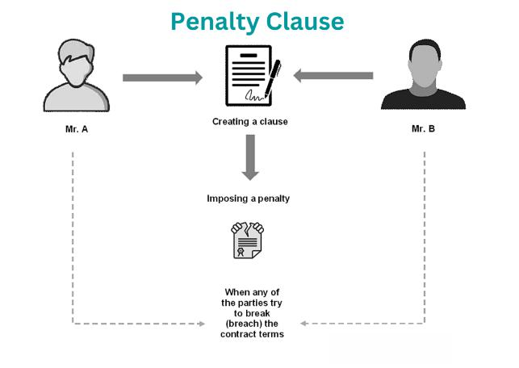

Penalty bids are an essential concept within the sphere of stock market investment banking, serving as a mechanism to discourage undesirable market behaviors during the initial distribution of securities. Typically, they are imposed on underwriters or brokers if shares allocated to them are resold within a short timeframe, leading to price instability. This mechanism is vital for maintaining price integrity and ensuring orderly market functions, particularly during initial public offerings (IPOs) or secondary offerings.

In the arena of algorithmic trading, penalty bids have become increasingly relevant. Algorithmic trading refers to the use of computer algorithms to execute trades based on pre-set conditions and criteria. With the rise of high-frequency trading, where decisions are made within microseconds, the presence of penalty bids can impact the algorithms designed to optimize trade execution. Specifically, the imposition of penalty bids introduces additional variables that algorithms must factor into their decision-making processes. This results in a more complex trading environment where the algorithms need to manage the constraints introduced by potential penalties, which can affect both speed and strategy.

The objective of this article is to explore the intricate interplay between penalty bids and algorithmic trading, examining how these components influence modern financial markets. By understanding this relationship, stakeholders can better appreciate the dynamics at play and devise strategies that align with current market realities.

Smart trading strategies have become increasingly crucial due to technological advancements and market complexities. The integration of sophisticated algorithms has revolutionized trading, enabling quicker, more efficient trades, and enhancing market liquidity. This evolution underscores the need for strategies that not only maximize returns but also mitigate risks associated with penalties and regulatory constraints.

Through this exploration, the article aims to shed light on the mechanisms of penalty bids within the context of algorithmic trading. The coming discussion will provide insights into how these elements interact within the financial industry, offering a comprehensive understanding of their roles and implications in shaping today's trading landscape.

## Table of Contents

## Understanding Penalty Bids

Penalty bids are a mechanism used in investment banking to regulate and stabilize the trading process during stock offerings. These bids essentially act as deterrents against the rapid resale of newly issued shares, promoting more orderly trading behaviors and helping maintain market stability. By imposing a penalty on brokers whose clients quickly sell their newly acquired shares, penalty bids aim to curb speculative trading that could lead to price volatility.

In the trading process, penalty bids impact market dynamics by ensuring that newly issued stocks do not immediately flood the secondary market. This can help sustain the initial offering price by controlling the supply of shares available for trading in the short term. Penalty bids reinforce the notion that investment strategies should favor longer-term holds over short-term speculation, thus contributing to market integrity and smooth operations.

The significance of penalty bids extends to both investors and financial institutions. For investors, penalty bids underscore the need for careful consideration of investment timelines and objectives, as selling stock too rapidly could incur penalties through their brokerage. Financial institutions, particularly underwriters and brokers, use penalty bids to guard against the rapid decline in stock prices following an Initial Public Offering (IPO) or follow-on offering. By maintaining an orderly transition from primary to secondary trading, institutions protect their reputations and foster investor confidence.

Historically, penalty bids have played a critical role in pivotal stock trading scenarios. During IPOs, for instance, penalty bids can help manage market expectations and prevent excessive [volatility](/wiki/volatility-trading-strategies) immediately following a stock's introduction. Their application during major corporate stock sales or significant secondary offerings has similarly contributed to stabilizing price structures and encouraging investor confidence. 

From a regulatory standpoint, penalty bids are subject to scrutiny to ensure market fairness and transparency. Regulatory bodies across different markets set guidelines and rules that govern their implementation, aiming to prevent misuse. For example, in the United States, the Securities and Exchange Commission (SEC) oversees the use of penalty bids to protect investors and maintain a fair trading environment. Each market may have distinct regulations reflecting local trading practices and economic contexts, which means understanding these nuances is essential for compliance.

Penalty bids serve as a critical tool in investment banking, guiding trading practices and helping maintain market stability. They exemplify the sophisticated approaches employed by financial institutions to balance market operations with investor interests. The regulatory framework surrounding penalty bids is vital to ensuring these mechanisms are used ethically and efficiently, ultimately supporting the broader objectives of market integrity and investor protection.

## The Role of Algorithmic Trading in Modern Finance

Algorithmic trading, an automated form of trading that utilizes complex algorithms to execute trades at high-speed and [volume](/wiki/volume-trading-strategy), has transformed modern finance. Originating in the late 20th century, [algorithmic trading](/wiki/algorithmic-trading), also known as algo-trading, was initially used by institutional investors for executing large orders to minimize market impact. Its evolution has been heavily influenced by advances in technology and statistical methods, facilitating increased adoption among both institutional and individual traders.

Technological advancements have been pivotal in the growth of algorithmic trading. The development of high-frequency trading ([HFT](/wiki/high-frequency-trading-strategies)) systems, capable of executing thousands of trades per second, has been driven by improved computational power, reduced latency in communication networks, and greater availability of real-time data. The advent of powerful computing resources has enabled the rapid analysis and execution of trading strategies, while advancements in fiber optics and microwave transmission have reduced information transfer times, contributing to a more efficient trading environment.

Algorithmic trading significantly enhances market [liquidity](/wiki/liquidity-risk-premium) and efficiency. Liquidity is increased as algorithms provide a continuous flow of buy and sell orders, tightening bid-ask spreads and reducing transaction costs. Furthermore, these algorithms can quickly adapt to market changes, thus promoting price discovery and decreasing market volatility. This results in a more stable financial market, which benefits all participants by ensuring that prices more accurately reflect available information.

Several algorithms are commonly employed in stock trading. The most basic include [trend following](/wiki/trend-following) strategies, which identify price movements and generate buy or sell signals based on market trends. Mean reversion strategies, another common type, are based on the assumption that asset prices will revert to their historical means. More advanced algorithms, such as statistical [arbitrage](/wiki/arbitrage), exploit price discrepancies between correlated securities to achieve profit. These strategies often rely on large datasets and sophisticated models to predict price movements and make trading decisions.

The integration of data analytics and [machine learning](/wiki/machine-learning) into algo-trading strategies has further revolutionized trading. Machine learning models can process vast amounts of data to identify patterns and make predictions with a high degree of accuracy. Techniques such as natural language processing (NLP) allow systems to analyze news and social media sentiment, enhancing decision-making processes. For instance, supervised learning algorithms are trained on historical data to forecast future price movements, while unsupervised learning can identify hidden structures in financial data.

In conclusion, algorithmic trading has become an indelible feature of modern financial markets. Its evolution is closely tied to technological progress, which has continuously pushed the boundaries of speed, efficiency, and accuracy in trade execution. As data analytics and machine learning further advance, the potential for more sophisticated and effective trading strategies grows, presenting ongoing opportunities for innovation in the financial industry.

## Interplay Between Penalty Bids and Algorithmic Trading

Penalty bids and algorithmic trading represent two intricate elements of modern investment banking, each with its own dynamic nuances and operational complexities. Their interaction is pivotal in shaping trading strategies and market behaviors. This section sheds light on how penalty bids are interpreted and managed through algorithmic trading systems and the challenges and opportunities emerging from such interactions.

### Management of Penalty Bids via Algorithmic Trading Systems

Algorithmic trading systems, driven by complex computer programs, execute orders at speeds and frequencies impossible for human traders. When integrated with penalty bids, these systems must be agile enough to adjust strategies in response to potential penalties. Penalty bids, designed to curb excessive flipping of IPO shares, require algorithms to be calibrated so that they can both recognize the imposition of these penalties and dynamically adjust trading strategies to maintain profitability. The algorithms help in real-time assessment of market conditions, allowing traders to reposition themselves if a penalty bid might adversely affect their trading outcome.

### Challenges and Opportunities

Algorithmic traders face significant challenges when navigating the terrain of penalty bids. A primary challenge lies in the systems' ability to predict and respond to the likelihood of a penalty being imposed. The algorithms must incorporate predictive models that account for factors such as market volatility and trading volume, which influence the risk of incurring a penalty. 

Opportunities arise from the ability of algorithms to handle large datasets and make informed decisions swiftly. This can potentially allow traders to optimize their portfolios by selecting trades that minimize penalty risks while maximizing returns. Furthermore, algorithmic systems can simulate various trading scenarios considering potential penalties, thus providing strategic insights to the traders.

### Case Studies and Strategic Approaches

Case studies illustrate how different market participants deploy algorithms to navigate penalty bids. For instance, a study involving a high-frequency trading firm showed that incorporating penalty prediction models based on historical trading data significantly reduced penalty costs by adjusting short-term trading volumes. Such models utilize machine learning to refine the prediction of flipping probability, allowing the algorithm to adjust orders accordingly.

Investment banks frequently adopt strategic approaches to harness algorithms against penalty bids. One typical strategy involves the use of hedging techniques, where an algorithm dynamically adjusts its position in correlated assets to offset the risk of a penalty on a particular trade. Another approach entails diversification of assets traded by the algorithm, as a means to spread the risk of penalties across multiple securities, thus reducing the impact on overall performance.

### Balancing Risk and Reward

The balance between risk and reward in handling penalty bids through algorithmic trading is a nuanced affair. Algorithms are meticulously crafted to weigh the immediate costs of potential penalties against the strategic benefits of high-frequency trades. Risk models are embedded within trading systems to quantitatively assess the trade-off: 

$$
\text{Risk-Reward Ratio} = \frac{\text{Expected Return} - \text{Potential Penalty}}{\text{Risk Exposure}}
$$

Algorithms must constantly update this ratio, evaluating real-time data to optimize decisions. Achieving equilibrium in this balance is critical; too conservative an approach could minimize profits, whereas overly aggressive trading could escalate penalty liabilities.

In conclusion, the interplay between penalty bids and algorithmic trading requires sophisticated systems that can anticipate, react, and adapt to the fast-paced changes in modern financial markets. By leveraging advanced data analytics and machine learning, traders can effectively manage the intricacies of penalty bids while capitalizing on the efficiencies offered by algorithmic trading.

## Market Impacts and Investment Strategies

The convergence of penalty bids and algorithmic trading represents a significant shift in market dynamics, impacting how trades are executed and risks are managed. Penalty bids, primarily used to discourage short selling and ensure market stability during new stock issuances, can lead to altered trading behaviors when combined with algorithmic trading. This combination can enhance market liquidity while simultaneously introducing complexities that necessitate sophisticated risk mitigation strategies.

Algorithmic trading systems, employing complex algorithms to execute trades at high speeds, have altered how penalty bids are experienced in the market. The automation of trading processes allows these systems to quickly adapt to penalty bids, protecting financial institutions from potential market manipulation and price anomalies. One prominent impact is the increased market liquidity, as algorithms can swiftly accommodate for buying and selling pressures introduced through penalty bids. However, these systems must account for the rapid adjustments in stock prices that penalty bids can cause, potentially leading to increased volatility.

Traders and banks employ various strategies to mitigate the risks associated with penalty bids. These include using advanced analytics to predict the likelihood and impact of penalty bids, thereby adjusting trading strategies accordingly. For instance, quantitative risk models might evaluate the sensitivity of a portfolio or position to penalty bids and recalibrate exposures to mitigate potential losses. Moreover, adopting a diversified portfolio strategy can distribute risk and reduce the impact of any single penalty bid event.

Investors can leverage the convergence of these trading strategies for portfolio diversification and risk management by understanding the signals emitted by algorithmic systems when penalty bids occur. This information can guide them in adjusting asset allocations or employing hedging strategies to manage exposure. For example, investors can use options or other derivatives that capitalize on volatility created by penalty bids, potentially enhancing returns while offsetting risk.

Technological advances continue to shape future trends in investment banking and trading strategies. With the incorporation of machine learning and data analytics, algorithms are becoming more intelligent and capable of processing vast amounts of data to detect market patterns and predict stock movements. This evolution promises more accurate adaptive responses to market events such as penalty bids.

For retail investors, navigating a market influenced by complex trading strategies requires staying informed about these technological and strategic developments. Utilization of trading platforms with robust analytical tools can aid in understanding market movements and potential risks. Educational resources that demystify these complex interactions are also crucial in empowering retail investors to make informed decisions and optimize their trading strategies accordingly.

In conclusion, the interplay between penalty bids and algorithmic trading significantly impacts market behavior, risk management, and investment strategies. As these dynamics continue to evolve, both institutional and retail investors stand to benefit from adapting to these innovations, ultimately enhancing their trading outcomes and investment portfolios.

## Regulatory Considerations and Future Outlook

The regulatory landscape concerning penalty bids and algorithmic trading is complex and continually evolving as authorities seek to balance market integrity with innovation. Penalty bids, primarily used in investment banking during securities offerings, are subject to regulatory scrutiny to ensure transparency and fairness. Regulators like the U.S. Securities and Exchange Commission (SEC) and the Financial Industry Regulatory Authority (FINRA) oversee and enforce rules pertaining to these practices. Currently, penalty bids must comply with regulations that guard against market manipulation and ensure that all market participants have a fair opportunity to participate.

Algorithmic trading, characterized by the use of high-speed, automated systems, is subject to different but equally significant regulatory frameworks. Key concerns include market volatility, systemic risk, and the potential for algorithmic systems to execute large volumes of trades in milliseconds, which can amplify market disturbances. As a result, regulators have introduced measures such as circuit breakers, which temporarily halt trading if a significant market movement is detected. In the European Union, the Markets in Financial Instruments Directive II (MiFID II) has set stringent guidelines on algorithmic trading, requiring firms to maintain robust controls and oversight over their trading algorithms.

Potential changes in regulations could focus on enhancing transparency and risk management for both penalty bids and algorithmic trading. This may involve stricter reporting requirements, improved monitoring of automated systems, and increased accountability for breaches of conduct. Additionally, there is growing discussion on the implementation of real-time surveillance technologies to monitor trading activities more effectively.

Ethical considerations and market fairness are central to the debate over penalty bids and algorithmic trading. The concern is that algorithmic trading, particularly high-frequency trading (HFT), may provide advantages to firms with access to advanced technology, creating an uneven playing field. Efforts to address these concerns involve promoting technological accessibility and considering transaction taxes on HFT to curb excessive market exploitation.

Future trends in investment banking and high-frequency trading are expected to be shaped by technological advancements such as [artificial intelligence](/wiki/ai-artificial-intelligence) and machine learning, leading to more sophisticated trading strategies. These technologies promise increased efficiency and improved risk assessment capabilities but also pose challenges in terms of regulatory compliance and ethical trading practices.

Investors and institutions can prepare for these future developments by adopting adaptive risk management strategies and investing in technology that enhances trading capabilities while ensuring compliance with regulatory standards. Continuous education on emerging trends and active engagement with policy discussions will be vital in navigating the changing landscape of financial markets. As regulations evolve, maintaining a balance between innovation and market integrity will be critical to fostering a stable and fair trading environment.

## References & Further Reading

[1]: Bergstra, J., Bardenet, R., Bengio, Y., & Kégl, B. (2011). ["Algorithms for Hyper-Parameter Optimization."](https://papers.nips.cc/paper/4443-algorithms-for-hyper-parameter-optimization) Advances in Neural Information Processing Systems 24.

[2]: ["Advances in Financial Machine Learning"](https://www.amazon.com/Advances-Financial-Machine-Learning-Marcos/dp/1119482089) by Marcos Lopez de Prado

[3]: ["Evidence-Based Technical Analysis: Applying the Scientific Method and Statistical Inference to Trading Signals"](https://www.amazon.com/Evidence-Based-Technical-Analysis-Scientific-Statistical/dp/0470008741) by David Aronson

[4]: ["Machine Learning for Algorithmic Trading"](https://github.com/stefan-jansen/machine-learning-for-trading) by Stefan Jansen

[5]: ["Quantitative Trading: How to Build Your Own Algorithmic Trading Business"](https://www.amazon.com/Quantitative-Trading-Build-Algorithmic-Business/dp/1119800064) by Ernest P. Chan