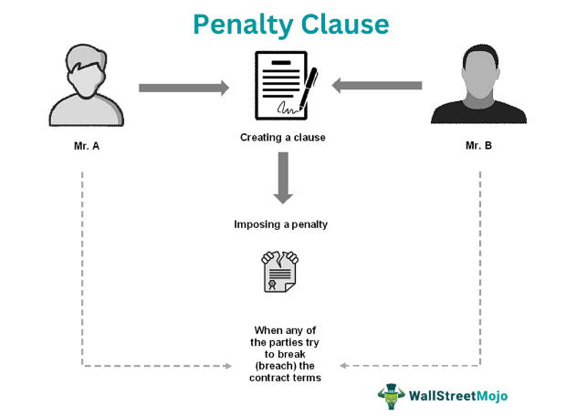

The world of sports encompasses a myriad of games, each governed by a unique set of rules aimed at ensuring fairness and competitiveness. Among these, ice hockey stands out with its fast-paced and dynamic nature, where the penalty box plays a pivotal role in maintaining order on the ice. Simultaneously, the financial markets have evolved to incorporate algorithmic trading, a method that utilizes complex mathematical models to execute trades at speeds much faster than human capability. At first glance, the structured chaos of ice hockey and the precision of algorithmic trading might appear unrelated, yet both are driven by stringent rules and strategies that can profoundly influence their respective outcomes.

In the context of ice hockey, the penalty box, often referred to as the "sin bin," is a testament to the sport's commitment to discipline and fair play. It serves not only as a physical space where players spend time following infractions but also as a strategic element that can shift the momentum of a game. Teams must adeptly manage these situations to either capitalize on the numerical advantage or mitigate the disadvantages, thus influencing the final scoreline.



Conversely, algorithmic trading represents a significant shift in how financial transactions are conducted, leveraging technology for precision and speed. Here, predefined algorithms make decisions based on a set of rules, executing trades that seek to optimize market positions. This approach can reshape the market landscape by introducing unprecedented efficiency and complexity into trading strategies, impacting the outcomes of financial portfolios.

Both the penalty box in ice hockey and algorithmic trading in financial markets operate within a framework of rules that dictate strategy and success. Understanding these systems provides valuable insights for sports enthusiasts eager to grasp the nuances of gameplay and for investors aiming to navigate the complexities of modern markets. By exploring these topics, we can appreciate how structured rules underpin strategies that lead to triumphs, whether on the ice or in the stock exchange.

## Table of Contents

## Understanding the Penalty Box in Ice Hockey

Ice hockey is a fast-paced sport that emphasizes both skill and strategy. A crucial element in maintaining order and fairness in the game is the penalty box, colloquially known as the 'sin bin.' This confined area adjacent to the rink is where players are sent after committing infractions, with the duration of their stay impacting their team’s strength and, consequently, the game’s dynamics.

Historically, the implementation of the penalty box was designed to ensure that the fast, often physical nature of ice hockey did not lead to unchecked aggression. This system not only punishes individual players but also imposes a disadvantage on their team, as they are forced to play with one less skater, typically for two minutes in minor penalty cases. Major penalties, often assigned for more severe infractions such as fighting, result in five-minute stays, while misconduct penalties can extend to ten minutes, affecting more long-term strategy.

The rules governing the penalty box are clear-cut. When a player commits an infraction, they are required to leave the ice and sit in the penalty box for a specified duration, determined by the type of penalty. Minor penalties remove a player for two minutes, during which their team plays shorthanded. If the opposing team scores during this time, the player is allowed to return to the ice, a rule that embodies the dynamic and fast-resolving nature of the sport. In contrast, major penalties require the full penalty time to be served regardless of scoring. These rules thereby influence a team's strategy significantly, as they must adapt to playing with fewer players and potentially change their defensive and offensive tactics.

The strategic implications of the penalty box are profound. Teams often modify their lineup by deploying specialized players known as 'penalty killers,' who excel in defensive play and can thwart power play attempts by the opposing team. Conversely, the team with a numerical advantage typically fields its most skilled offensive players to maximize the opportunity to score. Thus, the penalty box not only serves as a deterrent for foul play but also becomes a focal point around which strategies are developed and executed.

Throughout a game, the presence of the penalty box can alter [momentum](/wiki/momentum) and change the [course](/wiki/best-algorithmic-trading-courses) of a match. Coaches must be acutely aware of these dynamics, adjusting player roles and tactics to address the shifting on-ice scenarios. Understanding the intricacies of the penalty box is essential for players and fans alike, as it encapsulates the essence of sportsmanship and strategic depth that defines ice hockey.

## Common Infractions Leading to Penalties

In ice hockey, understanding the common infractions that lead to penalties is essential for grasping the intricacies of the game. Penalties disrupt the flow of play, presenting both challenges and strategic opportunities for teams. Among the most frequent infractions are tripping, slashing, and high-sticking, each carrying specific consequences that can influence the outcome of a match.

**Tripping** involves a player using their stick, hand, or any part of their body to cause an opponent to fall or lose balance. This infraction is usually assessed as a minor penalty, which results in the offending player spending two minutes in the penalty box. The absence of a player gives the opposing team a numerical advantage, often leading them to adopt an aggressive power-play strategy to score.

**Slashing** occurs when a player swings their stick at an opponent, regardless of contact. The severity of the slashing incident determines whether a minor or major penalty is imposed. A minor penalty for slashing results in a two-minute stint in the penalty box, whereas a major penalty can lead to a five-minute penalty, offering the opponent an extended power-play opportunity. This infraction not only affects the offending player's team composition but can also lead to injury or retaliation, further complicating the game dynamics.

**High-sticking** happens when a player carries or uses their stick above the shoulder level, making contact with an opponent. Like slashing, the penalty's severity depends on the impact. If no injury results, a minor penalty is applied, but if an opponent is injured, a double-minor (four minutes) or major penalty may be enforced. The extra time in the penalty box can significantly pressure the penalized player's team, forcing them to engage in a more defensive posture to mitigate the power-play threat.

Maintaining discipline on the ice is crucial for teams striving for victory. A high number of penalties can lead to extended periods of playing short-handed, exhausting players and disrupting team strategy. Conversely, disciplined teams can capitalize on their opponents' infractions, using power plays to gain a decisive advantage. Thus, understanding and avoiding common infractions is key to a team's overall performance and success in the highly competitive environment of ice hockey.

## The Role of Off-Ice Officials

Off-ice officials play a crucial but often overlooked role in ice hockey, ensuring that the game's integrity is maintained and that it runs smoothly. While players and coaches receive much of the attention, these officials are essential for managing various aspects of the game, especially when it comes to penalties, rules adherence, and communication.

A key responsibility of off-ice officials is managing penalty times. This involves accurately recording the duration of penalties assigned to players and ensuring they serve the correct amount of time in the penalty box. Precision in this task is essential, as any errors could unfairly alter the game's outcome. Off-ice officials typically use a game clock to monitor penalty durations and notify teams and players when they have served their time.

Beyond penalty management, off-ice officials ensure that the rules of the game are strictly followed, supporting the on-ice referees and linesmen in upholding fairness. They assist in verifying goals, determining whether infractions occurred, and resolving disputes about rules interpretations. This support is vital for maintaining the game's flow and preventing unnecessary interruptions.

Another critical function of off-ice officials is facilitating communication between players, coaches, and on-ice officials. This involves relaying information about penalties, goals, and any rule changes or clarifications during the game. Effective communication ensures that all parties are informed and can adjust their strategies and actions accordingly.

These responsibilities highlight the off-ice officials' integral role in ice hockey, ensuring that games run fairly and efficiently. Their work, though behind the scenes, is fundamental to the sport's operational success and integrity, making them indispensable to every match.

 to Algorithmic Trading

Algorithmic trading has transformed financial markets by introducing highly efficient, automated processes for executing trades. This approach leverages computer algorithms to assess vast amounts of market data, identify patterns, and execute trades based on predefined strategies and rules that humans may find challenging to process manually. 

**Overview of How Algorithmic Trading Works**

Algorithmic trading involves the use of mathematical models and algorithms to make trading decisions at speeds impractical for human traders. These algorithms analyze a variety of market factors, such as price, timing, and [volume](/wiki/volume-trading-strategy), to determine the optimal time and conditions for executing trades. The primary advantage is the ability to operate without the need for human intervention, which allows traders to capitalize on market opportunities that might exist only for fractions of a second.

The process begins with data collection, where trading algorithms gather relevant market data in real time. Once the data is acquired, algorithms use statistical and mathematical models to analyze and generate trading signals. Upon the detection of an opportunity, an order is automatically executed in the market. The speed and efficiency of this system is crucial, as it provides a competitive advantage in the fast-paced environment of financial markets. 

For instance, consider a simple moving average crossover strategy. A basic Python implementation might look like this:

```python
def moving_average(prices, window):
    return sum(prices[-window:]) / window

def moving_average_crossover(data, short_window, long_window):
    short_ma = moving_average(data, short_window)
    long_ma = moving_average(data, long_window)
    if short_ma > long_ma:
        return "buy"
    elif short_ma < long_ma:
        return "sell"
    else:
        return "hold"

prices = [110, 112, 115, 118, 120, 123, 125]
signal = moving_average_crossover(prices, short_window=3, long_window=5)
print(signal)  # Outputs: "buy" or "sell" or "hold"
```

**Rise in Popularity**

Over the past few decades, [algorithmic trading](/wiki/algorithmic-trading) has risen dramatically in popularity due to several factors. The availability of high-frequency data and increased computational power have made it possible to implement sophisticated algorithms. These advancements enable traders to process large datasets and execute trades at high speeds and volumes—characteristics that have contributed to a substantial presence of algorithmic trading in financial markets, reportedly accounting for a significant share of total trade volumes.

**Impact on Modern Financial Markets**

Algorithmic trading has significantly impacted the structure and dynamics of modern financial markets. By providing [liquidity](/wiki/liquidity-risk-premium) and narrowing spreads, it has enhanced market efficiency. However, the reliance on algorithmic strategies also introduces challenges, such as increased [volatility](/wiki/volatility-trading-strategies) and the potential for market disruptions caused by faulty algorithms or unexpected market conditions. Events like the "Flash Crash" of 2010 highlight the risks inherent in a system where a significant portion of the trading is automated.

As regulation and technology continue to evolve, algorithmic trading is set to play an even more prominent role in shaping market behavior, presenting both opportunities and challenges for modern traders and financial institutions. Understanding this system's workings and effects remains crucial for those wishing to navigate the intricacies of today's financial markets effectively.

## Strategies in Algorithmic Trading

Algorithmic trading has revolutionized financial markets, empowering traders with the ability to execute trades at speeds and volumes that human traders cannot match. To effectively capitalize on market opportunities, algo trading employs a variety of strategies. Among these, [trend following](/wiki/trend-following), statistical [arbitrage](/wiki/arbitrage), and [market making](/wiki/market-making) are particularly prominent.

Trend following is a popular strategy that relies on the premise that prices will continue to move in the same direction. This strategy is based on the idea of identifying and capitalizing on trends within the market data. By using moving averages, traders can establish entry and [exit](/wiki/exit-strategy) points for trades. For instance, a simple moving average crossover strategy involves buying when a short-term moving average crosses above a longer-term moving average and selling when it crosses below. The simplicity of trend following makes it widely accessible, but it can also be enhanced with more sophisticated techniques like [machine learning](/wiki/machine-learning) to optimize its predictive power.

Statistical arbitrage involves exploiting pricing inefficiencies between correlated securities. This strategy relies on statistical models to identify pairs of assets whose prices typically move together but may deviate temporarily. Traders buy the underpriced asset while selling the overpriced one, expecting that prices will converge over time. For example, if the price relationship between two stocks historically moves within a predictable range, a deviation from this range represents an opportunity for [statistical arbitrage](/wiki/statistical-arbitrage). The success of this strategy depends heavily on the accuracy of the statistical models used to predict asset price movements, often employing regression analysis or machine learning algorithms.

Market making is another critical strategy where traders provide liquidity to the markets by continuously quoting buy and sell prices for a particular asset. The goal of market making is to profit from the bid-ask spread. Market makers play a vital role in ensuring market efficiency by facilitating smoother transactions. Automated market-making algorithms assess real-time market data to adjust bid and ask prices dynamically. This strategy can be profitable due to the frequent trading involved, but it also requires sophisticated risk management to mitigate potential losses from market volatility.

Each of these strategies harnesses the computational power and speed of algorithms to exploit market inefficiencies, allowing traders to gain an edge in modern financial markets. The choice of strategy often depends on the trader's objectives, risk tolerance, and the specific characteristics of the market being targeted. As algorithmic trading continues to evolve, integrating advanced technologies such as [artificial intelligence](/wiki/ai-artificial-intelligence) and machine learning, the sophistication and effectiveness of these strategies will likely continue to advance, further reshaping the landscape of global financial markets.

## The Underlying Rules of Algo Trading

Algorithmic trading, much like sports, operates under a strict set of rules that ensure fairness and prevent misconduct. The architecture of these automated systems is not only built around efficiency but also compliance with regulatory frameworks. These frameworks are critical in maintaining the integrity and transparency of financial markets.

### Compliance and Regulatory Framework

The implementation of algorithmic trading is governed by regulations from financial authorities such as the U.S. Securities and Exchange Commission (SEC) and the European Securities and Markets Authority (ESMA). These regulations are intended to address issues such as market manipulation, ensure transparency, and promote fair trading practices. Key components of these regulations include:

1. **Market Integrity:** Algorithms must be designed to prevent practices like spoofing, where deceptive orders are placed to create an illusion of demand or supply. Violations of such nature can lead to severe penalties.

2. **Transparency:** Trading algorithms are subject to audit and require thorough documentation. This transparency is crucial for market regulators to review and ensure compliance with financial laws.

3. **Risk Management:** Algorithms are required to integrate risk management protocols that handle unintended trading errors. This includes mechanisms like kill switches that can halt trading activities in case of erratic behavior.

4. **Testing and Validation:** Before deployment, algorithms must undergo rigorous testing under simulated market conditions to ensure they behave as expected and comply with regulatory standards.

### Challenges and Controversies

Despite these regulations, algorithmic trading faces challenges and controversies. One significant challenge is keeping up with technological advancements that outpace regulatory frameworks, often leading to a regulatory lag. Additionally, the opacity of some algorithmic systems raises concerns about the potential for market abuse.

The "flash crash" of May 6, 2010, is a notable example where high-frequency trading algorithms were implicated in contributing to a sudden and severe market drop. Such events underscore the need for continuous evolution of regulatory measures to address algorithmic trading's inherent risks.

**Example Code for Compliance:**

Here's a brief example demonstrating a simple algorithmic trading strategy with a compliance check in Python:

```python
class AlgoTrader:
    def __init__(self):
        self.position = 0
        self.risk_limit = 100  # Maximum allowed position size
        self.trade_log = []

    def execute_trade(self, signal):
        if self.check_compliance(signal):
            self.position += signal
            self.trade_log.append(signal)
            print(f"Trade executed. Current position: {self.position}")
        else:
            print("Compliance check failed. Trade not executed.")

    def check_compliance(self, signal):
        # Ensure trade does not exceed risk limit
        if abs(self.position + signal) > self.risk_limit:
            return False
        return True

# Example of usage
trader = AlgoTrader()
signals = [10, 20, -5, 70]

for signal in signals:
    trader.execute_trade(signal)
```

This code demonstrates a basic compliance check to ensure that trading operations stay within pre-defined risk limits, showcasing how algorithms can be designed to align with regulatory expectations.

In summary, the rules governing algorithmic trading are designed to foster a fair and transparent trading environment while mitigating risks associated with automated systems. Understanding these underlying principles is essential for investors and developers involved in algorithmic trading to navigate the regulatory landscape adequately.

## Conclusion: Parallels Between Sports Rules and Algorithmic Strategies

From the ice rink to trading floors, structured frameworks shape strategies and influence outcomes. The essence of both ice hockey and algorithmic trading lies in their adherence to rules and strategic planning. In hockey, teams must skillfully manage penalties and adjust their play to maintain a competitive advantage. Similarly, traders rely on well-defined algorithms and must operate within a complex regulatory environment to ensure successful trades.

The penalty box in hockey exemplifies how regulations can dictate a game's flow and teams' responses. Understanding infractions and their repercussions is crucial for maintaining discipline and strategically adapting to changes in team dynamics. Likewise, traders harness algorithmic strategies governed by precise rules that dictate trading actions, often in milliseconds, to exploit fleeting market opportunities.

Both fields demand a keen awareness of their respective regulatory landscapes. In hockey, the presence of off-ice officials ensures adherence to the game's rules, maintaining fairness and integrity. In the financial sector, rigorous algorithms accompanied by regulatory compliance are essential to prevent market manipulation and ensure transparency. These frameworks are crucial for creating a level playing field, whether on the ice or in financial markets.

Despite their apparent differences, ice hockey and algorithmic trading share a reliance on strategic frameworks that participants must navigate to excel. As these domains continue to evolve, success will depend on a deep understanding of the systems governing them. Mastery over these structured environments is vital for those aspiring to achieve excellence, whether in sportsmanship or market expertise.

Looking ahead, the importance of understanding and adapting to these structured systems is only set to grow. Both sports enthusiasts and investors will benefit from insights gained by exploring the parallels in strategy and regulation, preparing them for future challenges and opportunities.

## References & Further Reading

[1]: Bergstra, J., Bardenet, R., Bengio, Y., & Kégl, B. (2011). ["Algorithms for Hyper-Parameter Optimization."](https://dl.acm.org/doi/10.5555/2986459.2986743) Advances in Neural Information Processing Systems 24.

[2]: ["Advances in Financial Machine Learning"](https://www.amazon.com/Advances-Financial-Machine-Learning-Marcos/dp/1119482089) by Marcos Lopez de Prado

[3]: ["Evidence-Based Technical Analysis: Applying the Scientific Method and Statistical Inference to Trading Signals"](https://www.amazon.com/Evidence-Based-Technical-Analysis-Scientific-Statistical/dp/0470008741) by David Aronson

[4]: ["Machine Learning for Algorithmic Trading"](https://github.com/stefan-jansen/machine-learning-for-trading) by Stefan Jansen

[5]: ["Quantitative Trading: How to Build Your Own Algorithmic Trading Business"](https://www.amazon.com/Quantitative-Trading-Build-Algorithmic-Business/dp/1119800064) by Ernest P. Chan