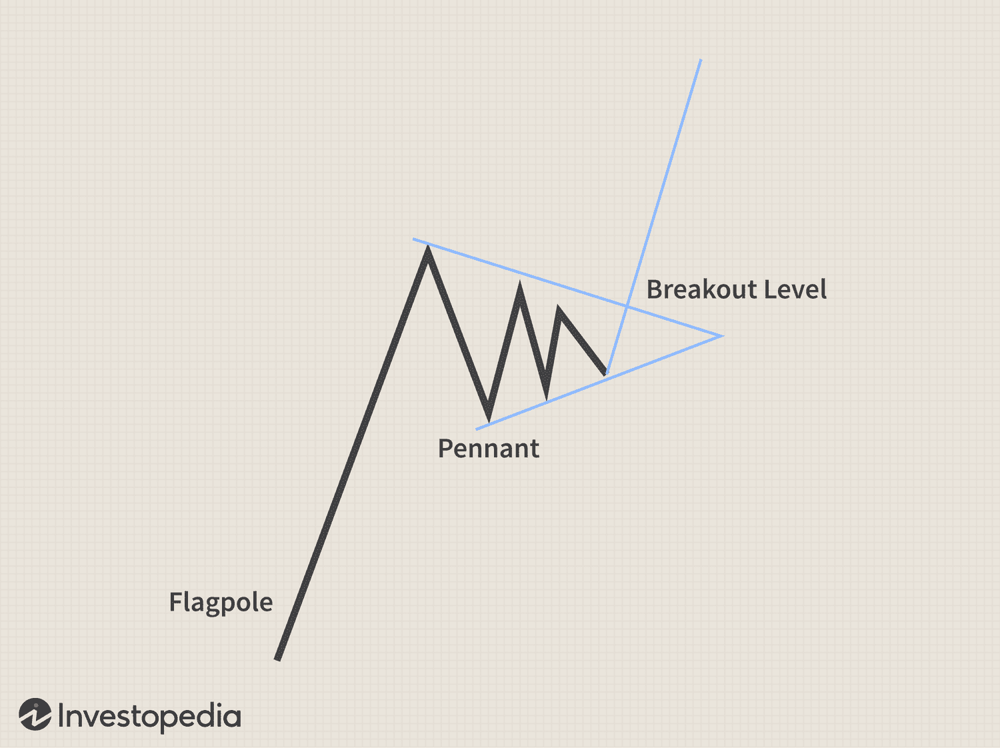

Trading relies heavily on technical analysis as a fundamental method for evaluating securities and making informed decisions. This method employs various tools, with chart patterns being essential in predicting market movements and aiding traders in seizing potential opportunities. Among these patterns, the pennant pattern stands out due to its frequent appearance and reliability. Recognized as a continuation pattern, the pennant forms during market consolidations after a robust price movement.

The consistent structure of pennant patterns offers traders valuable insights into ongoing trends and potential future movements. When the price consolidates, the market experiences a brief pause, characterized by two converging trendlines that form a symmetrical triangle or flag shape. This pattern suggests that after this consolidation, the previous trend is likely to resume, which can be effectively exploited in trading strategies.



This article provides an in-depth examination of pennant patterns, highlighting their formation, identification, and practical application in trading. Furthermore, the integration of pennant patterns into algorithmic trading is explored, demonstrating how automation can enhance trading efficiency and decision-making. By mastering the recognition and interpretation of the pennant pattern, traders can significantly improve their market performance.

## Table of Contents

## Understanding Chart Patterns in Technical Analysis

Chart patterns are crucial analytical tools in technical analysis, serving as visual representations of price movements on a price chart over time. These patterns materialize due to the collective psychology and behaviors exhibited by market participants, enabling technical analysts to derive informed predictions about potential future price directions. The strategic application of these patterns is vital for traders, offering insights into market psychology and informing decision-making processes.

Commonly recognized chart patterns include head and shoulders, triangles, flags, and pennants, each with distinct formations and implications for price trends. A "head and shoulders" pattern often signifies a reversal, indicating a shift in the prevailing trend, while "triangles" and "flags" are typically continuation patterns, suggesting the maintenance of the current trend post a consolidation phase.

A robust understanding of chart patterns is advantageous for traders, irrespective of experience levels, as it enhances their decision-making prowess. By identifying these formations, traders can better gauge the market sentiment, anticipate potential breakouts or reversals, and adjust their trading strategies accordingly. This knowledge aids in assessing the probability of certain outcomes and allows for more measured and strategic risk-taking.

Chart patterns are pivotal to technical analysis as they distill complex market activity into understandable visual cues. By closely analyzing these patterns, traders can align their strategies with statistical probabilities rather than gut feeling, thus optimizing their trading efficiency. Understanding the nuances of each pattern is paramount, as it provides traders with a comprehensive toolkit for navigating dynamic market conditions, hence underscoring the importance of chart patterns in enhancing traders' analytical and decision-making capabilities.

## What is a Pennant Pattern?

A pennant pattern is a continuation pattern in technical analysis that emerges following a significant price movement and is marked by a period of consolidation. This pattern forms when converging trendlines create a shape resembling a small flag or pennant, typically seen on a price chart after a sharp movement, often referred to as the "flagpole".

The formation of a pennant pattern is characterized by the following stages:

1. **Initial Sharp Price Movement (Flagpole):** The pattern begins with a strong price movement in either direction, which constitutes the flagpole of the pattern. This initial movement sets the groundwork for subsequent consolidation.

2. **Consolidation Phase:** Following the flagpole, the market enters a consolidation phase where the price action is contained within two converging trendlines. These trendlines form a symmetrical triangle as the market conditions stabilize temporarily, creating the pennant shape.

3. **Converging Trendlines:** During the consolidation phase, the trendlines, representing lower highs and higher lows, converge towards a point. The convergence of these trendlines indicates a decrease in volatility and represents a tug-of-war between bulls and bears as market participants await the next significant move.

4. **Breakout:** The pennant pattern concludes with a breakout that typically occurs in the direction of the preceding trend. This breakout signifies the continuation of the previous trend as market participants who were sidelined during the consolidation re-enter the market, often with renewed momentum.

Pennant patterns are versatile and can appear in both bullish and bearish markets. In bullish markets, the pattern follows a rapid upward movement and is followed by continued upward [momentum](/wiki/momentum) after the consolidation. In bearish markets, the process is mirrored, with the pattern emerging after a sharp downward move and subsequently continuing the downward trend post-consolidation.

The reliability of pennant patterns makes them a favored tool among technical analysts. However, traders should complement the pennant pattern analysis with other technical indicators, such as [volume](/wiki/volume-trading-strategy), to confirm the [breakout](/wiki/breakout-trading). Typically, volume decreases during the consolidation phase and then surges as the breakout occurs, enhancing the pattern's validity. This characteristic underlines the importance of holistic trading strategies that align various technical signals to predict market movements accurately.

## Identifying Pennant Patterns on a Chart

Identifying pennant patterns on a chart requires attention to specific price movements and visual characteristics. A pennant pattern emerges following a significant price movement, often referred to as 'the flagpole'. This initial price movement can be upwards or downwards and is marked by sharp and swift changes in price, signaling strong momentum either entering or exiting a particular asset.

Once this initial movement occurs, a period of consolidation typically follows. During this phase, traders should look for converging trendlines that form a symmetrical triangle. These trendlines emerge as the asset’s price oscillates between support and resistance levels, steadily moving towards a narrow price range. The pattern often resembles a small symmetrical triangle or pennant on the chart, hence the name.

Volume plays a critical role in identifying pennant patterns. Typically, trading volume decreases during the consolidation phase as the market retraces and traders await a potential breakout. The decrease in volume indicates reduced trading activity as the market decides the next direction. When a breakout occurs—marked by the price moving beyond the trendline—a surge in volume often confirms the breakout's legitimacy, indicating a resumption of the previous trend direction.

To identify pennant patterns on various types of price charts, traders can follow these steps:

1. **Locate the Flagpole**: Identify the strong upward or downward movement preceding the pennant. This sharp price movement represents the flagpole and sets the stage for the pennant formation.

2. **Spot the Pattern Formation**: Observe for the formation of two converging trendlines that create a triangular shape. This pattern is formed as the price consolidates after the initial strong move.

3. **Monitor Volume Changes**: Check for a decrease in volume during the formation of the pennant. The consolidation phase should witness lower trading volumes as the pattern develops.

4. **Identify the Breakout**: Look for an increase in price activity accompanied by a surge in trading volume, signaling the breakout. The direction of this breakout usually continues in the direction of the original flagpole.

For traders working with advanced tools or algorithmic systems, coding pattern recognition algorithms can offer a practical approach. In Python, this might involve using libraries such as pandas or NumPy for data handling and matplotlib or seaborn for visual charting. Implementing pattern recognition might include defining criteria for the flagpole, calculating regression lines for trend approximation, and using volume thresholds to confirm a breakout. 

Understanding and accurately identifying pennant patterns help traders anticipate future price movements, making timely trading decisions to capitalize on market opportunities.

## Interpreting and Trading Pennant Patterns

Interpreting and trading pennant patterns effectively can significantly enhance a trader's ability to capitalize on market trends. The key characteristic of a pennant pattern is that it serves as a continuation pattern, indicating that the price is likely to move in the same direction as the preceding trend post-breakout. Therefore, identifying the breakout direction is crucial for making informed trading decisions.

The breakout direction, generally resuming the prior trend, provides an opportunity to enter or [exit](/wiki/exit-strategy) positions strategically. For instance, in a bullish pennant, one might consider entering a long position as the price breaks out upwards, while a bearish pennant could signal a short position. The entry point usually coincides with the breakout from the converging trendlines, effectively capturing the momentum shift.

Setting price targets is another critical aspect of trading pennant patterns. The measure rule is often applied here, which involves estimating the potential price movement following the breakout. This is achieved by measuring the length of the flagpole, the price distance from the start of the trend to the start of the pennant. This distance is added (for bullish pennants) or subtracted (for bearish pennants) from the breakout point to set a target price. Mathematically, this can be expressed as:

$$
\text{Target Price} = \text{Breakout Price} \pm \text{Flagpole Height}
$$

Risk management is imperative when trading pennant patterns due to the possibility of false breakouts, whereby the price momentarily breaches the pattern only to reverse direction. Implementing stop-loss orders just outside the pennant pattern can mitigate potential losses. For example, a stop-loss order might be placed slightly below the lower trendline of a bullish pennant or above the upper trendline of a bearish one.

Timing is crucial in ensuring successful trades. It's advisable to wait for a confirmed breakout, often characterized by increased trading volume, to validate the move. Relying on volume spikes helps to corroborate the breakout strength and reduces the likelihood of falling for false signals.

Additionally, traders should consider placing stop-loss orders to protect against adverse price movements. A common strategy is to set stop-loss levels just outside the pattern's limits, ensuring that if the breakout is false, losses are minimized.

In sum, pennant patterns can yield profitable trading opportunities when analyzed and executed with precision. A combination of precise entry and exit strategies, accurate price target calculation, and robust risk management approaches will maximize the success of trades involving pennant patterns.

## Incorporating Pennant Patterns in Algorithmic Trading

Algorithmic trading involves the use of computer programs to conduct trades based on predetermined conditions. One insightful component that traders can incorporate into these algorithms is the pennant pattern. This chart pattern arises when a strong price movement is followed by a brief consolidation period, forming a shape similar to a small flag called a pennant. By integrating pattern recognition methods for such formations into trading algorithms, traders can automate the identification and interpretation processes, leading to more efficient and objective trade decisions.

Implementing pennant patterns into [algorithmic trading](/wiki/algorithmic-trading) strategies offers several advantages. Firstly, automation significantly increases trade execution speed, enabling the capture of opportunities in fast-moving markets. Secondly, the emotional component of trading is minimized, as decisions are made based on data and predefined rules rather than human psychology.

To effectively incorporate pennant patterns, it is crucial to grasp both coding and technical analysis concepts. Here is an outline of how such an algorithm could be structured in Python:

1. **Pattern Recognition**:
   Use historical price data to identify pennant patterns. This involves detecting a sharp price movement (the flagpole), followed by a consolidation phase where prices form a symmetrical triangle.

   ```python
   import pandas as pd
   import numpy as np

   def identify_pennant(price_data):
       # Simple moving average as a trend identifier
       price_data['SMA'] = price_data['Close'].rolling(window=20).mean()

       # Example logic to identify potential flagpoles and consolidation
       price_data['Flagpole'] = np.where((price_data['Close'] > price_data['SMA']), 1, 0)

       # Further refinement can include checks for volume confirmation and triangle formation
       return price_data
   ```

2. **Trade Execution**:
   Upon identifying a valid pennant pattern, the next step is to execute trades. The algorithm could set price targets based on the initial flagpole's height, determining potential profit margins.

   ```python
   def execute_trade(signal, current_price, target_price, stop_loss):
       if signal == 'buy':
           # Simulate buying action
           print(f"Bought at {current_price}")
           print(f"Set target at {target_price} and stop-loss at {stop_loss}")
       elif signal == 'sell':
           # Simulate selling action
           print(f"Sold at {current_price}")
           print(f"Set target at {target_price} and stop-loss at {stop_loss}")
   ```

3. **Risk Management**:
   Utilizing stop-loss orders is crucial to mitigate potential risks associated with false breakouts in pennant patterns. These orders automatically sell a security when its price falls to a specified level, hence limiting losses.

   ```python
   def set_risk_management(current_price, flagpole_height):
       target_price = current_price + flagpole_height
       stop_loss = current_price - (flagpole_height * 0.5) # Example stop-loss
       return target_price, stop_loss
   ```

Integrating pennant patterns in algorithmic trading requires a nuanced understanding of both market movements and algorithm development. By automating the process of recognizing these patterns and aligning trade executions with predefined criteria, traders can optimize performance and enhance their strategy's precision. This approach, however, should be complemented with comprehensive [backtesting](/wiki/backtesting) to ensure reliability and effectiveness in varying market conditions.

## Advantages and Limitations of Using Pennant Patterns

Pennant patterns, as a continuation pattern in technical analysis, offer several advantages to traders:

1. **Clear Entry and Exit Signals**: When identified accurately, pennant patterns provide traders with precise entry and exit points. This clarity arises from the symmetrical triangle structure, formed after an initial strong price movement, leading to a reliable breakout direction. Traders can anticipate the continuation of the existing trend, allowing them to position their trades accordingly.

2. **Applicability in Different Market Conditions**: Pennants can occur in both bullish and bearish markets, showcasing their versatility. This adaptability helps traders navigate various market scenarios without needing to switch to different types of patterns.

3. **Potential for High Reward-to-Risk Ratios**: By measuring the flagpole (the initial price movement before the pennant forms), traders can project the likely price target after a breakout. This can lead to high reward-to-risk ratios if the pattern unfolds as anticipated.

Despite these advantages, there are notable limitations to using pennant patterns:

1. **False Breakouts**: Not all pennant patterns result in successful breakouts in the anticipated direction. False breakouts can occur, where the price movement deviates after initially moving as expected, leading to potential losses. Such outcomes underline the necessity for robust risk management strategies, including setting stop-loss orders to mitigate losses.

2. **Market Volatility and External Factors**: The effectiveness of pennant patterns can be compromised by market volatility or sudden external economic events. These factors can disrupt even the strongest patterns, causing abrupt changes in price movement that technical patterns alone may not predict.

3. **Overreliance on Pattern Recognition**: Traders relying solely on pennant patterns might miss other critical market signals. Sole dependence on one pattern type can lead to an incomplete understanding of market dynamics, increasing the risk of misjudging trades.

To counterbalance these challenges, traders should adopt a diversified approach. This involves:

- **Combining with Other Analysis Tools**: Integrating pennant patterns with other technical indicators such as moving averages, RSI (Relative Strength Index), and MACD (Moving Average Convergence Divergence) can provide confirmation and strengthen trade predictions.

- **Incorporating Fundamental Analysis**: Understanding broader market conditions through economic indicators and news can help contextualize technical signals, offering a more holistic view of potential market movements.

- **Continuous Learning and Adaptation**: Market conditions and patterns evolve. Traders should stay informed about changes in market behavior and continuously refine their strategies to adapt to new patterns and trading technologies.

In conclusion, while pennant patterns are a valuable tool in technical analysis, their best use comes from being part of a broader strategy that considers diverse market factors and utilizes a range of analytical tools.

## Conclusion

The pennant pattern remains an essential instrument for technical analysts, offering applicability in both conventional and algorithmic trading frameworks. Mastery in identifying and interpreting the pennant pattern equips traders with the potential to bolster their market performance significantly. By recognizing the symmetrical triangle formation that often precedes a continuation of the prevailing trend, traders can make informed decisions to maximize their returns.

Despite their utility, pennant patterns should not be the sole cornerstone of a trading strategy. Their efficacy is heightened when combined with a comprehensive approach that takes into account diverse market variables such as economic indicators and statistical models. This broad strategy minimizes the risks associated with market [volatility](/wiki/volatility-trading-strategies) and false signals, which can sometimes arise from over-reliance on any single chart pattern.

For those employing algorithmic trading strategies, the integration of pennant pattern recognition offers an automated mechanism for optimizing trade executions. Algorithms can be designed to detect these patterns and trigger trades based on the anticipated continuation of the trend. This automation reduces the emotional bias often inherent in manual trading decisions and accelerates reaction times to market movements.

In conclusion, the continuous refinement of analytical skills and the ability to adapt to evolving market conditions are crucial for the successful application of chart patterns like the pennant. Traders should engage in ongoing education, stay informed on market developments, and remain flexible in their strategic approaches. Embracing a balanced and informed strategy can significantly improve the odds of trading success, whether through traditional analysis or algorithmic interventions.

## References & Further Reading

[1]: Bulkowski, T. N. (2005). ["Encyclopedia of Chart Patterns."](https://www.amazon.com/Encyclopedia-Chart-Patterns-Thomas-Bulkowski/dp/0471668265) Wiley.

[2]: Elder, A. (1993). ["Trading for a Living: Psychology, Trading Tactics, Money Management."](https://www.amazon.com/Trading-Living-Psychology-Tactics-Management/dp/0471592242) Wiley.

[3]: Pring, M. J. (2002). ["Technical Analysis Explained: The Successful Investor's Guide to Spotting Investment Trends and Turning Points."](https://www.amazon.com/Technical-Analysis-Explained-Fifth-Successful/dp/0071825177) McGraw-Hill.

[4]: Schwager, J. D. (1993). ["The New Market Wizards: Conversations with America's Top Traders."](https://archive.org/details/newmarketwizards00jack) HarperBusiness.

[5]: Murphy, J. J. (1999). ["Technical Analysis of the Financial Markets: A Comprehensive Guide to Trading Methods and Applications."](https://archive.org/details/technicalanalysi0000murp) New York Institute of Finance.