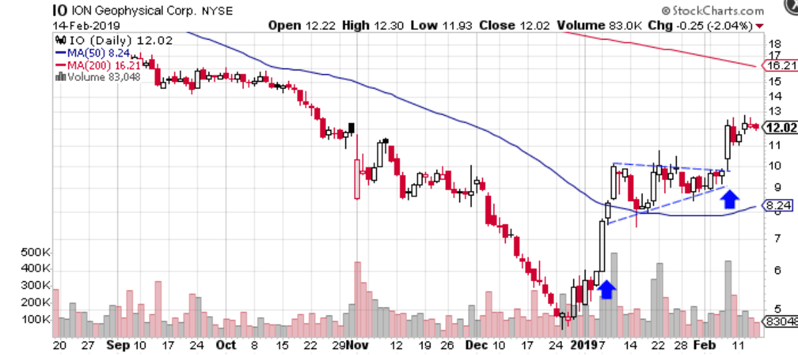

In algorithmic trading, chart patterns such as bullish pennants play a pivotal role in providing traders with significant insights into market trends. A bullish pennant is a continuation pattern typically observed following a sharp upward movement. It indicates a brief market consolidation or pause before the prevailing uptrend continues. Recognizing and understanding these patterns can be crucial for traders aiming to capitalize on ongoing market movements.

This article investigates the characteristics of a bullish pennant, including how traders can identify these patterns and integrate them into their algorithmic trading strategies. In essence, algorithmic trading professionals seek to enhance trade accuracy and profitability by incorporating these chart patterns into their strategies. By doing so, traders can systematically determine entry and exit points, optimize risk management, and improve the precision of their trades, which are fundamental aspects of successful algorithmic trading.



## Table of Contents

## What is a Bullish Pennant Pattern?

A bullish pennant pattern forms when the market consolidates following a sharp upward movement, resulting in a configuration visually similar to a small symmetrical triangle, commonly referred to as the pennant. This pattern is observed in the context of technical analysis and is distinguished by its specific configuration which signifies a temporary pause in the price action before the original upward trend resumes.

Structurally, the bullish pennant consists of two primary components: the 'pole' and the 'pennant.' The pole represents the strong and rapid uptrend that precedes the pattern. It is characterized by a steep price rally, indicating robust buying interest or a significant surge in bullish sentiment. Following the formation of the pole, the market typically enters a consolidation phase, which is where the pennant forms. The pennant itself is created by converging trend lines that represent a series of lower highs and higher lows, illustrating a symmetrical triangle. This formation suggests a period of indecision in the market where traders are temporarily uncertain about the price direction.

The significance of a bullish pennant lies in its indication of a continuation pattern. After the consolidation phase marked by the pennant, the expectation is that the price will break out in the direction of the preceding trend, continuing the upward trajectory. This pattern is valuable for traders as it provides a potential entry point for buying or adding to long positions with the anticipation of further price increases. Identifying and understanding the bullish pennant pattern enables traders to capitalize on market momentum following brief consolidation phases.

## Identifying a Bullish Pennant in Algo Trading

Recognizing a bullish pennant pattern in [algorithmic trading](/wiki/algorithmic-trading) involves a two-step analysis of the price action and trading [volume](/wiki/volume-trading-strategy). Initially, traders need to identify a sharp and rapid upward price movement, often referred to as the 'pole'. This is followed by a period of consolidation, where price movements form a small symmetrical triangle, known as the pennant. During this phase, prices tend to move between converging trendlines without any significant directional bias, creating a visual pattern resembling a pennant.

In terms of trading volume, the pattern is typically characterized by a decreasing volume during the formation of the pennant. This decline suggests a temporary slowdown in market [momentum](/wiki/momentum) as buyers and sellers reach a temporary equilibrium. However, a key feature that confirms the bullish pennant is a noticeable increase in volume when the price breaks above the upper boundary of the pennant. This surge in volume reinforces the credibility of the [breakout](/wiki/breakout-trading), indicating a potential continuation of the upward trend.

Algorithmic trading systems can be designed to identify these patterns through automated analysis of price data and volume metrics. By leveraging historical data, algorithms can be programmed to screen for rapid upward price movements and symmetrical consolidation patterns. A basic Python script using libraries like `pandas` for data handling and `matplotlib` for visualization can assist in detecting such patterns:

```python
import pandas as pd
import matplotlib.pyplot as plt

def detect_bullish_pennant(data):
    # Assuming 'data' is a DataFrame with 'price' and 'volume' columns
    # Detect rapid upward movement
    pole_threshold = data['price'].pct_change().mean() + data['price'].pct_change().std()
    pole = (data['price'].pct_change() > pole_threshold)

    # Detect decrease in volume during consolidation
    volume_trend = data['volume'].rolling(window=5).mean().diff().iloc[-5:].mean()

    # Determine breakout
    breakout = data['price'].iloc[-1] > max(data['price'].iloc[-20:])

    if pole.any() and volume_trend < 0 and breakout:
        print("Bullish pennant identified.")
    else:
        print("Bullish pennant not found.")

# Example usage
data = pd.DataFrame({
    'price': [105, 108, 112, 114, 111, 112, 113, 116],
    'volume': [1000, 1100, 950, 900, 850, 900, 950, 1250]
})

detect_bullish_pennant(data)
```

This script outlines a simple approach for identifying a bullish pennant by checking for a statistical outlier in the price change indicative of the 'pole', assessing the volume trend during the symmetrical consolidation, and verifying the occurrence of a breakout. More sophisticated algorithms could use [machine learning](/wiki/machine-learning) models to improve pattern recognition by training on larger datasets and incorporating additional market factors.

## The Importance of Bullish Pennants in Algo Trading

Bullish pennants play a significant role in algorithmic trading, offering traders the opportunity to identify robust continuation signals during periods of market [volatility](/wiki/volatility-trading-strategies). As a continuation pattern, the bullish pennant signals the potential resumption of an upward [trend following](/wiki/trend-following) a period of consolidation. This characteristic makes it particularly valuable for traders employing systematic strategies, as it provides clear entry points with pre-defined risk management protocols.

In algorithmic trading, the effectiveness of bullish pennants stems from their ability to provide timely signals for re-entering a trend that had experienced a temporary pause. These patterns are typically recognized by their distinctive structure, formed after a sharp price increase (the pole), followed by a consolidation phase, creating the pennant shape. During the consolidation, market indecision leads to lower volume, which is a key characteristic of the pattern.

Systematic traders benefit from bullish pennants by utilizing them to establish entry points that align with their risk management strategies. In practice, this might involve setting stop-loss orders just below the pennant formation to mitigate potential losses from false breakouts. Such careful planning ensures that risk is contained, while maintaining the potential for significant upside should the breakout happen as anticipated.

A typical approach involves calculating the profit target by measuring the height of the pole preceding the pennant formation and projecting it upwards from the breakout point of the pennant. This method provides a quantifiable target, aiding traders in setting realistic expectations for the potential movement post-breakout.

Algorithmic frameworks can further enhance the practicality of bullish pennants by incorporating automated detection. The integration of technical analysis algorithms, capable of recognizing these patterns and initiating trades, can enhance decision-making processes. This automation not only reduces the cognitive load on traders but also increases the efficiency and speed of executions during volatile market conditions.

Overall, the integration of bullish pennant patterns into algorithmic trading systems encapsulates a strategic advantage. It enhances trade precision, aligns with systematic risk management practices, and fosters an environment conducive to optimizing trading outcomes amidst unpredictable market movements.

## How to Trade a Bullish Pennant Pattern Effectively

To trade a bullish pennant pattern effectively, traders must identify a breakout above the pattern's upper boundary, which signals the resumption of upward momentum. This breakout is a critical point and serves as an entry signal for many traders. When trading the bullish pennant, it's imperative to implement a sound risk management strategy to mitigate potential losses from false breakouts.

Setting stop-loss orders is a key aspect of risk management. These orders should be placed just below the pennant pattern, safeguarding against significant losses if the breakout does not sustain. The placement of a stop-loss can vary depending on a trader's risk tolerance, but generally, it should be close enough to limit losses while allowing for minor market fluctuations.

Profit targets in bullish pennant trading are typically determined by the 'pole height' concept. The 'pole' is the initial sharp upward movement preceding the pennant formation. Traders project the height of the pole upwards from the breakout point to set their profit targets. This measure provides a systematic approach to estimating potential profit, ensuring that trades are exited at optimal points based on historical price movement.

Incorporating these strategies requires not only technical analysis but also a disciplined approach to execution. Traders may use algorithmic trading systems to automatically identify bullish pennant patterns, set entry and [exit](/wiki/exit-strategy) points, and manage risk efficiently. These systems can enhance the consistency and accuracy of trades, especially in fast-moving markets. Using [backtesting](/wiki/backtesting) and paper trading, traders can refine their strategies to suit different market conditions and improve their overall trading performance.

## Challenges and Considerations

While the bullish pennant is often regarded as a reliable chart pattern, traders must acknowledge the potential for false breakouts, which highlights the necessity for robust risk management strategies. False breakouts can lead traders to enter positions prematurely or exit too late, resulting in potential losses. To mitigate this, traders often employ stop-loss orders, which serve as a predefined exit point should the market move against their position. By setting stop-loss orders just below the lowest point of the pennant formation, traders can limit their downside risk.

Additionally, traders must consider the broader market context to enhance the pattern's reliability. Overarching trends play a crucial role in the effectiveness of bullish pennants. For instance, identifying a pennant in the context of an existing bullish market trend increases its likelihood of a successful breakout. Conversely, if the broader market trend is bearish or neutral, the reliability of a bullish pennant diminishes.

Volume dynamics also provide valuable insights into the pattern's validity. During the pennant formation phase, a decrease in trading volume is often observed, indicating market consolidation. A subsequent increase in volume upon breakout acts as a confirmation signal, suggesting that the bullish momentum is likely to resume. Without a significant increase in volume, the breakout may lack the necessary strength to sustain a continuation of the upward move.

Algorithmic traders can further refine their strategies by integrating pennant signals with other technical indicators. This multi-faceted approach involves combining the bullish pennant pattern with indicators such as Relative Strength Index (RSI), Moving Average Convergence Divergence (MACD), or other moving averages to filter out false signals and enhance trading precision. For instance, a bullish pennant breakout occurring while the RSI is also rising may provide a stronger signal of an impending price uptrend.

Here's an example of Python code that combines the detection of a bullish pennant with RSI to enhance trading decisions:

```python
import pandas as pd
import talib as ta

# Load market data
data = pd.read_csv('market_data.csv')

# Calculate RSI
data['RSI'] = ta.RSI(data['Close'], timeperiod=14)

# Define a function to detect bullish pennant patterns
def detect_bullish_pennant(data):
    # Logic to detect bullish pennant goes here
    # This is a placeholder for pattern detection algorithm
    return data['RSI'] > 50  # Example condition: RSI above 50

# Apply the detection function
data['BullishPennant'] = detect_bullish_pennant(data)

# Filter for trade signals
trade_signals = data[(data['BullishPennant'] == True) & (data['RSI'] < 70)]
```

This example assumes preprocessed data and integrates RSI as a complementary indicator to the bullish pennant pattern, filtering for trade signals when RSI is relatively high, indicating potential overbought conditions. By using code and quantitative techniques, traders can systematically identify and act upon bullish pennant opportunities, thereby enhancing their algorithmic trading strategies with a more comprehensive view of market dynamics.

## Conclusion

Bullish pennants serve as critical indicators for algorithmic traders, highlighting potential continuations in price movements. By integrating these patterns into trading algorithms, traders can enhance decision-making processes and optimize trading outcomes. The ability to recognize and respond to the formation and breakout of a bullish pennant equips traders with a strategic edge in volatile markets. 

In algorithmic systems, the automation of pattern recognition facilitates quicker response times, allowing traders to capitalize on brief market pauses before a trend resumes. This is achieved by embedding code that identifies key features of a bullish pennant: the sharp upward movement forming the pole, the subsequent consolidation forming the pennant, and the breakout characterized by increased volume.

Here is a basic example of how a bullish pennant may be identified programmatically in Python using libraries such as pandas and numpy:

```python
import pandas as pd
import numpy as np

def detect_bullish_pennant(prices, volumes):
    price_changes = np.diff(prices)
    strong_move_index = np.where(price_changes > np.std(price_changes))[0]  # Find strong upward moves
    if len(strong_move_index) < 1:
        return False

    start_index = strong_move_index[0] + 1
    pennant_prices = prices[start_index:]
    pennant_volume = volumes[start_index:]

    # Check for a triangular consolidation (this is simplified)
    if np.std(pennant_prices) < np.std(prices) and np.all(np.diff(pennant_volume) < 0):
        return True

    return False

# Example usage
prices = pd.Series([20, 22, 25, 27, 30, 28, 29, 27, 31])
volumes = pd.Series([100, 120, 150, 160, 110, 105, 100, 95, 130])
is_pennant = detect_bullish_pennant(prices, volumes)
```

Understanding bullish pennant dynamics not only aids in the identification of trading opportunities but also helps in setting strategic stop-losses and profit targets, based on the pattern's characteristics. Implementing these patterns effectively requires consideration of broader market conditions and other technical indicators, ensuring a holistic approach to trading strategy. As such, adept use of bullish pennants can significantly enhance a trader's ability to navigate market fluctuations and seize profitable opportunities.

## References & Further Reading

[1]: Bergstra, J., Bardenet, R., Bengio, Y., & Kégl, B. (2011). ["Algorithms for Hyper-Parameter Optimization."](https://dl.acm.org/doi/10.5555/2986459.2986743) Advances in Neural Information Processing Systems 24.

[2]: ["Advances in Financial Machine Learning"](https://www.amazon.com/Advances-Financial-Machine-Learning-Marcos/dp/1119482089) by Marcos Lopez de Prado

[3]: ["Evidence-Based Technical Analysis: Applying the Scientific Method and Statistical Inference to Trading Signals"](https://www.amazon.com/Evidence-Based-Technical-Analysis-Scientific-Statistical/dp/0470008741) by David Aronson

[4]: ["Machine Learning for Algorithmic Trading"](https://github.com/stefan-jansen/machine-learning-for-trading) by Stefan Jansen

[5]: ["Quantitative Trading: How to Build Your Own Algorithmic Trading Business"](https://books.google.com/books/about/Quantitative_Trading.html?id=j70yEAAAQBAJ) by Ernest P. Chan