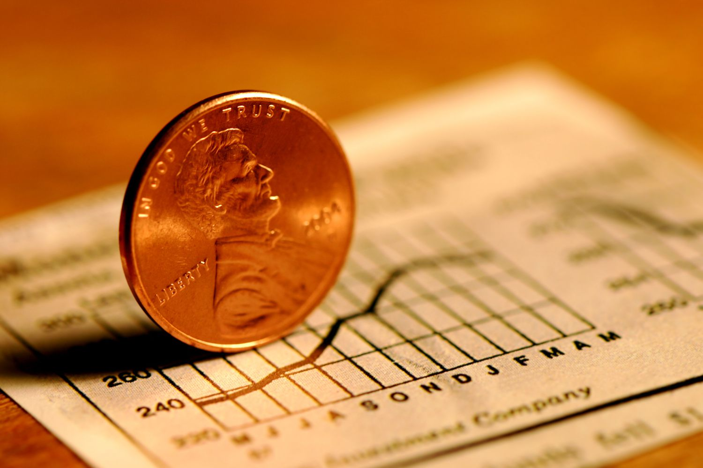
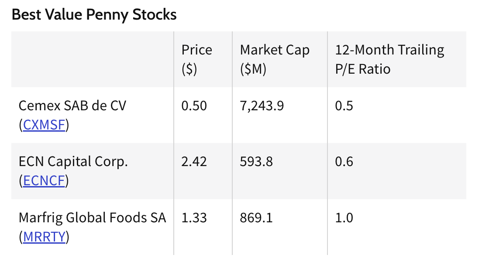
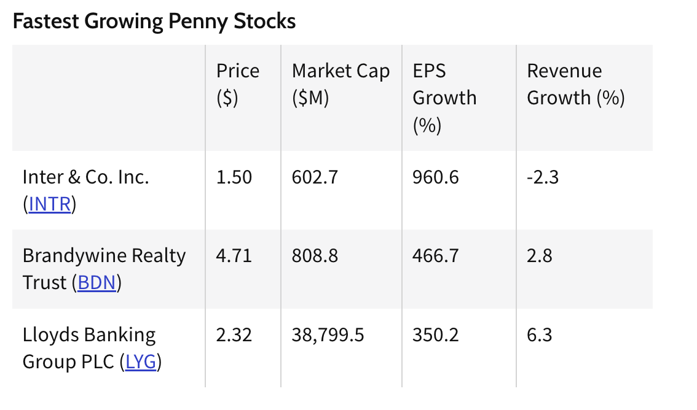

Penny stock day trading has long captured the imagination of ambitious traders, primarily due to tales of significant profits made from small initial investments. The very nature of penny stocks, often priced under $5 a share, allows traders to purchase a large quantity of shares with relatively low capital. This setup has the potential to yield substantial returns even with minor price movements. However, the glittering allure of penny stocks is equally matched by their volatility and the potential for loss. They often operate in the high-risk, high-reward paradigm, a characteristic punctuated by their frequent placement in nascent industries or businesses that are yet to prove their mettle.

Moreover, penny stocks are unique in more ways than just their low price. Their lack of liquidity, limited historical data, and the potential for manipulation, especially in the over-the-counter (OTC) markets, set them apart from blue-chip stocks. Traders must navigate through limited financial reporting, aggressive promotions, and at times, even outright scams. Despite these challenges, with the right strategy, tools, and mindset, penny stock day trading can be mastered, and traders can tap into the opportunities they offer while mitigating potential pitfalls.

## Table of Contents

## Understanding Penny Stocks

Penny stocks, colloquially known as "pennies", are shares of public companies that trade at relatively low prices. The U.S. Securities and Exchange Commission (SEC) classifies them as stocks priced below $5 per share[1]. While this threshold offers a technical definition, the essence of penny stocks lies in their characteristics. They typically have low market capitalizations, limited liquidity, and might be listed on smaller exchanges or over-the-counter (OTC) markets.

These stocks often belong to startups or companies in the nascent stages of their business cycle. Due to their size or the industries they operate in, these companies might not qualify for a listing on major stock exchanges. As a result, they trade on the OTC markets or alternative exchanges where regulatory scrutiny and reporting requirements might be less stringent than those like the NYSE or NASDAQ.

Differentiating penny stocks from traditional, or blue-chip stocks, goes beyond just price. Blue-chip stocks usually represent well-established companies with a history of financial stability and performance. They typically offer dividends and are covered extensively by market analysts. Penny stocks, in contrast, may not offer dividends and are rarely under the spotlight, unless they see unusual activity. Due to their lack of visibility, reliable information about penny stock companies can be hard to find, making them susceptible to rumors and less predictable price movements.

Now, delving into the pros and cons of trading penny stocks:

**Pros:**

1. **Affordability:** The low cost of entry means traders can buy a substantial number of shares with a smaller capital outlay.
2. **High Potential Returns:** Given their volatility, penny stocks can see significant price surges within short periods.
3. **Less Competition:** Fewer institutional investors operate in this space due to the risks and the small market caps of companies. This reduction in professional competition can give individual traders an edge.

**Cons:**

1. **Volatility:** The same attribute that makes them attractive for high returns makes them risky. Prices can drop as swiftly as they can rise.
2. **Limited Information:** With less media coverage and sometimes scarce formal reporting, making informed decisions can be challenging.
3. **Liquidity Concerns:** Some penny stocks have low trading volumes, making it hard to enter or exit positions without affecting the stock price.

In essence, while penny stocks offer opportunities for substantial gains, they come with heightened risks. A thorough understanding and careful strategy are imperative for anyone considering diving into this segment of the stock market.

## The Dynamics of Day Trading

Day trading is a unique form of financial strategy that revolves around buying and selling financial instruments within a single trading day. The objective is to capitalize on small price movements in highly liquid stocks or indexes. Unlike investors who may hold positions for weeks, months, or even years, day traders operate on a much shorter timeframe, typically closing out all positions by the end of the trading session.

**The Fundamentals of Day Trading Explained**

The essence of day trading is rooted in the art of speculation. Traders look for stocks or other instruments that have a higher probability of moving in a specific direction within a short timeframe. Their decisions are often influenced by a combination of technical analysis, real-time news, market trends, and even gut instinct.

There are some key characteristics that define day trading:

1. **Short-Term Focus:** Day traders focus on intraday price movements. Their trades might last seconds, minutes, or hours, but never more than a day.
2. **Leverage:** Many day traders utilize leverage to amplify their potential returns. However, while this can increase profit potential, it also elevates the risk.
3. **High Frequency:** A day trader might execute multiple trades within a single day. This high frequency can translate into higher transaction costs, making it crucial to have a clear strategy and minimize unnecessary trades.
4. **Technical Analysis:** Day traders often rely heavily on technical analysis, studying price charts and using technical indicators to predict future price movements. This contrasts with fundamental analysis, which looks at a company's financial health, industry trends, and other long-term factors.

**How Day Trading Penny Stocks Differs from Trading Other Stocks**

Penny stocks are low-priced, small-cap stocks that trade below $5 per share, though definitions can vary. Because of their low price, penny stocks can be susceptible to high volatility, often driven by speculation rather than fundamentals. Here's how day trading them stands apart:

1. **Volatility:** Penny stocks are notoriously volatile. While this can mean greater profit potential, it also comes with increased risk. A stock can soar or plummet within minutes based on news, rumors, or even sheer speculation.
2. **Liquidity Issues:** Unlike large-cap stocks that have a high volume of shares traded daily, penny stocks may have limited liquidity. This can make it challenging to enter or exit positions without affecting the stock's price.
3. **Less Information Availability:** Penny stocks often don't have the same level of scrutiny and transparency as stocks listed on major exchanges. There's generally less reliable information available, making it harder to make informed decisions.
4. **Manipulation:** Due to their low market capitalization and trading volume, penny stocks are more susceptible to price manipulation. Schemes like "pump and dump" can artificially inflate the stock price before those behind the scheme sell off, leading to rapid devaluation.
5. **Differing Strategies:** Because of the unique challenges and characteristics of penny stocks, day traders need to adjust their strategies. For instance, while a news-driven strategy might be effective for larger stocks, the unreliability of news surrounding penny stocks might make such a strategy less viable.

In essence, while the core principles of day trading remain consistent, the specific dynamics when trading penny stocks introduce a distinct set of challenges and opportunities. Aspiring traders must equip themselves with a deep understanding of these nuances to navigate the turbulent waters of penny stock day trading successfully.

## Penny Stocks: Where They Trade

Penny stocks, given their unique nature, are often not traded on the major stock exchanges like larger, established companies. Instead, they find their home across a variety of platforms, each with its own characteristics and implications for traders.

**Penny Stocks on NYSE and NASDAQ**

While the New York Stock Exchange (NYSE) and the NASDAQ are often associated with large-cap, established companies, they do list some penny stocks. These exchanges have strict listing requirements in terms of financial metrics, governance, and liquidity. Thus, penny stocks that make it to these exchanges are often viewed as more credible than those on less-regulated platforms. However, even on these exchanges, they remain volatile due to their low price and market capitalization[2].

**Over-the-Counter (OTC) Markets**

A significant portion of penny stocks is traded over-the-counter (OTC). OTC markets lack the stringent requirements of the major exchanges. OTC penny stocks are typically traded through a dealer network, rather than a centralized exchange. These stocks can be further categorized into different tiers, such as the OTCQX, OTCQB, and Pink Sheets, based on their level of financial disclosure and corporate governance[3].

**Importance of the Trading Platform**

The platform where a penny stock trades can have a profound impact on its liquidity and volatility:

1. **Liquidity:** Stocks on major exchanges like NYSE or NASDAQ typically have higher trading volumes, making them more liquid. In contrast, OTC stocks can sometimes have sporadic trading volumes, making it difficult to buy or sell large quantities without causing significant price changes.
2. **Volatility:** The reduced regulatory oversight in OTC markets can lead to higher volatility. With fewer reporting requirements and less transparency, these stocks can swing dramatically based on rumors or limited information.
3. **Information Availability:** Major exchanges have strict reporting requirements, ensuring a certain level of transparency. In OTC markets, especially the lower tiers, companies may not be required to disclose as much information, making them riskier for investors.
4. **Costs and Fees:** Different platforms have varying fee structures. For instance, OTC trades might come with additional fees or wider bid-ask spreads, potentially affecting a trader's profitability.

Traders interested in penny stocks should familiarize themselves with the intricacies of each trading platform. Understanding where a penny stock is traded provides insight into its risk profile, potential for liquidity issues, and the kind of due diligence required. As always, thorough research and caution are paramount when venturing into the world of penny stocks.

## Strategies and Techniques for Penny Stock Day Trading

Successfully day trading penny stocks requires a combination of keen observation, technical analysis, and a solid strategy. Let's deep dive into some widely employed strategies and their applications:

**Monitoring Fluctuations**

Penny stocks are notorious for their volatility. Successful traders often set alerts for price jumps or declines within a short time frame. For instance, if a stock worth $0.10 moves to $0.12 within minutes, that's a 20% increase. Capturing such movements can lead to substantial profits over the course of a day.

**Navigating Through Hype and Promotions**

Penny stocks often see bursts of activity fueled by news, rumors, or promotional campaigns. While some news can be legitimate catalysts for price movement, much of the hype is baseless. Recognizing the difference is crucial. Traders might ride the momentum of positive news, but they ensure a timely exit before the hype fades.

**Volume Analysis and Its Importance**

Volume indicates the number of shares traded during a particular time frame. A surge in volume can validate the significance of a price movement. For example, a penny stock rising 10% on low volume might be less reliable than one rising 5% on high volume. Observing volume spikes can help traders anticipate potential price shifts[4].

**The Art and Science of Timing Your Trades**

Entry and exit points are crucial. One method traders use is the "support and resistance" levels. Support is a price level at which a stock tends to stop falling, while resistance is where it caps its rise. If a penny stock repeatedly fails to rise above $0.20 but doesn't drop below $0.18, those would be its resistance and support levels, respectively. Buying near support and selling near resistance can be an effective strategy.

**Incorporating Indicators**

Technical indicators provide insights into potential price movements:

- **Bollinger Bands**: These bands represent standard deviation levels from a simple moving average. When the stock price touches the upper band, it might be overbought; when it hits the lower band, it could be oversold[5].
- **On Balance Volume (OBV)**: This indicator correlates volume to price changes. A rising OBV suggests that volume is increasing on up days, signaling potential buying pressure. Conversely, a falling OBV may indicate selling pressure[6].

**Risk Management and Stop Losses**

Regardless of the strategy, managing risk is paramount. Setting stop losses is a way to predetermine an exit point if a trade goes south. For example, if you buy a stock at $0.10, setting a stop loss at $0.09 limits potential loss to 10%.

**“Pump and Dump” Scheme**

This deceptive strategy involves artificially inflating ("pumping") a stock's price through misleading statements, only to sell ("dump") the shares once prices are high. For traders, recognizing such schemes is vital. Red flags include suspicious promotional campaigns, spikes in volume followed by sharp price declines, or news that seems too good to be true[7].

While the allure of penny stocks is undeniable, navigating their turbulent waters requires skill, strategy, and vigilance. Being well-armed with knowledge and a plan is the best defense against the inherent risks of this high-stakes game.

## Tools of the Trade

A trader's toolbox can significantly influence success, especially in the volatile world of penny stocks. Having the right tools can mean the difference between a successful trade and a missed opportunity. Here's what every penny stock day trader should consider:

**Stock Scanners Optimized for Penny Stocks**

Stock scanners are essential tools that filter stocks based on user-defined metrics, helping traders find potential opportunities in real-time. For penny stocks, criteria might include specific price ranges (e.g., stocks trading under $1) or significant percentage moves. Tools like Trade Ideas and Finviz offer customizable settings tailored to penny stock conditions[8]. Fine-tuning these settings allows traders to sift through the noise and hone in on potential breakout or high-volume trades.

**Reliable Sources for Penny Stock News and Updates**

Staying updated with real-time news is critical. Price movements in penny stocks often correlate with news releases, whether it's company-specific news, sector trends, or regulatory changes. Sources such as Benzinga, PR Newswire, and Yahoo Finance provide timely updates relevant to penny stocks[9]. Always ensure that news sources are reliable and not promotional materials in disguise, as misinformation is rampant in the penny stock world.

**The Role of Chart Patterns in Predicting Price Movement**

Technical analysis is the study of past market data, primarily through the use of charts, to forecast future price movements. Penny stock traders often rely on recognizable chart patterns that indicate potential price movements. Common patterns include the "head and shoulders," "double top," and "bull flag." Understanding these patterns and their implications can provide traders with insights into potential breakouts or breakdowns[10].

For example, a "bull flag" pattern occurs after a strong upward movement (the flagpole) followed by a consolidation phase that slopes against the trend (the flag). This pattern suggests a potential continuation of the prior uptrend. Recognizing and acting upon such patterns can give traders a strategic edge.

## Day Trading vs. Investing: Which Suits You Best?

Day trading and investing are often used interchangeably, but they are inherently different approaches to the financial markets, each with its unique objectives, time horizons, and methodologies.

At its core, day trading is about capturing short-term price movements within a single trading day[11]. The objective is to profit from intraday price changes, which requires a keen understanding of market psychology, technical analysis, and real-time decision-making. Day traders might enter and exit multiple trades within hours, if not minutes, aiming to capture small price movements that can accumulate into substantial profits.

Investing, on the other hand, is the practice of buying assets with the expectation of long-term appreciation[12]. Investors typically hold onto their assets for months, years, or even decades, emphasizing fundamental analysis to select stocks with promising future earnings or intrinsic value. Their decisions are more influenced by a company's financial health, competitive advantage, and industry trends rather than short-term price fluctuations.

When evaluating which approach aligns with your financial goals and temperament, consider the following:

1. **Capital Commitment**: Day trading often requires a higher starting capital due to regulatory rules, especially in the U.S., where the Pattern Day Trader rule mandates a minimum equity of $25,000 for individuals who make more than three day trades in a five-day period[13].
2. **Time Commitment**: Day trading is time-intensive. It demands constant market monitoring, quick decision-making, and often, the agility to act on split-second changes. Investing is more passive, allowing for periodic check-ins.
3. **Risk Tolerance**: The high frequency of trades in day trading can amplify both profits and losses. Understand your risk tolerance and whether you're comfortable with the potential of significant intraday losses.
4. **Skillset and Interests**: Are you intrigued by technical analysis, chart patterns, and real-time news? Or do you have a penchant for diving deep into financial statements and understanding industries?
5. **Emotional Resilience**: Day trading can be a roller-coaster of emotions given the rapid pace. It requires a temperament that can handle the stress, whereas investing allows for a more laid-back approach.
6. **Profit Expectations**: Day traders often seek regular income, while investors aim for capital appreciation over time.

Ultimately, the decision between day trading and investing boils down to your personal preferences, lifestyle, and financial goals. Penny stock day trading, with its heightened volatility, demands even more diligence. Before diving in, always educate yourself, practice with simulations, and consult with financial professionals to ensure a path aligns with your objectives.

## Five Golden Tips for Every Penny Stock Day Trader

1. **Stay Informed**: Penny stocks are particularly susceptible to market rumors, news, and promotions. Always stay updated with reliable sources and avoid basing decisions solely on unverified tips or hearsay. Websites such as [Finviz](https://www.finviz.com/) or the [SEC's EDGAR database](https://www.sec.gov/edgar/searchedgar/companysearch.html) can provide pertinent and timely information.
2. **Set a Budget and Stick to It**: Before entering any trade, decide on the maximum amount you are willing to lose and stick to it. By doing this, you protect yourself from the emotional pitfalls that can lead to irrational decisions in the heat of the moment. The use of stop-loss orders can be an effective way to automate this discipline.
3. **Beware of the Hype**: Penny stocks are infamous for being the target of "pump and dump" schemes. Traders may artificially inflate the price through misleading positive statements, only to sell off their shares once the price peaks. Always do your own research and avoid getting caught in the hype.
4. **Prioritize Liquidity**: Liquidity refers to how easily an asset can be bought or sold without affecting its price. In penny stock trading, lack of liquidity can trap traders in a position, especially during rapid market downturns. Ensure the penny stocks you trade have adequate volume, which can be checked on most trading platforms.
5. **Continuous Education**: The world of penny stock day trading is ever-evolving. What worked a year ago might not work today. Dedicate time to learning new strategies, understanding market changes, and refining your trading techniques. Online communities, seminars, and books can be excellent resources to further your education.

By integrating these golden tips into your trading regimen, you pave a clearer path toward consistent and informed trading decisions in the volatile world of penny stocks.

## Realities and Myths of Penny Stock Day Trading

Penny stock trading, often glamorized in media and popular culture, has its fair share of myths. Let's dive straight into debunking some common misconceptions and highlighting the stark realities of this trading niche.

**Myth 1: Penny Stocks are a Quick Route to Wealth**

Reality: While there are stories of traders making significant profits in a short time, the vast majority face losses. Penny stocks are highly speculative, and their low prices can make them more susceptible to manipulation[14]. Consistent profitability requires extensive research, discipline, and a well-defined strategy.

**Myth 2: All Penny Stocks are Undervalued Gems Waiting to Skyrocket**

Reality: Most penny stocks are priced low for a reason. They could belong to companies with unproven business models, financial difficulties, or limited operational history. While some may indeed be undervalued, many are accurately priced based on their potential and inherent risks.

**Myth 3: Penny Stock Trading is Similar to Gambling**

Reality: While both involve risk, successful penny stock trading is based on analysis, strategy, and informed decision-making, whereas gambling is based on pure chance. Traders who approach it like a game of roulette are likely to incur losses.

**Myth 4: More Stocks Mean More Profits**

Reality: It's a common misconception that buying more shares because they're cheap will lead to higher profits. The truth is, whether you buy 10 shares at $100 each or 1,000 shares at $1 each, a 10% loss is still a 10% loss.

**Myth 5: Large Trading Volumes Always Indicate a Good Buy**

Reality: High trading volumes can sometimes be the result of "pump and dump" schemes or other manipulative tactics. While volume is a critical factor to consider, it should never be the sole determinant in making a trading decision.

Regarding profitability, it's crucial to have a grounded perspective. A study by the North American Securities Administrators Association found that around 70% of day traders lose money. While penny stock trading lacks specific statistics, given its inherent volatility, the percentage could be at par or even higher. Only a fraction of traders, equipped with solid strategies, risk management, and continuous learning, truly achieve consistent success.

Traders venturing into penny stocks should do so with eyes wide open, understanding the associated risks and the blend of reality and myth that encompasses this space.

## Learning Through Simulation: The Power of Paper Trading

In the realm of penny stock day trading, jumping in without adequate preparation can be a recipe for financial disaster. This is where paper trading emerges as an invaluable tool for both novice and seasoned traders. Paper trading, or simulated trading, allows individuals to practice trading strategies and make decisions using virtual money, offering a risk-free environment to develop and refine skills.

For beginners, paper trading provides an introduction to the world of stock trading without the fear of actual financial loss. It aids in familiarizing traders with the trading platform, order types, and the mechanics of executing trades. This mock experience is especially important for penny stock traders, given the sector's volatility and rapid price movements.

Even for those with trading experience, paper trading can be beneficial. It allows traders to test new strategies and adapt to the changing dynamics of the market. For instance, if a trader wants to incorporate a new technical indicator or explore a different segment of penny stocks, they can do so in a simulated setting first. This hands-on practice can instill a deeper understanding of market intricacies.

While the absence of real capital means no actual financial gains or losses, it also poses a challenge: the emotional aspects of trading with real money aren't fully replicated. Real trading often comes with psychological pressures, such as the fear of losing money or the greed of chasing a surge. Thus, while paper trading is an excellent learning tool, it's essential to be aware of its limitations.

To maximize the benefits of paper trading:

1. **Treat Virtual Capital as Real**: Approach the simulation as if the virtual money were coming out of your pocket. This mindset ensures a genuine trading experience.
2. **Set Clear Goals**: Whether it's mastering a new strategy or getting acquainted with a trading platform, have clear objectives for your simulated trades.
3. **Review and Learn**: Regularly assess your trades, understand what worked and what didn't, and iterate on your strategies accordingly.

Several online brokerages and trading platforms offer paper trading features, making it easily accessible for those keen on harnessing its power. As you transition from virtual to real trading, remember that the lessons learned in simulation can be the foundation upon which you build your trading acumen.

## Diversifying Your Skills: Beyond Penny Stocks

Mastering penny stock day trading equips traders with a unique set of skills, but relying solely on penny stocks can be akin to placing all your eggs in one basket. The financial world is vast, with numerous avenues for trading and investment. Diversifying one’s skill set by understanding these other avenues can mitigate risks, offer more opportunities, and build a more resilient trading portfolio.

Penny stock trading, with its fast-paced nature and significant price swings, demands quick decision-making, rigorous research, and acute attention to detail. These abilities are valuable in other trading arenas. For instance, the technical analysis skills honed from tracking penny stocks can be invaluable when diving into commodities, forex, or even traditional stocks. Similarly, understanding market psychology and being able to identify hype and promotions in the penny stock world can offer insights when evaluating larger-cap stocks or even initial public offerings (IPOs).

Diversifying into different markets can also provide a safety net during downturns. While penny stocks might face turbulence due to market sentiment or regulatory changes, commodities or blue-chip stocks might remain stable or even thrive. Thus, having a foot in multiple markets ensures you aren’t overly exposed to the volatility of one.

Moreover, exploring other forms of investment like real estate, bonds, or mutual funds provides a chance to create passive income streams. These can balance out the more active income from day trading, offering financial stability in times of trading adversities.

Lastly, the discipline, risk management strategies, and continuous learning habits cultivated in penny stock trading set a solid foundation for any financial endeavor. Whether you venture into swing trading, long-term investing, or even financial advisory roles, the rigorous training from penny stock trading becomes a valuable asset.

In essence, while penny stocks offer exhilarating opportunities, stepping beyond this realm can amplify growth, provide stability, and shape a versatile trading career.

## Frequently Asked Question

**Can you get rich from penny stocks?**

Yes, it's possible to get rich from penny stocks, but it's also highly risky. Some traders have realized substantial profits by investing in penny stocks that have gone on to deliver outstanding returns. However, the volatile nature of penny stocks means they can just as quickly plummet in value. A significant number of penny stocks fail, and investors can lose their entire investment. It's essential to conduct thorough research, maintain strict discipline, and employ solid risk management techniques when trading in this sector[15].

**How much money do I need to start?**

The amount of money needed to start trading penny stocks varies depending on individual goals, risk tolerance, and the brokerage platform chosen. Some online brokerages have no minimum deposit requirement, while others might require a specific amount. However, it's wise to start with an amount you're willing to lose, given the high risk associated with penny stocks. A common suggestion for beginners is to start with a few hundred to a few thousand dollars.

**What are the regulatory considerations?**

Penny stocks are primarily regulated by the U.S. Securities and Exchange Commission (SEC). The SEC requires any broker-dealer to first approve the customer for the transaction and receive a written agreement. Additionally, the broker-dealer must furnish the customer a document detailing the risks of investing in penny stocks. Certain quotations about penny stocks are also restricted by the SEC. Furthermore, the broker-dealer must inform the customer of the current market quotation and the amount of compensation the firm and its broker will receive for the trade. Strict adherence to these and other regulations is vital to avoid potential legal complications[16].

## Conclusion

Penny stock day trading, while brimming with potential, is a high-risk endeavor that demands an unparalleled level of discipline. The markets can be unpredictable, and the stakes in penny stock trading are notably high. Yet, traders who arm themselves with knowledge, demonstrate unwavering patience, and commit to continuous education often find themselves better equipped to navigate the tumultuous waters of the penny stock realm.

But remember, the financial world is always evolving. Strategies that may have been successful yesterday might not be as effective tomorrow. As such, the onus is on you, the trader, to remain vigilant, adapting to market shifts, and regularly refining your trading techniques.

For those aspiring to carve a niche in penny stock day trading, the journey might be challenging, but the rewards—both financial and in terms of skill acquisition—can be significant. Embrace the journey with an open mind, capitalize on every opportunity to learn, and remember that in the world of trading, consistency and ongoing education are your most loyal allies.

To thrive in this environment, you must stay informed, practice relentlessly with tools like paper trading, and maintain an insatiable thirst for knowledge. The road to mastering penny stock day trading is long, but with dedication, it can indeed be fruitful.

💡 **Read more:**

- Trading strategies papers with code on [Equities](https://wiki.paperswithbacktest.com/trading-strategies/equities), [Cryptocurrencies](https://wiki.paperswithbacktest.com/trading-strategies/cryptocurrencies), [Commodities](https://wiki.paperswithbacktest.com/trading-strategies/commodities), [Currencies](https://wiki.paperswithbacktest.com/trading-strategies/currencies), [Bonds](https://wiki.paperswithbacktest.com/trading-strategies/bonds), [Options](https://wiki.paperswithbacktest.com/trading-strategies/options)
- [A curated list](https://github.com/paperswithbacktest/awesome-systematic-trading) of awesome libraries, packages, strategies, books, blogs, and tutorials for systematic trading
- [A bunch of datasets](https://huggingface.co/paperswithbacktest) for quantitative trading
- [A website to help you](https://paperswithbacktest.com/) become a quant trader and achieve financial independence

## References & Further Reading

[1]: [U.S. Securities and Exchange Commission – Microcap Stock: A Guide for Investors](https://www.sec.gov/reportspubs/investor-publications/investorpubsmicrocapstockhtm.html)

[2]: [NYSE Listing Requirements](https://www.nyse.com/listings-process)

[3]: [OTC Markets Group](https://www.otcmarkets.com/)

[4]: [Investopedia: Volume](https://www.investopedia.com/terms/v/volume.asp)

[5]: [Bollinger Bands](https://www.investopedia.com/terms/b/bollingerbands.asp)

[6]: [On Balance Volume (OBV)](https://www.investopedia.com/terms/o/onbalancevolume.asp)

[7]: [SEC on "Pump and Dump" Schemes](https://www.sec.gov/rss/your_money/pump_and_dump.htm)

[8]: [Trade Ideas](https://www.trade-ideas.com/)

[9]: [Benzinga](https://www.benzinga.com/)

[10]: [Investopedia: Technical Analysis](https://www.investopedia.com/terms/t/technicalanalysis.asp)

[11]: [Investopedia: What is Day Trading?](https://www.investopedia.com/articles/trading/05/011705.asp)

[12]: [Investopedia: Investing vs. Trading: What's the Difference?](https://www.investopedia.com/ask/answers/12/difference-investing-trading.asp)

[13]: [SEC: Pattern Day Trader Rule](https://www.sec.gov/fast-answers/answerspatterndaytraderhtm.html)

[14]: [SEC on Risks of Penny Stocks](https://www.sec.gov/reportspubs/investor-publications/investorpubsmicrocapstockhtm.html)

[15]: [Investopedia - Can Penny Stocks Make You Rich?](https://www.investopedia.com/updates/penny-stocks-risks-rewards/)

[16]: [U.S. Securities and Exchange Commission - Penny Stock Rules](https://www.sec.gov/rules/2005/07/amendments-penny-stock-rules-0)