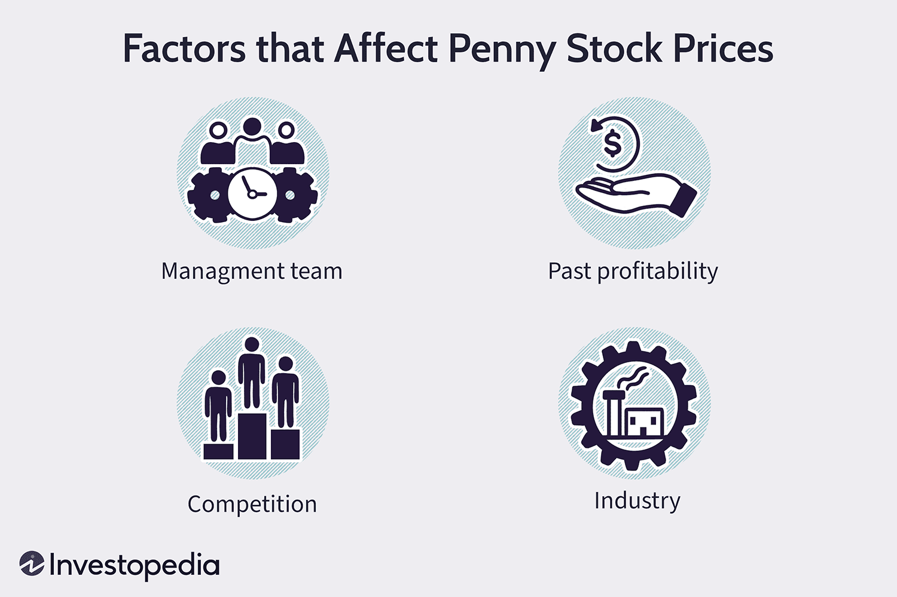

Penny stocks represent an attractive opportunity for beginner investors due to their affordability. Defined as stocks trading at $5 per share or less, they offer a chance to own shares in companies without significant upfront capital. This low entry point, however, is accompanied by considerable risks. Penny stocks often lack liquidity, making it challenging to buy or sell shares without affecting the stock price. Additionally, they exhibit high volatility, meaning their prices can change rapidly and unpredictably. These characteristics necessitate a cautious approach for any investor, especially those new to the market.

In light of these challenges, algorithmic trading emerges as a valuable tool for mitigating potential risks associated with penny stocks. By utilizing computer programs to execute trades based on pre-established criteria, algorithmic trading minimizes emotional decision-making and leverages technology for improved investment outcomes. This allows investors to systematically approach the unpredictable nature of penny stocks, enhancing decision-making with data-driven insights.



This guide focuses on equipping beginner investors with effective strategies to navigate the world of penny stocks through the use of algorithmic trading. By combining traditional investing principles with technological advancements, individuals can uncover strategies that align with their risk tolerance and financial goals. Understanding how penny stocks and algorithmic trading can complement each other will enable investors to incorporate these elements into a well-rounded investment strategy.

## Table of Contents

## Understanding Penny Stocks

Penny stocks are typically defined as equities trading at $5 per share or less, although definitions can sometimes vary. These stocks are often associated with small-cap companies, which possess market capitalizations ranging from $50 million to $300 million. Due to the lower initial investment required, penny stocks are an attractive option for many beginner investors seeking the allure of potentially high returns. However, this attractiveness is counterbalanced by significant risks, mainly because these stocks are subject to high volatility and speculative behaviors.

Penny stocks are predominantly traded over-the-counter (OTC) rather than on major exchanges like the New York Stock Exchange (NYSE) or NASDAQ. This is primarily due to the stringent listing requirements imposed by such exchanges, including minimum market capitalization and financial stability prerequisites that many small-cap companies cannot satisfy. Consequently, the trading of penny stocks in OTC marketplaces means they are generally less transparent and prone to manipulation and fraud, which heightens the risk for investors.

The volatility associated with penny stocks arises from several factors. First, the lower share price means that even small fluctuations can equate to substantial percentage changes. Additionally, the lack of liquidity, which refers to ease with which stocks can be bought or sold without affecting their price, further amplifies this volatility. With fewer shares being actively traded, large buy or sell orders can significantly affect the stock price, resulting in pronounced price swings.

Despite these inherent risks, investors are drawn to penny stocks due to the potential for outsized returns. A successful investment in a penny stock can yield substantial gains because of the low initial cost and high upside potential if the underlying company experiences growth or positive developments. However, investors must be highly cautious and conduct thorough due diligence before allocating capital to these high-risk securities. Understanding the speculative nature of penny stocks is crucial; they are not simply undervalued but rather priced low often due to the financial instability of the issuing company. Therefore, recognizing and accounting for the speculative environment is essential for investors considering an entry into penny stocks.

## Narrowing Down Trading Candidates

**Narrowing Down Trading Candidates**

When exploring penny stock investments, leveraging stock screening tools becomes vital in identifying promising trading candidates. These tools are designed to filter through numerous stocks based on specific criteria set by the investor, such as price, market capitalization, and trading [volume](/wiki/volume-trading-strategy). By setting these parameters, investors can zero in on stocks that meet their investment strategy and risk tolerance.

Begin by categorizing potential investments based on industry sectors. Certain sectors, like technology or biotech, might offer higher growth potential due to innovation trends or regulatory changes. Investors should stay informed about which industries are experiencing growth or facing challenges, as these factors can significantly influence stock performance.

The financial health of a company is another crucial metric. Analyzing a company's balance sheet, income statement, and cash flow statement can provide insights into its financial robustness. Key indicators include a low debt-to-equity ratio, positive cash flow, and increasing revenue trends. A company with solid financial fundamentals is likely better positioned to weather economic downturns and capitalize on market opportunities.

Trading volume is another essential [factor](/wiki/factor-investing) to consider. High trading volume generally indicates better [liquidity](/wiki/liquidity-risk-premium), making it easier for investors to enter or [exit](/wiki/exit-strategy) positions without significantly affecting the stock price. Stocks with higher liquidity reduce the risks associated with being unable to execute trades swiftly.

For a more in-depth analysis, consider companies that show the potential for growth. This involves looking at qualitative factors such as management effectiveness, competitive advantage, and product pipeline. For example, a tech startup with a patented innovation or a biotech firm with a promising drug in the trial phase might represent substantial growth opportunities.

Investors can utilize various online platforms that offer stock screening services. These platforms allow users to customize their search criteria and provide real-time data analytics, simplifying the process of finding viable penny stock investments.

By focusing on industry sectors, financial health, and trading volume, investors are better equipped to sift through vast options and target those with robust fundamentals and growth potential. This targeted approach increases the likelihood of identifying lucrative penny stock investments while mitigating some associated risks.

## Opening a Trading Account

When opening a trading account for penny stocks, it is essential to select a broker that not only specializes in these low-priced stocks but also offers a competitive fee structure. Brokers that focus on penny stocks often provide specialized tools and resources tailored to the unique challenges these investments present, such as high [volatility](/wiki/volatility-trading-strategies) and liquidity constraints. 

The structure of commissions is a crucial factor in minimizing trading costs. Two common types of commission structures are per-share and flat-rate commissions. A per-share commission charges a fee for every share traded, which can be beneficial for trading large volumes of low-priced stocks, as the cost per transaction remains low. Conversely, a flat-rate commission charges the same fee regardless of the trade's size, which may be advantageous for trades involving a high number of shares, or when transaction amounts significantly vary.

Moreover, it's imperative to ensure that the broker’s platform supports algorithmic or automated trading capabilities. Algorithmic trading can offer numerous advantages, such as executing trades based on complex mathematical models or predefined strategies without the need for constant manual intervention. This automated approach can help in taking swift action in volatile markets, a common characteristic of penny stocks. Below is a simple Python snippet demonstrating a basic setup for [algorithmic trading](/wiki/algorithmic-trading), primarily focusing on order placement:

```python
def place_order(broker_api, stock_ticker, order_type, quantity, price):
    try:
        order = {
            'ticker': stock_ticker,
            'order_type': order_type,  # 'buy' or 'sell'
            'quantity': quantity,
            'price': price
        }
        response = broker_api.execute(order)
        return response
    except Exception as e:
        print(f"Error placing order: {e}")
```

Choosing a broker with advanced algorithmic capabilities can streamline your trading operations, allowing you to focus on refining your trading strategies and addressing the inherent risks associated with penny stocks. As algorithmic trading becomes increasingly prevalent, selecting a broker that supports such technology ensures you remain competitive and efficient in your penny stock investments.

 to Algorithmic Trading

Algorithmic trading is a sophisticated trading approach where computer programs automatically execute trades based on a set of predefined criteria. This method leverages mathematical models and algorithms to identify potential trading opportunities, enabling trades to be executed at high speed and frequency. The primary advantage of algorithmic trading lies in its ability to process vast amounts of data and perform complex calculations at a speed far beyond human capabilities.

One core benefit of algorithmic trading is its capacity to make data-driven decisions, minimizing the emotional biases that often influence human traders. By adhering strictly to quantitative strategies, algorithmic trading helps investors remain disciplined and objective. It ensures that trades are executed precisely when specific criteria are met, taking advantage of even the smallest market inefficiencies or opportunities.

For beginners, algorithmic trading offers a systematic approach to identify trading patterns. Novice traders can use algorithmic systems to detect trends, reversals, or other significant market signals, all of which can be automated to ensure timely and accurate execution. This automated process can be facilitated using programming languages like Python, popular for its extensive libraries and ease of use in financial modeling.

An example of a simple algorithmic trading strategy could involve moving average crossovers:

```python
import pandas as pd
import numpy as np

# Sample data
data = pd.DataFrame({
    'price': [100, 102, 104, 103, 105, 107, 109, 108, 110, 112]
})

# Calculate moving averages
data['SMA_5'] = data['price'].rolling(window=5).mean()
data['SMA_10'] = data['price'].rolling(window=10).mean()

# Generate signals
data['Signal'] = np.where(data['SMA_5'] > data['SMA_10'], 1, 0)  # 1 indicates buy signal

print(data)
```

In this example, a simple algorithm is set to buy when the 5-day simple moving average (SMA_5) crosses above the 10-day simple moving average (SMA_10). Such strategies can be refined and backtested using historical data to assess their effectiveness before being deployed with actual capital.

Algorithmic trading, however, is not without its challenges. Market dynamics can change rapidly, so strategies must be regularly updated and tested. Moreover, the reliance on technology introduces risks, such as software errors or connectivity issues, which traders need to consider.

Overall, algorithmic trading presents beginners with a powerful tool to navigate the financial markets, offering the potential to optimize trading performance through disciplined and systematic approaches.

## Integrating Algorithmic Trading with Penny Stocks

To effectively leverage algorithmic trading with penny stocks, a foundational understanding of coding and trading algorithms is essential. Algorithmic trading employs computer algorithms to make trading decisions, offering speed and precision that can greatly benefit penny stock investors. Here’s how to integrate algorithmic trading strategies with penny stocks:

### Understanding the Basics of Coding and Trading Algorithms

Algorithmic trading starts with designing algorithms that can execute trades based on specific criteria. Beginners in this domain should familiarize themselves with programming languages such as Python, which is widely used in the financial industry due to its simplicity and vast array of libraries like NumPy, pandas, and SciPy. These libraries facilitate data manipulation, analysis, and numerical computations crucial for developing trading strategies.

Here is a simple example of Python code for a moving average crossover strategy, a common algorithmic trading strategy:

```python
import pandas as pd

# Load historical penny stock data
data = pd.read_csv('historical_penny_stock_data.csv')

# Calculate moving averages
data['SMA_50'] = data['Close'].rolling(window=50).mean()
data['SMA_200'] = data['Close'].rolling(window=200).mean()

# Generate trading signals
data['Signal'] = 0
data.loc[data['SMA_50'] > data['SMA_200'], 'Signal'] = 1  # Buy signal
data.loc[data['SMA_50'] < data['SMA_200'], 'Signal'] = -1 # Sell signal
```

### Use Backtesting for Strategy Validation

Backtesting is a crucial step in verifying the effectiveness of trading algorithms. This process involves applying your strategy to historical penny stock data to gauge potential profitability and risk. A well-executed backtest allows for refining strategies before deploying them in live markets, minimizing risks associated with unproven methods.

Key metrics to evaluate during [backtesting](/wiki/backtesting) include:

- **Cumulative Returns**: The total return on an investment from the start to the end of the testing period.

- **Drawdown**: Measures peak-to-trough decline, indicating potential risk.

- **Sharpe Ratio**: Evaluates risk-adjusted return, calculated as:
$$
  \text{Sharpe Ratio} = \frac{E[R_p - R_f]}{\sigma_p}

$$

  Where $E[R_p - R_f]$ is the expected portfolio return minus the risk-free rate, and $\sigma_p$ is the standard deviation of the portfolio return.

### Employing Risk Management Techniques

Risk management is pivotal in algorithmic trading to mitigate the inherent risks of penny stocks, such as high volatility and low liquidity. Some effective risk management techniques include:

- **Position Sizing**: Determine the appropriate amount of capital allocated to each trade to leverage gains and manage losses effectively.

- **Stop-loss Orders**: Predefine the acceptable loss limit for a trade to automatically exit a losing position at a predetermined price level.

- **Dynamic Algorithm Adjustments**: Continuously adapt and refine the algorithm based on market conditions and performance feedback.

Incorporating these strategies helps traders safeguard their investments while capitalizing on the opportunities present in the high-risk, high-reward world of penny stocks. By combining algorithmic trading's precision with strategic risk management, investors can better navigate this volatile market segment.

## Understanding the Risks

Penny stocks present a unique risk profile characterized by extreme susceptibility to price manipulation and abrupt price swings. These characteristics stem primarily from the low share prices and low market capitalization typical of penny stocks, which make them easier targets for manipulation due to the minimal capital required to move prices. For instance, schemes like "pump and dump" manipulate stock prices by artificially inflating them before selling off at a profit, leaving subsequent investors at a loss. Consequently, potential investors in penny stocks must be vigilant of such practices to protect their investments.

Another significant risk associated with penny stocks is their lack of liquidity. Liquidity refers to how easily a security can be bought or sold in the market without affecting its price. Low liquidity in penny stocks can pose a substantial challenge, as it may be difficult to enter or exit positions at favorable prices. This illiquidity is exacerbated when rapid price changes occur, trapping investors in positions unable to realize a favorable return or cut losses swiftly.

While these risks are inherent to penny stocks, algorithmic trading offers some mitigation strategies. Algorithmic trading employs predefined criteria to automatically execute trades, allowing for faster reaction times and improved market analysis. Despite its advantages, algorithms cannot entirely eliminate the risks of manipulation and liquidity constraints but can help investors manage these more adeptly.

By utilizing backtesting—a strategy where algorithms are tested against historical data—investors can understand how their strategies might perform under different scenarios. However, success in backtesting does not guarantee future results, as market conditions can change rapidly, especially with penny stocks. Additionally, risk management practices, such as setting stop-loss orders and limiting the size of penny stock positions, should be integrated within the algorithmic strategies to further mitigate risks.

Therefore, while algorithmic trading provides a technological advantage in handling the volatile and less liquid nature of penny stocks, investors must maintain a comprehensive approach incorporating additional risk management techniques to navigate these challenges effectively.

## The Bottom Line

Investing in penny stocks requires careful consideration and a high tolerance for risk. These stocks, often characterized by their low price and small market capitalization, attract investors with the potential for substantial gains. However, their speculative nature and inherent volatility necessitate a cautious approach.

Algorithmic trading offers a valuable toolkit for investors attempting to navigate this turbulent landscape. By employing predefined criteria and computer programs, algorithmic trading can mitigate some of the challenges presented by penny stocks. For instance, it allows investors to execute trades based on data-driven insights, reducing the impact of emotional decision-making. This capability to systematically analyze and act upon market trends can be particularly advantageous in managing the rapid price fluctuations typical of penny stocks.

Moreover, algorithmic strategies often incorporate risk management techniques, aligning with the risk profile necessary for penny stock investments. Through backtesting—analyzing how a trading model would have performed using historical data—investors can hone their algorithms to improve performance and minimize losses. For example, a common risk management approach in algorithmic trading involves setting stop-loss orders to automatically sell a stock when it reaches a certain price, thereby limiting potential losses.

It's pertinent for investors to understand both the opportunities and the perils associated with penny stocks. While algorithmic trading cannot completely eliminate the risks involved, it does provide a more structured framework for engaging with these volatile investments. By leveraging technology and maintaining a disciplined approach, beginners can enhance their chances of success in the penny stock market.

Comprehensive knowledge and preparation—characterized by a clear understanding of market mechanics and strategic deployment of algorithmic tools—are crucial. Successful penny stock trading depends not just on potential opportunity identification but also on effectively managing risks and expectations. The intersection of algorithmic trading and penny stocks offers a potent avenue for investors to potentially achieve meaningful returns, provided they approach it with diligence and informed decision-making.

## References & Further Reading

[1]: Bergstra, J., Bardenet, R., Bengio, Y., & Kégl, B. (2011). ["Algorithms for Hyper-Parameter Optimization."](https://dl.acm.org/doi/10.5555/2986459.2986743) Advances in Neural Information Processing Systems 24.

[2]: ["Advances in Financial Machine Learning"](https://www.amazon.com/Advances-Financial-Machine-Learning-Marcos/dp/1119482089) by Marcos Lopez de Prado

[3]: ["Evidence-Based Technical Analysis: Applying the Scientific Method and Statistical Inference to Trading Signals"](https://www.amazon.com/Evidence-Based-Technical-Analysis-Scientific-Statistical/dp/0470008741) by David Aronson

[4]: ["Machine Learning for Algorithmic Trading"](https://github.com/stefan-jansen/machine-learning-for-trading) by Stefan Jansen

[5]: ["Quantitative Trading: How to Build Your Own Algorithmic Trading Business"](https://www.amazon.com/Quantitative-Trading-Build-Algorithmic-Business/dp/1119800064) by Ernest P. Chan