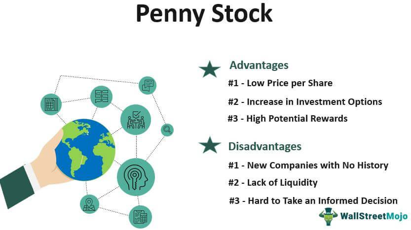

In an ever-evolving financial landscape, stock reform acts and financial regulation play crucial roles in ensuring market stability and investor protection. The Penny Stock Reform Act epitomizes such legislation, targeting the unpredictable and often speculative domain of penny stocks. These stocks, characterized by their low price and market capitalization, present unique challenges due to their high volatility and susceptibility to fraudulent schemes. 

Algorithmic trading has started to permeate this segment, offering increased transaction speed and efficiency. However, this technological advancement also necessitates careful regulatory oversight to prevent potential market manipulation and instability. Algorithmic trading can amplify risks inherent in penny stocks, making the need for robust regulatory frameworks more pressing.

This article examines the nuances of financial regulation concerning penny stocks and the implications of algorithmic trading within this context. It highlights the challenges regulators face as they strive to balance innovation with the necessity for investor protection. Furthermore, it scrutinizes the advancements in regulatory measures aimed at safeguarding investments in these high-risk markets. By focusing on these aspects, this discussion contributes to a broader understanding of the evolving regulatory landscape and its role in promoting fairness and transparency in financial markets.

## Table of Contents

## Overview of the Penny Stock Reform Act

The Penny Stock Reform Act was enacted by the U.S. Congress in 1990 with the primary goal of mitigating fraudulent activities within the penny stock market, which comprises stocks that typically trade at low prices and are not listed on major exchanges. Penny stocks, due to their low price point and typical trading on over-the-counter (OTC) markets, are often susceptible to manipulation and deceitful practices. To address these concerns, the Penny Stock Reform Act granted the Securities and Exchange Commission (SEC) enhanced administrative power over issuers, brokers, and dealers involved in the penny stock market.

One of the critical features of this legislation was the establishment of robust regulatory requirements for brokers and dealers, mandating them to disclose fundamental information to their clients, thus increasing transparency. The goal was to ensure that investors were adequately informed before making investment decisions in high-risk penny stocks. For instance, brokers are required to provide disclosures that include the risks of investing in penny stocks, bid and offer quotations, and the broker’s compensation from the transactions.

Moreover, the act played a pivotal role in structuring a marketplace specific to penny stocks, emphasizing the need for these securities to be subjected to regulatory scrutiny akin to that of exchange-listed securities. By obligating compliance and fortifying oversight, the Penny Stock Reform Act aimed to diminish instances of fraud such as 'pump and dump' schemes where stock prices are artificially inflated before insiders sell overvalued shares to the public.

Through enforcing stringent disclosure requirements and enhancing the SEC’s oversight capabilities, the Penny Stock Reform Act sought to safeguard investors and instill greater trust within the penny stock marketplace. The legislation's enduring impact is evident as it laid the groundwork for ongoing regulatory measures aimed at maintaining fairness and transparency in lower-tier equity markets.

## Financial Risks in Penny Stock Trading

Penny stocks present substantial financial risks to investors, primarily due to their inherent lack of transparency and financial disclosure. These stocks, typically priced below $5 per share, are predominantly traded over-the-counter (OTC), thereby circumventing the rigorous listing standards imposed by major exchanges such as the New York Stock Exchange (NYSE) or NASDAQ. This absence of formal exchange regulation results in a market that can be opaque and difficult for investors to navigate effectively.

One of the most pressing concerns associated with penny stocks is the issue of [liquidity](/wiki/liquidity-risk-premium). Due to their low trading volumes, these stocks often suffer from significant liquidity constraints, posing challenges for investors seeking to buy or sell shares swiftly without impacting the stock price. This illiquidity can lead to volatile price fluctuations, and investors may find themselves unable to [exit](/wiki/exit-strategy) positions without incurring substantial losses.

Another critical risk associated with penny stock trading is the scarcity of reliable and timely financial information. Penny stock companies are frequently small, developmental firms that do not have the same reporting obligations as larger, exchange-listed entities. As a result, there is often a dearth of publicly available information regarding their financial health, operations, or future prospects. This lack of transparency can create an environment conducive to misinformation and fraudulent schemes, such as pump and dump strategies, where stock promoters artificially inflate stock prices to profit from unwary investors.

Investors in penny stocks must exercise heightened due diligence and skepticism, recognizing the increased potential for encountering fraudulent activities and market manipulation. Without the safeguards typically provided by larger exchanges, penny stock markets necessitate a wary and informed approach to investment decision-making to mitigate these inherent risks.

## Regulatory Measures for Penny Stocks

The Penny Stock Reform Act mandates that dealers and brokers involved with penny stocks disclose critical market information to protect investors and ensure market integrity. This legislation employs a two-pronged strategy: increasing regulatory measures and enhancing transparency through mandatory disclosures. This dual approach is designed to minimize fraudulent activities commonly associated with penny stocks.

The Securities and Exchange Commission (SEC) plays a crucial role in enforcing these regulations. The Act grants the SEC comprehensive administrative power to oversee penny stock activities, ensuring continuous monitoring and regulation. This oversight involves strict scrutiny of brokers and dealers to verify compliance with disclosure requirements and to identify any suspicious activities that could lead to investor harm.

Particularly, one of the Act's significant aims is to combat 'pump and dump' schemes, which are rampant in penny stock markets. In such fraudulent schemes, stock prices are artificially inflated ('pumped') through false or misleading statements, allowing the perpetrators to sell their overvalued shares at a profit. Once these shares are sold, the prices typically plummet ('dumped'), leaving unsuspecting investors with substantial losses. These schemes exploit the [volatility](/wiki/volatility-trading-strategies), low liquidity, and lack of transparency in penny stock markets.

To address these challenges, the Act requires that brokers provide potential investors with detailed financial information about the penny stocks they are considering. This includes issuing risk disclosure documents that outline the volatile nature of these investments, the limited liquidity, and the potential for significant financial loss.

Furthermore, broader regulatory efforts have been implemented to support these measures, such as the adoption of advanced data analysis techniques to monitor trading patterns and detect anomalies that might indicate market manipulation. The SEC also collaborates with other financial regulatory bodies to share information and coordinate actions against suspicious activities across different markets.

Overall, these regulatory measures aim to enhance investor confidence in penny stock markets by ensuring that all participants operate transparently and ethically. By fostering an environment of increased disclosure and robust oversight, the Act seeks to mitigate risk and protect investors from fraudulent schemes within this inherently volatile segment of the financial market.

## Algorithmic Trading in the Penny Stock Market

Algorithmic trading has gained prominence in the penny stock market, providing traders with increased speed and efficiency. This type of trading involves the use of computer algorithms to execute trades at speeds and frequencies beyond human capacity. While these sophisticated algorithms can optimize trading operations, they present significant challenges, particularly concerning market manipulation in the form of high-frequency trading ([HFT](/wiki/high-frequency-trading-strategies)).

The speed at which [algorithmic trading](/wiki/algorithmic-trading) operates allows it to capitalize on minute price discrepancies, creating a scenario where traditional retail investors may find it challenging to react swiftly enough. This technological edge can lead to an unequal playing field. Furthermore, the complex algorithms can be manipulated to exploit penny stock volatility, leading to potential market manipulation and the exacerbation of already substantial risks associated with such stocks.

Regulators have a critical task in ensuring that algorithmic trading in penny stocks does not lead to unfair practices or manipulate market prices. The potential for algorithmic strategies to conduct rapid-fire trades can result in 'flash crashes', where security prices plummet and rebound in seconds, leading to significant market disruptions. Such events necessitate robust regulatory oversight to ensure market stability.

To mitigate these risks, regulatory bodies such as the Securities and Exchange Commission (SEC) impose rules requiring transparency and systematic risk control. Tools like circuit breakers, which halt trading if drastic price swings occur, are employed to manage the volatility introduced by algorithmic trading.

Overall, while algorithmic trading offers significant benefits in terms of effectiveness, careful oversight is required to avert potential pitfalls in the penny stock market. Maintaining the balance between innovation and regulation is vital to ensure that advancements in trading technology do not undermine market integrity.

## Conclusion

The Penny Stock Reform Act has served as a cornerstone in the regulation of the penny stock market, providing a framework for investor protection and market stability. Despite these efforts, the dynamic nature of trading technologies and market practices poses ongoing challenges. The rise of algorithmic trading, for example, necessitates a continual evolution of regulatory measures to address potential new avenues for market manipulation and fraud.

The need for continuous advancements in financial regulation is evident, as existing frameworks must adapt to the complexities introduced by new trading methodologies. Incorporating technological solutions for real-time market monitoring and implementing more sophisticated algorithms for fraud detection presents an opportunity to reinforce regulatory oversight.

Furthermore, maintaining a fair market environment will require a balanced approach that integrates both technological innovation and robust regulatory frameworks. The development of advanced tools for risk assessment and the ongoing training of regulatory personnel are vital components of this strategy. By aligning regulatory measures with the rapid pace of technological advancement, the potential for sustaining an equitable and secure market for all investors is greatly enhanced.

## References & Further Reading

[1]: ["Penny Stock Reform Act and Investor Protection"](https://www.investopedia.com/terms/p/penny-stock-reform-act.asp). Remarks by Richard Ketchum, August 15, 1990, SEC.gov.

[2]: Lopez de Prado, M. (2018). ["Advances in Financial Machine Learning"](https://www.amazon.com/Advances-Financial-Machine-Learning-Marcos/dp/1119482089). Wiley.

[3]: Securities and Exchange Commission (SEC). ["Guide to Penny Stock Rules."](https://www.sec.gov/investor/schedule15g.htm) SEC.gov.

[4]: Chan, E.P. (2008). ["Quantitative Trading: How to Build Your Own Algorithmic Trading Business"](https://github.com/ftvision/quant_trading_echan_book). Wiley.

[5]: Jansen, S. (2018). ["Machine Learning for Algorithmic Trading: Predictive models to extract signals from market and alternative data for systematic trading strategies with Python"](https://scholar.google.com/citations?user=dRKfiYQAAAAJ&hl=en). Packt Publishing.

[6]: U.S. Government Publishing Office. ["Penny Stock Act of 1990 Public Law 101-429"](https://www.gpo.gov/). Congress.gov.