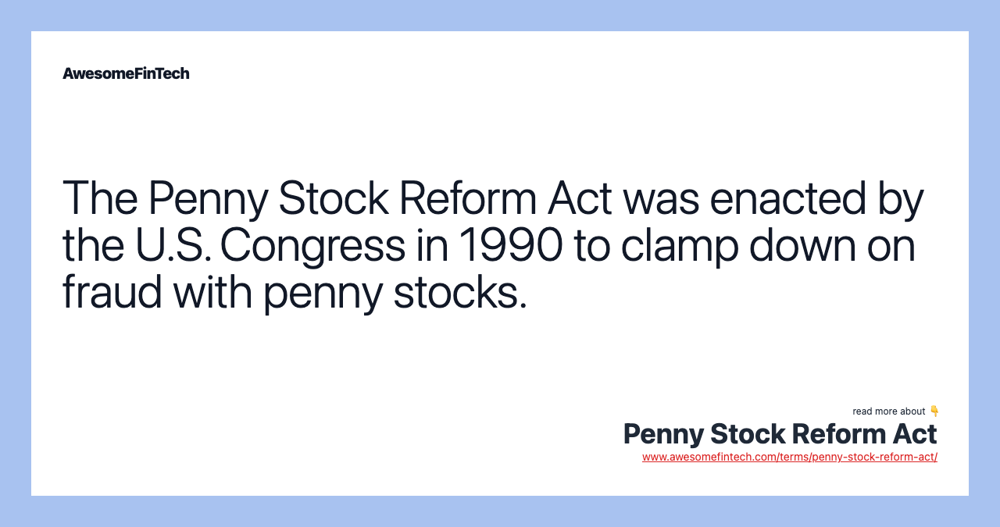

## Table of Contents

## What is the Penny Stock Reform Act?

The Penny Stock Reform Act is a law that was passed in 1990 to help protect people who invest in penny stocks. Penny stocks are stocks that cost very little money, usually less than a dollar. The law was made because some people were cheating investors by giving them false information about these stocks. The act made it harder for dishonest people to trick investors by setting new rules for brokers and dealers who sell penny stocks.

One of the main things the Penny Stock Reform Act did was to require brokers to give investors a lot more information before they could sell them penny stocks. This information includes details about the stock, the company, and the risks involved. The act also made it so that brokers have to get special permission from their firm before they can sell penny stocks. This helps make sure that the brokers are following the rules and not trying to cheat people. Overall, the Penny Stock Reform Act was created to make investing in penny stocks safer for everyone.

## When was the Penny Stock Reform Act passed?

The Penny Stock Reform Act was passed in 1990. It was made to help protect people who buy penny stocks. Penny stocks are very cheap stocks, usually less than a dollar. The law came about because some people were tricking investors by giving them false information about these stocks.

The act set new rules for brokers and dealers who sell penny stocks. It made it harder for dishonest people to cheat investors. Brokers now have to give investors a lot more information before selling them penny stocks. This includes details about the stock, the company, and the risks involved. Brokers also need special permission from their firm before they can sell penny stocks. This helps make sure they follow the rules and don't trick people.

## What are penny stocks and why are they considered risky?

Penny stocks are stocks that cost very little money, usually less than a dollar. They are often from small companies that are just starting out or are not doing well. Because they are so cheap, people think they can make a lot of money if the stock price goes up even a little bit.

But penny stocks are risky because they can be easy to manipulate. Some people might lie about how well a company is doing to make the stock price go up. Also, these stocks are not traded on big stock exchanges like the New York Stock Exchange. They are traded on smaller markets, which can make them harder to buy and sell. This means you might not be able to sell your penny stocks when you want to, which can be a big problem if the price starts to drop.

## What were the main goals of the Penny Stock Reform Act?

The Penny Stock Reform Act was passed to protect people who invest in penny stocks. Penny stocks are very cheap stocks, usually less than a dollar. The main goal of the act was to stop dishonest people from tricking investors. Before the act, some people were lying about how well a company was doing to make the stock price go up. The act wanted to make sure that investors got honest information before they bought penny stocks.

Another big goal of the Penny Stock Reform Act was to make new rules for brokers and dealers who sell penny stocks. The act said that brokers have to give investors a lot more information about the stock, the company, and the risks involved. Brokers also need special permission from their firm before they can sell penny stocks. These rules help make sure that brokers follow the law and don't cheat people. Overall, the act was made to make investing in penny stocks safer and more honest for everyone.

## How does the Penny Stock Reform Act aim to protect investors?

The Penny Stock Reform Act aims to protect investors by making sure they get a lot more information before buying penny stocks. Penny stocks are very cheap stocks, usually less than a dollar. Before the act, some people were lying about how well a company was doing to trick investors. The act changed this by requiring brokers to give investors honest details about the stock, the company, and the risks involved. This way, investors can make better choices about whether to buy the stocks.

Another way the act protects investors is by setting new rules for brokers and dealers who sell penny stocks. The act says that brokers need special permission from their firm before they can sell penny stocks. This helps make sure that brokers are following the rules and not trying to cheat people. By making these changes, the Penny Stock Reform Act tries to make investing in penny stocks safer and more honest for everyone.

## What specific regulations were introduced by the Penny Stock Reform Act?

The Penny Stock Reform Act introduced new rules to protect people who buy penny stocks. Penny stocks are very cheap stocks, usually less than a dollar. One big rule is that brokers have to give investors a lot more information before they can sell them penny stocks. This information includes details about the stock, the company, and the risks involved. This helps investors make better choices about whether to buy the stocks.

Another important rule is that brokers need special permission from their firm before they can sell penny stocks. This helps make sure that brokers are following the rules and not trying to cheat people. By making these changes, the Penny Stock Reform Act tries to make investing in penny stocks safer and more honest for everyone.

## How has the Penny Stock Reform Act impacted the trading of penny stocks?

The Penny Stock Reform Act has made trading penny stocks safer for investors. Before the act, some people were lying about how well a company was doing to trick people into buying penny stocks. The act changed this by making new rules that brokers have to follow. Now, brokers have to give investors a lot more information about the stock, the company, and the risks involved. This helps investors make better choices about whether to buy the stocks.

Another big change is that brokers need special permission from their firm before they can sell penny stocks. This rule helps make sure that brokers are following the law and not trying to cheat people. Overall, the Penny Stock Reform Act has made it harder for dishonest people to trick investors, making the trading of penny stocks more honest and safer for everyone.

## What are the criticisms of the Penny Stock Reform Act?

Some people say that the Penny Stock Reform Act makes it too hard for small companies to raise money. Before the act, these companies could sell penny stocks to get the money they needed to grow. But now, the new rules make it harder for them to do this. Brokers have to give investors a lot more information, and they need special permission to sell penny stocks. This means fewer people might want to buy them, which can make it tough for small companies to get the money they need.

Others think the act does not go far enough to stop dishonest people from tricking investors. Even with the new rules, some people still find ways to lie about how well a company is doing. They say the act should have even stricter rules to make sure investors are completely safe. But making the rules too strict could make it even harder for small companies to raise money, so it's a tricky balance to get right.

## How effective has the Penny Stock Reform Act been in reducing fraud in penny stock markets?

The Penny Stock Reform Act has helped make the penny stock market safer by making new rules for brokers. Before the act, some people were lying about how well a company was doing to trick investors into buying penny stocks. Now, brokers have to give investors a lot more information about the stock, the company, and the risks involved. This helps investors make better choices and makes it harder for dishonest people to cheat them. Brokers also need special permission from their firm before they can sell penny stocks, which helps make sure they follow the rules.

Even though the act has helped, some people say it hasn't stopped all the fraud in the penny stock market. Some dishonest people still find ways to lie and trick investors. They think the act should have even stricter rules to make sure investors are completely safe. But making the rules too strict could make it harder for small companies to raise money, which is a tricky balance to get right. Overall, the Penny Stock Reform Act has made things better, but there is still work to be done to stop all the fraud in penny stock markets.

## What amendments or updates have been made to the Penny Stock Reform Act since its enactment?

Since the Penny Stock Reform Act was passed in 1990, there have been some changes to make it even better at protecting investors. One big change came with the Dodd-Frank Wall Street Reform and Consumer Protection Act in 2010. This new law added more rules to stop fraud in the penny stock market. It made it so that the Securities and Exchange Commission (SEC) could keep a closer eye on brokers and dealers who sell penny stocks. This helps make sure they are following the rules and not trying to trick people.

Another update happened with the JOBS Act in 2012. This act made some changes to help small companies raise money more easily. It allowed them to use crowdfunding to sell penny stocks to more people. But it also kept the rules from the Penny Stock Reform Act to make sure investors still get the information they need to make good choices. These updates show that the government is trying to balance helping small companies grow while also keeping investors safe from fraud.

## How does the Penny Stock Reform Act compare to other financial regulatory reforms?

The Penny Stock Reform Act is a specific law that focuses on protecting people who buy penny stocks. Penny stocks are very cheap stocks, usually less than a dollar. The act makes brokers give investors a lot more information about the stock, the company, and the risks involved. It also says that brokers need special permission from their firm before they can sell penny stocks. This helps make sure that brokers follow the rules and don't trick people. Compared to other financial regulatory reforms, the Penny Stock Reform Act is very targeted. It deals with a specific part of the market that can be risky for investors.

Other financial regulatory reforms, like the Dodd-Frank Act and the JOBS Act, cover a wider range of financial activities. The Dodd-Frank Act, passed in 2010, was made to stop big financial problems like the ones that happened during the 2008 financial crisis. It has many rules for banks and other big financial companies. The JOBS Act, passed in 2012, helps small companies raise money more easily. It allows them to use crowdfunding to sell stocks to more people. Both of these laws have parts that help protect investors, but they are not as focused on penny stocks as the Penny Stock Reform Act is.

## What future legislative changes are being considered in relation to penny stocks and the Penny Stock Reform Act?

Some people in the government are thinking about making new rules to make the penny stock market even safer. They want to make sure that investors get even more information about the stocks they are buying. This could mean that brokers have to tell investors about any problems the company might have, like if it is losing money or if it has been in trouble with the law. They also want to make it easier for the Securities and Exchange Commission (SEC) to catch people who are trying to trick investors. These changes would help make sure that the penny stock market is fair and honest for everyone.

At the same time, some people are worried that making the rules too strict could make it harder for small companies to raise money. They think that if the rules are too tough, fewer people might want to buy penny stocks. This could make it difficult for small companies to grow and create jobs. So, the government is trying to find a balance. They want to protect investors from fraud, but they also want to help small companies get the money they need. It's a tricky problem, but they are working on it to make the penny stock market better for everyone.

## References & Further Reading

[1]: ["Penny Stock Reform Act and Investor Protection"](https://www.investopedia.com/terms/p/penny-stock-reform-act.asp). Remarks by Richard Ketchum, August 15, 1990, SEC.gov.

[2]: Lopez de Prado, M. (2018). ["Advances in Financial Machine Learning"](https://www.amazon.com/Advances-Financial-Machine-Learning-Marcos/dp/1119482089). Wiley.

[3]: Securities and Exchange Commission (SEC). ["Guide to Penny Stock Rules."](https://www.sec.gov/investor/schedule15g.htm) SEC.gov.

[4]: Chan, E.P. (2008). ["Quantitative Trading: How to Build Your Own Algorithmic Trading Business"](https://github.com/ftvision/quant_trading_echan_book). Wiley.

[5]: Jansen, S. (2018). ["Machine Learning for Algorithmic Trading: Predictive models to extract signals from market and alternative data for systematic trading strategies with Python"](https://scholar.google.com/citations?user=dRKfiYQAAAAJ&hl=en). Packt Publishing.

[6]: U.S. Government Publishing Office. ["Penny Stock Act of 1990 Public Law 101-429"](https://www.gpo.gov/). Congress.gov.