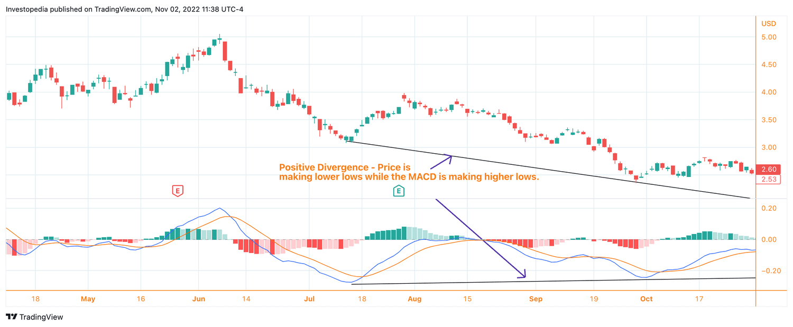

## Table of Contents

## What are penny stocks and why are they considered high-risk investments?

Penny stocks are stocks that trade at a very low price, usually less than a dollar. They are often from small companies that are just starting out or are not doing well. Because they are cheap, people might think they are a good deal. But, penny stocks can be very risky.

The main reason penny stocks are high-risk is because they can lose value very quickly. The companies behind these stocks might not have a lot of money or a good plan, so their stock price can go up and down a lot. Also, it can be hard to find good information about these companies, so it's hard to know if they are a good investment. Because of these risks, many people lose money when they invest in penny stocks.

## How can beginners start analyzing penny stocks?

To start analyzing penny stocks, beginners should first learn about the companies behind the stocks. Look for information on what the company does, who runs it, and if they have any products or services that people want. You can find this information on the company's website, in news articles, or in reports they file with the government. It's important to understand the company's business because penny stocks can be risky, and knowing more about the company can help you make better decisions.

Next, beginners should look at the stock's price history and trading volume. This shows how the stock has been doing over time and how many people are buying and selling it. You can find this information on financial websites like Yahoo Finance or Google Finance. If the stock's price goes up and down a lot, it might be more risky. Also, if not many people are trading the stock, it can be hard to sell it when you want to. By looking at these things, beginners can start to understand if a penny stock might be a good investment or not.

## What are the basic technical analysis tools used for penny stocks?

Technical analysis for penny stocks involves looking at charts and patterns to guess where the stock price might go next. One simple tool is the moving average, which is a line on the chart that shows the average price of the stock over a certain time, like 50 days or 200 days. If the stock price goes above the moving average, it might mean the price will keep going up. If it goes below, it might mean the price will go down. Another tool is the Relative Strength Index (RSI), which measures how fast the stock price is going up or down. If the RSI is over 70, it might mean the stock is overbought and the price could go down soon. If it's under 30, it might mean the stock is oversold and the price could go up.

Volume is also important in technical analysis. It shows how many shares of the stock are being bought and sold. If the stock price goes up and the volume is high, it might mean more people believe the price will keep going up. But if the price goes up and the volume is low, it might not be a strong move. Beginners can use these tools to start understanding penny stock charts better, but remember, technical analysis is not perfect and it's just one way to look at stocks.

## How do moving averages help in analyzing penny stock trends?

Moving averages help in analyzing penny stock trends by smoothing out the price data over time. They show the average price of a stock over a certain number of days, like 50 days or 200 days. This helps to see the overall direction of the stock price, making it easier to spot trends. If the stock price is above the moving average, it might mean the stock is in an uptrend, and it could keep going up. If the stock price is below the moving average, it might mean the stock is in a downtrend, and it could keep going down.

Using moving averages also helps to filter out the small, day-to-day price changes that can make it hard to see the bigger picture. For example, if the price of a penny stock goes up and down a lot from day to day, the moving average will stay smoother and show you if the stock is generally going up or down over time. By comparing different moving averages, like the 50-day and 200-day moving averages, you can get even more information. If the shorter moving average (50-day) crosses above the longer moving average (200-day), it might be a sign that the stock is starting a new uptrend. If the shorter moving average crosses below the longer one, it might be a sign of a new downtrend.

## What role do volume indicators play in penny stock analysis?

Volume indicators are important when looking at penny stocks because they show how many shares are being bought and sold. If a lot of shares are traded, it means the stock is popular and there's a lot of interest in it. This can be a good sign if the stock price is going up because it might mean more people believe the price will keep going up. But if the stock price goes up and the volume is low, it might not be a strong move because not many people are trading the stock.

Volume can also help you see if a price change is real or just a short-term thing. If the price of a penny stock goes up a lot in one day but the volume is low, it might just be a few people pushing the price up and it might not last. But if the price goes up and the volume is high, it's more likely that the price change is real and will last longer. So, looking at volume along with the price can give you a better idea of what's really happening with the stock.

## How can support and resistance levels be identified in penny stocks?

Support and resistance levels in penny stocks are important because they show where the price might stop going down or up. To find support levels, look at the lowest points where the stock price has stopped falling and started to go up again. This is where the price seems to "bounce" back up. For example, if a penny stock's price keeps going down to $0.50 and then goes back up each time, $0.50 might be a support level. People might buy the stock more at this price because they think it's a good deal.

Resistance levels are the opposite. They are the highest points where the stock price stops going up and starts to fall again. If a penny stock's price keeps going up to $1.00 and then goes back down each time, $1.00 might be a resistance level. People might sell the stock more at this price because they think it's too high. By looking at past price charts, you can see these levels and use them to guess where the price might go next.

## What are the common chart patterns observed in penny stocks and how to interpret them?

Common chart patterns in penny stocks include the head and shoulders, double tops and bottoms, and triangles. The head and shoulders pattern looks like a head with two shoulders and can mean the stock price might start going down. The double top pattern looks like two peaks at about the same height and can also mean the price might go down soon. On the other hand, the double bottom pattern looks like two lows at about the same level and can mean the price might start going up. Triangles can be ascending, descending, or symmetrical. An ascending triangle might mean the price will go up, a descending triangle might mean it will go down, and a symmetrical triangle means the price could go either way.

To interpret these patterns, you need to look at the stock's price chart over time. If you see a head and shoulders pattern forming, it might be a good time to sell the stock before the price drops. If you see a double bottom pattern, it might be a good time to buy the stock because the price could start going up. Triangles can be a bit trickier. If you see an ascending triangle and the price breaks out above the top line, it's a good sign that the price will keep going up. If you see a descending triangle and the price breaks out below the bottom line, it's a good sign that the price will keep going down. Symmetrical triangles mean you need to wait and see which way the price breaks out to know what might happen next.

## How to use Relative Strength Index (RSI) effectively in penny stock analysis?

The Relative Strength Index (RSI) is a tool that helps you see if a penny stock is overbought or oversold. It measures how fast the stock's price is going up or down over a certain time, usually 14 days. The RSI is shown as a number between 0 and 100. If the RSI is over 70, it means the stock might be overbought, and the price could go down soon. If the RSI is under 30, it means the stock might be oversold, and the price could go up soon. By looking at the RSI, you can get a better idea of when to buy or sell a penny stock.

Using the RSI effectively in penny stock analysis involves more than just looking at the number. You should also look at the RSI's trend and how it compares to the stock's price. If the RSI is going up along with the stock's price, it can confirm that the stock is in a strong uptrend. But if the RSI starts to go down while the stock's price is still going up, it might mean the uptrend is getting weak and the price could soon go down. Also, watch for times when the RSI crosses above 30 or below 70. These can be good times to buy or sell because they show the stock might be starting a new trend.

## What advanced technical indicators should be used for a deeper analysis of penny stocks?

For a deeper analysis of penny stocks, you can use advanced technical indicators like the Moving Average Convergence Divergence (MACD) and the Bollinger Bands. The MACD helps you see the relationship between two moving averages of a stock's price. It shows you when the stock's [momentum](/wiki/momentum) is changing, which can tell you if it's a good time to buy or sell. The MACD line is the difference between a short-term and a long-term moving average. When the MACD line crosses above the signal line, it might mean the stock's price will go up. When it crosses below, it might mean the price will go down.

Bollinger Bands are another useful tool. They are made up of three lines: the middle line is a moving average, and the top and bottom lines are set a certain distance away from the middle line. This distance is based on how much the stock's price has been moving up and down. If the stock's price goes outside the top band, it might be overbought and the price could go down soon. If it goes outside the bottom band, it might be oversold and the price could go up soon. By using these advanced indicators, you can get a better understanding of where the stock's price might go next and make smarter decisions about buying or selling penny stocks.

## How can traders use candlestick patterns to make informed decisions on penny stocks?

Candlestick patterns are shapes that show up on stock charts and can tell traders a lot about what the stock might do next. For penny stocks, these patterns are really useful because the prices can change a lot. One common pattern is the "doji," which looks like a plus sign or a cross. It means the stock's price opened and closed at about the same place, showing that buyers and sellers are not sure what to do next. If you see a doji after the stock's price has been going up a lot, it might mean the price could start going down soon. Another pattern is the "hammer," which looks like a candle with a long bottom wick and a small body at the top. This can mean the stock's price might start going up because buyers are starting to take control.

Another important candlestick pattern is the "engulfing pattern," which can be bullish or bearish. A bullish engulfing pattern happens when a small red candle is followed by a bigger green candle that completely covers the red one. This can mean the stock's price might start going up because buyers are taking over. A bearish engulfing pattern is the opposite, with a small green candle followed by a bigger red one, which can mean the price might start going down because sellers are taking over. By watching these patterns, traders can make better guesses about when to buy or sell penny stocks. It's like trying to read the mood of the market and make decisions based on what the patterns are telling you.

## What are the pitfalls of over-relying on technical analysis for penny stocks?

Over-relying on technical analysis for penny stocks can be risky because it only looks at the past price and volume data, not the company itself. Penny stocks often come from small companies that might not have a lot of information available about them. If you only use technical analysis, you might miss important details about the company's health, like if it's making money or if it has good leaders. This can lead to bad investment choices because the stock's price can change a lot based on things that technical analysis can't see.

Also, penny stocks can be manipulated by people who want to make the price go up or down quickly. Technical analysis can't tell you if this is happening. For example, someone might buy a lot of shares to make the price go up and then sell them to make a quick profit. If you're only looking at the charts, you might think the price is going up because the company is doing well, but it could just be a trick. So, while technical analysis can help you understand trends, it's important to look at other information too, like news about the company and what experts are saying.

## How can an expert combine technical analysis with fundamental analysis to enhance penny stock investment strategies?

An expert can combine technical analysis with [fundamental analysis](/wiki/fundamental-analysis) to make better decisions about penny stocks by looking at both the stock's price patterns and the company's financial health. Technical analysis helps you see trends and patterns in the stock's price, like if it's going up or down and when might be a good time to buy or sell. But it doesn't tell you why the price is changing. That's where fundamental analysis comes in. It looks at things like the company's earnings, how much money it's making, and who is running the company. By using both types of analysis, you can get a fuller picture of whether a penny stock is a good investment.

For example, if the technical analysis shows that a penny stock's price is in an uptrend and the RSI is not overbought, it might seem like a good time to buy. But before you do, you should check the company's fundamentals. If the company is losing money or has a lot of debt, the stock's price might go down even if the technical indicators look good. By looking at both the technical and fundamental sides, you can avoid buying stocks that might look good on the chart but are actually risky because the company behind them is not doing well. This way, you can make smarter and safer investment choices with penny stocks.

## What is Understanding Technical Analysis?

Technical analysis involves the examination of past market data, with an emphasis on price and volume, to forecast future price movements. This methodological approach proves especially valuable for penny stocks, which are characterized by significant price volatility. By analyzing patterns and employing technical indicators, traders can gain insights into potential future stock movements, thereby formulating informed trading strategies.

Understanding the main tools used in technical analysis is essential for effectively trading penny stocks. Among these tools are moving averages, the Relative Strength Index (RSI), and the Moving Average Convergence Divergence (MACD).

**Moving Averages** are pivotal in smoothing out price data to identify trends over specific periods. The two commonly used types are the Simple Moving Average (SMA) and the Exponential Moving Average (EMA). 

The formula for calculating the Simple Moving Average over a period of $n$ is:

$$
\text{SMA} = \frac{\sum_{i=1}^{n} P_i}{n}
$$

where $P_i$ represents the stock price at each time period $i$.

In contrast, the Exponential Moving Average places greater weight on more recent prices, thus reacting more swiftly to price changes. This feature makes EMA particularly useful for penny stocks, where rapid price shifts are common.

**Relative Strength Index (RSI)** is another crucial indicator, quantifying the speed and change of price movements. It oscillates between 0 and 100, with traditional interpretations considering an RSI below 30 as indicating an oversold condition, while an RSI above 70 suggests an overbought condition. This information can be leveraged to predict potential reversal points.

The RSI is computed as follows:

$$
\text{RSI} = 100 - \frac{100}{1 + \frac{\text{Average Gain}}{\text{Average Loss}}}
$$

**Moving Average Convergence Divergence (MACD)** is a trend-following momentum indicator that shows the relationship between two moving averages of a stock's price. The MACD is calculated by subtracting the 26-period EMA from the 12-period EMA. Additionally, a 9-day EMA of the MACD line, known as the "signal line," is plotted alongside to function as a trigger for buy and sell signals.

The predictive power of these indicators lies in their ability to reveal underlying market sentiment and potential trend reversals. For instance, crossovers in the MACD can signal shifts from bullish to bearish trends or vice versa, allowing investors to act promptly.

By harnessing these tools effectively, traders can navigate the unsteady waters of penny stock trading with greater precision. They form the backbone of technical analysis strategies that, when applied skillfully, can identify lucrative trading opportunities in volatile stock environments.

## What is the Volatility of Penny Stocks?

Penny stocks, defined as stocks trading for less than $5 per share, are typically associated with small, often young companies that have a market capitalization of under $300 million. The [volatility](/wiki/volatility-trading-strategies) of these stocks is primarily due to their low price and market cap, which makes them susceptible to significant price swings given even minor changes in trading [volume](/wiki/volume-trading-strategy) or market sentiment. This volatility can be both a risk and an opportunity for investors, especially those engaged in short-term trading strategies.

High volatility in penny stocks is characterized by sharp price movements over short periods. Such fluctuations can be triggered by a variety of factors, including company-specific news, macroeconomic events, or simply the speculative nature of the stock market. For example, a favorable announcement like a new product launch or a breakthrough in technology could rapidly increase a penny stock's price. Conversely, negative news can just as swiftly lead to dramatic losses.

Because of this erratic nature, technical analysis becomes an essential toolkit for traders of penny stocks. Technical analysis focuses on past trading data, primarily price and volume, using this information to recognize patterns and forecast future price movements. Key technical indicators often employed in the analysis of penny stocks include moving averages, which smooth out price data to identify trends, and oscillators such as the Relative Strength Index (RSI), which can indicate overbought or oversold conditions.

For instance, a simple moving average (SMA) can be calculated as:

$$
\text{SMA} = \frac{P_1 + P_2 + \cdots + P_n}{n}
$$

Where $P_1, P_2, \ldots, P_n$ are the stock prices over a given number of periods $n$.

By applying these indicators, investors can pinpoint potential entry points—such as when a stock crosses above its moving average, suggesting a bullish trend—or identify [exit](/wiki/exit-strategy) points when an indicator signals that the stock may be overvalued. Thus, technical analysis helps to manage the inherent risks of penny stocks by offering insights into the most opportune moments for buying or selling.

The high volatility of penny stocks requires vigilant risk management, as the potential for quick gains is matched by the possibility of steep losses. Traders often set stop-loss orders to automate the selling of a stock once it hits a certain price, limiting potential losses. This ability to intelligently navigate volatile markets positions technical analysis as an invaluable asset for those seeking to leverage the unique opportunities presented by penny stocks—while also safeguarding against their risks.

The dynamic nature of penny stock trading demands a consistent, disciplined approach, blending analytical acumen with real-world trading experience. While the upside can be significant, maintaining a strategy that combines both technical indicators and sound risk management practices is crucial for achieving sustainable success.

## References & Further Reading

[1]: Bergstra, J., Bardenet, R., Bengio, Y., & Kégl, B. (2011). ["Algorithms for Hyper-Parameter Optimization."](https://papers.nips.cc/paper/4443-algorithms-for-hyper-parameter-optimization) Advances in Neural Information Processing Systems 24.

[2]: ["Advances in Financial Machine Learning"](https://www.amazon.com/Advances-Financial-Machine-Learning-Marcos/dp/1119482089) by Marcos Lopez de Prado

[3]: ["Evidence-Based Technical Analysis: Applying the Scientific Method and Statistical Inference to Trading Signals"](https://www.amazon.com/Evidence-Based-Technical-Analysis-Scientific-Statistical/dp/0470008741) by David Aronson

[4]: ["Machine Learning for Algorithmic Trading"](https://github.com/stefan-jansen/machine-learning-for-trading) by Stefan Jansen

[5]: ["Quantitative Trading: How to Build Your Own Algorithmic Trading Business"](https://www.amazon.com/Quantitative-Trading-Build-Algorithmic-Business/dp/1119800064) by Ernest P. Chan