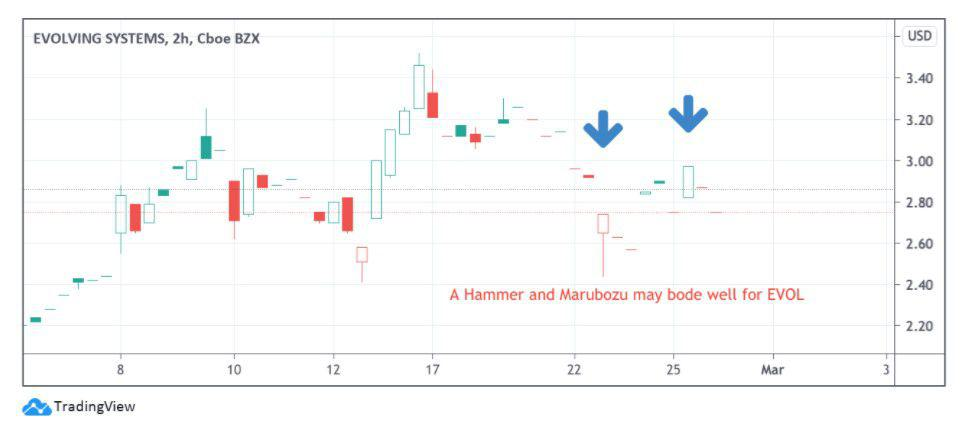

Penny stocks, defined as shares trading for less than $5, present unique opportunities and significant risks for investors due to their volatility and the typically small size of the companies involved. Many investors use technical analysis to better understand and predict price movements, which is crucial in this high-risk segment of the stock market. Technical analysis involves examining historical data, particularly price and volume, to identify patterns and trends to forecast future price movements. This method is particularly suited to penny stocks, which often exhibit rapid and unpredictable price changes.

In recent years, the stock market has increasingly incorporated algorithmic trading or algo trading, which uses computer programs to execute trades based on pre-established criteria. This form of trading benefits from speed and precision, allowing traders to capitalize on small price changes in real-time. Technical analysis plays an essential role in algorithmic trading by providing the signals and criteria that guide trading decisions. 



This article aims to explore how integrating technical analysis with algorithmic trading strategies can enhance decision-making processes for trading penny stocks. The combination of these approaches can potentially lead to more informed trading decisions and improved profitability. However, the inherent volatility and low liquidity of penny stocks require careful consideration and adaptation of strategies to succeed in this challenging market landscape.

## Table of Contents

## Understanding Technical Analysis

Technical analysis involves the examination of past market data, with an emphasis on price and volume, to forecast future price movements. This methodological approach proves especially valuable for penny stocks, which are characterized by significant price volatility. By analyzing patterns and employing technical indicators, traders can gain insights into potential future stock movements, thereby formulating informed trading strategies.

Understanding the main tools used in technical analysis is essential for effectively trading penny stocks. Among these tools are moving averages, the Relative Strength Index (RSI), and the Moving Average Convergence Divergence (MACD).

**Moving Averages** are pivotal in smoothing out price data to identify trends over specific periods. The two commonly used types are the Simple Moving Average (SMA) and the Exponential Moving Average (EMA). 

The formula for calculating the Simple Moving Average over a period of $n$ is:

$$
\text{SMA} = \frac{\sum_{i=1}^{n} P_i}{n}
$$

where $P_i$ represents the stock price at each time period $i$.

In contrast, the Exponential Moving Average places greater weight on more recent prices, thus reacting more swiftly to price changes. This feature makes EMA particularly useful for penny stocks, where rapid price shifts are common.

**Relative Strength Index (RSI)** is another crucial indicator, quantifying the speed and change of price movements. It oscillates between 0 and 100, with traditional interpretations considering an RSI below 30 as indicating an oversold condition, while an RSI above 70 suggests an overbought condition. This information can be leveraged to predict potential reversal points.

The RSI is computed as follows:

$$
\text{RSI} = 100 - \frac{100}{1 + \frac{\text{Average Gain}}{\text{Average Loss}}}
$$

**Moving Average Convergence Divergence (MACD)** is a trend-following momentum indicator that shows the relationship between two moving averages of a stock's price. The MACD is calculated by subtracting the 26-period EMA from the 12-period EMA. Additionally, a 9-day EMA of the MACD line, known as the "signal line," is plotted alongside to function as a trigger for buy and sell signals.

The predictive power of these indicators lies in their ability to reveal underlying market sentiment and potential trend reversals. For instance, crossovers in the MACD can signal shifts from bullish to bearish trends or vice versa, allowing investors to act promptly.

By harnessing these tools effectively, traders can navigate the unsteady waters of penny stock trading with greater precision. They form the backbone of technical analysis strategies that, when applied skillfully, can identify lucrative trading opportunities in volatile stock environments.

## The Volatility of Penny Stocks

Penny stocks, defined as stocks trading for less than $5 per share, are typically associated with small, often young companies that have a market capitalization of under $300 million. The [volatility](/wiki/volatility-trading-strategies) of these stocks is primarily due to their low price and market cap, which makes them susceptible to significant price swings given even minor changes in trading [volume](/wiki/volume-trading-strategy) or market sentiment. This volatility can be both a risk and an opportunity for investors, especially those engaged in short-term trading strategies.

High volatility in penny stocks is characterized by sharp price movements over short periods. Such fluctuations can be triggered by a variety of factors, including company-specific news, macroeconomic events, or simply the speculative nature of the stock market. For example, a favorable announcement like a new product launch or a breakthrough in technology could rapidly increase a penny stock's price. Conversely, negative news can just as swiftly lead to dramatic losses.

Because of this erratic nature, technical analysis becomes an essential toolkit for traders of penny stocks. Technical analysis focuses on past trading data, primarily price and volume, using this information to recognize patterns and forecast future price movements. Key technical indicators often employed in the analysis of penny stocks include moving averages, which smooth out price data to identify trends, and oscillators such as the Relative Strength Index (RSI), which can indicate overbought or oversold conditions.

For instance, a simple moving average (SMA) can be calculated as:

$$
\text{SMA} = \frac{P_1 + P_2 + \cdots + P_n}{n}
$$

Where $P_1, P_2, \ldots, P_n$ are the stock prices over a given number of periods $n$.

By applying these indicators, investors can pinpoint potential entry points—such as when a stock crosses above its moving average, suggesting a bullish trend—or identify [exit](/wiki/exit-strategy) points when an indicator signals that the stock may be overvalued. Thus, technical analysis helps to manage the inherent risks of penny stocks by offering insights into the most opportune moments for buying or selling.

The high volatility of penny stocks requires vigilant risk management, as the potential for quick gains is matched by the possibility of steep losses. Traders often set stop-loss orders to automate the selling of a stock once it hits a certain price, limiting potential losses. This ability to intelligently navigate volatile markets positions technical analysis as an invaluable asset for those seeking to leverage the unique opportunities presented by penny stocks—while also safeguarding against their risks.

The dynamic nature of penny stock trading demands a consistent, disciplined approach, blending analytical acumen with real-world trading experience. While the upside can be significant, maintaining a strategy that combines both technical indicators and sound risk management practices is crucial for achieving sustainable success.

## Incorporating Algo Trading with Technical Analysis

Algorithmic trading, or algo trading, leverages pre-defined criteria within computer programs to execute trades, often employing high-frequency trading techniques to capitalize on minute price fluctuations in stocks. This method aligns well with the volatile nature of penny stocks, offering a structured approach that can effectively manage the rapid price shifts characteristic of these investments.

Incorporating technical analysis into [algorithmic trading](/wiki/algorithmic-trading) refines these pre-programmed criteria, enhancing the decision-making process through the integration of various technical indicators. Traders can use historical data and technical patterns such as moving averages, support and resistance levels, and more complex signals like breakouts to inform their trading algorithms. For instance, a moving average crossover—where a shorter-term moving average crosses above a longer-term one—can be programmed as a buy signal in an algorithm.

Python, a versatile programming language, provides numerous libraries such as `pandas`, `numpy`, and `TA-Lib` that facilitate the incorporation of technical indicators into trading algorithms. Here's a basic Python code snippet that demonstrates how a simple moving average (SMA) can be used in an algorithm:

```python
import pandas as pd

# Load stock data
data = pd.read_csv('penny_stock_data.csv')

# Calculate short-term and long-term moving averages
data['SMA_20'] = data['Close'].rolling(window=20).mean()
data['SMA_50'] = data['Close'].rolling(window=50).mean()

# Generate trading signals
data['Signal'] = 0
data.loc[data['SMA_20'] > data['SMA_50'], 'Signal'] = 1
data.loc[data['SMA_20'] < data['SMA_50'], 'Signal'] = -1

# Implement the trading strategy
data['Position'] = data['Signal'].shift()

# Output the buy/sell signals
print(data[['Close', 'SMA_20', 'SMA_50', 'Signal', 'Position']])
```

This script calculates the 20-day and 50-day simple moving averages and generates buy or sell signals based on their crossovers. The algorithm can automate the decision to buy when the 20-day SMA crosses above the 50-day SMA and sell when the opposite occurs.

For penny stock trading, algorithms can be fine-tuned to detect specific technical setups, such as [breakout](/wiki/breakout-trading) points—where a stock moves outside a defined support or resistance level, indicating a potential trend. By aligning these setups with an investor’s unique strategies and risk tolerance, algo trading can systematically execute trades designed to capitalize on penny stock movements efficiently.

The integration of technical analysis into algorithmic trading strategies not only aids in identifying profitable opportunities but also imparts discipline and objectivity to trading by minimizing emotional influence. This hybrid approach is essential for navigating the fluctuations of penny stocks, thereby maximizing potential returns while effectively managing risk.

## Case Studies: Applying Technical Analysis in Penny Stock Trading

In the world of penny stocks, technical analysis can provide critical insights that lead to profitable trading decisions. An analysis of Gaotu Techedu Inc. and Vyant Bio Inc. demonstrates how this method can accurately forecast stock price movements.

**Gaotu Techedu Inc.**  
Gaotu Techedu Inc., a Chinese education company, has exhibited considerable price volatility, characteristic of penny stocks. Technical analysis of Gaotu's trading patterns highlights certain indicators such as Moving Averages (MA) and Relative Strength Index (RSI) that have proven effective. For instance, the 50-day MA crossing above the 200-day MA—a signal known as the Golden Cross—preceded a marked uptrend in Gaotu's stock price. Moreover, RSI values dipping below 30 often indicated oversold conditions, allowing traders to anticipate potential rebounds. These patterns, combined with algorithmic trading, allow investors to automate buying during such setups and selling when the RSI exceeds 70, indicative of overbought conditions.

**Example Python Code for MA and RSI Analysis:**
```python
import pandas as pd

# Sample data: Date, Closing Price
stock_data = pd.read_csv('gaotu_stock_data.csv')

# Calculate Moving Averages
stock_data['50_MA'] = stock_data['Close'].rolling(window=50).mean()
stock_data['200_MA'] = stock_data['Close'].rolling(window=200).mean()

# Calculate RSI
delta = stock_data['Close'].diff()
gain = (delta.where(delta > 0, 0)).rolling(window=14).mean()
loss = (-delta.where(delta < 0, 0)).rolling(window=14).mean()
rs = gain / loss
stock_data['RSI'] = 100 - (100 / (1 + rs))

# Identifying Golden Cross and RSI signals
golden_cross = stock_data[(stock_data['50_MA'] > stock_data['200_MA'])]
buy_signals = stock_data[(stock_data['RSI'] < 30)]
sell_signals = stock_data[(stock_data['RSI'] > 70)]
```

**Vyant Bio Inc.**  
Vyant Bio Inc., focused on biotechnology, offers another illustration of successful technical analysis in penny stock trading. The application of Bollinger Bands has been particularly beneficial. When Vyant's stock price approaches the lower Bollinger Band, it often indicates an impending price increase, signaling a buy opportunity. Conversely, when prices touch the upper Band, it often suggests that the stock is overbought, presenting a potential sell point. Coupling these technical indicators with algorithmic trading can enhance profitability by executing rapid trades at opportune moments.

**Bollinger Bands Example Python Code:**
```python
import numpy as np

# Calculate Bollinger Bands
stock_data['20_MA'] = stock_data['Close'].rolling(window=20).mean()
stock_data['Std_dev'] = stock_data['Close'].rolling(window=20).std()
stock_data['Upper_Band'] = stock_data['20_MA'] + (2 * stock_data['Std_dev'])
stock_data['Lower_Band'] = stock_data['20_MA'] - (2 * stock_data['Std_dev'])

# Identifying Bollinger Bands signals
buy_signals = stock_data[stock_data['Close'] < stock_data['Lower_Band']]
sell_signals = stock_data[stock_data['Close'] > stock_data['Upper_Band']]
```

These case studies underline the efficacy of technical analysis in navigating the highs and lows of penny stock trading. By leveraging historical price patterns and implementing algorithmic execution, traders can potentially boost their performance, demonstrating the fusion of analysis and technology in financial markets.

## Advantages and Risks

The combination of technical analysis and algorithmic trading presents several advantages for penny stock trading. One of the primary benefits is the ability to engage in systematic and emotionless trading. By deploying algorithms, traders can automate their strategies to execute trades based on predefined technical criteria, such as specific chart patterns or technical indicators. This automation helps minimize emotional biases and can improve the consistency of trading decisions.

Another significant advantage is the speed at which algorithmic trading operates. Algorithms can process information and execute trades at much faster rates than a human trader, allowing them to capitalize on fleeting market opportunities that would otherwise be missed. This is particularly beneficial in the high-volatility environment of penny stocks, where prices can fluctuate wildly in short periods.

However, it's important to acknowledge the risks associated with this approach. Penny stocks are inherently volatile and often have lower [liquidity](/wiki/liquidity-risk-premium) compared to larger-cap stocks. This volatility can lead to rapid price changes that even the fastest algorithms may not anticipate, potentially resulting in significant losses. Lower liquidity can also mean that executing larger trades without affecting the stock price is challenging.

Algorithmic trading also necessitates sophisticated technology and a comprehensive understanding of programming within financial markets. Developing and maintaining an effective trading algorithm requires skills in both finance and software development. This technical barrier can be an impediment for individual traders who may not have the resources or expertise to create these systems.

In summary, while integrating technical analysis with algorithmic trading offers substantial benefits like speed and systematic decision-making, it is essential to remain cautious of the volatility and liquidity issues unique to penny stocks. Moreover, the need for advanced technology and programming expertise may limit accessibility for many investors.

## Conclusion

Mastering the art of technical analysis combined with algorithmic trading presents a formidable strategy for trading penny stocks. This integration allows investors to leverage data-driven insights and automation to potentially enhance profitability. Technical analysis, with its reliance on historical price patterns and indicators, provides a foundation for forecasting price movements, particularly in the volatile penny stock market. When coupled with algorithmic trading, which offers systematic and expedient execution of trades based on pre-set rules, the opportunities for profit can be significant.

Nevertheless, the allure of combining technical analysis with algorithmic trading should not overshadow the inherent risks associated with penny stocks. Their high volatility and often lower liquidity can lead to abrupt price changes, posing challenges even to sophisticated trading algorithms. Investors must remain vigilant and continuously adapt their strategies to mitigate these risks. The rapid evolution of market environments requires traders to be flexible and responsive to new data and trends.

Moreover, the complexity of algorithmic trading demands a deep understanding of both financial markets and programming. Technical proficiency in developing and maintaining trading algorithms is crucial, as is conducting thorough [backtesting](/wiki/backtesting) to ensure the reliability and effectiveness of these systems under various market conditions.

In conclusion, while the synergy of technical analysis and algorithmic trading offers significant profit potential, success in penny stock trading ultimately hinges on rigorous due diligence and robust risk management. Investors must not only rely on historical data but also develop a keen awareness of current market dynamics and be prepared to adjust strategies as necessary. Through careful planning and strategic execution, traders can aim to maximize returns while navigating the complexities of the stock market.

## References & Further Reading

[1]: Bergstra, J., Bardenet, R., Bengio, Y., & Kégl, B. (2011). ["Algorithms for Hyper-Parameter Optimization."](https://papers.nips.cc/paper/4443-algorithms-for-hyper-parameter-optimization) Advances in Neural Information Processing Systems 24.

[2]: ["Advances in Financial Machine Learning"](https://www.amazon.com/Advances-Financial-Machine-Learning-Marcos/dp/1119482089) by Marcos Lopez de Prado

[3]: ["Evidence-Based Technical Analysis: Applying the Scientific Method and Statistical Inference to Trading Signals"](https://www.amazon.com/Evidence-Based-Technical-Analysis-Scientific-Statistical/dp/0470008741) by David Aronson

[4]: ["Machine Learning for Algorithmic Trading"](https://github.com/stefan-jansen/machine-learning-for-trading) by Stefan Jansen

[5]: ["Quantitative Trading: How to Build Your Own Algorithmic Trading Business"](https://www.amazon.com/Quantitative-Trading-Build-Algorithmic-Business/dp/1119800064) by Ernest P. Chan