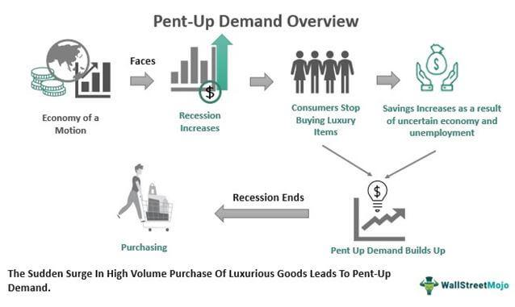

In the intricate landscape of modern economics, understanding consumer behavior is pivotal. Consumer behavior, the study of individuals' purchasing decisions and the external factors influencing them, provides a critical lens through which economists can interpret market dynamics and predict future trends. Among the various phenomena shaping economic cycles, pent-up demand stands as a significant driver, particularly during recovery phases following economic downturns.

Pent-up demand refers to the accumulated desire to purchase goods and services that consumers defer during periods of economic uncertainty. This latent demand often leads to a surge in buying activity once economic conditions stabilize, acting as a catalyst for economic recovery. Such demand is most prominently observed in markets for durable goods—products that are not purchased frequently, such as automobiles and home appliances. Understanding the triggers and impacts of pent-up demand allows policymakers and businesses to better navigate economic fluctuations.



This article explores how pent-up demand interacts with other elements of economic mechanics, including consumer behavior, economic measurement, and algorithmic trading. By analyzing these interconnected components, we illuminate their crucial roles in shaping modern financial markets. The aim is to provide a comprehensive understanding that can aid both policymakers in crafting supportive economic policies and traders in refining their strategies to optimize market opportunities. Through this exploration, deeper insights can be gained into the essential nature of pent-up demand and its broader implications on economic stability and market dynamics.

## Table of Contents

## Understanding Pent-Up Demand

Pent-up demand is characterized by a marked increase in consumer demand following periods of recession or reduced economic activity. This phenomenon primarily occurs when consumers delay purchases due to economic uncertainties or financial constraints. During economic downturns, individuals often focus on essentials, deferring expenditures on non-essential or high-cost items, which leads to a backlog of consumption intentions. As economic conditions subsequently improve—marked by increased employment, rising consumer confidence, and better financial stability—this accumulated demand is unleashed, thus stimulating economic activity.

Economists regard pent-up demand as a critical driver of recovery because it facilitates a rapid resurgence in economic activity. It plays a particularly prominent role in markets for durable goods, such as automobiles and home appliances. These items represent significant financial commitments, and their purchase is more easily deferred during economic uncertainty. As confidence returns, the delayed purchases begin to take place, leading to heightened production and sales in the sectors involved.

Pent-up demand can create a multiplier effect, where increased consumer spending leads to higher production output, which in turn results in job creation, income generation, and further spending. This cycle supports a broader economic recovery. However, economists and policymakers must monitor pent-up demand to understand its potential impacts on inflation and supply chain dynamics. If demand outpaces supply, it can lead to price hikes and shortages, necessitating careful economic planning and policy intervention.

Understanding the dynamics of pent-up demand requires analyzing various economic indicators, such as consumer confidence indices and purchasing trends. For instance, the Consumer Confidence Index (CCI) can serve as a proxy for projected spending, reflecting the degree of consumer optimism about the economic future. The released demand can be modeled statistically to anticipate its effects using historical data on past economic recoveries.

In conclusion, the concept of pent-up demand highlights the important interplay between consumer behavior and economic cycles, providing valuable insights for economic forecasting and policy formulation.

## Consumer Behavior and Its Impact on Economics

Consumer behavior has a profound effect on economic patterns and recovery processes, especially during economic downturns such as recessions. During these times, consumers tend to constrict their spending habits, opting to save more and delay purchases that are not immediately necessary. This shift in behavior is driven by a need to conserve financial resources in response to economic uncertainty and is a key [factor](/wiki/factor-investing) in affecting demand and supply dynamics in the market.

The propensity for consumers to save rather than spend during recessions can be quantified through various economic indicators such as the savings rate and consumer spending data. Economists use these indicators to track changes in consumer confidence and spending behavior. For instance, a significant increase in the personal savings rate may signal a decrease in consumer confidence and indicate that a period of deferred consumption is underway.

Understanding these behavioral patterns is crucial for economists as they attempt to predict potential spikes in demand—referred to as "pent-up demand"—that occur when economic conditions begin to improve. This anticipation of pent-up demand is instrumental for policymakers engaged in shaping monetary policies aimed at fostering economic recovery. By predicting when consumers are likely to resume spending, governments and central banks can better time their interventions, such as adjustments to interest rates or fiscal stimulus measures, to support a steady economic rebound.

Moreover, recognizing patterns in consumer behavior allows for the identification of economic segments most likely to experience surges in demand. Sectors such as automotive, real estate, and electronics often see heightened activity once consumers regain confidence and start spending again. Accurate predictions enable these industries to prepare for fluctuations in demand, optimizing inventory management and production schedules in advance.

To summarize, by analyzing consumer behavior during economic downturns, economists can make informed predictions regarding pent-up demand. This foresight assists in the formulation of effective monetary policies, ultimately playing a pivotal role in economic recovery and stability.

## Measuring Pent-Up Demand

Measuring pent-up demand involves a detailed analysis of various economic indicators and consumer behavior patterns, providing critical insights into potential economic recovery. A key metric used in this measurement is the average age of durable goods, which serves as a proxy for deferred spending decisions by consumers. The Bureau of Economic Analysis (BEA) tracks this metric, as older average ages of durable goods often indicate delayed purchases during economic downturns, suggesting a build-up of demand that could be unleashed once economic stability returns.

Economists utilize these measurements to assess the potential for economic rebound following periods of reduced consumer expenditure. During a recession, as consumers postpone buying durable goods like vehicles, appliances, and electronics, these items' average ages increase. Once economic conditions improve, the replacement or upgrade of these goods can accelerate economic activity, making the average age a vital signal for impending demand surges.

Despite its usefulness, measuring pent-up demand is complex due to the challenges associated with predicting future consumer behavior based on past trends. The accuracy of these predictions is limited by factors such as changes in consumer preferences, technological advancements, and alterations in purchasing power over time. Economists often employ models to estimate potential demand, incorporating variables such as disposable income levels, interest rates, and consumer confidence indices. However, these models must be continually adjusted to reflect current economic realities and emerging trends.

To illustrate, a simplified Python model for estimating pent-up demand might look like this:

```python
import numpy as np

# Simulated data for average age of durable goods (in years)
average_age = np.array([5, 6, 7, 8, 9, 10])

# Simulated growth in economic conditions
growth_factor = np.array([1.02, 1.05, 1.07, 1.1, 1.15, 1.2])

# Estimating pent-up demand using a linear relationship with the growth factor
pent_up_demand = average_age * growth_factor

print("Estimated Pent-up Demand:", pent_up_demand)
```

While such models offer insights, they inherently possess uncertainty because extrapolating future behavior from historical data involves assumptions that may not hold in changing economic contexts. Therefore, continuous monitoring and updating of these models are essential for maintaining their relevance and accuracy in capturing the dynamics of pent-up demand within the economy.

## Algorithmic Trading in the Context of Economic Shifts

Algorithmic trading utilizes automated systems to execute financial decisions in milliseconds, relying on algorithms to analyze vast amounts of market data. This technological approach is significantly responsive to economic indicators, such as signals of pent-up demand, which can lead to sudden shifts in market conditions.

Economic shifts are often characterized by changes in consumer behavior—such as those resulting from pent-up demand—that can cause rapid fluctuations in asset prices. For example, when a period of economic downturn ends, and pent-up demand is released, the increased consumer activity can lead to a rise in the stock prices of companies producing durable goods. Algorithmic trading systems, equipped with the ability to process large data sets and detect substantial market trends, can exploit these fluctuations to optimize returns.

Traders and financial institutions deploy algorithms to identify opportunities created by market movements linked to economic changes. These algorithms typically incorporate [machine learning](/wiki/machine-learning) techniques to predict future price movements and to react swiftly to new data. The inclusion of pent-up demand indicators in these models could enhance their ability to forecast short-term market [volatility](/wiki/volatility-trading-strategies) and adjust trading strategies accordingly. For example, an algorithm might include a variable that measures the average age of durable goods in the economy, as indicated by entities like the Bureau of Economic Analysis. If this average age increases beyond a certain threshold, the algorithm might predict an imminent surge in consumer spending and adjust its investment strategy to anticipate the resulting market rally.

Refining algorithmic models to incorporate pent-up demand indicators requires a comprehensive understanding of both historical and real-time economic data. By leveraging this information, algorithms can increase their predictive accuracy, thus improving the financial outcomes for traders. This integration may involve advanced data analysis techniques and partners high-frequency market data with economic indicators to generate actionable insights.

Moreover, implementing these advanced algorithmic models demands a robust computational infrastructure. High-performance computing environments and parallel processing techniques are vital for running sophisticated simulations and real-time analysis of market data. Python, a widely-used language in financial data analysis, offers libraries such as NumPy, pandas, and scikit-learn to handle data processing and machine learning tasks efficiently.

Here is a simple example in Python for a portion of a trading algorithm that could react to changes in durable goods data:

```python
import numpy as np
import pandas as pd
from sklearn.linear_model import LinearRegression

# Assume 'durable_goods_data' and 'stock_prices' are pandas DataFrames
def predict_stock_movement(durable_goods_data, stock_prices):
    # Prepare data - assume durable_goods_data has 'year', 'average_age', 'month', 
    # and stock_prices has 'price'
    X = durable_goods_data[['average_age']].values
    y = stock_prices['price'].values

    # Train a simple linear regression model
    model = LinearRegression()
    model.fit(X, y)

    # Predict future stock prices based on current durable goods data
    prediction = model.predict(X[-1].reshape(1, -1))
    return prediction

# Usage
# predicted_price = predict_stock_movement(durable_goods_data, stock_prices)
# if predicted_price > stock_prices['price'].iloc[-1]:
#     execute_trade('buy')
# else:
#     execute_trade('sell')
```

By employing these methodologies, traders can better align [algorithmic trading](/wiki/algorithmic-trading) strategies with economic realities, optimizing for both profitability and risk management. Understanding and integrating the dynamics of pent-up demand within trading algorithms thus becomes a valuable asset in navigating the intricate movements of financial markets.

## Case Studies and Real-World Examples

### Case Studies and Real-World Examples

Pent-up demand has played a significant role in various historical contexts, offering insightful examples of its impact on economic recovery. One of the most notable periods showcasing pent-up demand was the post-World War II era. During the war, production focused heavily on military needs, resulting in shortages of consumer goods. This scarcity, combined with savings accrued during the war, led to a significant backlog of consumer demand. Once the war ended, and manufacturers retooled for civilian production, there was an explosive increase in consumer spending. This surge fueled economic growth and aided in the transition to a peacetime economy [1].

Another more recent example is the economic impact of the COVID-19 pandemic. During the pandemic's height, lockdowns and restrictions dramatically curtailed consumer spending, particularly in sectors such as travel, hospitality, and retail. Simultaneously, government stimulus measures in many countries helped maintain household income levels, leading to increased savings rates. As restrictions eased, this accumulated savings rapidly translated into heightened consumer demand. In the United States, for example, retail sales saw a significant rebound post-lockdown, markedly contributing to economic recovery in 2021 [2]. This scenario underlined how pent-up demand can swiftly alter economic trajectories, causing rapid shifts in market dynamics.

Analyzing these instances provides essential insights for managing future economic fluctuations. Recognizing the conditions that lead to pent-up demand, such as prolonged periods of suppressed consumer activity, can help policymakers design preemptive economic strategies. For businesses, understanding pent-up demand phenomena allows for better inventory and resource management, anticipating potential spikes in consumer activity. For instance, during the COVID-19 recovery phase, sectors such as electronics and home improvement experienced unforeseen demand levels, highlighting the importance of adaptable supply chains.

Overall, historical and contemporary examples of pent-up demand illustrate its substantial influence on economic recovery. By learning from these instances, economic stakeholders can better prepare for and respond to similar situations in the future, thus fostering stability and growth in global markets.

**References**:
1. Broadberry, S., & Harrison, M. (2005). The Economics of World War II: Six Great Powers in International Comparison. Cambridge University Press.
2. U.S. Census Bureau. (2021). Advance Monthly Retail Trade Report. [Online] Available at: https://www.census.gov/retail/marts/www/marts_current.pdf

## Conclusion

In the complex interplay of consumer behavior, economic measurement, and algorithmic trading, pent-up demand emerges as a pivotal factor influencing economic cycles. Understanding this concept aids in predicting the timing and intensity of economic recoveries, helping to ensure market stability and fostering sustained growth. For policymakers, insights into pent-up demand enable the crafting of informed monetary and fiscal policies that can mitigate the adverse effects of economic downturns and hasten recovery phases. These policies may include targeted stimulus packages or [interest rate](/wiki/interest-rate-trading-strategies) adjustments aimed at encouraging consumer spending.

For traders and financial institutions, recognizing the patterns of pent-up demand provides opportunities to enhance market profitability. Algorithmic trading systems, which rely on sophisticated models to process economic indicators, can integrate signals of pent-up demand to improve predictive accuracy and make better-informed trading decisions. For instance, when a significant release of pent-up demand is anticipated, algorithms can adjust trading strategies to exploit expected market movements.

As the global economy becomes increasingly interconnected, the ability to anticipate and manage the impacts of pent-up demand is becoming more critical. Future economic challenges, such as those posed by technological disruptions or unexpected global events, will require agile and well-informed decision-making. By leveraging insights into pent-up demand, stakeholders can better navigate these challenges, fostering economic resilience and ensuring long-term market prosperity. Therefore, a thorough grasp of pent-up demand not only enhances economic forecasting but also empowers effective action, shaping a more stable economic landscape.

## References & Further Reading

[1]: Broadberry, S., & Harrison, M. (2005). ["The Economics of World War II: Six Great Powers in International Comparison."](https://www.academia.edu/75563173/The_Economics_of_World_War_II_Six_Great_Powers_in_International_Comparison) Cambridge University Press.

[2]: U.S. Census Bureau. (2021). ["Advance Monthly Retail Trade Report."](https://www.census.gov/retail/index.html/)

[3]: Shiller, R. J. (2015). ["Irrational Exuberance, 3rd Edition."](https://www.amazon.com/Irrational-Exuberance-3rd-Robert-Shiller/dp/0691166269) Princeton University Press.

[4]: Elliot, L., & Atkinson, D. (2008). ["The Gods That Failed: How Blind Faith in Markets Has Cost Us Our Future."](https://www.semanticscholar.org/paper/The-gods-that-failed-%3A-how-blind-faith-in-markets-Elliott-Atkinson/47cd25d7163d21640dd7de9862a889614809e19d) Nation Books.

[5]: Reinhart, C. M., & Rogoff, K. S. (2011). ["This Time is Different: Eight Centuries of Financial Folly."](https://www.nber.org/system/files/working_papers/w13882/w13882.pdf) Princeton University Press.