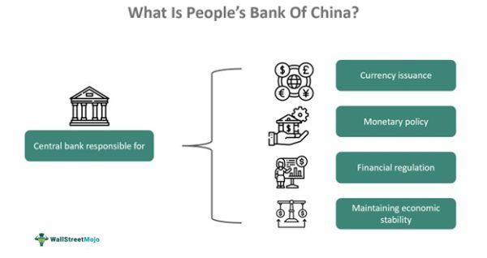

The People's Bank of China (PBoC) stands as a cornerstone in the financial architecture of China, wielding a profound influence over the nation’s economic stability and monetary policy. As China's central bank, the PBoC is entrusted with a multitude of critical functions that not only stabilize the domestic economy but also affect the broader global financial landscape. This article examines the extensive roles and responsibilities of the PBoC, focusing on its foundational elements and the significant impact it has on algorithmic trading within the country.

Through its strategic financial policies, the PBoC aligns itself with the objectives of managing monetary supply, overseeing currency circulation, and ensuring the overall stability of the financial system. Its actions and directives play a critical role in the guidance and regulation of economic activities, influencing both conventional financial systems and emerging trends like algorithmic trading. Algorithmic trading, characterized by the use of complex algorithms and high-speed data to drive trading decisions in financial markets, is increasingly becoming prevalent in China. This development invites a closer alignment and interaction with PBoC regulations as these strategies evolve.

The article will explore the convergence of PBoC's policies with the dynamics of algorithmic trading, reflecting broader economic trends. Readers will gain insights into how the PBoC not only shapes China's economic framework but also responds to technological advancements in financial markets. By illuminating these aspects, the article offers a thorough understanding of the PBoC's strategic influence in shaping China's economic trajectory and its engagement with the sophisticated mechanisms of modern trading.

## Table of Contents

## Overview of the People's Bank of China

The People's Bank of China (PBoC) was established in 1948 and serves as the central bank of China. Headquartered in Beijing, the PBoC plays a pivotal role in the country's economic and financial infrastructure. One fundamental responsibility of the PBoC is the issuance of the Renminbi (RMB), China's official currency, which it manages alongside the country's vast foreign exchange reserves. These reserves are significant as they contribute to China's ability to maintain a stable currency and support its economic policies on a global platform.

The PBoC's mission encompasses the formulation and implementation of monetary policy to ensure sustainable financial stability. This involves strategic decisions around interest rates and money supply that directly affect inflation, unemployment, and overall economic growth. The PBoC acts as a regulatory body over China's financial system, exerting its authority over commercial banks and financial markets. This oversight ensures that these institutions operate within a framework that promotes financial security, efficiency, and growth.

Furthermore, the PBoC's presence is not limited to Beijing; it operates regional branches throughout major cities in China. This extensive network allows the bank to effectively monitor and control regional markets, offering a tailored approach to regional economic management. Through these decentralized branches, the PBoC can implement policies that consider local economic conditions while still aligning with national financial objectives.

The PBoC's comprehensive influence across various layers of China's financial landscape underscores its essential role in supporting and stabilizing the nation's economy.

## Core Functions and Responsibilities

The People's Bank of China (PBoC) is central to the execution of monetary policy, influencing both the micro and macroeconomic conditions within China. Its core responsibilities include the formulation and implementation of monetary policy, which involves adjusting interest rates strategically to control inflation, influence economic growth, and maintain financial stability. By managing currency circulation, the PBoC ensures that the supply of Renminbi aligns with the demand, facilitating both domestic and international trade.

A pivotal function of the PBoC is the regulation of China's financial markets and the assurance of banking sector stability. The bank supervises financial institutions, imposing standards and practices that safeguard the financial system from systemic risks. By overseeing commercial banks, the PBoC ensures that these institutions operate within the established regulatory framework, promoting transparency and reducing the likelihood of financial crises.

The PBoC also plays a crucial role in drafting financial legislation. It oversees the enforcement of these laws to maintain the integrity and stability of the financial system. This regulatory function extends to supervising lending practices and regulating interbank transactions to promote a healthy banking environment. The PBoC’s regulatory oversight extends as well to ensuring that lenders adhere to best practices, thereby preventing predatory lending and financial malpractices.

In addition, the PBoC is tasked with managing the credit reporting industry, ensuring that credit information is accurately maintained and accessible, thus enhancing financial transparency and accountability. The bank also oversees the operations of the state treasury, ensuring that state funds are allocated effectively and support the country's economic priorities efficiently.

Through these comprehensive functions, the PBoC not only supports the stable functioning of the domestic economy but also facilitates the country's integration into the global financial system.

## Algorithmic Trading and PBoC's Role

Algorithmic trading, characterized by the use of computer algorithms to automate trading strategies, has gained significant traction in China's financial markets. The People's Bank of China (PBoC), as the central regulatory authority, exerts substantial influence over this domain through its monetary policies and regulatory framework.

One of the primary mechanisms through which the PBoC impacts [algorithmic trading](/wiki/algorithmic-trading) is its monetary policy, particularly [interest rate](/wiki/interest-rate-trading-strategies) policies. Algorithmic trading strategies often rely on the predictability of market conditions, and interest rate fluctuations can influence market [volatility](/wiki/volatility-trading-strategies) and [liquidity](/wiki/liquidity-risk-premium). For instance, a decrease in interest rates by the PBoC might stimulate market activities by making borrowing cheaper, leading to increased trading volumes, which in turn affects algorithmic trade strategies that capitalize on high-frequency trades.

Furthermore, the PBoC's regulation of market liquidity is critical. By managing reserve requirements and open market operations, the PBoC influences the amount of money circulating in the economy, which impacts the liquidity available in financial markets. High liquidity is conducive to algorithmic trading, facilitating the quick execution of trades that algorithms are designed to perform.

The bank has also been proactive in fostering a technologically conducive environment for algorithmic trading platforms. Through initiatives aimed at modernizing financial infrastructure, such as promoting digital transformation and supporting fintech advancements, the PBoC enables more robust and resilient trading systems. These efforts are evident in the development of digital payment systems and enhancements in data processing capabilities, which are integral to algorithmic trading operations.

Lastly, the interaction between PBoC regulations and algorithmic trading highlights the intricate balance required in modern financial systems. While the PBoC aims to ensure market stability and protect against systemic risks, it also strives to foster innovation and market efficiency. This dual mandate necessitates a delicate balance in crafting policies that accommodate rapid technological advancements while safeguarding financial sector integrity.

In conclusion, the PBoC's role in algorithmic trading is multifaceted and dynamic, influencing trading environments through its policies and regulatory measures. Its ongoing efforts to adapt to technological advancements continue to shape the landscape of China's financial markets.

## PBoC's Financial Position and Recent Initiatives

The People's Bank of China (PBoC) holds a dominant position in global finance, reflected by its immense foreign exchange reserves. As of recent estimates, these reserves rank among the largest internationally, underlining the bank's significant financial influence. Economic policies and reforms undertaken by the PBoC demonstrate its proactive approach to maintaining economic stability and fostering national growth.

Among its recent initiatives, the PBoC has reduced reserve requirement ratios (RRR) for commercial banks, a strategic decision aimed at increasing liquidity in the financial system. This adjustment is intended to provide banks with more capital to lend to businesses, thus stimulating economic activity and supporting the broader economy. By reducing RRR, the bank seeks to bolster credit availability, particularly during periods of economic uncertainty.

In 2022, recognizing the complexities of an evolving global economy, the PBoC implemented targeted monetary policies tailored to support vital economic sectors. These policies were designed to cushion sectors most impacted by external shocks, ensuring their continued operation and contribution to economic health. Such targeted measures underscore the bank's role in not only responding to immediate economic needs but also anticipating future challenges.

A critical aspect of the PBoC's strategic focus remains on fostering innovation and supporting small and medium-sized enterprises (SMEs). By prioritizing these areas, the bank aims to enhance the economy's competitive edge and resilience. Through financial incentives and supportive policies, it encourages technological advancements and entrepreneurship, which are vital for sustained economic growth and job creation.

Additionally, recent reforms concerning the loan prime rate (LPR) illustrate the PBoC's commitment to facilitating economic growth. Adjusting the LPR helps influence borrowing costs and can stimulate investment by reducing the cost of funding for businesses and consumers. This reform aligns with broader goals of stabilizing financial markets, ensuring they operate efficiently and transparently.

Overall, the PBoC's financial positioning and its recent initiatives reflect its crucial role in navigating economic challenges while capitalizing on growth opportunities. The bank's policies are instrumental in sustaining financial stability, promoting innovation, and supporting national economic objectives.

## Challenges and Opportunities

Balancing economic growth with financial stability is a central challenge for the People’s Bank of China (PBoC). The institution must carefully manage its policies to stimulate economic expansion without compromising financial stability. One of the contemporary challenges and opportunities facing the PBoC is the rapid evolution of digital currencies. With China's push for the Digital Renminbi (e-CNY), the PBoC must navigate the complexities of introducing a central bank digital currency (CBDC) while addressing potential issues such as cybersecurity, monetary control, and the effects on commercial banks.

Interest rate fluctuations in global markets present another significant challenge. As a central bank deeply integrated into the global economy, the PBoC must respond swiftly and effectively to maintain China's financial stability. Global interest rate changes can lead to capital outflows or inflows, exchange rate volatility, and altered foreign reserve levels. Thus, the PBoC must employ agile monetary policy tools to safeguard against potential destabilizing effects from international market shifts.

The rise of algorithmic trading enhances market efficiency through increased transaction speed and reduced costs, presenting opportunities for the PBoC. However, this technology also introduces increased complexity into the trading ecosystem, requiring the PBoC to establish robust regulatory frameworks. Ensuring that algorithmic trading adheres to market transparency and fairness is essential to prevent systemic risks and market manipulation. 

In managing these diverse challenges and opportunities, the PBoC aims to sustain China's economic [momentum](/wiki/momentum), fostering a stable environment conducive to long-term growth. The bank's ability to effectively balance these dynamics will significantly influence China's financial landscape and its position in the global economy.

## Conclusion

The People's Bank of China (PBoC) plays a fundamental role in maintaining China's financial stability, primarily through effective policy-making and regulatory oversight. As the epicenter of the country's financial system, the PBoC influences both domestic and international markets. Its strategic decisions, particularly in interest rate management and market liquidity, are critical to mitigating financial risks and ensuring steady economic growth.

Algorithmic trading, an increasingly prevalent component of global finance, is significantly impacted by the PBoC’s policy measures. The bank's approach to regulation and technology development supports the growth and stability of these trading practices, which are becoming crucial for market efficiency and competitiveness. Insights into the PBoC's policies can provide a better understanding of China's financial dynamics, illustrating how domestic decisions have international ramifications.

The continued rise of China as a major economic power underscores the importance of the PBoC's strategies. The central bank's focus on innovation, market reform, and financial stability will remain central to sustaining economic momentum. As global financial landscapes evolve, the adaptability and foresight of the PBoC will be vital in shaping China's economic future and its global economic position.

## References & Further Reading

[1]: Cheng, C. (2019). ["Central Banking in China and Taiwan: A Comparative Analysis."](https://www.sciencedirect.com/science/article/abs/pii/S1094202520301150) Springer.

[2]: Huang, Y. (2012). ["Renminbi Strategy, Plight and Prospect."](https://papers.ssrn.com/sol3/papers.cfm?abstract_id=2441821) World Scientific.

[3]: Prasad, E. (2016). ["Gaining Currency: The Rise of the Renminbi."](https://academic.oup.com/book/4566) Oxford University Press.

[4]: Fung, B., & Halaburda, H. (2016). ["Central Bank Digital Currencies: A Framework for Assessing Why and How."](https://www.semanticscholar.org/paper/Central-Bank-Digital-Currencies%3A-A-Framework-for-Fung-Halaburda/1cd95deffa6254f38435128c496aa85a883a4503) Bank of Canada Staff Discussion Paper.

[5]: Chiu, J., & Koeppl, T. V. (2019). ["The Economics of Central Bank Digital Currency."](https://papers.ssrn.com/sol3/papers.cfm?abstract_id=3048124) The Journal of Economic Surveys.

[6]: Lopez de Prado, M. (2018). ["Advances in Financial Machine Learning."](https://www.amazon.com/Advances-Financial-Machine-Learning-Marcos/dp/1119482089) John Wiley & Sons.

[7]: Chan, E. P. (2008). ["Quantitative Trading: How to Build Your Own Algorithmic Trading Business."](https://github.com/ftvision/quant_trading_echan_book) John Wiley & Sons.

[8]: Aronson, D. R. (2006). ["Evidence-Based Technical Analysis: Applying the Scientific Method and Statistical Inference to Trading Signals."](https://www.amazon.com/Evidence-Based-Technical-Analysis-Scientific-Statistical/dp/0470008741) Wiley.