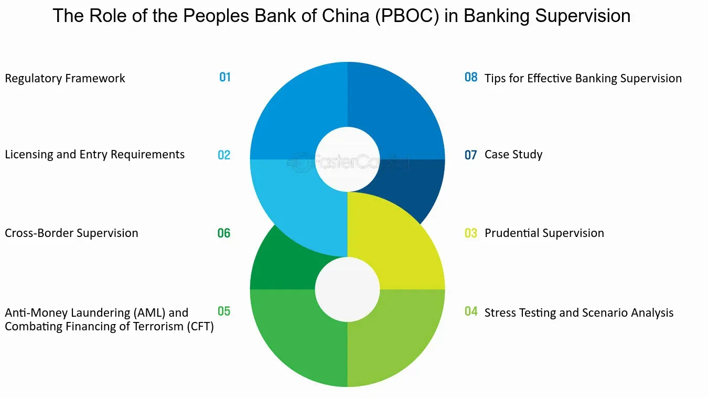

## Table of Contents

## What is the People's Bank of China?

The People's Bank of China, often called PBOC, is the central bank of China. It is like a big boss for all the other banks in China. The PBOC controls the country's money and makes sure the economy runs smoothly. It decides how much money is in circulation and sets the interest rates that banks use.

The PBOC also helps to keep the value of the Chinese currency, called the yuan, stable. It does this by buying and selling the yuan in the global market. The bank works to prevent big ups and downs in the economy and tries to keep prices from going too high or too low. This helps people and businesses in China to plan and spend their money wisely.

## When was the People's Bank of China established?

The People's Bank of China was set up on December 1, 1948. At that time, China was going through big changes and needed a strong bank to help manage its money.

Over the years, the PBOC has grown and changed a lot. It now plays a very important role in keeping China's economy stable and helping it grow. The bank works hard to make sure that the money in China is used in the best way possible.

## What are the primary functions of the People's Bank of China?

The People's Bank of China, or PBOC, has several important jobs. One of its main functions is to control the amount of money in the economy. It does this by setting interest rates and deciding how much money banks can lend. This helps to keep the economy growing at a good pace without getting too hot or too cold. The PBOC also looks after the value of China's money, called the yuan. It buys and sells the yuan in global markets to make sure its value stays stable.

Another big job of the PBOC is to make sure that banks in China are safe and sound. It keeps an eye on how banks are doing and makes rules that banks have to follow. This helps to prevent problems that could hurt people who save money in banks or borrow from them. The PBOC also helps to manage the country's payments and keeps the financial system running smoothly. It works to make sure that money can move around easily and safely within China and with other countries.

## How does the People's Bank of China influence monetary policy?

The People's Bank of China, or PBOC, has a big say in how money works in China. It does this by setting interest rates, which is like deciding how much it costs to borrow money. When the PBOC makes interest rates low, it's easier for people and businesses to borrow money, and this can help the economy grow faster. But if the economy is growing too fast and prices are going up a lot, the PBOC might raise interest rates to slow things down and keep prices from getting too high.

The PBOC also decides how much money banks can lend out. It does this by setting something called the reserve requirement ratio, which is the amount of money banks have to keep in their vaults and not lend out. If the PBOC wants more money to be available for loans, it can lower this ratio. If it wants to pull money out of the economy, it can raise the ratio. This helps the PBOC to control how much money is moving around and to keep the economy balanced.

## What role does the People's Bank of China play in managing the yuan?

The People's Bank of China, or PBOC, is in charge of looking after the yuan, which is China's money. One of the big jobs the PBOC does is to make sure the yuan stays at a good value. It does this by buying and selling the yuan in the world market. If the yuan is getting too weak, the PBOC might buy more yuan to make it stronger. If the yuan is getting too strong, the PBOC might sell some yuan to make it weaker. This helps to keep the yuan's value steady, which is good for people and businesses in China.

The PBOC also sets rules about how the yuan can be used. It decides how much of the yuan can be changed into other countries' money and how much can be moved in and out of China. This helps the PBOC to control the flow of money and keep the economy stable. By managing the yuan carefully, the PBOC helps to make sure that China's money works well both at home and around the world.

## How does the People's Bank of China regulate financial institutions?

The People's Bank of China, or PBOC, keeps a close watch on banks and other financial places in China. It makes rules that these places have to follow to make sure they are safe and sound. The PBOC checks how well these financial places are doing and makes sure they have enough money to pay back people who save with them. If a bank is not doing well, the PBOC can step in and help fix the problem or even take over the bank to protect people's money.

The PBOC also sets limits on how much money banks can lend out. It does this by telling banks how much money they need to keep in their vaults and not lend out. This is called the reserve requirement ratio. By changing this ratio, the PBOC can control how much money is moving around in the economy. This helps to keep the economy stable and prevent big problems. The PBOC's rules help to make sure that banks and other financial places in China work well and safely.

## What are the key responsibilities of the People's Bank of China in maintaining financial stability?

The People's Bank of China, or PBOC, works hard to keep the money system in China stable. It does this by watching over banks and other places that deal with money. The PBOC makes rules that these places have to follow to make sure they are safe and have enough money to pay back people who save with them. If a bank is not doing well, the PBOC can step in to fix the problem or even take over the bank to protect people's money. This helps to stop big problems from happening and keeps the money system strong.

The PBOC also controls how much money is in the economy. It does this by setting interest rates, which is like deciding how much it costs to borrow money. If the economy is growing too fast and prices are going up a lot, the PBOC might raise interest rates to slow things down. If the economy needs a boost, it might lower interest rates to make borrowing easier. By doing this, the PBOC helps to keep the economy balanced and prevents big ups and downs. This way, people and businesses can plan and spend their money wisely.

## How does the People's Bank of China contribute to the development of the financial market?

The People's Bank of China, or PBOC, helps the financial market in China grow by making rules that keep it safe and fair. It watches over banks and other places that deal with money to make sure they are doing things the right way. The PBOC also helps new financial products and services to come out by setting up rules that let them work well. This makes the financial market stronger and gives people and businesses more choices for saving and borrowing money.

The PBOC also works to make the financial market more open and connected to the rest of the world. It does this by setting rules about how money can move in and out of China. This helps Chinese businesses to work with other countries and brings more money into China's financial market. By doing all these things, the PBOC helps the financial market to grow and become better, which is good for everyone in China.

## What tools does the People's Bank of China use to control inflation?

The People's Bank of China, or PBOC, uses different tools to control inflation, which is when prices go up too fast. One big tool is changing interest rates. When prices are going up a lot, the PBOC might raise interest rates. This makes it more expensive to borrow money, so people and businesses might spend less. When they spend less, prices don't go up as fast. On the other hand, if prices are not going up enough, the PBOC might lower interest rates to make borrowing cheaper, so people and businesses spend more and help the economy grow.

Another tool the PBOC uses is called the reserve requirement ratio. This is the amount of money banks have to keep in their vaults and not lend out. If the PBOC wants to slow down the economy and control inflation, it can raise this ratio. This means banks can lend out less money, which can help to stop prices from going up too fast. If the PBOC wants to help the economy grow, it can lower the reserve requirement ratio, letting banks lend out more money. This can make the economy move faster but needs to be done carefully to not let inflation get out of control.

The PBOC also uses something called open market operations. This is when the PBOC buys or sells government bonds to control how much money is in the economy. If it wants to take money out of the economy to control inflation, it might sell bonds. People and businesses buy these bonds, giving their money to the PBOC, which means there's less money around to spend. If the PBOC wants to put more money into the economy, it might buy bonds back, giving money back to people and businesses. This way, the PBOC can keep the economy balanced and stop prices from going up too fast.

## How does the People's Bank of China manage foreign exchange reserves?

The People's Bank of China, or PBOC, keeps a close eye on the country's foreign exchange reserves, which is like a big pile of money in different currencies from around the world. The PBOC uses these reserves to help keep the value of the yuan, China's money, stable. If the yuan is getting too weak, the PBOC might use some of the reserves to buy yuan and make it stronger. If the yuan is getting too strong, the PBOC might sell some yuan and add to the reserves, making the yuan weaker. This helps to keep the yuan's value steady, which is good for people and businesses in China.

The PBOC also uses the foreign exchange reserves to manage the flow of money in and out of China. It sets rules about how much of the yuan can be changed into other countries' money and how much can be moved in and out of the country. By doing this, the PBOC can control the amount of money moving around and keep the economy stable. Managing the reserves carefully helps the PBOC to make sure that China's money works well both at home and around the world.

## What is the impact of the People's Bank of China's policies on international trade?

The People's Bank of China, or PBOC, affects international trade a lot by controlling the value of the yuan. When the PBOC keeps the yuan's value stable, it helps Chinese businesses know how much their products will cost in other countries. If the yuan is too weak, Chinese goods become cheaper for people in other countries to buy, which can help Chinese businesses sell more. But if the yuan is too strong, Chinese goods can become more expensive, and it might be harder for Chinese businesses to sell them. So, the PBOC's actions can make a big difference in how well Chinese products do in the global market.

The PBOC also sets rules about how money can move in and out of China. These rules can affect how easily businesses can buy and sell things with other countries. If the PBOC makes it easier to move money, it can help international trade grow because businesses can pay for things more easily. But if the PBOC makes it harder to move money, it might slow down trade because businesses might have trouble getting paid or paying for what they need. So, the PBOC's policies on money movement are important for keeping international trade running smoothly.

## How does the People's Bank of China coordinate with other global central banks?

The People's Bank of China, or PBOC, works with other big banks around the world to make sure money moves smoothly between countries. It talks with banks like the U.S. Federal Reserve, the European Central Bank, and others to share ideas and plans. They work together to keep the world's money system stable. For example, they might agree on how to help each other if there's a big problem with money moving around the world. This teamwork helps to stop big ups and downs in the world economy and keeps things calm.

The PBOC also joins in groups like the Bank for International Settlements, where central banks from different countries meet to talk about money and the economy. By being part of these groups, the PBOC can learn from what other countries are doing and share what China is doing. This helps everyone understand each other better and work together more easily. When the PBOC works well with other central banks, it helps China's money, the yuan, to be used more around the world and makes international trade easier.

## References & Further Reading

[1]: Cheng, C. (2019). ["Central Banking in China and Taiwan: A Comparative Analysis."](https://www.sciencedirect.com/science/article/abs/pii/S1094202520301150) Springer.

[2]: Huang, Y. (2012). ["Renminbi Strategy, Plight and Prospect."](https://papers.ssrn.com/sol3/papers.cfm?abstract_id=2441821) World Scientific.

[3]: Prasad, E. (2016). ["Gaining Currency: The Rise of the Renminbi."](https://academic.oup.com/book/4566) Oxford University Press.

[4]: Fung, B., & Halaburda, H. (2016). ["Central Bank Digital Currencies: A Framework for Assessing Why and How."](https://www.semanticscholar.org/paper/Central-Bank-Digital-Currencies%3A-A-Framework-for-Fung-Halaburda/1cd95deffa6254f38435128c496aa85a883a4503) Bank of Canada Staff Discussion Paper.

[5]: Chiu, J., & Koeppl, T. V. (2019). ["The Economics of Central Bank Digital Currency."](https://papers.ssrn.com/sol3/papers.cfm?abstract_id=3048124) The Journal of Economic Surveys.

[6]: Lopez de Prado, M. (2018). ["Advances in Financial Machine Learning."](https://www.amazon.com/Advances-Financial-Machine-Learning-Marcos/dp/1119482089) John Wiley & Sons.

[7]: Chan, E. P. (2008). ["Quantitative Trading: How to Build Your Own Algorithmic Trading Business."](https://github.com/ftvision/quant_trading_echan_book) John Wiley & Sons.

[8]: Aronson, D. R. (2006). ["Evidence-Based Technical Analysis: Applying the Scientific Method and Statistical Inference to Trading Signals."](https://www.amazon.com/Evidence-Based-Technical-Analysis-Scientific-Statistical/dp/0470008741) Wiley.