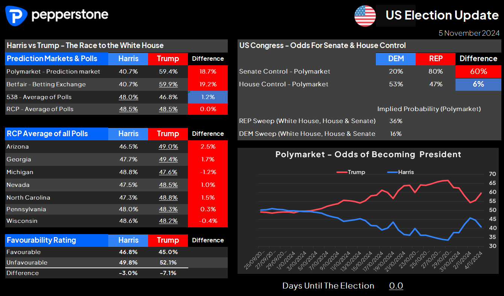

## Table of Contents

## What is Pepperstone and what services do they offer?

Pepperstone is a company that helps people trade money from different countries. They are known as a forex broker, which means they let people buy and sell currencies online. Pepperstone started in 2010 and is based in Australia. They have become popular because they offer good prices and fast trading.

Pepperstone offers many services to help people trade. They have different trading platforms, like MetaTrader 4 and MetaTrader 5, which are tools that make trading easier. They also provide educational resources, like videos and guides, to help people learn about trading. Additionally, Pepperstone offers customer support to help with any questions or problems people might have while trading.

## How can a beginner start trading with Pepperstone in 2024?

To start trading with Pepperstone in 2024, a beginner should first visit the Pepperstone website and click on the "Open Account" button. They will need to fill out a simple form with their personal details, like their name, email, and phone number. After submitting the form, they will need to verify their identity by uploading some documents, like a passport or driver's license, and a proof of address, like a utility bill. Once the account is verified, they can choose the type of trading account they want, such as a standard account or a razor account, depending on their trading needs and preferences.

After setting up their account, beginners should download and install the trading platform that Pepperstone offers, like MetaTrader 4 or MetaTrader 5. These platforms are user-friendly and come with many tools to help with trading. Before starting to trade with real money, it's a good idea to practice with a demo account. Pepperstone provides demo accounts where beginners can trade with virtual money to get a feel for the market without any risk. Once they feel ready, they can deposit money into their account using one of the many payment methods Pepperstone supports, like bank transfers or credit cards, and start trading for real.

## What are the different account types available at Pepperstone and which one suits beginners best?

Pepperstone offers several types of trading accounts to suit different needs. The main types are the Standard Account and the Razor Account. The Standard Account is good for people who are new to trading because it doesn't charge a commission on trades. Instead, the cost is included in the spread, which is the difference between the buying and selling price of a currency. This makes it easier for beginners to understand their costs. The Razor Account, on the other hand, charges a small commission per trade but offers lower spreads. This account is better for more experienced traders who trade a lot and want to save on costs.

For beginners, the Standard Account is usually the best choice. It's simpler because there are no extra commission fees to worry about. Beginners can focus on learning how to trade without getting confused by extra charges. Plus, the Standard Account comes with access to all the educational resources and customer support that Pepperstone offers, which can be really helpful for someone just starting out. Once a beginner gets more comfortable and trades more often, they might want to switch to the Razor Account to take advantage of the lower spreads and save money on their trades.

## What are the trading fees and commissions at Pepperstone in 2024?

In 2024, Pepperstone has two main types of accounts with different fees. The Standard Account does not charge a commission on trades. Instead, the cost is included in the spread, which is the difference between the buying and selling price of a currency. For example, if the spread is 1 pip, that's the cost you pay to make a trade. This makes it easier for beginners to understand their costs because they don't have to worry about extra fees.

The Razor Account, on the other hand, charges a small commission per trade but offers lower spreads. The commission is usually around $3.50 per lot for a round trip trade (that means buying and then selling). Because the spreads are lower, this account can save money for people who trade a lot. So, if you're trading more often and in larger amounts, the Razor Account might be cheaper overall, even with the commission.

## How does Pepperstone's trading platform compare to other brokers?

Pepperstone uses trading platforms like MetaTrader 4 (MT4) and MetaTrader 5 (MT5), which are very popular among traders. These platforms are easy to use and have many tools that help with trading. They let you see live prices, use different charts, and set up automatic trading with something called Expert Advisors. Compared to other brokers, Pepperstone's platforms are fast and reliable. They have low latency, which means there's less delay when you make a trade. This is important because it can help you get better prices. Other brokers might use different platforms, like cTrader or their own custom platforms, but MT4 and MT5 are well-known and trusted by many traders.

Pepperstone also offers a platform called TradingView, which is great for people who like to analyze the market before trading. TradingView has lots of charts and tools that help you understand what's happening in the market. Some other brokers might not offer TradingView, so this can be a big plus for Pepperstone. Overall, Pepperstone's platforms are user-friendly and have many features that can help both new and experienced traders. They are competitive with other brokers because they offer a good mix of speed, reliability, and useful tools.

## What are the key features of Pepperstone's mobile trading app?

Pepperstone's mobile trading app is designed to let you trade on the go. It works on both iPhones and Android phones. The app has all the important features you need to trade, like live price charts and the ability to make trades quickly. It's easy to use, so even if you're new to trading, you can figure out how to use it without much trouble. The app also lets you set up price alerts, so you get a notification if the price of a currency reaches a level you're interested in.

Another great thing about Pepperstone's mobile app is that it has tools to help you analyze the market. You can use different types of charts and indicators to understand what's happening with the prices. The app also lets you manage your trades easily, so you can change or close them whenever you need to. Plus, it's fast and reliable, which is important when you're trading because you want to make sure your trades go through quickly.

## How does Pepperstone ensure the security of client funds and data?

Pepperstone takes security very seriously to keep your money and information safe. They use strong encryption to protect your data when you're trading or using their website. This means your information is turned into a code that's hard for anyone else to read. They also follow strict rules from financial regulators, like the Australian Securities and Investments Commission (ASIC), which make sure they handle your money the right way. Your money is kept in separate bank accounts, so it's not mixed with the company's money. This helps make sure your funds are safe even if something goes wrong with Pepperstone.

Pepperstone also has other ways to keep things secure. They use two-[factor](/wiki/factor-investing) authentication, which means you need more than just a password to log in. This makes it harder for someone else to get into your account. They also watch for any strange activity on your account and have a team that works to stop fraud. If you ever have a problem, you can reach out to their customer support team, who are there to help you keep your account safe.

## What advanced trading tools does Pepperstone offer for experienced traders?

Pepperstone offers many advanced tools that can help experienced traders do better. One of these tools is called Expert Advisors, which are special programs that can trade for you automatically. They can follow rules you set up to buy or sell at the right times. Another useful tool is called Autochartist, which looks at the market and tells you when there might be good times to trade. It can find patterns in price charts that might be hard to see on your own. Pepperstone also lets you use something called hedging, where you can make trades that protect you from losing too much money if the market moves against you.

In addition to these tools, Pepperstone offers something called cTrader, which is another trading platform that many experienced traders like. cTrader has a feature called cAlgo, which lets you write your own trading programs if you know how to code. This can be really powerful because you can make the program do exactly what you want. Pepperstone also has very fast trading speeds, which is important for experienced traders who need to make quick decisions. All these tools together can help experienced traders manage their trades better and possibly make more money.

## How does Pepperstone's customer support perform, and what are the available contact methods?

Pepperstone's customer support is known for being helpful and quick to respond. They have people working all the time, so you can get help whenever you need it, day or night. The support team knows a lot about trading and can answer your questions well. Many people say they are happy with how fast and friendly the support is.

You can reach Pepperstone's customer support in different ways. You can call them on the phone, which is good if you want to talk to someone right away. They also have a live chat on their website, which is easy to use and you get answers quickly. If you prefer writing, you can send them an email, and they usually reply fast. No matter how you choose to contact them, Pepperstone's support team is there to help you with any problems or questions you have.

## What are the latest regulatory changes affecting Pepperstone in 2024?

In 2024, Pepperstone, like other brokers, has to follow new rules from the Australian Securities and Investments Commission (ASIC). These rules are meant to make trading safer for everyone. One big change is that brokers have to tell clients more about the risks of trading. They also need to check if clients really understand what they're doing before letting them trade. This is to stop people from losing a lot of money without knowing the risks.

Another change is about how brokers can use the money clients put in their accounts. Now, Pepperstone has to keep client money separate from their own money all the time. This makes sure that if something bad happens to the broker, the clients' money stays safe. These new rules help make sure that trading with Pepperstone is more secure and fair for everyone.

## How does Pepperstone's market analysis and research tools assist in trading decisions?

Pepperstone's market analysis and research tools help traders make better decisions by giving them a lot of useful information. They have something called Autochartist, which looks at the market and finds patterns that might be hard to see on your own. This tool can tell you when there might be good times to buy or sell. Pepperstone also gives you access to daily market reports and economic calendars. These reports tell you what's happening in the world that might affect the prices of currencies. By reading these, you can understand why prices are moving and make smarter trades.

Another helpful tool is Trading Central, which gives you detailed analysis and predictions about the market. It can show you where prices might go next and suggest good times to trade. Pepperstone also has a tool called SmartTrader, which lets you see what other traders are doing. This can give you ideas and help you decide if you want to do the same thing. All these tools together make it easier for you to understand the market and make better trading choices.

## What are the expert opinions and user reviews on Pepperstone's performance in 2024?

In 2024, experts and users generally have good things to say about Pepperstone. Many experts like how fast and reliable Pepperstone's trading platforms are. They say the low spreads and the choice between the Standard and Razor accounts make it a good option for both new and experienced traders. Users also like the customer support, saying it's quick and helpful. They appreciate the educational resources and the different tools Pepperstone offers to help with trading decisions.

However, some users mention that the fees can be a bit confusing at first, especially for beginners. They say it takes time to understand the difference between the Standard and Razor accounts and which one is better for them. Despite this, most users feel that Pepperstone is a trustworthy broker. They like how Pepperstone keeps their money safe and follows the new rules from regulators. Overall, the general opinion in 2024 is that Pepperstone is a solid choice for anyone looking to trade [forex](/wiki/forex-system).

## References & Further Reading

[1]: Bergstra, J., Bardenet, R., Bengio, Y., & Kégl, B. (2011). ["Algorithms for Hyper-Parameter Optimization."](https://papers.nips.cc/paper/4443-algorithms-for-hyper-parameter-optimization) Advances in Neural Information Processing Systems 24.

[2]: ["Advances in Financial Machine Learning"](https://www.amazon.com/Advances-Financial-Machine-Learning-Marcos/dp/1119482089) by Marcos Lopez de Prado

[3]: ["Evidence-Based Technical Analysis: Applying the Scientific Method and Statistical Inference to Trading Signals"](https://www.amazon.com/Evidence-Based-Technical-Analysis-Scientific-Statistical/dp/0470008741) by David Aronson

[4]: ["Machine Learning for Algorithmic Trading"](https://github.com/PacktPublishing/Machine-Learning-for-Algorithmic-Trading-Second-Edition) by Stefan Jansen

[5]: ["Quantitative Trading: How to Build Your Own Algorithmic Trading Business"](https://books.google.com/books/about/Quantitative_Trading.html?id=j70yEAAAQBAJ) by Ernest P. Chan