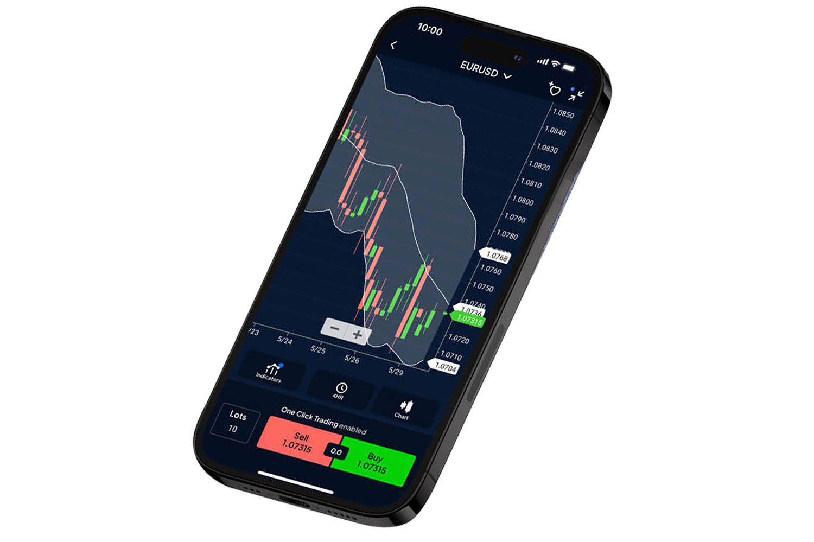

In today's fast-paced financial markets, algorithmic trading stands out as a preferred method for traders who prioritize efficiency and precision. Algorithmic trading, or algo trading, involves the use of complex algorithms and advanced software to execute trades at speeds and frequencies that would be impossible for a human trader. This technology-driven approach allows traders to exploit market conditions with accuracy and consistency, making it an attractive option for both individual and institutional investors.

Pepperstone, a prominent forex and CFD broker, has embraced the trend of automated trading by offering a suite of financial services and trading platforms designed to support algorithmic trading strategies. Established in 2010, Pepperstone has rapidly evolved into a significant player in the global trading arena, catering to the diverse needs of traders through its comprehensive range of tradable assets. As of 2024, Pepperstone provides access to a wide array of financial instruments, including forex, commodities, cryptocurrencies, ETFs, and stocks, thereby offering opportunities for diversification and risk management.



This review focuses on Pepperstone's offerings specifically tailored for 2024, with particular emphasis on its capabilities in algorithmic trading. The suitability of the broker is assessed for traders at various skill levels, from novices to experienced market participants. Critical to this evaluation is Pepperstone's integration with advanced trading platforms such as MetaTrader 4, MetaTrader 5, and cTrader. These platforms are renowned for their robust features, supporting technical analysis, automated trading, and API integration—essential elements for deploying sophisticated trading algorithms.

As we examine Pepperstone's infrastructure, attention is given to various aspects that influence trading efficiency: costs, tools, and customer support. Pepperstone is known for its competitive fee structures, designed to cater to different trading preferences. Its emphasis on transparency and customer satisfaction further enhances its reputation. Understanding these elements is crucial for traders who rely on algorithmic strategies, where even minor cost differences can impact overall profitability.

Through an exploration of these factors, this review aims to provide a comprehensive understanding of Pepperstone's role and reliability as a broker for algorithmic trading in 2024.

## Table of Contents

## Overview of Pepperstone Financial Services

Founded in 2010, Pepperstone has achieved prominence as a leading broker in the financial industry, providing its clients with an extensive selection of tradable assets. The broker offers access to over 1,200 Contracts for Difference (CFDs), covering a wide range of asset classes such as forex, commodities, cryptocurrencies, ETFs, and stocks. This broad spectrum enables traders to diversify their portfolios and implement varied trading strategies.

Pepperstone's operations are characterized by strict regulatory compliance, acquiring licenses from multiple reputable financial authorities across various jurisdictions. Such oversight ensures robust operational integrity and enhances client trust. Some of the key regulatory bodies overseeing Pepperstone include the Australian Securities and Investments Commission (ASIC) and the Financial Conduct Authority (FCA) in the United Kingdom, among others. These regulatory affiliations are crucial for ensuring the broker adheres to stringent financial practices, safeguarding client interests, and maintaining market transparency.

The hallmark of Pepperstone's services lies in its competitive fee structures. The broker implements a cost-effective model through differing account types catering to diverse trading needs. The Razor account features raw spreads coupled with a small commission per trade, ideal for traders who prefer low transaction costs. This structure is particularly appealing to high-frequency and algorithmic traders who execute a large [volume](/wiki/volume-trading-strategy) of transactions. On the other hand, the Standard account offers spread-only pricing, which simplifies cost calculations for traders preferring an all-inclusive fee.

Transparency and customer satisfaction remain core components of Pepperstone's ethos. The broker prioritizes delivering a client-centric experience through continuous service enhancement and transparency in its operations. Client feedback and regulatory developments are often integrated into service offerings, reflecting Pepperstone’s commitment to maintaining high standards of customer engagement and satisfaction.

## Trading Platforms and Technology

Pepperstone supports a variety of third-party trading platforms that are particularly popular among algorithmic traders, including MetaTrader 4 (MT4), MetaTrader 5 (MT5), and cTrader. Each of these platforms provides an array of tools tailored for technical analysis, automated trading, and API integration, facilitating the deployment of sophisticated trading algorithms.

MetaTrader 4, one of the most widely used platforms for [forex](/wiki/forex-system) trading, is known for its robust infrastructure accommodating expert advisors (EAs), which are integral for [algorithmic trading](/wiki/algorithmic-trading). The platform offers an intuitive interface where traders can develop, test, and optimize their trading strategies. Features like advanced charting capabilities and real-time market data provide analytical depth, crucial for developing nuanced trading algorithms.

MetaTrader 5 extends the functionalities of MT4, incorporating an improved order management system with more sophisticated order types. It supports stock and commodities trading alongside forex, thus offering diversified trading opportunities. MT5's MQL5 programming language enhances [backtesting](/wiki/backtesting) speed and allows traders to develop multi-threaded strategies, providing an edge in high-frequency trading scenarios. Furthermore, MT5's built-in economic calendar and advanced technical tools support traders in making informed decisions.

cTrader presents another competitive platform, favored for its direct market access (DMA) and customizable features. It stands out for its user-friendly interface and is designed to facilitate a seamless transition from manual to automated trading. The platform supports cTrader Automate, which allows for the development of trading bots using the C# programming language within a well-documented API environment. This makes it possible to tailor trading strategies with precision and test them rigorously under simulated market conditions.

The API integration capabilities of these platforms further enhance their value to algorithmic traders. By leveraging APIs, traders can implement custom algorithms, connect with external data feeds, and automate trading signals with minimal latency, a significant advantage in dynamic market conditions.

Overall, the choice between MT4, MT5, and cTrader largely depends on a trader's specific needs and trading strategy. MT4 might be preferable for those focused exclusively on forex, while MT5 offers greater flexibility across asset classes. cTrader, with its open architecture and ease of use, is often the platform of choice for traders seeking simplicity combined with advanced functionality. With these platforms, Pepperstone provides an efficient and adaptable environment for algorithmic trading, catering to both novice and experienced traders looking to leverage technology in their trading strategies.

## Algorithmic Trading with Pepperstone

Algorithmic trading, often termed as 'algo trading', promotes efficient and consistent execution of trades by automating trading strategies through pre-designed algorithms. At Pepperstone, traders can leverage sophisticated algorithmic trading tools such as cTrader Automate and MetaTrader Expert Advisors (EAs), each providing unique functionalities to enhance trading precision.

cTrader Automate, formerly known as cAlgo, is a highly versatile feature within the cTrader suite. It allows traders to develop custom robots called 'cBots' using C# programming, enabling full customization of trading strategies. The platform provides an integrated development environment (IDE) featuring robust backtesting capabilities, which help assess the viability of strategies under historical market conditions. This simulation process is crucial for optimizing algorithmic models without incurring real capital risks. For developers acquainted with object-oriented programming, cTrader Automate offers a seamless transition into algo trading by tailoring strategies to market dynamics through code snippets resembling:

```csharp
public class MyAlgo : Robot
{
    protected override void OnStart()
    {
        // Initialize your algo once the strategy starts
    }

    protected override void OnTick()
    {
        // Logic to be processed on each price change
    }

    protected override void OnStop()
    {
        // Clean up resources after the strategy stops
    }
}
```

MetaTrader, encompassing both MT4 and MT5 versions, supports Expert Advisors (EAs), which are fully automated trading robots crafted using the MQL (MetaQuotes Language). These tools are specifically developed to analyze market conditions and execute trades based on coded instructions. MetaTrader provides comprehensive charting tools, technical indicators, and the MQL editor, promoting the creation and refinement of complex trading algorithms. An essential part of algorithmic trading using MetaTrader is backtesting, performed through its Strategy Tester, allowing traders to validate strategies over historical data. The pseudo code for an EA might look like:

```cpp
int start()
{
    // Check for a buy signal
    if (ConditionForBuy())
    {
        // Open buy order
        OrderSend(...);
    }

    // Check for a sell signal
    if (ConditionForSell())
    {
        // Open sell order
        OrderSend(...);
    }
    return 0;
}
```

The flexibility of both cTrader Automate and MetaTrader EAs allows traders at Pepperstone to not only automate existing strategies but also to innovate and test new ones, enriching their trading arsenal without the need for constant monitoring. Users can enhance their strategies through parameter optimization and efficient risk management modules embedded within these platforms, thus aligning their trading objectives with their risk appetite effectively. These alternatives offered by Pepperstone equip traders with the necessary tools to navigate the complexities of modern markets by efficiently leveraging technology to gain a competitive advantage.

## Costs and Fees

Pepperstone provides traders with competitive pricing structures through its Razor and Standard accounts, accommodating different trading strategies and preferences. The Razor account is tailored for algorithmic traders, offering raw spreads, which are effectively the market spreads, with a small commission charged per trade. This account type is designed to provide the tightest spreads possible, which can be advantageous for high-frequency and algorithmic traders who require precision and low trading costs.

For forex pairs, Pepperstone's Razor account typically charges a commission of a few dollars per standard lot traded, in addition to the raw spreads. This structure allows traders to better anticipate their trading costs, which is critical for those employing algorithmic strategies where small differences in costs can significantly impact overall profitability.

Additionally, Pepperstone features an Active Trader program that benefits high-volume traders. This program offers rebates and reduced trading costs based on the trading volume achieved by the trader over a specific period. Rebates can help mitigate trading costs further, enhancing the overall cost-efficiency of executing a large number of trades.

For traders who prefer a more straightforward pricing model without additional commissions, the Standard account may be a more suitable option. This account type includes all trading costs within the spread, making it simpler for traders to manage their expenses.

Overall, Pepperstone's diverse account offerings and targeted programs align well with the needs of both casual and seasoned traders, especially those engaged in high-frequency and algorithmic trading, by providing cost-effective trading solutions.

## Customer Support and Education

Pepperstone, a prominent player in the online trading ecosystem, understands the critical role of customer support and education in enhancing the trading experience. The brokerage provides 24/5 live customer support to address and resolve traders' inquiries and issues promptly. This accessibility ensures that traders can seek assistance during the majority of the trading week, aligning with global financial markets' active hours.

In addition to responsive customer service, Pepperstone invests significantly in trader education. The company offers a variety of educational resources designed to empower both novice and advanced traders. These resources include webinars, articles, video tutorials, and comprehensive guides on various trading topics. Webinars hosted by industry experts provide insights into market trends and trading strategies, which can be particularly beneficial for those looking to expand their knowledge base.

Pepperstone’s commitment to supporting advanced traders is evident through its specialized resources on algorithmic trading. For traders interested in deploying algo trading strategies, the broker provides extensive information on platforms like MetaTrader and cTrader. Resources focus on the development and testing of trading algorithms, highlighting the flexibility and customization options these platforms offer. By offering a robust suite of educational tools, Pepperstone aids traders in honing their skills and optimizing their trading approaches, particularly in algorithmic trading environments.

## Pros and Cons of Trading with Pepperstone

Pepperstone, as a prominent broker in the field of algorithmic trading, offers several advantages that attract both novice and experienced traders. One significant benefit is the wide array of tradable assets available. With access to over 1,200 different CFDs, traders can diversify their portfolios by investing in forex, commodities, cryptocurrencies, ETFs, and stocks. This diversity enables traders to implement various trading strategies and mitigate risks by spreading investments across multiple asset classes.

The robust trading platforms supported by Pepperstone, such as MetaTrader 4, MetaTrader 5, and cTrader, further enhance the trading experience. These platforms are known for their advanced technological capabilities, including comprehensive tools for technical analysis, automated trading solutions, and seamless API integration. Such features empower traders to deploy sophisticated algorithmic systems, enabling precision and efficiency in trading operations.

Pepperstone is also well-regulated, with licenses from reputable financial authorities across several jurisdictions. This strong regulatory oversight ensures a high level of security and transparency, which is crucial for maintaining trader confidence. Regulation helps mitigate risks associated with financial malpractice and provides a layer of protection for traders' investments.

However, there are a few drawbacks to consider when trading with Pepperstone. One such limitation is the somewhat restricted range of non-CFD options, which might not appeal to traders interested in broader financial instruments outside CFDs. Additionally, Pepperstone is not available to residents of the United States, which limits its accessibility for a significant portion of potential users.

Despite these limitations, Pepperstone remains a compelling option for algorithmic traders. Its focus on technology-driven solutions provides a competitive trading environment, allowing users to take full advantage of automated trading strategies. The combination of diverse assets, cutting-edge platforms, and robust regulatory compliance makes Pepperstone a strong choice for traders worldwide, especially those focused on algorithmic trading.

## Conclusion

In 2024, Pepperstone has solidified its position as a prominent broker for algorithmic trading, distinguished by its advanced trading platforms and enriched trading environment. Traders seeking to automate their strategies will discover that Pepperstone offers a comprehensive and user-friendly suite of tools, seamlessly integrating with popular platforms such as MetaTrader and cTrader. This enables both novice and experienced traders to efficiently deploy, customize, and test their algorithmic trading strategies.

Despite certain limitations, Pepperstone provides significant advantages, including competitive pricing, a diverse range of assets, and robust regulatory oversight. These features contribute to a well-rounded offering that can accommodate the needs of traders worldwide. The broker's commitment to technology-driven services and transparency further reinforces its appeal to those engaged in algorithmic trading.

Overall, Pepperstone's combination of advanced technology, customer-focused services, and a supportive trading ecosystem positions it as a compelling choice for traders globally, notably those with a keen interest in algorithmic trading. This makes Pepperstone not only a powerful ally for current algo traders but also a beneficial entry point for those looking to explore automated trading strategies.

## References & Further Reading

[1]: Bergstra, J., Bardenet, R., Bengio, Y., & Kégl, B. (2011). ["Algorithms for Hyper-Parameter Optimization."](https://papers.nips.cc/paper/4443-algorithms-for-hyper-parameter-optimization) Advances in Neural Information Processing Systems 24.

[2]: ["Advances in Financial Machine Learning"](https://www.amazon.com/Advances-Financial-Machine-Learning-Marcos/dp/1119482089) by Marcos Lopez de Prado

[3]: ["Evidence-Based Technical Analysis: Applying the Scientific Method and Statistical Inference to Trading Signals"](https://www.amazon.com/Evidence-Based-Technical-Analysis-Scientific-Statistical/dp/0470008741) by David Aronson

[4]: ["Machine Learning for Algorithmic Trading"](https://github.com/PacktPublishing/Machine-Learning-for-Algorithmic-Trading-Second-Edition) by Stefan Jansen

[5]: ["Quantitative Trading: How to Build Your Own Algorithmic Trading Business"](https://books.google.com/books/about/Quantitative_Trading.html?id=j70yEAAAQBAJ) by Ernest P. Chan