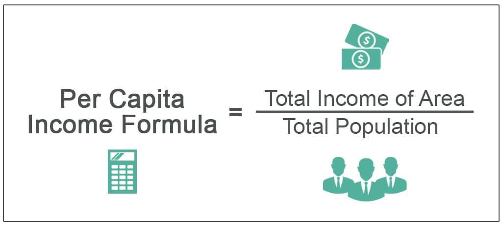

## Table of Contents

## What is per capita income?

Per capita income is the average amount of money each person in a country makes in a year. It is calculated by taking the total income of a country and dividing it by the total number of people living there. This number helps us understand how well-off people in a country are on average.

However, per capita income doesn't tell the whole story. It is just an average, so it doesn't show how income is spread out among people. In some countries, a few people might be very rich while many others are poor. So, even if the per capita income is high, it doesn't mean everyone in the country is doing well.

## How is per capita income calculated?

Per capita income is calculated by taking the total income of a country and dividing it by the total number of people living there. The total income includes all the money earned by everyone in the country, from wages and salaries to profits from businesses and investments. The total number of people is usually the population of the country at the midpoint of the year.

This calculation gives us an average amount of money each person in the country makes in a year. For example, if a country has a total income of $100 million and a population of 10 million people, the per capita income would be $100 million divided by 10 million, which equals $10 per person. It's a simple way to understand the economic well-being of a country's residents on average.

## Why is per capita income important?

Per capita income is important because it helps us understand how well people in a country are doing financially. It gives us a simple number that shows the average income of each person in the country. This number can be used to compare how rich or poor different countries are. For example, if one country has a higher per capita income than another, it usually means that people in the first country have more money to spend on things they need and want.

However, per capita income is just an average, so it doesn't tell the whole story. It doesn't show if the money is shared equally among everyone in the country. In some places, a few people might have a lot of money while many others have very little. So, even if a country has a high per capita income, it doesn't mean everyone there is rich. But knowing the per capita income still helps us get a basic idea of a country's economic health.

## What are the common uses of per capita income in economic analysis?

Per capita income is often used by economists to compare the wealth of different countries. By looking at the average income per person, they can see which countries are richer or poorer. This helps them understand global economic trends and how living standards vary around the world. For example, if one country has a much higher per capita income than another, it suggests that people in the first country generally have more money to spend on things like food, housing, and healthcare.

Another use of per capita income is to track changes in a country's economy over time. Economists can look at how per capita income changes from year to year to see if the country is getting richer or poorer. This can help them figure out if their economic policies are working or if they need to make changes. For instance, if per capita income is going up, it might mean that people are earning more money and the economy is growing.

However, per capita income is just one piece of the puzzle. It doesn't show how evenly money is spread out among people in a country. So, economists also use other measures, like the Gini coefficient, to get a fuller picture of a country's economic situation. By combining per capita income with these other measures, they can better understand both the average wealth and the level of inequality in a country.

## Can per capita income be used to compare the standard of living between countries?

Per capita income can be used to compare the standard of living between countries. It shows the average amount of money each person makes in a year. If one country has a higher per capita income than another, it usually means that people in the first country have more money to spend on things they need and want, like food, housing, and healthcare. So, a higher per capita income often means a higher standard of living.

However, per capita income is just an average, so it doesn't tell the whole story. It doesn't show if the money is shared equally among everyone in the country. In some places, a few people might have a lot of money while many others have very little. So, even if a country has a high per capita income, it doesn't mean everyone there has a high standard of living. To get a better picture, economists also look at other measures, like how evenly money is spread out in a country, to see the true standard of living.

## What are the limitations of using per capita income as a measure of economic well-being?

Per capita income is just an average, so it doesn't show how money is spread out among people in a country. In some places, a few people might be very rich while many others are poor. So, even if a country has a high per capita income, it doesn't mean everyone there is doing well. This means that per capita income alone can't tell us the true economic well-being of all the people in a country.

Another problem is that per capita income doesn't take into account the cost of living, which can be very different from one country to another. For example, $10,000 might go a long way in a country where things are cheap, but it might not be enough in a place where everything is expensive. So, comparing per capita income between countries can be misleading if we don't also look at the cost of living.

Also, per capita income doesn't include things that affect people's quality of life, like access to good healthcare, education, and a clean environment. These things are important for economic well-being, but they don't show up in the per capita income number. So, while per capita income can give us a basic idea of how well people are doing, it's not enough to fully understand their economic well-being.

## How does per capita income differ from median income, and why does this matter?

Per capita income and median income are two different ways to measure how much money people in a country make. Per capita income is the total income of a country divided by the number of people living there. It gives us an average amount of money each person makes in a year. On the other hand, median income is the income of the person who is right in the middle when you line up everyone's income from lowest to highest. Half the people make more than the median income, and half make less.

The difference between per capita income and median income matters because they can tell us different things about a country's economy. Per capita income can be pulled up by a few very rich people, even if most people in the country don't make much money. This means that a high per capita income might not mean everyone is doing well. Median income, however, gives us a better idea of what a typical person earns, because it's not affected by the very rich or the very poor. So, if you want to understand how most people are doing financially, median income is a better measure.

## What impact does income inequality have on the interpretation of per capita income?

Income inequality can make per capita income misleading. Per capita income is just an average, so it doesn't show how money is spread out among people in a country. If a few people are very rich and most people are poor, the average can be high even though most people don't have much money. This means that a high per capita income might not mean everyone in the country is doing well. It's like saying the average temperature in a room is warm, but some people might still be cold if the heat is not spread out evenly.

Because of this, when we look at per capita income, we also need to think about how equal or unequal the income is. If income inequality is high, the per capita income might not give a true picture of how most people are living. For example, if a country has a few billionaires and many people living in poverty, the per capita income might look good, but it won't show that many people are struggling. So, to really understand how well people in a country are doing, we need to look at both per capita income and how evenly the money is shared among everyone.

## How can per capita income be misleading in countries with significant non-monetary economies?

Per capita income can be misleading in countries with big non-monetary economies because it only counts money that people earn. In some places, people might not use money a lot. They might trade things like food or help each other out without using money. So, even if people in these countries are doing okay because they have what they need, their per capita income might look low because it doesn't count the value of these non-money trades.

This means that per capita income might make it seem like people in these countries are poorer than they really are. For example, if a farmer grows food and shares it with their neighbors instead of selling it, this doesn't show up in the per capita income. But the farmer and their neighbors still have food to eat. So, to really understand how well people are doing in countries with big non-monetary economies, we need to look at more than just per capita income.

## What are some real-world examples of how per capita income has been used to guide policy decisions?

In India, the government has used per capita income to help decide where to focus their efforts to reduce poverty. They look at per capita income in different areas of the country to see which places are doing worse than others. If an area has a very low per capita income, the government might decide to spend more money there on things like building schools, improving roads, and helping people start businesses. This way, they hope to raise the per capita income and help more people get out of poverty.

In the United States, per capita income is used to help decide how much money different states get from the federal government. States with lower per capita incomes might get more money to help them improve their economies. For example, if a state has a low per capita income, the federal government might give them money to build new factories or help people find jobs. This is meant to help raise the per capita income in those states and make life better for the people living there.

## How do adjustments for purchasing power parity affect the interpretation of per capita income across countries?

When we compare per capita income across countries, we need to think about something called purchasing power parity (PPP). This means how much money people can actually buy with their income in their own country. Without adjusting for PPP, comparing per capita income can be misleading. For example, if one country has a high per capita income but everything there is very expensive, people might not be able to buy as much as people in another country with a lower per capita income where things are cheaper.

Adjusting for PPP helps us get a better idea of how well people in different countries can live. It takes into account the different costs of living in each country. So, if we adjust the per capita income for PPP, we can see that a country with a lower per capita income might actually have a higher standard of living if things there are less expensive. This way, we can compare the real value of money across countries more fairly and understand better how people are doing in different places.

## What advanced statistical methods can be used to refine the analysis of per capita income data?

To get a better understanding of per capita income, economists can use a method called regression analysis. This helps them see how different things, like education or the number of jobs, affect per capita income. By looking at these relationships, they can figure out what might help raise or lower per capita income in a country. For example, if they find that more education leads to higher per capita income, they might suggest that the government should spend more money on schools.

Another useful method is time series analysis. This lets economists look at how per capita income changes over time. They can see if it's going up or down and try to understand why. For instance, if per capita income is growing slowly, they might look at what's happening in the economy, like if there are fewer jobs or if prices are going up. By using time series analysis, they can make better guesses about what might happen to per capita income in the future and help plan for it.

## What is Understanding Income Analysis?

Income analysis is an essential process in evaluating the economic stability and growth potential of a nation or region. By examining various income data, policymakers and economists can gauge the health of an economy and identify potential areas for improvement. Different income types and their related metrics play crucial roles in economic measurement, with Gross Domestic Product (GDP), Gross National Income (GNI), and per capita income being among the most significant.

Gross Domestic Product (GDP) is one of the primary indicators used to assess the economic performance of a country. It represents the total monetary value of all goods and services produced within a country's borders in a specific period. Calculating GDP involves summing consumption, investment, government spending, and net exports (i.e., exports minus imports):

$$
\text{GDP} = C + I + G + (X - M)
$$

where $C$ is consumption, $I$ is investment, $G$ is government spending, $X$ is exports, and $M$ is imports. GDP is a crucial metric as it provides insights into the economic activity and growth of a country.

Gross National Income (GNI) extends the concept of GDP by including the net income from abroad, thus providing a broader picture of a nation's income. GNI includes all income from residents and businesses, whether inside or outside the country. The formula for calculating GNI is:

$$
\text{GNI} = \text{GDP} + \text{Net Income from Abroad}
$$

GNI is important for understanding the total wealth generated by a nation's resources and citizens, which can be more indicative of financial well-being than GDP alone.

Per capita income is another critical measure, representing the average income earned per person in a specific area. It is calculated by dividing the total national income (such as GDP or GNI) by the population. Per capita income provides a sense of the economic prosperity experienced by residents and is often used to compare living standards across different regions or countries.

Although these metrics are highly valuable, they each have unique strengths and weaknesses in capturing economic reality. For instance, while GDP provides a snapshot of economic production and activity, it does not necessarily reflect the income distribution across the population. Conversely, per capita income can offer insights into average living standards but may not accurately represent income inequality within a society.

Together, these income metrics provide a comprehensive view of economic health. By analyzing GDP, GNI, and per capita income, economists can better understand the current economic environment and make informed decisions to promote stability and growth. Understanding these metrics is crucial for designing effective economic policies and strategies.

## What is Per Capita Income as an Economic Measure?

Per capita income is a statistical measure that reflects the average income earned by each individual in a specific geographical region, such as a country, city, or district. It is a key indicator used to assess the standard of living and economic health of populations. The calculation of per capita income involves dividing the total income of a region by its population size, expressed in a formula as:

$$

\text{Per Capita Income} = \frac{\text{Total Income of a Region}}{\text{Population of the Region}} 
$$

This measure serves as a useful benchmark for comparing the economic prosperity of different areas. A higher per capita income generally suggests a higher standard of living and a more economically prosperous society. This metric is especially valuable for policy makers and economists when assessing economic growth and development over time.

Per capita income is instrumental in evaluating living standards as it provides a snapshot of economic affluence for individuals within a region. It is often utilized to compare the wealth of nations, aiding in identifying disparities across countries or regions. When examining global comparisons, it can highlight inequities in income distribution, bringing attention to areas that may require economic intervention or aid.

Despite its widespread use, per capita income also faces certain limitations. It oversimplifies complex economic realities by averaging income without accounting for variations in income distribution among the populace. Consequently, it does not address issues related to income inequality. A high per capita income may mask underlying income disparities where wealth is concentrated within a small segment of the population, leaving a significant portion living in poverty.

Moreover, per capita income does not adjust for inflation or differences in purchasing power across regions. Consequently, while it may indicate nominal income levels, it fails to provide a real measure of economic well-being when prices vary significantly between regions. Complementary metrics such as the Gini coefficient, which measures income inequality, and the Human Development Index (HDI), which incorporates factors like life expectancy and education, are often employed alongside per capita income to provide a more comprehensive economic analysis.

In global economic assessments, per capita income continues to be a pivotal measure, balancing its straightforwardness with its limitations to offer insights into the economic stature and potential of various populations.

## What is the interplay between economic metrics and trading algorithms?

The interaction between economic metrics and trading algorithms is integral to the functionality of modern financial markets. Understanding this relationship is essential for developing trading strategies that can adapt to changing economic circumstances. Economic metrics like Gross Domestic Product (GDP), inflation rates, and unemployment figures are critical inputs in algorithmic trading models, affecting buy and sell decisions, risk management, and strategic asset allocations.

A primary case study illustrating this relationship involves the use of GDP growth rates in predictive trading models. For instance, when a country's GDP growth exceeds expectations, it can signal a stronger economy, potentially leading to a bullish market reaction wherein algorithmic trading systems may increase equity exposure. Conversely, lower-than-expected GDP growth might trigger algorithms to reduce holdings in anticipation of a market downturn. The mathematical representations of these algorithms might take GDP figures as inputs and adjust portfolio allocations using functions that account for variance and expected returns. A simple model could use a regression analysis framework, defined as:

$$
\text{Expected Return} = \alpha + \beta \times \text{GDP Growth}
$$

where $\alpha$ represents the intercept, and $\beta$ the sensitivity of returns to GDP changes.

Inflation metrics also have significant implications for trading algorithms. For example, a sudden increase in the Consumer Price Index (CPI) might lead algorithms to reallocate assets from bonds to equities, as higher inflation could erode bond yields. This necessitates real-time data processing capabilities and dynamic algorithm adjustments. Signal-processing techniques in trading algorithms can be deployed using Python to perform this task. A Python snippet for adaptive moving average adjustments could look like:

```python
import pandas as pd

def adjust_algorithm(prices, inflation_rate):
    window = max(10, int(100 / inflation_rate))  # Dynamic window based on inflation
    return prices.rolling(window).mean()

prices_df = pd.DataFrame({'prices': [...]})  # Load price data
inflation_rate = 2.5  # Example inflation rate
adjusted_prices = adjust_algorithm(prices_df['prices'], inflation_rate)
```

Trading algorithms must also dynamically adjust to unexpected economic reports or indicators, such as sudden unemployment rate changes due to unforeseen economic shocks. Algorithms should be capable of rapid recalibration in response to new data, often employing [machine learning](/wiki/machine-learning) techniques to improve forecast accuracy and response speed. For instance, using [reinforcement learning](/wiki/reinforcement-learning) models, algorithms can fine-tune trading strategies based on previous economic releases and market behaviors to enhance performance.

The multifaceted interaction between economic metrics and algorithmic trading necessitates robust data analytics and model validation processes. By continuously refining how economic data is interpreted and utilized, traders can achieve a significant edge in market forecasting and strategy optimization.

## References & Further Reading

[1]: ["Income Method vs. Expenditure Method: An Example for GDP."](https://www.investopedia.com/terms/e/expenditure-method.asp) Investopedia.

[2]: Malkiel, B. G., & Fama, E. F. (1970). ["Efficient Capital Markets: A Review of Theory and Empirical Work."](https://onlinelibrary.wiley.com/doi/abs/10.1111/j.1540-6261.1970.tb00518.x) Journal of Finance, 25(2), 383-417.

[3]: Benninga, S. (2014). ["Financial Modeling (4th Edition)."](https://mitpress.mit.edu/9780262027281/financial-modeling/) MIT Press.

[4]: ["Advanced Fixed Income Analysis"](https://www.fitchlearning.com/advanced-fixed-income-analysis-virtual) by Moorad Choudhry

[5]: Piketty, T. (2014). ["Capital in the Twenty-First Century."](https://www.jstor.org/stable/j.ctt6wpqbc) Harvard University Press.