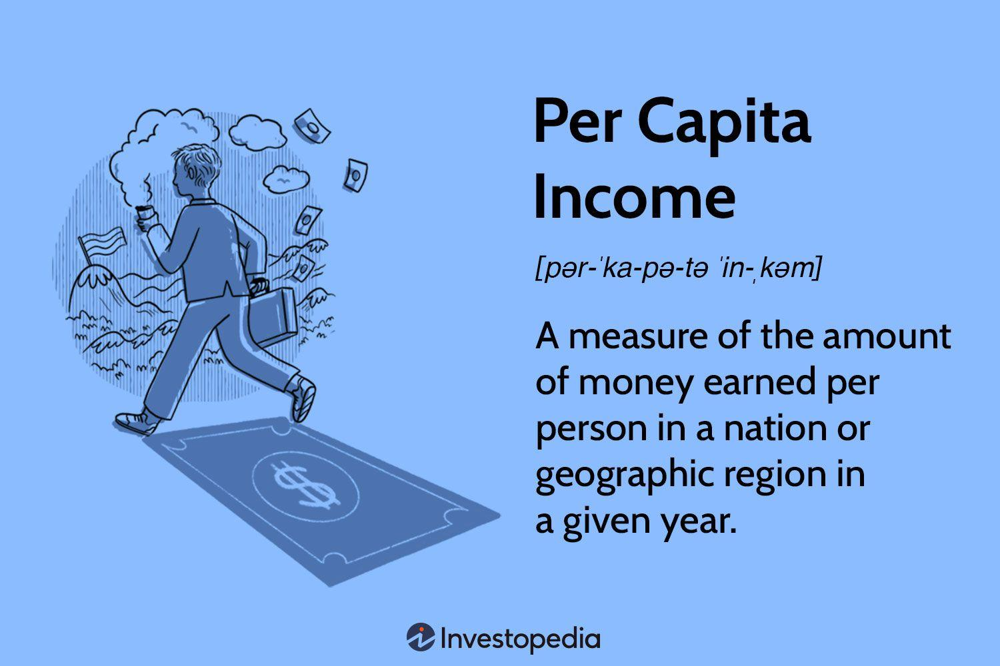

## Table of Contents

## What is the basic definition of per capita?

Per capita is a term that means "per person." It is used to show how much of something there is for each individual in a group, like a country or a city. For example, if you want to know how much money people in a country make on average, you can look at the per capita income. This helps to understand the economic situation of individuals within that group.

When people talk about per capita, they often use it to compare different places or groups. For instance, comparing the per capita income of two countries can show which country's people, on average, earn more money. It's a useful way to measure and compare things like income, consumption, or even the number of doctors in different areas. By using per capita figures, we get a clearer picture of what life is like for the average person in different places.

## How is per capita calculated?

To calculate something per capita, you take the total amount of whatever you're measuring and divide it by the number of people in the group. For example, if you want to find out the per capita income of a country, you add up all the income earned by everyone in that country and then divide it by the total number of people living there. This gives you an average amount of income per person.

Per capita calculations are useful because they help us understand how things are spread out among people. If you're looking at the number of cars per capita in a city, you count all the cars and divide by the city's population. This tells you, on average, how many cars there are for each person. It's a simple way to compare different places or see how resources are distributed.

## What are some common uses of per capita data?

Per capita data is often used to compare how well different countries or areas are doing. For example, economists look at per capita income to see which countries have more money for each person on average. This helps them understand if a country is rich or poor compared to others. Governments also use per capita data to plan things like schools and hospitals. If they know how many people there are per doctor, they can decide if they need to train more doctors.

Another common use of per capita data is to measure things like pollution or resource use. For instance, scientists might look at carbon emissions per capita to see which countries produce more pollution per person. This can help in making environmental policies. Also, businesses use per capita data to understand their markets better. If a company knows how many people in an area use their product, they can plan their sales and marketing strategies more effectively.

## Can you provide examples of per capita in different contexts?

In the context of income, per capita income is a common measure used to understand the average earnings of people in a country or region. For example, if a country has a total income of $100 billion and a population of 50 million, the per capita income would be $2,000. This means, on average, each person in that country earns $2,000. This number helps compare how well people are doing financially in different places. For instance, if another country has a per capita income of $5,000, you can see that, on average, people in that country earn more than in the first country.

In the context of healthcare, per capita data can show how many doctors are available for each person in a region. If a city has 1,000 doctors and a population of 500,000, the per capita number of doctors would be 1 doctor for every 500 people. This information helps governments decide if they need to train more doctors or if the current number is enough. It also helps people understand how easy or hard it might be to see a doctor in that area.

In the context of environmental impact, per capita data can be used to measure carbon emissions. If a country emits 500 million tons of carbon dioxide a year and has a population of 25 million, the per capita carbon emission would be 20 tons per person. This helps in comparing the environmental impact of different countries. If another country has per capita emissions of 10 tons, it shows that, on average, people in the first country contribute more to carbon emissions than in the second country.

## How does per capita income differ from average income?

Per capita income and average income are similar but not exactly the same. Per capita income is the total income of a country or area divided by the number of people living there. It gives you an idea of how much money each person would get if the total income was shared equally among everyone. This is useful for comparing different places or seeing how well people are doing overall.

Average income, on the other hand, can be a bit different because it depends on how you define "average." Usually, average income is calculated by adding up the incomes of all the people in a group and then dividing by the number of people. But sometimes, average income might only include people who are working or [earning](/wiki/earning-announcement) money, leaving out children or people who are not working. This can make the average income higher than the per capita income because it doesn't include everyone in the population.

## What are the limitations of using per capita measurements?

One limitation of using per capita measurements is that they can hide big differences between people. For example, if a country has a high per capita income, it might seem like everyone is doing well. But in reality, a few very rich people might be making most of the money, while many others are poor. So, per capita income can make a country look richer than it really is for most people.

Another problem with per capita data is that it doesn't tell us about how things are spread out. For instance, if you look at the number of doctors per capita in a country, it might seem like there are enough doctors. But if most of those doctors work in big cities, people in rural areas might still have a hard time getting medical help. So, per capita numbers can sometimes give a false sense of how evenly resources are shared.

## How does per capita GDP reflect the economic status of a country?

Per capita GDP, or Gross Domestic Product per person, is a way to measure how much money a country makes for each person living there. It helps show if a country is rich or poor compared to others. To find per capita GDP, you take the total GDP of a country and divide it by the number of people living there. If a country has a high per capita GDP, it means that, on average, each person in that country has more money to spend or save. This can make the country seem wealthier overall.

But per capita GDP doesn't tell the whole story. It can hide big differences between people. For example, a country might have a high per capita GDP because a few very rich people make a lot of money, while many others are poor. This means that even though the per capita GDP is high, many people in the country might not feel rich at all. Also, per capita GDP doesn't show how money is spent or if people are happy with their lives. It's just one way to look at a country's economic status, but it's important to look at other things too.

## What role does per capita play in demographic studies?

In demographic studies, per capita measures help researchers understand how different things are spread out among people. For example, demographers might look at the number of cars per capita to see how many cars there are for each person in different areas. This can show how people move around and use transportation. They might also look at the number of people per household to understand family sizes and living situations. These per capita numbers help demographers compare different places and see how populations are growing or changing.

Another important use of per capita in demographic studies is to look at things like income or healthcare. For instance, demographers might study per capita income to see how well people are doing financially in different regions. This helps them understand if there are big differences between rich and poor areas. They might also look at the number of doctors per capita to see how easy it is for people to get medical care. By using per capita data, demographers can get a clearer picture of how resources and services are shared among people in different parts of the world.

## How can per capita statistics be misleading and why?

Per capita [statistics](/wiki/bayesian-statistics) can be misleading because they show an average, which can hide big differences between people. For example, if you look at per capita income, it might seem like everyone in a country is doing well if the number is high. But in reality, a few very rich people might be making most of the money, while many others are poor. So, the per capita number can make the country look richer than it really is for most people.

Another way per capita statistics can be misleading is that they don't show how things are spread out. For instance, if you look at the number of doctors per capita in a country, it might seem like there are enough doctors. But if most of those doctors work in big cities, people in rural areas might still have a hard time getting medical help. So, per capita numbers can sometimes give a false sense of how evenly resources are shared.

## What advanced methods can be used to adjust per capita figures for more accurate analysis?

One advanced method to adjust per capita figures for more accurate analysis is to use something called "purchasing power parity" or PPP. This method looks at how much things cost in different places. For example, if a burger costs $5 in one country but only $2 in another, PPP helps to make these prices equal so we can compare them fairly. When we use PPP to adjust per capita income, we get a better idea of how much money people can actually spend in their own country. This helps us see if people in different places are really better or worse off than just looking at the raw numbers.

Another method is to use something called "inequality-adjusted" measures. These measures take into account how money or resources are spread out among people. For example, if a country has a high per capita income but most of the money is with just a few people, an inequality-adjusted measure would show this. It would give a lower number to show that not everyone is doing as well as the raw per capita number suggests. This helps us understand the real situation better and see if there are big gaps between rich and poor people in a country.

## How do international organizations like the World Bank use per capita data in their reports?

International organizations like the World Bank use per capita data to understand and compare the economic situations of different countries. They look at things like per capita income to see how much money people in each country have on average. This helps them decide where to focus their efforts and how to help countries that need it the most. For example, if a country has a very low per capita income, the World Bank might give that country more financial help or suggest ways to improve their economy.

The World Bank also uses per capita data to track progress and set goals. They might look at per capita GDP to see if a country is getting richer over time. This information is important for their reports because it shows how well their programs are working. By using per capita numbers, the World Bank can make sure they are helping countries in the best way possible and making a real difference in people's lives.

## What are the future trends in the application of per capita metrics in global economic analysis?

In the future, per capita metrics will play an even bigger role in global economic analysis because they help us understand how well people are doing in different countries. As the world gets more connected, it's important to compare places fairly. One trend we might see is more use of purchasing power parity (PPP) to adjust per capita numbers. This makes it easier to compare how much money people can actually spend in their own countries. For example, if a dollar buys more in one country than another, PPP helps show that difference. This way, we can get a clearer picture of how rich or poor people really are, not just how much money they have.

Another trend could be the use of more detailed data to look at things like income inequality. Instead of just looking at the average per capita income, future analyses might focus more on how money is spread out among people. This means using inequality-adjusted measures to see if a few people have most of the money while others are poor. By doing this, global economic reports will give a better idea of what life is really like for people in different places. This can help international organizations decide where to help and how to make the world a fairer place for everyone.

## What is Understanding Per Capita Economic Measurement?

Per capita economic measurement serves as a critical tool for assessing the economic performance of a population by providing an average economic output or income per person. This granular insight allows for straightforward comparisons across different regions by normalizing key economic indicators concerning population size. 

Common per capita metrics, such as Gross Domestic Product (GDP) per capita and income per capita, form the backbone of these analyses. GDP per capita is often calculated by dividing a country's gross domestic product by its total population. The formula for GDP per capita can be expressed as follows:

$$
\text{GDP per capita} = \frac{\text{Gross Domestic Product}}{\text{Population}}
$$

This measure offers a snapshot of a country's economic productivity relative to its population size, providing an easily interpretable economic gauge that facilitates comparisons of economic health and living standards across various countries or regions. Similarly, income per capita is calculated by dividing the total national income by the population, offering insights into the average income of a citizen in a specific region.

Understanding how these figures are determined is essential for economic analysis. GDP per capita is derived from the sum of consumer spending, investment, government spending, and net exports, adjusted for population size differences. These measures often appear in economic reports as indicators of welfare, reflecting the average standard of living and economic prosperity in different locales. However, it’s important to note that GDP per capita does not necessarily reflect income distribution or inequality within a region.

Despite their utility, per capita measures are not without challenges and limitations. One significant issue is the impact of outliers, such as extremely high incomes skewing the average and painting an unrealistically positive picture of economic welfare. Moreover, population dynamics can affect per capita figures considerably; for instance, rapid population growth without equivalent economic expansion can lead to a decrease in GDP per capita, depicting slower economic progress than might be occurring.

Another limitation lies in potential data inaccuracies due to informal economies or unreported income, which can result in skewed representations of actual economic performance. Additionally, per capita measures often fail to account for disparities within a population, such as regional economic differences or demographic variations among age and societal groups, which can lead to incomplete analyses of economic health.

In summary, while per capita economic measurement provides valuable tools for standardizing economic data across populations, careful consideration must be given to the metrics' limitations and potential biases. Understanding these nuances is crucial for analysts, policymakers, and investors seeking to derive meaningful insights from economic data.

## What is an Overview of Algorithmic Trading?

Algorithmic trading is a method of executing orders using automated pre-programmed trading instructions. This approach allows for high-speed trading, minimizing human intervention and enabling transactions to be completed more efficiently. Trading strategies implemented through algorithms include [trend following](/wiki/trend-following), mean reversion, statistical [arbitrage](/wiki/arbitrage), and sentiment analysis. Each strategy targets different market inefficiencies or price patterns to capitalize on potential trading opportunities.

Trend following is a strategy that assumes securities which have been rising will continue to increase in value, and those which have been falling will continue to drop. This method often uses moving averages or other [momentum](/wiki/momentum) indicators to generate buy or sell signals. Mean reversion focuses on the tendency of a stock's price to return to an average level over time. It identifies overbought or oversold conditions, assuming they will revert to their mean. Statistical arbitrage utilizes statistical and econometric techniques to profit from pricing inefficiencies between related financial instruments. This strategy requires sophisticated models to detect price patterns and execute trades before the market corrects itself. Sentiment analysis, a more contemporary strategy, processes unstructured text data from news articles, social media, and other sources to gauge public sentiment and its likely impact on security prices.

The benefits of [algorithmic trading](/wiki/algorithmic-trading) include efficiency, speed, and enhanced risk management. By automating the trading process, algorithms can execute trades in fractions of a second, allowing traders to capture fleeting market opportunities that are impossible with manual trading. This speed also reduces the market impact of larger trades, minimizing the cost of execution. Furthermore, algorithmic trading can improve risk management by enforcing consistent strategies and removing emotion from trading decisions.

Assessing the performance of algorithmic trading involves several key metrics. The Sharpe Ratio is one such measure, providing a risk-adjusted return metric by comparing the difference between the portfolio return and the risk-free rate relative to the portfolio's standard deviation of return. Mathematically, it is expressed as:

$$
\text{Sharpe Ratio} = \frac{R_p - R_f}{\sigma_p}
$$

where $R_p$ is the portfolio return, $R_f$ is the risk-free rate, and $\sigma_p$ is the standard deviation of the portfolio return. Another critical metric is the maximum drawdown, which quantifies the largest peak-to-trough decline in the value of a portfolio, indicative of the investment risk during a specific period.

However, algorithmic trading also presents challenges. Transaction costs can erode profit margins, particularly in high-frequency trading scenarios where a large [volume](/wiki/volume-trading-strategy) of trades is executed. Market conditions can also impact strategy effectiveness; for example, a strategy that performs well in trending markets may not succeed in sideways or volatile markets. Successful algorithmic trading requires robust [backtesting](/wiki/backtesting) to ensure strategies are resilient across various market conditions and periods. Additionally, the reliance on technology introduces risks such as system failures and algorithmic errors, necessitating regular monitoring and updates. 

Algorithmic trading continues to evolve with advancements in data science and [machine learning](/wiki/machine-learning), offering sophisticated tools for market analysis and execution strategies. However, traders must remain vigilant to the intricacies of underlying algorithms and market dynamics to leverage their potential effectively.

## References & Further Reading

[1]: Hendershott, T. (2011). ["Does Algorithmic Trading Improve Liquidity?"](https://onlinelibrary.wiley.com/doi/full/10.1111/j.1540-6261.2010.01624.x) The Journal of Finance, 66(1), 1-33.

[2]: Lopez de Prado, M. (2018). ["Advances in Financial Machine Learning"](https://www.amazon.com/Advances-Financial-Machine-Learning-Marcos/dp/1119482089) Wiley.

[3]: Aronson, D. (2006). ["Evidence-Based Technical Analysis: Applying the Scientific Method and Statistical Inference to Trading Signals"](https://www.wiley.com/en-us/Evidence+Based+Technical+Analysis%3A+Applying+the+Scientific+Method+and+Statistical+Inference+to+Trading+Signals-p-9780470008744) Wiley.

[4]: Jansen, S. (2020). ["Machine Learning for Algorithmic Trading: Second Edition"](https://www.oreilly.com/library/view/machine-learning-for/9781839217715/) Packt Publishing.

[5]: Chan, E. P. (2009). ["Quantitative Trading: How to Build Your Own Algorithmic Trading Business"](https://github.com/ftvision/quant_trading_echan_book) Wiley.