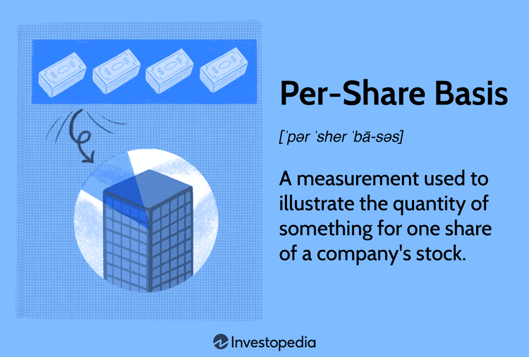

## Table of Contents

## What does 'per share basis' mean in basic terms?

When people talk about something on a 'per share basis,' they are talking about dividing up a company's total numbers into smaller parts. Each part represents one share of the company's stock. For example, if a company made $100 million in profit and has 50 million shares, the profit per share would be $2. This helps investors understand how much of the company's earnings, or other financial measures, they would get for each share they own.

This way of looking at things is useful because it makes it easier to compare different companies. If one company earns $2 per share and another earns $1 per share, you can see which one might be doing better, even if the total profits are different. It's like comparing apples to apples instead of apples to oranges. This method is commonly used when talking about earnings, dividends, and other financial metrics.

## How is the per share value calculated for a company's earnings?

To find out the earnings per share for a company, you take the total earnings, which is the profit the company made, and divide it by the total number of shares the company has. For example, if a company earned $1 million in profit and has 100,000 shares, the earnings per share would be $1 million divided by 100,000 shares, which equals $10 per share.

This calculation helps investors see how much profit they would get for each share they own. It's a simple way to understand how well a company is doing in terms of making money for its shareholders. By knowing the earnings per share, investors can compare different companies easily, even if the companies are very different sizes.

## Can you explain the difference between earnings per share (EPS) and dividends per share?

Earnings per share (EPS) and dividends per share are two different financial measures that tell you about a company's performance and how it shares its profits with shareholders. EPS is calculated by taking the company's total profit, or earnings, and dividing it by the total number of shares. This number shows how much profit the company made for each share of its stock. It's a way to see how much money the company is making for its investors, but it doesn't mean you get that money directly.

Dividends per share, on the other hand, is the amount of money a company actually pays out to its shareholders for each share they own. Not all companies pay dividends, but those that do take a portion of their earnings and distribute it to shareholders. So, while EPS shows the total profit per share, dividends per share shows how much of that profit you get in your pocket. It's like the difference between knowing how much money a company made and knowing how much of that money you get to keep.

## What role does per share basis play in stock valuation?

When people want to figure out how much a company's stock is worth, they often look at things on a per share basis. This means they take the company's total numbers, like earnings or dividends, and divide them by the number of shares. This helps them compare different companies easily, even if those companies are very different sizes. For example, if one company has a higher earnings per share than another, it might be seen as more valuable because it's making more money for each share of its stock.

Looking at things per share is also important because it helps investors understand what they're getting for their money. If a stock costs $50 per share and the company pays $2 in dividends per share each year, investors can see that they're getting a 4% return on their investment just from dividends. This kind of information helps people decide if a stock is a good buy or not. By breaking down the company's performance into per share numbers, investors can make smarter choices about where to put their money.

## How do companies report financial metrics on a per share basis?

Companies report financial metrics on a per share basis by taking their total numbers, like earnings or dividends, and dividing them by the total number of shares they have. This helps everyone see how much of the company's money each share gets. For example, if a company made $1 million in profit and has 100,000 shares, the earnings per share would be $10. This way, investors can easily understand how much profit they would get for each share they own.

These per share numbers are usually found in a company's financial reports, like the quarterly or annual earnings statements. Companies have to follow rules set by financial authorities, like the Securities and Exchange Commission in the U.S., to make sure they report these numbers correctly. By doing this, they help investors compare different companies and make better decisions about buying or selling stocks.

## What are the common financial ratios that use per share data?

Some common financial ratios that use per share data are the Price-to-Earnings (P/E) ratio, the Dividend Yield, and the Earnings Per Share (EPS) growth rate. The P/E ratio is found by taking the price of a stock and dividing it by the earnings per share. This helps investors see how much they are paying for the company's earnings. A high P/E ratio might mean the stock is expensive, while a low P/E ratio might mean it's a bargain. Dividend Yield is another ratio that uses per share data. It's calculated by taking the dividends per share and dividing it by the stock price. This shows how much money you get back from dividends for each dollar you invest in the stock.

The EPS growth rate is also important. It looks at how much the earnings per share have grown over time. To find it, you take the difference in EPS between two periods and divide it by the EPS from the earlier period. This helps investors see if the company is getting better at making money for its shareholders. All these ratios help investors make smarter choices about buying or selling stocks by giving them a clearer picture of the company's performance and value.

## How does stock dilution affect per share metrics?

When a company issues more shares, it's called stock dilution. This means the total number of shares goes up. Because of this, the value of each share can go down. For example, if a company had 100 shares and made $100 in profit, each share would get $1 of that profit. But if the company then issues 100 more shares, the same $100 profit now has to be split between 200 shares, so each share only gets $0.50. This is how stock dilution can lower the earnings per share.

Stock dilution also affects other per share metrics like dividends per share. If a company pays out $50 in dividends and has 100 shares, each share gets $0.50 in dividends. But if the number of shares doubles to 200 because of dilution, each share now only gets $0.25. This shows that when a company issues more shares, it can make each share less valuable, which is important for investors to understand.

## What are the implications of changes in per share figures over time?

When per share figures like earnings per share or dividends per share change over time, it can tell investors a lot about how a company is doing. If earnings per share go up, it usually means the company is making more money for each share of its stock. This can make the stock more valuable because investors see that the company is doing well. On the other hand, if earnings per share go down, it might mean the company is not doing as well, and the stock might lose value. Investors watch these changes closely to decide if they should buy, hold, or sell their shares.

Changes in dividends per share can also be important. If a company starts paying more dividends per share, it's a good sign because it means shareholders are getting more money back. This can make the stock more attractive to investors who want regular income from their investments. But if dividends per share go down, it might worry investors because it could mean the company is having trouble making enough money to keep paying out dividends. By keeping an eye on these per share figures, investors can get a better idea of a company's health and future prospects.

## How can investors use per share data to make investment decisions?

Investors can use per share data to make smart choices about where to put their money. By looking at earnings per share, investors can see how much profit a company is making for each share of its stock. If the earnings per share are going up over time, it's a good sign that the company is doing well and might be a good investment. On the other hand, if earnings per share are going down, it might mean the company is struggling, and investors might want to be careful or sell their shares. Per share data also helps investors compare different companies easily, even if those companies are different sizes, so they can pick the best ones to invest in.

Another important per share number is dividends per share. This tells investors how much money they get back from the company for each share they own. If a company pays higher dividends per share, it can be attractive to investors who want to earn regular income from their investments. But if dividends per share go down, it might be a warning sign that the company is having trouble making enough money. By looking at both earnings per share and dividends per share, investors can get a full picture of a company's health and decide if it's a good place to put their money.

## What are some advanced techniques for analyzing per share data?

One advanced technique for analyzing per share data is using the Price-to-Earnings (P/E) ratio. This ratio compares the price of a stock to its earnings per share. Investors can use this to see if a stock is a good deal. A low P/E ratio might mean the stock is undervalued and could be a good buy. But a high P/E ratio might mean the stock is expensive. By comparing the P/E ratios of different companies, investors can find the best investments. They can also look at how the P/E ratio changes over time to see if the stock is getting more or less expensive.

Another technique is looking at the Earnings Per Share (EPS) growth rate. This shows how much the company's earnings per share are growing each year. A high EPS growth rate is a good sign because it means the company is making more money for its shareholders. Investors can use this to find companies that are doing well and might keep growing. They can also compare the EPS growth rates of different companies to see which ones are growing the fastest. By combining EPS growth rate with other per share data, investors can make smarter choices about where to put their money.

## How do accounting standards impact the calculation of per share metrics?

Accounting standards are the rules that companies follow when they report their financial numbers. These rules are important because they make sure that companies calculate their earnings per share (EPS) and other per share metrics the same way. For example, in the United States, the Generally Accepted Accounting Principles (GAAP) tell companies how to figure out their earnings and how to count their shares. This helps investors trust the numbers and compare different companies easily. If companies didn't follow these rules, their per share numbers might not be accurate, and it would be hard for investors to know if they were getting a fair picture of the company's performance.

Different countries might have different accounting standards, like International Financial Reporting Standards (IFRS) used in many places outside the U.S. These standards can affect how companies report their earnings and shares, which can change the per share metrics. For instance, IFRS might have different rules for counting certain types of earnings or shares compared to GAAP. This means that investors need to be aware of which standards a company is using when they look at per share data. By understanding these differences, investors can make better decisions and see how a company's numbers might look under different accounting rules.

## What are the limitations and potential misuses of per share data in financial analysis?

Per share data, like earnings per share and dividends per share, can be very helpful for investors, but it also has some limitations. One big problem is that per share numbers can be affected by things like stock dilution. If a company issues more shares, the earnings per share can go down even if the company's total earnings stay the same. This can make the company look worse than it really is. Also, per share data doesn't tell the whole story about a company's financial health. For example, a company might have high earnings per share but also a lot of debt, which could be a problem.

Another issue is that per share data can be misused. Sometimes, companies might try to make their per share numbers look better by buying back their own shares. This can make earnings per share go up because there are fewer shares to divide the earnings by. But this doesn't always mean the company is doing better; it might just be a way to make the numbers look good. Investors need to be careful and look at other financial metrics too, like the company's total earnings and its debt levels, to get a full picture of its health. By understanding these limitations and potential misuses, investors can make smarter decisions about their investments.

## What is the understanding of Per-Share Basis Financial Metrics?

Per-share basis financial metrics are essential in evaluating the financial health and performance of a company from the perspective of each individual share. These metrics provide a clearer picture of a company's financial standing by normalizing broad financial metrics to a per-share level, allowing for easier comparison between different companies regardless of size or capital structure.

Key metrics in this category include:

1. **Earnings Per Share (EPS):** EPS is arguably the most crucial per-share metric, representing the portion of a company's profit allocated to each outstanding share. It is calculated by dividing a company's net earnings by the number of outstanding shares:
$$
   \text{EPS} = \frac{\text{Net Income} - \text{Preferred Dividends}}{\text{Average Outstanding Shares}}

$$

   This metric is pivotal in assessing a company's profitability and is often used in valuation ratios such as the Price-to-Earnings (P/E) ratio.

2. **Cash Flow Per Share:** This metric provides insights into the cash generating ability of a company on a per-share basis, calculated by dividing the total cash flow from operations by the average number of outstanding shares. It helps investors understand how much cash is available to be distributed to shareholders or reinvested in the company.
$$
   \text{Cash Flow Per Share} = \frac{\text{Cash Flow from Operations}}{\text{Average Outstanding Shares}}

$$

3. **Revenue Per Share:** To gauge a company’s revenue efficiency, revenue per share is calculated by dividing total revenue by the average number of outstanding shares. This metric allows investors to see how effectively a company is generating sales on a per-share basis.
$$
   \text{Revenue Per Share} = \frac{\text{Total Revenue}}{\text{Average Outstanding Shares}}

$$

4. **Debt Per Share:** This measure provides insights into the financial leverage and obligations of a company on a per-share basis. Calculated by dividing total debt by the number of outstanding shares, it helps assess the financial risk associated with the company’s capital structure.
$$
   \text{Debt Per Share} = \frac{\text{Total Debt}}{\text{Average Outstanding Shares}}

$$

The methodology behind these metrics involves dividing significant financial aggregates by the number of outstanding shares. By converting absolute financial data into per-share terms, investors can make more accurate comparisons among companies within the same industry, regardless of size. This normalization ensures that the analysis remains relevant across different investment contexts.

Understanding these per-share financial metrics is pivotal for accurately valuing a company and comparing it with its industry peers. These metrics provide investors with critical insights that influence investment decisions and strategies, fostering a better understanding of a company's financial health.

## References & Further Reading

[1]: ["Advances in Financial Machine Learning"](https://www.amazon.com/Advances-Financial-Machine-Learning-Marcos/dp/1119482089) by Marcos Lopez de Prado

[2]: ["Evidence-Based Technical Analysis: Applying the Scientific Method and Statistical Inference to Trading Signals"](https://www.amazon.com/Evidence-Based-Technical-Analysis-Scientific-Statistical/dp/0470008741) by David Aronson

[3]: ["Machine Learning for Algorithmic Trading"](https://github.com/stefan-jansen/machine-learning-for-trading) by Stefan Jansen

[4]: ["Quantitative Trading: How to Build Your Own Algorithmic Trading Business"](https://www.amazon.com/Quantitative-Trading-Build-Algorithmic-Business/dp/1119800064) by Ernest P. Chan

[5]: Penman, S. H. (2009). ["Accounting for Value"](https://cup.columbia.edu/book/accounting-for-value/9780231151184) Columbia University Press.

[6]: Damodaran, A. (2012). ["Investment Valuation: Tools and Techniques for Determining the Value of Any Asset"](https://books.google.com/books/about/Investment_Valuation.html?id=5SRHAAAAQBAJ) John Wiley & Sons.