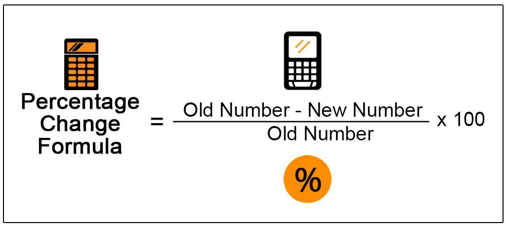

Algorithmic trading employs mathematical formulas to execute trades based on a variety of market conditions, with one critical mathematical concept being the calculation of percentage change. This concept is pivotal to the operation of algorithmic trading systems, as it aids traders in making informed decisions by examining price movements, predicting future trends, and crafting trading strategies geared towards market success. A comprehensive grasp of how to compute and apply percentage change can significantly enhance a trader's ability to analyze financial data effectively, enabling the prediction of potential market scenarios.

Algorithmic trading systems often rely on algorithms that utilize percentage changes to evaluate and respond to fluctuations in asset prices. The core idea is to use percentage change to quantify the rise or fall in an asset's price, thus serving as a vital indicator of market dynamics. By doing so, traders can assess potential investment opportunities or risks, allowing for strategically timed buy or sell decisions. This article explores the significance of percentage change in the world of finance, outlining its calculation and its multifaceted application in algorithmic trading. Understanding these principles equips traders with the tools to navigate the complexities of modern financial markets efficiently.



## Table of Contents

## Understanding Percentage Change

Percentage change is a mathematical concept that quantifies how a particular value has shifted over a period, expressed as a percentage. This measure is crucial for assessing the performance of financial assets such as stocks, indices, and other instruments. It enables the analysis of historical price behaviors and the prediction of future market trends. To compute percentage change, the formula applied is:

$$
\text{Percentage Change} = \left(\frac{\text{New Value} - \text{Old Value}}{\text{Old Value}}\right) \times 100
$$

This straightforward calculation offers a powerful means to gauge the magnitude of change, whether it signifies an increase or a decrease. The broad applicability and inherent simplicity of the percentage change formula make it a staple tool in various spheres of financial analysis. Historical data evaluation often employs this metric to track price trends, allowing investors and analysts to forecast potential price movements and make informed decisions. For instance, through percentage change, analysts can effectively compare the growth of different stocks or assess volatility over time. These insights are vital when developing robust market forecasts and constructing investment strategies.

## Percentage Change Formula and Calculation

The percentage change is calculated using the formula: 

$$
\text{Percentage Change} = \left(\frac{\text{New Value} - \text{Old Value}}{\text{Old Value}}\right) \times 100
$$

This formula offers a quantitative understanding of the relative change in value, signifying either an increase or decrease. A positive result indicates an increase in value, whereas a negative result denotes a decrease. For instance, if a stock's price increases from $100 to $110, this change can be calculated using the formula as follows:

$$
\text{Percentage Change} = \left(\frac{110 - 100}{100}\right) \times 100 = 10\%
$$

This result illustrates a 10% rise in the stock's price. The universality of this formula allows it to be applied across varying contexts, from assessing the performance of different financial assets to gauging economic indicators. Its simplicity ensures that it remains an indispensable tool for anyone involved in data analysis or financial forecasting. The formula's straightforwardness enables it to be easily implemented in programming languages such as Python, allowing for efficient computation, particularly when analyzing large datasets. Here is a basic Python example for calculating the percentage change:

```python
def calculate_percentage_change(old_value, new_value):
    return ((new_value - old_value) / old_value) * 100

# Example usage
old_price = 100
new_price = 110
percentage_change = calculate_percentage_change(old_price, new_price)
print(f"The percentage change is {percentage_change}%")
```

This code snippet can be expanded or integrated into larger algorithms, serving as the foundation for more complex trading strategies and financial analyses.

## Importance of Percentage Change in Algorithmic Trading

Percentage change is a critical metric in [algorithmic trading](/wiki/algorithmic-trading), serving as a key component in making buy or sell decisions based on predefined algorithms. By evaluating the relative movement in asset prices, algorithmic trading systems can effectively quantify market trends and assess the [volatility](/wiki/volatility-trading-strategies) of financial instruments. This capability is crucial for traders seeking to understand and exploit the fluctuations in market dynamics.

The percentage change formula, $(\text{New Value} - \text{Old Value}) / \text{Old Value} \times 100$, allows traders to determine how much an asset's price has moved relative to its previous value. This calculation provides insight into the performance of individual assets and allows for comparison against industry benchmarks. For instance, if an asset's price increases from $100 to $105, the percentage change would be $(105 - 100) / 100 \times 100 = 5\%$, indicating a 5% upward movement.

In algorithmic trading, predefined percentage change thresholds are frequently used to automate trading actions. These thresholds minimize human intervention in trading processes, allowing the system to operate efficiently and consistently. For example, an algorithm might initiate a sell order if the price of a particular stock decreases by more than 3% within a trading session. This automated approach ensures that trading decisions are executed swiftly, capitalizing on opportunities that may arise from sudden market changes.

By incorporating percentage change as a foundational metric, algorithmic trading systems can optimize asset performance assessment and compare it against relevant benchmarks. This optimization results in more informed trading decisions and can lead to improved portfolio performance. As traders adjust their algorithms based on historical percentage changes and trend analysis, they can strategically align their trading activities with desired outcomes, thus harnessing the full potential of algorithmic trading.

## Applications in Trading Strategies

Percentage change is a crucial component in various trading strategies, significantly enhancing the decision-making process in algorithmic trading. It is particularly valuable in the strategies of trend-following, mean reversion, and risk management.

Trend-following strategies rely heavily on percentage change to identify and capitalize on prevailing market directions. By analyzing the percentage change in asset prices, algorithms can determine the strength and persistence of a trend, enabling traders to enter positions aligned with market [momentum](/wiki/momentum). For example, a significant positive percentage change may signal a strong upward trend, prompting a purchase action, whereas a negative change might indicate a downtrend, suggesting a sell order.

Mean reversion strategies depend on the concept that asset prices will eventually return to their historical average. Traders use percentage change to identify deviations from the mean. When an asset's price experiences a considerable percentage change away from its historical average, algorithms might initiate trades predicting a reversion toward the mean. This approach often involves buying undervalued assets or selling overvalued ones, based on the percentage change from the average price.

Risk management is another area where percentage change plays a vital role. Traders use it to establish stop-loss and take-profit levels, effectively managing the risk and reward ratio in trades. For instance, a trader might set a stop-loss order at a percentage change of -5%, preventing excessive loss if the market moves against the position. Conversely, a take-profit order might be placed at a positive percentage change, ensuring that profits are realized when a target level is reached.

In high-frequency trading ([HFT](/wiki/high-frequency-trading-strategies)), algorithms analyze percentage changes across multiple markets at an exceptional speed, identifying and exploiting short-term price discrepancies. The rapid computation of percentage changes enables HFT systems to execute large volumes of trades within microseconds, capturing fleeting market opportunities that human traders would miss.

Incorporating percentage change into these trading strategies allows for a systematic and quantitative approach, which can lead to more consistent and profitable outcomes in the competitive landscape of financial markets.

## Example of Percentage Change in Algo Trading

Consider an algorithm designed to capitalize on stocks that experience a significant daily price drop by more than 5%, aiming to benefit from potential rebound opportunities. This trading strategy relies on the accurate computation of percentage changes to identify opportune entry points for trading positions. The percentage change calculation is crucial in determining when a stock has breached the 5% threshold, triggering a buying decision.

The decision-making process can be coded in Python as follows:

```python
def calculate_percentage_change(old_price, new_price):
    return (new_price - old_price) / old_price * 100

def should_buy_stock(old_price, new_price):
    percentage_drop = calculate_percentage_change(old_price, new_price)
    return percentage_drop <= -5

# Example usage
old_price = 100  # Example old price
new_price = 94   # Example new price

if should_buy_stock(old_price, new_price):
    print("Buy the stock")
else:
    print("Do not buy the stock")
```

In this example, the algorithm calculates the percentage change to assess whether the stock’s price has declined by more than 5%. If the condition is met, a buy signal is generated.

Backtesting is a crucial step in validating this strategy. By applying the algorithm to historical data, traders can evaluate its performance and refine its parameters. The process involves running simulations based on past price movements to determine the strategy's profitability and risk parameters. Continuous refinement through [backtesting](/wiki/backtesting) helps optimize the algorithm, allowing for adjustments to the percentage drop threshold or timing of buying decisions. This iterative approach enhances the algorithm’s robustness in real-world trading conditions, potentially improving investment outcomes.

## Conclusion

The calculation and application of percentage change are essential to achieving success in algorithmic trading. This straightforward yet powerful tool allows traders to design and implement robust trading algorithms, thereby enhancing investment strategies and improving outcomes. By assessing the relative change in asset prices, traders can make informed decisions about when to enter or [exit](/wiki/exit-strategy) positions, optimizing their potential for profit and managing risk effectively.

Mastering percentage change calculation facilitates the automation of trading actions, reducing reliance on human intervention and enabling more efficient execution of strategies. When algorithms integrate percentage change with adapted thresholds, they can respond dynamically to market movements, which is crucial in today's fast-paced financial landscape.

Moreover, leveraging percentage change alongside other quantitative metrics can significantly enhance algorithmic models. By using factors such as volatility, moving averages, or fundamental data, traders can develop sophisticated models that account for multiple dimensions of market behavior. This integrated approach fosters a more comprehensive strategy formulation, allowing traders to maintain a competitive edge in a dynamic trading environment.

In summary, understanding and effectively applying percentage change empowers traders to create algorithms that are not only responsive but also resilient, capable of navigating the complexities of modern financial markets with precision and efficiency.

## References & Further Reading

[1]: ["Advances in Financial Machine Learning"](https://www.amazon.com/Advances-Financial-Machine-Learning-Marcos/dp/1119482089) by Marcos Lopez de Prado

[2]: ["Evidence-Based Technical Analysis: Applying the Scientific Method and Statistical Inference to Trading Signals"](https://www.amazon.com/Evidence-Based-Technical-Analysis-Scientific-Statistical/dp/0470008741) by David Aronson

[3]: ["Machine Learning for Algorithmic Trading"](https://github.com/stefan-jansen/machine-learning-for-trading) by Stefan Jansen

[4]: ["Quantitative Trading: How to Build Your Own Algorithmic Trading Business"](https://www.amazon.com/Quantitative-Trading-Build-Algorithmic-Business/dp/1119800064) by Ernest P. Chan