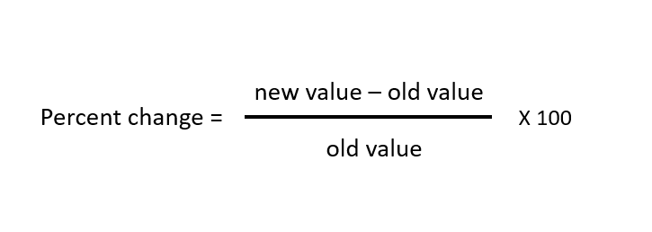

## Table of Contents

## What is percentage change?

Percentage change is a way to measure how much a number has increased or decreased over time. It is calculated by finding the difference between the new number and the original number, dividing that difference by the original number, and then multiplying by 100 to get a percentage. This helps us understand the size of the change in a way that is easy to compare and understand.

For example, if you had 50 apples last week and now you have 60 apples, the percentage change would show how much your apple collection has grown. By using percentage change, we can see that the increase from 50 to 60 apples is a 20% increase, which is a clear and simple way to express the growth. This method is useful in many areas like finance, science, and everyday life to track changes in values over time.

## Why is calculating percentage change important?

Calculating percentage change is important because it helps us understand how much something has grown or shrunk. When we see numbers change, like the price of a toy or the number of students in a class, percentage change tells us how big that change is in a way that's easy to understand. Instead of just seeing the new number, we can see if it's a little bit more or a lot more, or if it's less than before.

This is really helpful in everyday life and in bigger things like business and science. For example, if you save money and want to know how much your savings have grown, percentage change can show you if it's a good amount or not. In business, companies use it to see if they are making more money or if they need to change something. Scientists also use it to track changes in things like the weather or animal populations. So, knowing the percentage change helps us make better choices and understand the world around us.

## How do you calculate the percentage change between two numbers?

To calculate the percentage change between two numbers, you need to follow a simple three-step process. First, find the difference between the new number and the original number. For example, if the original number was 50 and the new number is 60, the difference is 60 minus 50, which equals 10. Next, divide this difference by the original number. In our example, you would divide 10 by 50, which gives you 0.2. Finally, to turn this into a percentage, multiply the result by 100. So, 0.2 times 100 equals 20. This means the percentage change from 50 to 60 is 20%.

Understanding how to calculate percentage change is useful in many situations. It helps you see how much something has increased or decreased in a clear way. For instance, if you want to know how much your savings have grown from last year to this year, you can use percentage change to find out. It's also important in business to track sales growth or in science to measure changes in data over time. By calculating the percentage change, you get a better picture of the changes happening around you.

## What is the formula for percentage change?

The formula for percentage change is simple. You take the new number and subtract the original number to find the difference. Then, you divide that difference by the original number. After that, you multiply the result by 100 to turn it into a percentage. So, the formula looks like this: (New Number - Original Number) / Original Number * 100.

Using this formula helps us see how much something has changed in a way that's easy to understand. For example, if you had 50 apples last week and now you have 60 apples, you can find out the percentage change. You subtract 50 from 60 to get 10, then divide 10 by 50 to get 0.2, and finally multiply 0.2 by 100 to find out that your apple collection grew by 20%. This is useful in many situations, like tracking savings growth or understanding changes in business and science.

## Can percentage change be negative? What does it mean?

Yes, percentage change can be negative. A negative percentage change means that the new number is smaller than the original number. It shows how much something has decreased. For example, if you had 100 apples last week and now you have only 80 apples, the percentage change would be negative, showing a decrease in your apple collection.

When the percentage change is negative, it helps us understand losses or reductions. In everyday life, a negative percentage change might show how much money you lost in your savings account or how much the price of a toy went down. In business, it could mean sales went down or profits decreased. Knowing about negative percentage change helps us see and understand these decreases clearly.

## How do you interpret a percentage change in real-world scenarios?

In real life, understanding percentage change helps us see how much things have grown or shrunk. For example, if you saved $100 last month and now you have $120, the percentage change tells you that your savings grew by 20%. This makes it easy to know if your savings are doing well or if you need to save more. In a store, if a toy's price goes from $20 to $15, the negative percentage change of 25% shows you how much the price dropped, which can help you decide if it's a good time to buy.

Percentage change is also important in bigger situations like business and science. In a company, if sales go from $1,000 to $1,100, a 10% increase tells the business if they are doing better or if they need to work harder. Scientists use percentage change to track things like how much a river's water level has changed or how many more birds are in a certain area. By looking at these changes as percentages, it's easier to understand and compare them over time, which helps in making decisions or planning for the future.

## What are common mistakes to avoid when calculating percentage change?

When calculating percentage change, it's easy to make mistakes. One common error is using the wrong numbers in the formula. People sometimes mix up the new number and the original number, which can lead to the wrong percentage change. For example, if you start with 50 apples and end with 60, you need to subtract 50 from 60, not the other way around. Another mistake is forgetting to multiply by 100 at the end to turn the result into a percentage. If you stop at dividing the difference by the original number, you'll get a decimal like 0.2, but you need to multiply it by 100 to see it's actually a 20% increase.

Another common mistake is not paying attention to whether the change is positive or negative. If the new number is smaller than the original number, you should get a negative percentage change, which shows a decrease. For instance, if you had 100 apples and now you have 80, you need to see that as a negative 20% change. Also, some people might round numbers too early in the calculation, which can lead to small errors in the final percentage. It's better to keep the numbers exact until the very end to get the most accurate result.

## How does percentage change differ from percentage point change?

Percentage change and percentage point change are two different ways to talk about changes in numbers. Percentage change tells you how much a number has grown or shrunk compared to what it was before. You find it by taking the difference between the new number and the old number, dividing that by the old number, and then multiplying by 100. For example, if a store's sales go from 100 to 120, the percentage change is 20%. This helps us see how big the change is in a way that's easy to understand.

Percentage point change, on the other hand, just looks at the difference between two percentages without comparing them to the original number. If the store's sales go from 10% of the total market to 15%, the percentage point change is 5 percentage points. This doesn't tell us how much the sales grew compared to the original amount, just that the percentage went up by 5 points. So, percentage change gives us a sense of growth or decrease, while percentage point change simply shows the difference between two percentages.

## How can percentage change be applied in financial analysis?

In financial analysis, percentage change helps us understand how much money has grown or shrunk. For example, if a company's profits go from $100,000 to $120,000, the percentage change shows that profits grew by 20%. This is important because it helps investors and managers see if the company is doing better or worse than before. By looking at percentage changes over time, they can make decisions about whether to invest more money or if they need to change their plans to improve the company's performance.

Percentage change is also used to compare different investments. If one stock goes up by 10% and another by 5%, it's clear which one did better. This helps people choose where to put their money. In budgeting, percentage change can show how much expenses have gone up or down, helping people or companies plan for the future. By understanding these changes, financial analysts can give better advice and help make smarter financial decisions.

## What advanced statistical methods can be used to analyze percentage changes over time?

One advanced way to look at percentage changes over time is by using time series analysis. This method helps us see patterns and trends in the data. For example, if we're looking at how a company's profits change each year, time series analysis can show us if the profits are going up steadily, or if they go up and down a lot. We can use tools like moving averages to smooth out the ups and downs and see the bigger picture. Another tool is exponential smoothing, which gives more weight to recent data, helping us predict what might happen next based on the latest changes.

Another method is regression analysis, which can help us understand what causes the percentage changes. For example, we might want to know if a company's profits go up because they're selling more products or because they're charging more for each product. Regression analysis can look at these different factors and tell us which ones are most important. By doing this, we can make better guesses about what might happen in the future and plan accordingly. These advanced methods help us make sense of complex data and make smarter decisions based on how things change over time.

## How do you calculate compound percentage change over multiple periods?

To calculate compound percentage change over multiple periods, you need to understand how each change builds on the previous ones. Imagine you have a savings account that grows by 5% each year. If you start with $100, after the first year, you'll have $105. The next year, the 5% growth is applied to the new amount of $105, not the original $100. So, you'll have $105 times 1.05, which equals $110.25. This process of applying the percentage change to the new amount each time is what makes it compound.

To find the total compound percentage change over several periods, you multiply the growth factors together and then subtract 1 to get the overall percentage change. Using our example, if you want to know the compound percentage change over two years, you would multiply 1.05 (the growth [factor](/wiki/factor-investing) for the first year) by 1.05 again (the growth factor for the second year), which gives you 1.1025. Subtract 1 from this result to get the total compound percentage change, which is 0.1025 or 10.25%. This method helps you see how much something has grown or shrunk over time when changes keep building on each other.

## What software tools or programming languages are best for automating percentage change calculations?

For automating percentage change calculations, you can use spreadsheet software like Microsoft Excel or Google Sheets. These tools are easy to use and have built-in functions that make calculating percentage changes simple. In Excel, you can use a formula like `=(New Value - Old Value) / Old Value * 100` to find the percentage change between two numbers. Google Sheets works the same way. These programs are great for people who aren't used to coding because you can just type in the numbers and the formulas do the rest.

If you want to use programming languages, Python is a good choice because it's easy to learn and has lots of libraries to help with calculations. You can write a simple script to calculate percentage changes using basic math operations. For example, you could use the formula `(new_value - old_value) / old_value * 100` in Python. Libraries like Pandas make it even easier by letting you work with big sets of data and calculate percentage changes across many numbers at once. This is useful if you need to do a lot of calculations or if you're working with data that changes over time.

## What is Understanding Percentage Change?

Percentage change is a mathematical concept that quantifies how a particular value has shifted over a period, expressed as a percentage. This measure is crucial for assessing the performance of financial assets such as stocks, indices, and other instruments. It enables the analysis of historical price behaviors and the prediction of future market trends. To compute percentage change, the formula applied is:

$$
\text{Percentage Change} = \left(\frac{\text{New Value} - \text{Old Value}}{\text{Old Value}}\right) \times 100
$$

This straightforward calculation offers a powerful means to gauge the magnitude of change, whether it signifies an increase or a decrease. The broad applicability and inherent simplicity of the percentage change formula make it a staple tool in various spheres of financial analysis. Historical data evaluation often employs this metric to track price trends, allowing investors and analysts to forecast potential price movements and make informed decisions. For instance, through percentage change, analysts can effectively compare the growth of different stocks or assess [volatility](/wiki/volatility-trading-strategies) over time. These insights are vital when developing robust market forecasts and constructing investment strategies.

## What is the Percentage Change Formula and how is it calculated?

The percentage change is calculated using the formula: 

$$
\text{Percentage Change} = \left(\frac{\text{New Value} - \text{Old Value}}{\text{Old Value}}\right) \times 100
$$

This formula offers a quantitative understanding of the relative change in value, signifying either an increase or decrease. A positive result indicates an increase in value, whereas a negative result denotes a decrease. For instance, if a stock's price increases from $100 to $110, this change can be calculated using the formula as follows:

$$
\text{Percentage Change} = \left(\frac{110 - 100}{100}\right) \times 100 = 10\%
$$

This result illustrates a 10% rise in the stock's price. The universality of this formula allows it to be applied across varying contexts, from assessing the performance of different financial assets to gauging economic indicators. Its simplicity ensures that it remains an indispensable tool for anyone involved in data analysis or financial forecasting. The formula's straightforwardness enables it to be easily implemented in programming languages such as Python, allowing for efficient computation, particularly when analyzing large datasets. Here is a basic Python example for calculating the percentage change:

```python
def calculate_percentage_change(old_value, new_value):
    return ((new_value - old_value) / old_value) * 100

# Example usage
old_price = 100
new_price = 110
percentage_change = calculate_percentage_change(old_price, new_price)
print(f"The percentage change is {percentage_change}%")
```

This code snippet can be expanded or integrated into larger algorithms, serving as the foundation for more complex trading strategies and financial analyses.

## References & Further Reading

[1]: ["Advances in Financial Machine Learning"](https://www.amazon.com/Advances-Financial-Machine-Learning-Marcos/dp/1119482089) by Marcos Lopez de Prado

[2]: ["Evidence-Based Technical Analysis: Applying the Scientific Method and Statistical Inference to Trading Signals"](https://www.amazon.com/Evidence-Based-Technical-Analysis-Scientific-Statistical/dp/0470008741) by David Aronson

[3]: ["Machine Learning for Algorithmic Trading"](https://github.com/stefan-jansen/machine-learning-for-trading) by Stefan Jansen

[4]: ["Quantitative Trading: How to Build Your Own Algorithmic Trading Business"](https://www.amazon.com/Quantitative-Trading-Build-Algorithmic-Business/dp/1119800064) by Ernest P. Chan