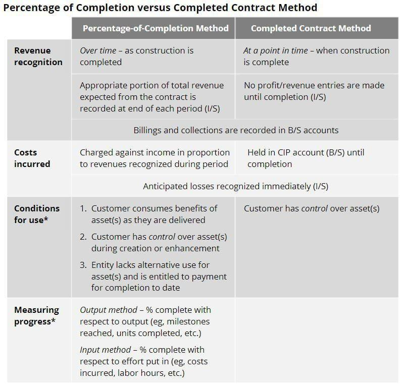

In today's rapidly evolving financial landscape, businesses and investors are constantly seeking effective methods to manage financial reporting and trading. The dynamic twin challenges arise from the need to accurately account for long-term projects and the pursuit of efficient trading strategies in increasingly sophisticated markets. This article addresses the intersection between traditional accounting methods—particularly the Percentage of Completion and Completed Contract methods—and the advancing field of algorithmic trading.

The Percentage of Completion and Completed Contract methods have long been staples in sectors such as construction and engineering where long-term contracts dominate. These accounting techniques provide businesses with frameworks to ascertain the right timing and manner of recognizing revenues and expenses. The Percentage of Completion method progressively accounts for financial results based on the progress of a project, offering a more current representation of a company’s financial performance. Conversely, the Completed Contract method takes a more conservative approach by deferring revenue recognition until the completion of a project, adding predictability but also delaying the reflection of a project’s financial impact.



Simultaneously, algorithmic trading is remaking the landscape of financial trading. By leveraging computational algorithms, traders can execute orders at unprecedented speeds and volumes, often eclipsing human capabilities. This movement towards automation is not only reshaping how trades are executed but is also introducing new paradigms in strategy formulation, aimed at maximizing efficiency and minimizing latency.

The intersection of these two domains—accounting methods and algorithmic trading—presents intriguing implications. As algorithmic trading systems increasingly utilize financial reporting data to inform trading strategies, the choice of accounting method can significantly influence algorithmic performance, particularly in relation to market predictions affiliated with corporate financial disclosures. Understanding these accounting approaches is therefore crucial for companies aiming to harness financial data to improve automated trading strategies. Through this convergence of disciplines, businesses and investors gain a wider scope of tools to enhance both fiscal reporting accuracy and trading effectiveness.

## Table of Contents

## Understanding Accounting Methods: Percentage of Completion and Completed Contract

Every business engaged in long-term projects must adopt an appropriate accounting method to accurately report income and expenses. Two widely utilized methods for such endeavors are the Percentage of Completion and Completed Contract methods.

The Percentage of Completion method recognizes income and expenses incrementally, aligning them with the degree of completion of the contract. This approach is based on the principle that no profit should be reported unless realized, and it correlates revenue with the costs incurred. For instance, if a construction project is 60% complete, 60% of the expected revenue and associated costs are recorded in the financial statements for that period. This method is beneficial as it provides a more timely reflection of financial performance, thereby reducing [volatility](/wiki/volatility-trading-strategies) in the income statement. It is particularly suitable for industries where revenues and costs can be reasonably estimated and demands detailed contracts specifying payment and completion milestones.

Conversely, the Completed Contract method postpones income and expense recognition until the entirety of the project is completed. This approach is advantageous for projects where the timeline and payment schedules may be uncertain or when estimations of progress and costs are unreliable. As income and expenses are recognized upon project completion, this method is seen as a conservative option, mitigating the risk of premature revenue recognition. However, it can lead to significant fluctuations in financial outcomes at the project's conclusion and might obscure a company's financial health during the project's life.

Each method presents distinct advantages and challenges, particularly concerning timing and tax implications. The Percentage of Completion method allows for a more even distribution of income, supporting consistent tax planning, while the Completed Contract method can defer tax liabilities until project completion. Selecting the appropriate method is essential for accurate financial reporting, especially for businesses engaged in sectors like construction and engineering, where projects often span multiple fiscal periods.

Understanding these methods and their applications is crucial for stakeholders to gain an accurate picture of financial standing and performance over time. Accurate application ensures compliance with accounting standards and supports strategic decision-making, providing a clearer lens through which stakeholders can view a company's financial journey.

## An In-Depth Look at the Percentage of Completion Method

The Percentage of Completion method is a vital accounting tool for recognizing revenue and expenses progressively over the lifespan of long-term projects. This method helps mitigate fluctuations in income statements, providing a more stable financial overview by allocating earnings and expenses according to the degree of project completion rather than traditional end-of-project recorded figures.

This accounting method is particularly beneficial for projects where both revenue and costs can be reasonably estimated, and where both parties—client and contractor—adhere diligently to their contractual obligations. It ensures a consistent revenue stream, which is crucial for businesses such as those in the construction and engineering sectors where project timelines extend across multiple financial periods.

A key requirement for the successful implementation of the Percentage of Completion method is the presence of detailed contracts. These contracts should clearly specify project milestones, payment terms, and assurances of both payment and project completion. Such detailed documentation is essential to ascertain progress and appropriately match expenses with the income earned over the contract's term.

The method is in compliance with the Generally Accepted Accounting Principles (GAAP), thereby offering insights into the project's financial performance over time. As per GAAP, using the Percentage of Completion method allows for a reflection of more accurate financial results, as revenue recognition aligns closely with the activities and efforts undertaken throughout the project's lifecycle. This alignment helps stakeholders gain a transparent view of the project's financial progression, making it easier to anticipate necessary adjustments and decisions.

Moreover, this method effectively smooths income recognition over the periods involved, offering a less abrupt and more consistent view of financial health. For instance, if a project is 50% complete, the revenues and costs reflected in financial statements would also mirror this completion percentage, thereby ensuring that stakeholders are informed of gradual revenue inflow as the work progresses.

A mathematical expression that exemplifies this revenue recognition could be as follows:

$$
\text{Recognized Revenue} = \left(\frac{\text{Costs Incurred to Date}}{\text{Total Estimated Costs}}\right) \times \text{Total Contract Revenue}
$$

This formula calculates the portion of the total contract revenue that is recognized as of a given date, based on the proportion of costs incurred relative to the total estimated costs. By consistently applying this method throughout a project, organizations can maintain a balanced and insightful financial perspective.

## The Completed Contract Method: A Conservative Option

The Completed Contract method is a traditional accounting approach that defers the recognition of income and expenses until a project's completion. This method is characterized by its conservative nature, as it postpones any financial accounting of revenues and costs until all work associated with a contract is finalized. This approach is particularly useful in situations where the project's timeline and payment schedules are difficult to ascertain, thereby mitigating the risk of prematurely recognizing revenues or expenses that may not ultimately materialize.

One of the primary advantages of the Completed Contract method is its ability to simplify the accounting process. By delaying income and expense recognition until the completion of a project, businesses are not required to estimate costs and revenues throughout the project's duration. This can reduce the potential for errors that come with forecasting and adjustments and provides a straightforward financial snapshot upon project completion.

Nevertheless, the Deferred Revenue reporting inherent in the Completed Contract method poses significant challenges. Investors and analysts may find it difficult to gauge a company's financial health, as ongoing projects do not reflect in the financial reports until they are completed. This can result in seemingly erratic financial statements that do not reflect the company's true operational status over interim periods.

Moreover, there are potential risks associated with deferred income tax liabilities under this method. Should tax rates increase over the project's timeline, the company may face higher tax liabilities than initially anticipated. This risk underlines the importance of strategic tax planning when adopting the Completed Contract method.

Despite these challenges, the simplicity and conservatism of this method appeal to companies engaged in long-term projects with uncertain trajectories, as it avoids the assumptions and estimates required by alternative accounting methods. By matching revenue and expenses to the project's life, this method provides a clear and concise final financial outcome, albeit at the cost of obscuring financial insights during the project's [course](/wiki/best-algorithmic-trading-courses).

## Algorithmic Trading: Transforming Trading Strategies

Algorithmic trading, often referred to as algo trading, leverages automated systems to execute trading strategies with unprecedented speed and [volume](/wiki/volume-trading-strategy). These systems rely on complex algorithms designed to make trading decisions by analyzing a multitude of factors far quicker than a human trader could. The capabilities of these algorithms extend to processing historical data, statistical analysis, and market conditions to optimize trading strategies.

Algo trading has become a mainstay in stock markets globally and is seeing increased usage across other types of financial securities, including commodities and cryptocurrencies. This transition is driven by the demand for greater efficiency in trade execution. The utilization of [algorithmic trading](/wiki/algorithmic-trading) systems significantly reduces both transaction costs and latency, allowing market participants to capitalize on small price movements with minimal delay.

A crucial aspect of implementing successful algorithmic trading strategies involves understanding the impact of accounting methods on a firm’s financial health. Methods such as Percentage of Completion and Completed Contract influence how revenue and expenses are recognized, thus affecting the financial statements that algo trading models might use. For instance, the choice of accounting method can alter reported earnings, impacting [liquidity](/wiki/liquidity-risk-premium) ratios that algorithms might consider when predicting stock performance.

Algorithmic models must integrate these financial insights to adjust strategies dynamically, ensuring that trading decisions are aligned with the underlying financial health as represented in company reports. Incorporating this dimension enables traders to optimize their algorithms for better forecasting and more accurate execution in response to financial disclosures. As the landscape evolves, aligning algorithmic models with corporate financial reporting practices remains an essential strategy for success in algorithmic trading.

## Integrating Accounting Methods with Algorithmic Trading

Integrating accounting methods with algorithmic trading represents a strategic confluence in modern financial management, enabling the extraction of actionable insights from financial reports to optimize trading strategies. Understanding corporate accounting models, such as the Percentage of Completion and Completed Contract methods, is critical for anticipating market behavior in response to corporate announcements and earnings reports. The release of these financial statements can significantly impact stock prices, and algorithmic trading systems can be programmed to respond to these changes efficiently.

Algorithmic models leverage reporting data to adjust strategies dynamically, factoring in the nuances of different accounting methods. For example, algorithms can be designed to interpret and respond to revenue recognition entries, understanding how variations in reporting can signify shifts in a company's financial health or operational success. This requires a nuanced comprehension of how income and expenses reported under these methods influence a company's financial statements, impacting ratios such as liquidity or profitability. Liquidity ratios, such as the current ratio or quick ratio, reveal a company's ability to meet short-term obligations and can be vital signals for trading strategies. These metrics are impacted by how and when income and expenses are recognized, thus influencing trading decisions.

Consider a Python-based algorithm that parses financial statements to adjust trading positions. Such an algorithm might use the company's reported earnings before interest and taxes (EBIT) to gauge operational efficiency, adjusting positions based on a comparison with historical EBIT performance. Here's a simplified example:

```python
def adjust_trading_strategy(financial_data):
    ebit_current = financial_data.get('EBIT_current')
    ebit_previous = financial_data.get('EBIT_previous')

    # Calculate percentage change in EBIT
    ebit_change_percentage = ((ebit_current - ebit_previous) / ebit_previous) * 100

    # Set trading strategy based on EBIT change
    if ebit_change_percentage > 10:
        strategy = "Increase Long Position"
    elif ebit_change_percentage < -10:
        strategy = "Short Position"
    else:
        strategy = "Hold"

    return strategy
```

In this example, the algorithm uses EBIT data to determine the percentage change and adjusts trading strategies accordingly. A significant increase might suggest improved operational performance, indicating a bullish outlook. Conversely, a significant decrease might trigger a bearish strategy. 

The integration of accounting methods and algorithmic trading thus provides a holistic framework, aligning accounting insights with trading models. This strategic alignment empowers firms to make more informed and profitable trading decisions, enhancing their ability to navigate complex financial environments. As data from financial reports are increasingly incorporated into algorithmic models, this integrated approach promises to revolutionize trading strategies, offering tactical advantages in financial markets.

## Conclusion

In today's complex financial environment, the integration of accounting methods such as the Percentage of Completion and Completed Contract into strategic financial reporting extends well beyond corporate bookkeeping; it has profound implications in the arena of trading. Algorithmic trading, with its capability to process substantial volumes of data at incredible speeds, stands to gain significantly from the insights offered by robust financial accounting practices.

The synergy between these disciplines enables enterprises to achieve superior fiscal control and enhanced trading acumen. As algorithmic trading systems analyze data from diverse sources, they become more precise and efficient when equipped with accurate, timely financial information derived from strategic accounting methods. These systems can adjust trading strategies in real time, based on dynamic insights from financial statements prepared using Percentage of Completion or Completed Contract methods. For example, shifts in reported revenue under these accounting methods can influence liquidity ratios, which in turn impact trading decisions by adjusting capital allocations based on perceived financial stability and performance.

As both accounting practices and trading technologies continue to evolve, the necessity for continuous learning and adapting to new developments becomes increasingly crucial. Staying abreast of advancements ensures the effective utilization of these tools, enabling businesses to refine strategies and optimize performance. Python scripts and algorithmic code enhancements can further facilitate the integration of these accounting insights into automated trading models, maximizing potential benefits.

Ultimately, the combination of strategic accounting methods and algorithmic trading equips businesses and investors with improved abilities to foresee and navigate fluctuations in the financial landscape. This comprehensive approach enhances decision-making, allowing for more informed predictions and strategies, resulting in greater dexterity and foresight in managing financial ventures.

## References & Further Reading

[1]: ["Revenue Recognition - A Guide to the Percentage-of-Completion Method and Completed Contract Method"](https://corporatefinanceinstitute.com/resources/accounting/percentage-of-completion-method/) The CPA Journal.

[2]: ["Algorithmic Trading & DMA: An Introduction to Direct Access Trading Strategies"](https://www.amazon.com/Algorithmic-Trading-DMA-introduction-strategies/dp/0956399207) by Barry Johnson

[3]: ["Accounting for Long-Term Contracts](https://pro.bloombergtax.com/portfolios/accounting-for-long-term-contracts-portfolio-575/) Journal of Accountancy.

[4]: ["Algorithmic and High-Frequency Trading"](https://www.amazon.com/Algorithmic-High-Frequency-Trading-Mathematics-Finance/dp/1107091144) by Álvaro Cartea, Sebastian Jaimungal, and José Penalva

[5]: ["The Handbook of Algorithmic Trading: A Financial Engineer's Perspective on Trading Strategies and Big Data"](https://academic.oup.com/edited-volume/41262/chapter/350850196) by Greg N. Gregoriou