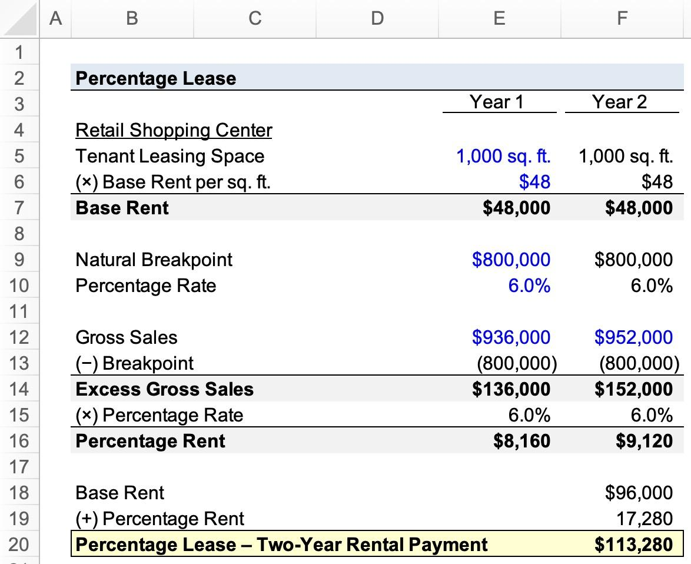

## Table of Contents

## What is a percentage lease?

A percentage lease is a type of rental agreement often used in commercial real estate, especially in shopping centers or malls. In this kind of lease, the tenant pays a base rent plus a percentage of their gross sales. This means that if the tenant's business does well and makes more money, they will pay more rent. The idea behind this is to share the success of the business between the landlord and the tenant.

This type of lease can be good for both the landlord and the tenant. For the landlord, it means they can earn more money if the businesses in their property do well. For the tenant, it can be helpful because the base rent might be lower than in a traditional lease, which can make it easier to start a new business. However, it also means that if the business doesn't do well, the tenant might struggle to pay the rent.

## How does a percentage lease differ from a fixed lease?

A percentage lease and a fixed lease are two different ways to rent a space. In a percentage lease, the tenant pays a small base rent plus a part of their sales. This means if the business makes more money, the rent goes up. It's like sharing the success of the business with the landlord. On the other hand, a fixed lease is simpler. The tenant pays the same amount of rent every month, no matter how much money the business makes.

With a percentage lease, it can be good for new businesses because the base rent might be lower. This makes it easier to start up. But, if the business does really well, the rent can get high. A fixed lease is easier to plan for because the rent stays the same. This can be good if you want to know exactly how much you'll pay each month. But, if the business doesn't do well, you still have to pay the full rent, which can be hard.

## What types of businesses typically use percentage leases?

Businesses that often use percentage leases are usually found in shopping centers or malls. These are places like retail stores, restaurants, and other shops that sell things directly to customers. They use percentage leases because it helps them when they're starting out. The base rent can be lower, so it's easier to open a new shop without worrying too much about high rent right away.

These businesses like percentage leases because if they do well and make more sales, they're okay with paying more rent. It's like sharing their success with the landlord. But if the business doesn't make much money, the rent won't be as high as a fixed lease, which can be a big help during tough times.

## What is the typical percentage range used in a percentage lease?

In a percentage lease, the percentage of sales that a business pays to the landlord usually ranges from about 5% to 10%. This means if a store makes $100,000 in sales, they might pay an extra $5,000 to $10,000 in rent on top of their base rent. The exact percentage can change depending on the type of business and the agreement with the landlord.

For example, a clothing store might have a lower percentage, like 5%, because they have smaller profit margins. But a jewelry store, which can make more money on each sale, might have a higher percentage, like 7% or 8%. The goal is to find a fair percentage that works for both the business and the landlord.

## How is the breakpoint calculated in a percentage lease?

The breakpoint in a percentage lease is the point where the tenant starts paying the percentage of their sales on top of the base rent. To calculate the breakpoint, you divide the annual base rent by the percentage rate agreed upon in the lease. For example, if the base rent is $12,000 per year and the percentage rate is 6%, you divide $12,000 by 0.06. This gives you a breakpoint of $200,000. This means the tenant pays only the base rent until their sales reach $200,000. After that, they start paying the percentage of any sales above that amount.

It's important for both the landlord and the tenant to understand the breakpoint because it affects how much rent will be paid. If a business's sales are below the breakpoint, they only pay the base rent. But if their sales go above the breakpoint, they pay the base rent plus the percentage of the extra sales. This can help businesses plan their finances better, knowing exactly when they'll start paying more rent based on their sales.

## What are the advantages of a percentage lease for landlords?

A percentage lease can be good for landlords because it lets them make more money if the businesses in their property do well. If a store or restaurant has a lot of sales, the landlord gets a part of that money as extra rent. This means the landlord can earn more without having to do more work. It's like having a share in the success of the businesses they rent to.

Also, percentage leases can help landlords keep their properties full. When businesses know they might pay less rent if they don't make a lot of money, they might be more willing to rent the space. This can be especially helpful for new businesses that want to start up but don't have a lot of money yet. So, landlords can attract more tenants and keep their shopping centers busy and lively.

## What are the advantages of a percentage lease for tenants?

A percentage lease can help tenants, especially if they're starting a new business. The base rent is usually lower than with a fixed lease, which means it's easier to get started without worrying about high rent right away. If the business doesn't make a lot of money at first, the tenant won't have to pay as much rent. This can be a big relief during the early days when a business is trying to grow.

Another good thing about a percentage lease is that it shares the success of the business with the landlord. If the business does really well and makes a lot of sales, the tenant pays more rent, but they're okay with that because their business is doing great. It's like a fair deal where both the tenant and the landlord can benefit from the business doing well. This can make tenants feel more comfortable knowing they have some help from the landlord as they grow their business.

## What are the potential disadvantages of a percentage lease for landlords?

One problem for landlords with percentage leases is that if the businesses in their property don't do well, they might not get much rent. If sales are low, the landlord only gets the small base rent, which might not be enough to cover their costs. This means the landlord's income can go up and down a lot, depending on how well the businesses are doing.

Also, landlords might find it harder to plan their finances with percentage leases. Because the rent depends on the businesses' sales, the landlord can't know for sure how much money they'll get each month. This can make it tough to budget and plan for things like building repairs or other expenses. It's like having a part of their income that's always changing, which can be stressful and hard to manage.

## What are the potential disadvantages of a percentage lease for tenants?

One big problem for tenants with a percentage lease is that if their business does really well, their rent can go up a lot. If they make a lot of sales, they have to pay a part of that money to the landlord on top of the base rent. This means their rent can get very high, which can eat into their profits. It's like the more successful they are, the more they have to pay, which can make it hard to keep growing their business.

Another issue is that tenants might find it hard to plan their money with a percentage lease. Because the rent changes based on how much they sell, they can't know for sure how much they'll have to pay each month. This can make it tough to budget and save money. If their sales go down, they might struggle to pay even the base rent, which can be stressful and make it hard to keep their business running smoothly.

## How can a tenant negotiate better terms in a percentage lease?

A tenant can negotiate better terms in a percentage lease by talking to the landlord about the base rent and the percentage rate. They can ask for a lower base rent, which would make it easier to start their business without worrying about high costs right away. They might also ask for a lower percentage rate, so even if their sales go up, the extra rent they have to pay won't be as high. It's important for the tenant to show the landlord that a lower rate could help them do better and make more sales, which would still be good for the landlord in the long run.

Another way to negotiate better terms is to ask for a higher breakpoint. This means the tenant would only start paying the percentage of their sales once they reach a higher amount of sales. This can give the business more time to grow before the rent goes up. The tenant can also ask for a 'natural breakpoint', which is calculated based on the base rent and the percentage rate. By understanding these numbers and explaining how a higher breakpoint could help their business succeed, the tenant can make a strong case to the landlord for better terms.

## What are the accounting implications of a percentage lease for a business?

When a business has a percentage lease, it affects how they do their accounting. They have to keep track of their sales very carefully because the rent they pay changes based on how much they sell. Every month, they need to figure out if their sales are above the breakpoint. If they are, they have to add the percentage of the extra sales to their base rent. This means they need good records to know exactly how much rent to pay and to make sure they're not paying too much or too little.

This kind of lease also makes it harder to plan their budget. Because the rent can change every month, the business can't know for sure how much they'll have to pay. This can make it tough to predict their expenses and plan for the future. They have to be ready for the rent to go up if sales are good, or stay low if sales are not so good. Keeping good records and understanding how the percentage lease works is really important for managing their money well.

## How do economic conditions affect the terms and effectiveness of percentage leases?

Economic conditions can have a big impact on percentage leases. When the economy is doing well, businesses usually make more sales. This means tenants might have to pay more rent because their sales go above the breakpoint. Landlords like this because they can make more money when the economy is strong. But if the economy is not doing so well, businesses might not make as many sales. This can make it hard for tenants to pay even the base rent, and landlords might not get as much money as they hoped.

Because of how the economy can change, both landlords and tenants need to think carefully about the terms of a percentage lease. In good economic times, tenants might try to negotiate a lower percentage rate or a higher breakpoint so they don't have to pay too much rent when their sales go up. In tough economic times, landlords might be more willing to offer better terms to keep their properties full and attract new businesses. Understanding how the economy can affect their business helps both sides make smarter decisions about the lease.

## What is a Percentage Lease?

A percentage lease is a commonly used contract in commercial real estate that ties a tenant’s rent payments to a specified percentage of their sales revenue. This leasing structure aligns the financial interests of both landlords and tenants with the performance of the business operating within the leased space. Under this arrangement, tenants pay a minimum base rent, along with an additional rent calculated as a percentage of their gross sales, once sales surpass a predetermined threshold. 

**Difference Between Percentage Leases and Traditional Lease Agreements**

Traditional lease agreements typically involve fixed rental payments that do not fluctuate with the tenant's sales performance. This means that tenants must pay a predetermined rent amount, regardless of their business success or economic conditions. While this structure offers predictability, it does not account for variability in tenant income and may place a financial burden on businesses during less profitable periods.

In contrast, percentage leases introduce a variable component to rental payments. By linking a portion of the rent to sales performance, percentage leases offer greater financial flexibility to tenants, as the rent obligations are more closely aligned with the tenant's ability to pay. This can be particularly advantageous for retail businesses, where sales may vary significantly based on seasonal trends and economic factors.

**Components of a Percentage Lease: Base Rent and Percentage of Sales**

The fundamental components of a percentage lease are the base rent and the percentage of sales clause. The base rent is the minimum fixed amount that a tenant must pay, regardless of sales performance. It establishes a baseline income for landlords and ensures that property expenses are covered.

The second component is the percentage of sales that the tenant must pay once their sales exceed a specified breakpoint. For instance, if a retail tenant generates monthly sales above a certain threshold, they are required to pay a percentage of these excess sales as additional rent. This percentage is determined through negotiations between the landlord and tenant and can vary depending on the lease agreement.

To illustrate this, consider a hypothetical percentage lease agreement where a retail tenant agrees to a base rent of $10,000 per month and a sales threshold of $100,000, above which an additional 5% of sales is paid. If the tenant's sales for the month amount to $150,000, the additional rent would be calculated as follows:

$$
\text{Additional Rent} = (\text{Sales} - \text{Breakpoint}) \times \text{Percentage Rate}
$$

$$
\text{Additional Rent} = (\$150,000 - \$100,000) \times 0.05 = \$2,500
$$

Therefore, the total rent for that month would be the base rent plus the additional rent, amounting to $12,500. 

Percentage leases create a partnership vibe between landlords and tenants, fostering cooperative efforts to enhance business success. This lease type is particularly prevalent within the retail sector, attracting new businesses due to its adaptive nature in rental payments.

## References & Further Reading

[1]: Graaskamp, J. A., & Shilling, J. D. (1983). ["Real Estate Investment: A Perspective on Current Trends and Issues."](https://link.springer.com/chapter/10.1007/978-1-4615-1703-0_13) The Journal of Portfolio Management.

[2]: Fisher, J. D., & Lentz, G. H. (1986). ["The Income Approach to Valuation: Property and Shares to Leased Fee and Leasehold Valuations."](https://en.wikipedia.org/wiki/List_of_Major_League_Baseball_umpires) Journal of Real Estate Finance and Economics.

[3]: Benjamin, J. D., Boyle, G. W., & Sirmans, C. F. (1990). ["Retail Leasing: The Determinants of Shopping Center Rents."](https://onlinelibrary.wiley.com/doi/abs/10.1111/1540-6229.00524) Journal of the American Real Estate and Urban Economics Association.

[4]: "Retail Leasing Strategies" from the International Council of Shopping Centers. [Link](https://www.sciencedirect.com/science/article/pii/S1877042811016521)

[5]: Lee, S., & Suh, Y. J. (2017). ["An empirical study on the use of retail tenant mix strategy using big data analytics."](https://www.semanticscholar.org/paper/The-Effects-of-Virtual-Reality-on-Consumer-An-Suh-Lee/801c17090ff48fd46f52f74eff6cb6c1114c5e81) Journal of Facilities Management.

[6]: ["Advances in Financial Machine Learning"](https://www.amazon.com/Advances-Financial-Machine-Learning-Marcos/dp/1119482089) by Marcos Lopez de Prado.