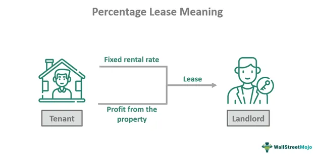

Retail lease percentage agreements play a vital role in the landscape of commercial real estate, offering a unique approach to leasing that aligns the interests of landlords and tenants. These agreements typically entail a leasing arrangement where tenants pay a base rent in addition to a percentage of their gross sales to the landlord. This structure is predominantly employed in retail environments such as shopping malls and high-traffic commercial centers, where tenant sales performance can significantly vary.

Commercial leasing, in this context, forms the backbone of the retail property sector, balancing risk and reward between property owners and retailers. Unlike traditional fixed lease agreements where tenants pay a set amount regardless of sales volume, percentage leases enable property owners to benefit directly from the success of their tenants. This can be particularly advantageous in periods of economic growth or in bustling retail locations where sales are expected to soar, providing potential for increased revenue for landlords.



The intersection of commercial leasing with algorithmic trading presents exciting opportunities for enhancing decision-making within the real estate sector. Algorithmic trading strategies, primarily used in financial markets, involve using computers programmed to follow specific rules for trading decisions. When applied to commercial leasing, these algorithms can analyze vast datasets, including tenant sales patterns, market trends, and consumer behavior, to optimize lease terms and manage risk. By leveraging these data-driven insights, both landlords and tenants can negotiate more favorable and sustainable lease agreements.

The significance of retail lease percentage agreements in today's market is underscored by the dynamic nature of consumer behavior and the retail industry. With the ongoing shift towards e-commerce and the impact of global events—such as the COVID-19 pandemic—on retail sales, percentage leases offer a level of flexibility and adaptability that can be crucial for both landlords and tenants. They allow for lease structures that can adapt to changes in consumer demand and help tenants manage cash flow more effectively during unpredictable market conditions.

In summary, understanding the fundamentals of retail lease percentage agreements and their role in commercial real estate is essential for navigating the modern leasing landscape. These agreements not only provide financial benefits and incentives for both parties involved but also demonstrate how emerging technologies and innovative strategies can transform traditional commercial leasing models into more dynamic and mutually beneficial arrangements.

## Table of Contents

## What is a Percentage Lease?

A percentage lease is a commonly used contract in commercial real estate that ties a tenant’s rent payments to a specified percentage of their sales revenue. This leasing structure aligns the financial interests of both landlords and tenants with the performance of the business operating within the leased space. Under this arrangement, tenants pay a minimum base rent, along with an additional rent calculated as a percentage of their gross sales, once sales surpass a predetermined threshold. 

**Difference Between Percentage Leases and Traditional Lease Agreements**

Traditional lease agreements typically involve fixed rental payments that do not fluctuate with the tenant's sales performance. This means that tenants must pay a predetermined rent amount, regardless of their business success or economic conditions. While this structure offers predictability, it does not account for variability in tenant income and may place a financial burden on businesses during less profitable periods.

In contrast, percentage leases introduce a variable component to rental payments. By linking a portion of the rent to sales performance, percentage leases offer greater financial flexibility to tenants, as the rent obligations are more closely aligned with the tenant's ability to pay. This can be particularly advantageous for retail businesses, where sales may vary significantly based on seasonal trends and economic factors.

**Components of a Percentage Lease: Base Rent and Percentage of Sales**

The fundamental components of a percentage lease are the base rent and the percentage of sales clause. The base rent is the minimum fixed amount that a tenant must pay, regardless of sales performance. It establishes a baseline income for landlords and ensures that property expenses are covered.

The second component is the percentage of sales that the tenant must pay once their sales exceed a specified breakpoint. For instance, if a retail tenant generates monthly sales above a certain threshold, they are required to pay a percentage of these excess sales as additional rent. This percentage is determined through negotiations between the landlord and tenant and can vary depending on the lease agreement.

To illustrate this, consider a hypothetical percentage lease agreement where a retail tenant agrees to a base rent of $10,000 per month and a sales threshold of $100,000, above which an additional 5% of sales is paid. If the tenant's sales for the month amount to $150,000, the additional rent would be calculated as follows:

$$
\text{Additional Rent} = (\text{Sales} - \text{Breakpoint}) \times \text{Percentage Rate}
$$

$$
\text{Additional Rent} = (\$150,000 - \$100,000) \times 0.05 = \$2,500
$$

Therefore, the total rent for that month would be the base rent plus the additional rent, amounting to $12,500. 

Percentage leases create a partnership vibe between landlords and tenants, fostering cooperative efforts to enhance business success. This lease type is particularly prevalent within the retail sector, attracting new businesses due to its adaptive nature in rental payments.

## Benefits of Percentage Leases

Percentage leases, a prevalent structure in commercial real estate, offer several benefits to both landlords and tenants by aligning financial incentives and allowing flexibility based on sales performance.

### Advantages for Landlords

1. **Potential for Higher Income**: One of the primary advantages of percentage leases for landlords is the potential for increased revenue. Unlike traditional fixed leases, percentage leases include a base rent plus a percentage of the tenant's gross sales over a specified threshold. This arrangement allows landlords to benefit directly from the tenant's success. As a tenant's sales volume increases, the landlord's income from the property rises as well, providing an opportunity for significant returns beyond the guaranteed base rent.

2. **Tenant Performance Incentive**: Percentage leases inherently motivate tenants to optimize their sales performance, benefiting landlords. Since tenants are required to share a percentage of their sales, they are incentivized to attract more customers and increase sales, ensuring maximum occupancy and foot traffic within the commercial property. This creates a symbiotic relationship where both parties are focused on enhancing the overall appeal and marketability of the retail space.

### Benefits for Tenants

1. **Financial Flexibility**: For tenants, particularly those in the retail sector, percentage leases offer considerable financial flexibility. By tying a portion of the rent to sales, tenants can manage cash flow more effectively, paying less during low sales periods and more when sales improve. This adaptability is particularly valuable for new businesses or those with seasonal variations in sales.

2. **Alignment of Interests**: Percentage leases foster a partnership-like relationship between tenants and landlords. This alignment of interests encourages landlords to invest in the property and its surroundings to enhance the tenant's success. Improvements in facilities, marketing efforts, and overall property management often flow from this shared goal of maximizing sales, creating a conducive environment for business growth.

### Real-world Examples of Successful Percentage Leases

Large retail spaces, such as shopping malls and suburban outlets, frequently employ percentage leases due to their ability to harness varying sales volumes. A well-documented example includes major retail centers like the Mall of America, which utilizes percentage leases to attract anchor stores like department stores and well-known brand retailers. These leases have enabled landlords to capitalize on high foot traffic areas while providing tenants with an arrangement that correlates rent costs with sales performance. As a result, both landlords and retailers have benefited from dynamic economic conditions, adjusting rent obligations in response to current market demands.

By tying rent to sales performance, percentage leases strategically align the interests of landlords and tenants, encouraging mutual growth and benefiting both parties in a fluctuating retail landscape.

## Challenges and Considerations

Retail lease percentage agreements present both advantages and challenges for both landlords and tenants. Understanding these challenges is crucial for successful lease management and negotiation.

One of the primary challenges landlords face in percentage lease agreements is ensuring accurate sales reporting from tenants. Since the rent is partly based on the tenant's revenue, it is vital for landlords to have a transparent view of sales figures to calculate the percentage rent correctly. Inaccurate reporting can lead to disputes and financial discrepancies. To mitigate this risk, landlords often require tenants to submit regular sales reports and may conduct audits to verify the accuracy of these figures.

From the tenant's perspective, managing cash flow becomes a significant consideration. Percentage leases offer financial flexibility, allowing tenants to pay lower rent during periods of lower sales. However, during high sales periods, tenants must be prepared for an increase in rent payments, which can strain cash flow if not properly managed. Effective cash flow management strategies and forecasting are essential for tenants to meet their rental obligations when sales performance fluctuates.

Negotiating fair terms is another critical aspect for tenants. It is important for tenants to negotiate a base rent that reflects their expected sales performance while also ensuring that the percentage applied to gross sales is reasonable. This negotiation requires a careful balance, as tenants must ensure that, even during peak sales, the rent remains manageable and does not excessively erode profits.

Legal and regulatory aspects must also be considered when entering into percentage lease agreements. Different jurisdictions may have varying laws and regulations governing commercial leases that can impact both parties. For instance, there may be specific disclosure requirements, audit rights, or legal obligations concerning the calculation and reporting of sales figures. Tenants and landlords should seek legal counsel to navigate these legal requirements and ensure compliance with all applicable regulations, avoiding potential legal disputes in the future.

Overall, while percentage leases offer several benefits, like the alignment of landlord-tenant interests and the ability to share in the tenant’s success, they also come with challenges that require careful management and negotiation by both parties. Addressing these challenges proactively can lead to a more harmonious and financially beneficial leasing relationship.

## The Role of Algo Trading in Commercial Leasing

Algorithmic trading, commonly associated with financial markets, is increasingly finding applications in various sectors, including commercial real estate leasing. The adoption of [algorithmic trading](/wiki/algorithmic-trading) strategies in this domain is revolutionizing how lease agreements are optimized, negotiated, and managed.

### Optimization of Lease Agreements

Algorithmic trading employs complex mathematical models and vast datasets to execute orders and optimize outcomes. In commercial leasing, these strategies can streamline the process by identifying optimal lease terms based on historical data, market trends, and tenant performance metrics. By utilizing algorithms, landlords and tenants can assess a range of variables, such as foot traffic, sales performance, and economic indicators, to predict the most favorable lease terms.

For example, algorithms can analyze past sales data and predict future performance, enabling landlords to set percentage lease terms that maximize revenue while remaining attractive to tenants. Algorithms can also simulate various market scenarios to help tenants choose the most advantageous leases.

### Data-Driven Decision Making

Algorithmic trading facilitates data-driven decision-making, which is crucial in lease negotiations and performance tracking. By integrating data analytics tools, stakeholders can dissect complex datasets to gain insights into market conditions and tenant dynamics. This reduces reliance on intuition or past experiences.

Python, a highly versatile programming language, is often used to develop such algorithms. Below is a simplified example demonstrating how Python can be used to analyze lease data:

```python
import pandas as pd

# Load historical sales and lease data
df = pd.read_csv('lease_data.csv')

# Calculate average sales growth
df['sales_growth'] = df['sales'].pct_change()

# Determine optimal lease percentage
optimal_percentage = df['sales_growth'].mean() * 0.1

print(f"The optimal lease percentage is {optimal_percentage:.2%}")
```

This code snippet estimates an optimal lease percentage based on average sales growth, providing a data-backed starting point for negotiations.

### Impact of Technology and Automation

The impact of technology and automation is profound in commercial leasing. Automation reduces the time and effort required for lease management, ensuring accuracy and efficiency throughout the process. Algorithm-driven platforms can automatically generate lease proposals, monitor compliance with lease terms, and adapt to changing market conditions in real-time. This dynamic adaptation ensures both parties maintain a fair and productive partnership.

Moreover, the incorporation of AI and [machine learning](/wiki/machine-learning) enables automated anomaly detection in sales reporting, helping landlords verify the accuracy of tenant-reported figures. This ensures transparency and trust in the landlord-tenant relationship.

In conclusion, algorithmic trading strategies enhance the efficiency and effectiveness of commercial lease agreements through data-driven insights and technological advancements. By embracing these innovations, stakeholders in commercial real estate can make more informed decisions, streamline operations, and foster mutually beneficial lease arrangements.

## Future Trends in Retail Lease Percentage Agreements

Emerging trends in retail lease percentage agreements indicate a shift towards hybrid models, which combine fixed base rents with a percentage of sales. This model provides a balanced risk-reward structure for both landlords and tenants. Traditionally, percentage leases involve tenants paying a base rent plus a percentage of their revenue once it surpasses a predetermined breakpoint. Hybrid models further refine this by potentially adjusting the base rent according to sales performance metrics, ensuring that rents remain competitive and tied closely to tenant success.

The rise of e-commerce significantly impacts percentage leases. As consumer behavior continues to shift towards online shopping, the sales figures that typically drive percentage agreements are changing. Retailers are analyzing omni-channel sales, which incorporate both in-store and online sales, to determine their rent obligations. This integration necessitates landlords and tenants to reassess and possibly renegotiate lease terms to reflect the total revenue picture rather than just in-store sales.

In a post-pandemic world, commercial leasing is expected to become more flexible and responsive to market dynamics. The pandemic accelerated e-commerce uptake and altered consumer preferences, leading retailers to focus on experiential and service-oriented store formats. Consequently, percentage lease structures might evolve to consider a wider range of performance indicators, including foot traffic and customer engagement metrics, alongside traditional sales figures.

Future lease agreements may utilize advanced data analytics and technology-driven insights to tailor rent structures that reflect current market conditions and tenant performance. As digital tools for measuring and forecasting retail performance become more sophisticated, they will play a central role in shaping future lease agreements, ensuring they are both equitable and reflective of contemporary retail landscapes.

## Conclusion

Percentage leases play a pivotal role in commercial real estate by offering a dynamic structure that aligns the interests of landlords and tenants. These leases are structured with a base rent and an additional rent calculated as a percentage of the tenant's sales, which provides adaptability in various economic climates. The importance of percentage leases stems from their ability to incentivize both parties; landlords benefit from potential higher income as tenants prosper, while tenants gain financial flexibility as their rental outgoings ebb and flow with their revenue streams.

The benefits of percentage leases are multifaceted. For landlords, these agreements can result in enhanced income prospects when tenants experience strong sales performance, and they encourage tenants to optimize their sales efforts. This alignment of interests can foster a cooperative relationship between landlords and tenants. For tenants, the key advantage lies in managing financial risk more effectively, as these leases can reduce fixed costs and tie expenses to business success. Real-world examples have demonstrated the success of these agreements, particularly in markets where tenant revenue can vary significantly.

However, percentage leases also pose challenges. Landlords must rely on accurate sales reporting from tenants, which requires a level of trust and transparency. Tenants, on the other hand, must be adept at managing cash flow to accommodate fluctuating rent expenses, and they must negotiate terms that are fair and reflective of their business's potential. Legal and regulatory considerations are crucial in these negotiations to ensure compliance and mutual agreement on terms.

Incorporating algorithmic trading strategies into commercial leasing represents a forward-thinking approach to optimize lease agreements. Algorithms can analyze vast amounts of market data to identify trends and opportunities, which can inform better decision-making in setting lease terms and tracking performance. The integration of technology and automation in the leasing process stands to revolutionize how leases are managed, offering precision and efficiency.

As we look to the future, retail lease percentage agreements are poised to evolve with emerging trends such as hybrid rent models that blend fixed and percentage-based components, adapting to shifts in consumer behavior and the growth of e-commerce. The post-pandemic world has accelerated these changes, underscoring the need for commercial leasing strategies to incorporate technological advancements like algorithmic trading to stay competitive and responsive to market dynamics.

## References & Further Reading

[1]: Graaskamp, J. A., & Shilling, J. D. (1983). ["Real Estate Investment: A Perspective on Current Trends and Issues."](https://link.springer.com/chapter/10.1007/978-1-4615-1703-0_13) The Journal of Portfolio Management.

[2]: Fisher, J. D., & Lentz, G. H. (1986). ["The Income Approach to Valuation: Property and Shares to Leased Fee and Leasehold Valuations."](https://en.wikipedia.org/wiki/List_of_Major_League_Baseball_umpires) Journal of Real Estate Finance and Economics.

[3]: Benjamin, J. D., Boyle, G. W., & Sirmans, C. F. (1990). ["Retail Leasing: The Determinants of Shopping Center Rents."](https://onlinelibrary.wiley.com/doi/abs/10.1111/1540-6229.00524) Journal of the American Real Estate and Urban Economics Association.

[4]: "Retail Leasing Strategies" from the International Council of Shopping Centers. [Link](https://www.sciencedirect.com/science/article/pii/S1877042811016521)

[5]: Lee, S., & Suh, Y. J. (2017). ["An empirical study on the use of retail tenant mix strategy using big data analytics."](https://www.semanticscholar.org/paper/The-Effects-of-Virtual-Reality-on-Consumer-An-Suh-Lee/801c17090ff48fd46f52f74eff6cb6c1114c5e81) Journal of Facilities Management.

[6]: ["Advances in Financial Machine Learning"](https://www.amazon.com/Advances-Financial-Machine-Learning-Marcos/dp/1119482089) by Marcos Lopez de Prado.