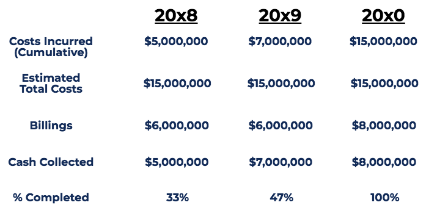

## Table of Contents

## What is the Percentage of Completion Method?

The Percentage of Completion Method is a way for businesses to report their income from long-term projects. It's used when a project will take a long time to finish, like building a bridge or a skyscraper. Instead of waiting until the whole project is done, companies can report some of their earnings as they go along. They do this by figuring out how much of the project is finished and then reporting that percentage of the total expected income.

To use this method, a company needs to estimate how complete the project is at a certain point in time. They might look at how much they've spent compared to the total expected cost, or they might measure how much of the work is actually done. Once they know the percentage of completion, they can report that same percentage of the total profit they expect to make from the project. This method helps give a more accurate picture of a company's financial health during long projects, but it relies on good estimates and can be tricky if those estimates are wrong.

## Why is the Percentage of Completion Method used in accounting?

The Percentage of Completion Method is used in accounting because it helps businesses show their earnings from big projects that take a long time to finish. Instead of waiting until the whole project is done, companies can report some of their earnings as the project goes along. This method is really helpful for projects like building roads or big buildings, where it can take years to complete everything. By using this method, a company can give a better idea of how well it's doing financially during the project, not just at the end.

This method works by figuring out how much of the project is finished at a certain time. Companies might look at how much money they've spent so far compared to what they expect to spend in total, or they might measure how much of the actual work is done. Once they know what percentage of the project is complete, they can report that same percentage of the total profit they expect to make. This helps give a more accurate picture of the company's financial health during long projects, but it can be tricky because it relies on good estimates. If those estimates are wrong, it can mess up the financial reports.

## How does the Percentage of Completion Method differ from the Completed Contract Method?

The Percentage of Completion Method and the Completed Contract Method are two ways businesses can report their earnings from long-term projects, but they work differently. The Percentage of Completion Method lets companies report some of their earnings as they go along. They figure out how much of the project is done and then report that percentage of the total expected profit. This method is useful because it gives a better picture of the company's financial health during the project, not just at the end. It's often used for big projects like building roads or skyscrapers that take a long time to finish.

On the other hand, the Completed Contract Method waits until the whole project is finished before reporting any earnings. Companies using this method don't report any profit until the project is 100% done. This can make their financial reports look less accurate during the project because they're not showing any earnings until the very end. The Completed Contract Method is simpler because it doesn't need to estimate how much of the project is complete, but it might not show how well the company is doing until the project is over.

Both methods have their pros and cons. The Percentage of Completion Method can be more accurate during the project but relies on good estimates, which can be tricky. The Completed Contract Method is simpler but might not show the company's financial health as clearly during the project. Companies choose the method that works best for their needs and the type of projects they're working on.

## What are the key steps to apply the Percentage of Completion Method?

To use the Percentage of Completion Method, a company first needs to figure out how much of the project is done at a certain time. They can do this by looking at how much money they've spent so far compared to what they expect to spend in total, or by measuring how much of the actual work is finished. This step is important because it helps them know what percentage of the project is complete. For example, if they've spent half of the total expected cost, they might say the project is 50% done.

Once the company knows the percentage of completion, they can report that same percentage of the total profit they expect to make from the project. If they think the project is 50% done and they expect to make $100,000 in total profit, they would report $50,000 in profit at that time. This method helps show how the company is doing financially during the project, not just at the end. But it relies on good estimates, and if those estimates are wrong, it can mess up the financial reports.

## How do you calculate the percentage of completion?

To calculate the percentage of completion, you need to figure out how much of the project is done at a certain time. One way to do this is by looking at how much money you've spent so far compared to what you expect to spend in total. For example, if you've spent $50,000 out of a total expected cost of $100,000, you might say the project is 50% done. Another way is by measuring how much of the actual work is finished. If you've completed half of the tasks needed to finish the project, you could also say it's 50% done.

Once you know the percentage of completion, you can report that same percentage of the total profit you expect to make from the project. If you think the project is 50% done and you expect to make $100,000 in total profit, you would report $50,000 in profit at that time. This method helps show how your company is doing financially during the project, not just at the end. But it's important to have good estimates because if they're wrong, it can mess up your financial reports.

## What types of contracts typically use the Percentage of Completion Method?

The Percentage of Completion Method is often used for long-term contracts, especially in construction and engineering. These are big projects that take a long time to finish, like building roads, bridges, or skyscrapers. Companies use this method because it lets them report some of their earnings as they go along, instead of waiting until the whole project is done. This helps give a better picture of how the company is doing financially during the project.

Another type of contract that might use the Percentage of Completion Method is in manufacturing, especially for custom or large-scale products. If a company is making something that takes a long time to build, like a ship or a custom machine, they might use this method to report their earnings. It's helpful because it shows how the company is doing as the project moves forward, not just at the end.

## What are the revenue recognition criteria under the Percentage of Completion Method?

The Percentage of Completion Method helps companies report their earnings from long-term projects as they go along. To use this method, a company needs to figure out how much of the project is finished at a certain time. They might look at how much money they've spent so far compared to the total expected cost, or they might measure how much of the actual work is done. Once they know the percentage of completion, they can report that same percentage of the total revenue they expect to make from the project. For example, if a project is 50% done and the total expected revenue is $100,000, the company would report $50,000 in revenue at that time.

This method is useful for projects like building roads or skyscrapers that take a long time to finish. By reporting revenue as the project goes along, companies can give a better idea of how they're doing financially during the project, not just at the end. But it's important to have good estimates because if those estimates are wrong, it can mess up the financial reports. The key is to accurately measure the progress of the project and then report the right amount of revenue based on that progress.

## How does the Percentage of Completion Method affect financial statements?

The Percentage of Completion Method lets companies show some of their earnings from long-term projects as they go along. This means they don't have to wait until the whole project is done to report income. For example, if a company is building a bridge and they're halfway done, they can report half of the total expected profit right then. This method makes the company's financial statements look more accurate during the project because it shows how they're doing as the work progresses, not just at the end.

Using this method can make a company's income statement look better because it shows steady earnings over time instead of a big lump at the end. It also affects the balance sheet because the company might show more assets and liabilities as they report revenue and costs. But it's important to have good estimates because if the company guesses wrong about how much of the project is done, it can mess up the financial statements. This method is really helpful for big projects like building roads or skyscrapers, but it needs careful tracking and good guesses to work right.

## What are the potential challenges and risks associated with using the Percentage of Completion Method?

Using the Percentage of Completion Method can be tricky because it relies a lot on guessing how much of a project is done. If a company gets these guesses wrong, it can mess up their financial reports. For example, if they think a project is 50% done but it's really only 30% done, they might report too much profit too soon. This can make their financial statements look better than they should, which can be a problem if investors or auditors find out. Also, if costs go up unexpectedly or if the project takes longer than expected, the company might have to change their estimates, which can make their financial reports less accurate.

Another challenge is that this method needs a lot of careful tracking and paperwork. Companies have to keep good records of how much they've spent and how much work they've done. This can be a lot of work, and if they don't keep good records, it can lead to mistakes in their financial statements. There's also the risk that if a project goes badly, like if it gets delayed or if there are big cost overruns, the company might have to report losses that they didn't expect. This can make their financial situation look worse than they thought, which can be a problem for investors and creditors who are looking at their financial health.

## How can companies ensure accurate application of the Percentage of Completion Method?

To make sure they use the Percentage of Completion Method correctly, companies need to keep really good records of how much they've spent and how much work they've done on a project. They should check these records often to make sure their guesses about how much of the project is done are right. If they find out their guesses were wrong, they need to fix them quickly so their financial reports stay accurate. Using good software can help with this because it can keep track of everything and make it easier to see how the project is going.

Another important thing is to have people who know a lot about the project look at the estimates and records. They can help make sure the guesses about how much of the project is done are as accurate as possible. Companies should also be ready to change their estimates if something unexpected happens, like if costs go up or if the project takes longer than they thought. By doing all these things, companies can make sure they're using the Percentage of Completion Method the right way and that their financial reports show a true picture of how they're doing.

## What are the latest updates or changes to the Percentage of Completion Method under accounting standards?

The latest big change to the Percentage of Completion Method came with the new revenue recognition standard called ASC 606, which was released by the Financial Accounting Standards Board (FASB) in 2014 and became effective for public companies in 2018. This new standard changed how companies report their earnings from long-term projects. Before ASC 606, companies could use the Percentage of Completion Method if they could estimate the project's progress and costs reliably. But now, under ASC 606, companies have to follow a five-step model to recognize revenue, and they can only use the Percentage of Completion Method if the project meets certain criteria, like if the company can measure progress toward complete satisfaction of the performance obligation.

One key part of ASC 606 is that it focuses on when a company has satisfied a performance obligation to the customer. If a company can measure its progress toward completing the project in a way that shows how much value the customer is getting, they can use the Percentage of Completion Method. This means companies need to keep really good records and make sure their estimates about how much of the project is done are accurate. The new standard aims to make financial reporting more consistent and transparent across different industries, but it also means companies have to be more careful and detailed in how they report their earnings from long-term projects.

## How does the Percentage of Completion Method integrate with project management and cost accounting systems?

The Percentage of Completion Method works well with project management and cost accounting systems because it needs good records and estimates to work right. In project management, teams track how much work is done and how much is left to do. They use tools and software to keep an eye on the project's progress. This information is really important for the Percentage of Completion Method because it helps figure out what percentage of the project is complete. By using project management systems, companies can get accurate data about the project's progress, which they can then use to report their earnings correctly.

Cost accounting systems are also key for using the Percentage of Completion Method. These systems track how much money the company is spending on the project. They keep records of costs like materials, labor, and overhead. By knowing how much has been spent so far and comparing it to the total expected cost, companies can estimate the percentage of completion. This helps them report the right amount of revenue and profit. Both project management and cost accounting systems give the company the information they need to make sure their financial reports are accurate and up-to-date as the project goes along.

## What is the Percentage of Completion Accounting Method?

The percentage of completion accounting method is a technique used to recognize revenue and expenses corresponding to the progress made on a long-term project. This method offers a more transparent and continuous reflection of a project's financial performance by accounting for income and expenses incrementally as the project progresses, rather than recognizing them only at the conclusion of the project.

Contrasting with the completed contract method, which defers all revenue and expense recognition until the project's finishing point, the percentage of completion method allows for partial recognition of profits and costs throughout the lifespan of a project. This ongoing recognition is accomplished by estimating the stage of completion of a project at any given time. Revenue and expenses are then recognized in proportion to this estimated percentage.

The advantages of the percentage of completion method are significant. It provides a consistent and realistic picture of a firm's financial performance across a project's duration, reducing [volatility](/wiki/volatility-trading-strategies) in financial statements that might occur if large revenues and expenses were only recognized upon project completion. This method aligns more closely with the accrual accounting principle, which seeks to match revenues with the expenses incurred to generate them within the same accounting period.

Typically, industries such as construction, engineering, and certain sectors involving large-scale software development use this method. The method's applicability in industries with long-term contracts stems from its ability to proportionally match revenue and expenses with the project's actual progress, thereby offering a more accurate financial outlook on ongoing projects.

Mathematical formulas play a vital role in determining the stage of completion. A standard formula for the percentage of completion is:

$$
\text{Percentage of Completion} = \frac{\text{Costs Incurred to Date}}{\text{Total Estimated Costs}}
$$

Using this formula, businesses can calculate the proportion of the contract's value that can be recognized as revenue, enabling them to maintain up-to-date financial records and provide more precise financial insights to stakeholders.

In addition to its primary use in accounting, businesses that adopt solid internal controls and technological integrations, such as automated accounting systems, can enhance the method's effectiveness, ensuring more accurate and reliable financial reporting.

## What is the Implementation of the Percentage of Completion Method?

Implementing the percentage of completion accounting method requires a robust understanding of costs and project-specific metrics to ensure accurate revenue and expenditure recognition. At the core of its implementation lies precise cost estimation, which is fundamental for correctly assessing the percentage of a project's completion. This assessment facilitates the proportional recognition of revenue and costs over the duration of a project. Various methods are adopted for these assessments, each with its unique approach and application.

One common approach is the **cost-to-cost method**. This calculation involves comparing the incurred costs to the estimated total costs of the project. The formula used in this method is:

$$
\text{Percentage of Completion} = \left( \frac{\text{Actual Costs Incurred}}{\text{Total Estimated Costs}} \right) \times 100
$$

This method provides a straightforward calculation and is heavily reliant on accurate cost forecasting and ongoing data collection.

Another method is the **efforts-expended method**, which measures progress based on the amount of effort, such as labor hours or machine hours, expended relative to estimated total effort. The formula here would be:

$$
\text{Percentage of Completion} = \left( \frac{\text{Actual Effort Expended}}{\text{Total Estimated Effort}} \right) \times 100
$$

The **units-of-delivery method**, meanwhile, recognizes revenue by tracking deliverable units completed against total units to be delivered. This approach is beneficial when deliverables are quantifiable and uniform in effort, such as in manufacturing or production environments.

Successful implementation of these methods extends beyond mere calculation. Businesses must ensure meticulous record-keeping and reliable data collection systems are in place. This ensures that each assessed percentage completion aligns closely with the project's actual progress. Maintaining precise records aids ongoing assessments and audits, fostering an accurate reflection of a project's financial standing at any given time.

Integrating strong internal controls and leveraging technology are crucial for efficient method implementation. Automated accounting tools can greatly enhance the accuracy and efficiency of data collection, calculation, and reporting processes. These tools often include built-in controls to ensure data integrity and compliance with financial regulations, effectively minimizing human error and enabling quick adjustments to project forecasts.

In conclusion, while the percentage of completion method offers significant advantages in revenue and cost recognition, its success hinges upon precise cost estimations, diligent record maintenance, and strategic technology use. By implementing these practices, businesses can enhance their financial reporting accuracy and improve decision-making processes for long-term projects.

## What are the applications in financial reporting?

The percentage of completion accounting method is a critical tool in financial reporting, especially for industries with projects that span over extended periods. By aligning revenue recognition with the actual progress of a project, it helps companies manage cash flow more effectively. This method improves the predictability of income statements, thereby reducing volatility and offering stakeholders clearer insights into a company's financial standing over time.

Under the guidance of financial regulations such as ASC 606 (Revenue from Contracts with Customers) and IFRS 15 (Revenue from Contracts with Customers), the application of the percentage of completion method ensures consistent and transparent reporting practices worldwide. These regulations outline specific criteria and guidelines for revenue recognition, promoting uniformity and comparability in financial statements across different jurisdictions.

For firms engaged in large-scale software development and infrastructure projects, the percentage of completion method is particularly beneficial. By recognizing revenue and expenses in proportion to the project's progress, companies can present a more balanced view of their financial performance. This proportional recognition is calculated using various metrics such as costs incurred to date compared to total estimated costs, efforts expended, or units delivered.

Mathematically, suppose a company is working on a software development project with an estimated total cost of \$1,000,000, and to date, it has incurred costs of \$400,000. The percentage of completion can be calculated as follows:

$$
\text{Percentage of Completion} = \left( \frac{\text{Costs Incurred to Date}}{\text{Total Estimated Costs}} \right) \times 100\%
$$

$$
\text{Percentage of Completion} = \left( \frac{400,000}{1,000,000} \right) \times 100\% = 40\%
$$

Based on this calculation, the company would recognize 40% of the total contract revenue in its financial statements.

This method not only aids in painting a realistic picture of financial performance but also assists in aligning financial strategies with project timelines. By employing the percentage of completion method, firms can ensure their financial reports accurately reflect ongoing project progress, thereby optimizing financial assessment and decision-making processes.

## References & Further Reading

[1]: ["Financial Accounting: Tools for Business Decision Making"](https://www.wiley.com/en-us/Financial+Accounting%3A+Tools+for+Business+Decision+Making%2C+10th+Edition-p-9781394184910) by Paul D. Kimmel, Jerry J. Weygandt, and Donald E. Kieso

[2]: ["Revenue Recognition: Principles and Practices"](https://accountinginsights.org/revenue-recognition-principles-methods-and-financial-impact/) by Deloitte on IFRS 15

[3]: ["Understanding ASC 606: A Comprehensive Guide"](https://kpmg.com/us/en/frv/reference-library/2024/handbook-revenue-recognition.html) by PwC

[4]: ["Cost Accounting: A Managerial Emphasis"](https://www.amazon.com/Cost-Accounting-Managerial-Emphasis-14th/dp/0132109174) by Charles T. Horngren, Srikant M. Datar, and Madhav V. Rajan

[5]: ["Algorithmic Trading and DMA: An Introduction to Direct Access Trading Strategies"](https://www.amazon.com/Algorithmic-Trading-DMA-introduction-strategies/dp/0956399207) by Barry Johnson