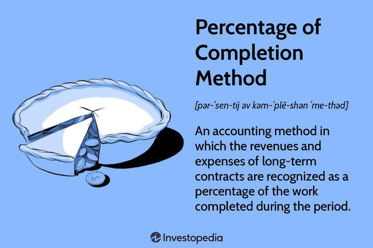

Understanding different accounting methods is crucial for accurate financial reporting, particularly in industries engaged in long-term projects. These methods determine how revenues and expenses are recognized and reported, affecting stakeholders' perception of a company's financial health. One prominent accounting method is the percentage of completion method, utilized mainly in sectors such as construction, engineering, and software development. Its significance stems from the need to provide a more realistic financial portrayal throughout the duration of extended projects.

The percentage of completion method involves recognizing revenue and expenses based on the percentage of work completed during a reporting period. This approach contrasts with the completed contract method, where revenue and expense recognition is deferred until a project's completion. By spreading revenue and expenses over the life of a project, the percentage of completion method offers a clearer picture of a company's ongoing operations and financial standing. 



In this article, we will examine the essentials of the percentage of completion accounting method, its benefits, and the potential challenges and risks inherent in its use. The method's relevance in financial reporting and its applications across various industries, including algorithmic trading, will also be addressed. We aim to provide insights into the advantages and disadvantages, along with the challenges and solutions associated with the implementation of this method, which often necessitates precise cost estimation and reliable data collection.

Additionally, the intersection of percentage of completion accounting with algorithmic trading presents an opportunity to explore its role in modern financial practices. Algorithmic trading relies on accurate, real-time financial data, and integrating this accounting method can offer enhanced decision-making capabilities and financial evaluations for ongoing projects. Understanding this interplay is essential for businesses aiming to remain competitive and compliant in today's evolving economic landscape.

## Table of Contents

## What is the Percentage of Completion Accounting Method?

The percentage of completion accounting method is a technique used to recognize revenue and expenses corresponding to the progress made on a long-term project. This method offers a more transparent and continuous reflection of a project's financial performance by accounting for income and expenses incrementally as the project progresses, rather than recognizing them only at the conclusion of the project.

Contrasting with the completed contract method, which defers all revenue and expense recognition until the project's finishing point, the percentage of completion method allows for partial recognition of profits and costs throughout the lifespan of a project. This ongoing recognition is accomplished by estimating the stage of completion of a project at any given time. Revenue and expenses are then recognized in proportion to this estimated percentage.

The advantages of the percentage of completion method are significant. It provides a consistent and realistic picture of a firm's financial performance across a project's duration, reducing [volatility](/wiki/volatility-trading-strategies) in financial statements that might occur if large revenues and expenses were only recognized upon project completion. This method aligns more closely with the accrual accounting principle, which seeks to match revenues with the expenses incurred to generate them within the same accounting period.

Typically, industries such as construction, engineering, and certain sectors involving large-scale software development use this method. The method's applicability in industries with long-term contracts stems from its ability to proportionally match revenue and expenses with the project's actual progress, thereby offering a more accurate financial outlook on ongoing projects.

Mathematical formulas play a vital role in determining the stage of completion. A standard formula for the percentage of completion is:

$$
\text{Percentage of Completion} = \frac{\text{Costs Incurred to Date}}{\text{Total Estimated Costs}}
$$

Using this formula, businesses can calculate the proportion of the contract's value that can be recognized as revenue, enabling them to maintain up-to-date financial records and provide more precise financial insights to stakeholders.

In addition to its primary use in accounting, businesses that adopt solid internal controls and technological integrations, such as automated accounting systems, can enhance the method's effectiveness, ensuring more accurate and reliable financial reporting.

## Implementation of the Percentage of Completion Method

Implementing the percentage of completion accounting method requires a robust understanding of costs and project-specific metrics to ensure accurate revenue and expenditure recognition. At the core of its implementation lies precise cost estimation, which is fundamental for correctly assessing the percentage of a project's completion. This assessment facilitates the proportional recognition of revenue and costs over the duration of a project. Various methods are adopted for these assessments, each with its unique approach and application.

One common approach is the **cost-to-cost method**. This calculation involves comparing the incurred costs to the estimated total costs of the project. The formula used in this method is:

$$
\text{Percentage of Completion} = \left( \frac{\text{Actual Costs Incurred}}{\text{Total Estimated Costs}} \right) \times 100
$$

This method provides a straightforward calculation and is heavily reliant on accurate cost forecasting and ongoing data collection.

Another method is the **efforts-expended method**, which measures progress based on the amount of effort, such as labor hours or machine hours, expended relative to estimated total effort. The formula here would be:

$$
\text{Percentage of Completion} = \left( \frac{\text{Actual Effort Expended}}{\text{Total Estimated Effort}} \right) \times 100
$$

The **units-of-delivery method**, meanwhile, recognizes revenue by tracking deliverable units completed against total units to be delivered. This approach is beneficial when deliverables are quantifiable and uniform in effort, such as in manufacturing or production environments.

Successful implementation of these methods extends beyond mere calculation. Businesses must ensure meticulous record-keeping and reliable data collection systems are in place. This ensures that each assessed percentage completion aligns closely with the project's actual progress. Maintaining precise records aids ongoing assessments and audits, fostering an accurate reflection of a project's financial standing at any given time.

Integrating strong internal controls and leveraging technology are crucial for efficient method implementation. Automated accounting tools can greatly enhance the accuracy and efficiency of data collection, calculation, and reporting processes. These tools often include built-in controls to ensure data integrity and compliance with financial regulations, effectively minimizing human error and enabling quick adjustments to project forecasts.

In conclusion, while the percentage of completion method offers significant advantages in revenue and cost recognition, its success hinges upon precise cost estimations, diligent record maintenance, and strategic technology use. By implementing these practices, businesses can enhance their financial reporting accuracy and improve decision-making processes for long-term projects.

## Applications in Financial Reporting

The percentage of completion accounting method is a critical tool in financial reporting, especially for industries with projects that span over extended periods. By aligning revenue recognition with the actual progress of a project, it helps companies manage cash flow more effectively. This method improves the predictability of income statements, thereby reducing volatility and offering stakeholders clearer insights into a company's financial standing over time.

Under the guidance of financial regulations such as ASC 606 (Revenue from Contracts with Customers) and IFRS 15 (Revenue from Contracts with Customers), the application of the percentage of completion method ensures consistent and transparent reporting practices worldwide. These regulations outline specific criteria and guidelines for revenue recognition, promoting uniformity and comparability in financial statements across different jurisdictions.

For firms engaged in large-scale software development and infrastructure projects, the percentage of completion method is particularly beneficial. By recognizing revenue and expenses in proportion to the project's progress, companies can present a more balanced view of their financial performance. This proportional recognition is calculated using various metrics such as costs incurred to date compared to total estimated costs, efforts expended, or units delivered.

Mathematically, suppose a company is working on a software development project with an estimated total cost of \$1,000,000, and to date, it has incurred costs of \$400,000. The percentage of completion can be calculated as follows:

$$
\text{Percentage of Completion} = \left( \frac{\text{Costs Incurred to Date}}{\text{Total Estimated Costs}} \right) \times 100\%
$$

$$
\text{Percentage of Completion} = \left( \frac{400,000}{1,000,000} \right) \times 100\% = 40\%
$$

Based on this calculation, the company would recognize 40% of the total contract revenue in its financial statements.

This method not only aids in painting a realistic picture of financial performance but also assists in aligning financial strategies with project timelines. By employing the percentage of completion method, firms can ensure their financial reports accurately reflect ongoing project progress, thereby optimizing financial assessment and decision-making processes.

## Challenges and Risks

Accurate initial estimation and ongoing adjustments are critical components in maintaining the integrity of the percentage of completion accounting method. Errors in these estimates can significantly distort a company's financial statements, misrepresenting both revenue and profitability. A major challenge is the need for detailed project budgets and timelines from the onset, allowing for informed and realistic expectations. Utilizing tools for predictive analytics and historical data can enhance the reliability of these estimations but necessitates a robust infrastructure for data gathering and analysis.

Managing changes in project scope and cost updates further complicates the implementation of this method. Projects rarely progress exactly as planned, and any deviations necessitate timely reassessment of the percentage of completion. This dynamic environment requires an agile financial management process capable of incorporating change orders, cost overruns, or unexpected project delays into financial projections. Effective project management practices, supported by regular reviews and updates, are essential to maintain accurate reporting.

The percentage of completion method is susceptible to manipulation for creative accounting purposes. This risk is particularly significant in industries with complex, multi-phase projects, where subjective judgments about the percentage complete can be used to defer or accelerate revenue recognition. Historical scandals have highlighted the potential for such misuse, where companies have deliberately exaggerated project progress to present a more favorable financial situation. This necessitates strict oversight and audit processes to ensure transparency and honesty in financial reporting.

Finally, regulatory changes and evolving economic environments pose additional risks. The landscape of accounting standards is continually evolving, with frameworks like ASC 606 and IFRS 15 setting guidelines for revenue recognition. These standards aim to standardize practices globally, yet require businesses to stay informed and compliant with updates. The implementation of these standards often demands thorough evaluation of existing accounting systems, possibly requiring adjustments to align with new requirements. Companies must dedicate resources to ensure ongoing compliance and adapt swiftly to regulatory changes, leveraging expert guidance to mitigate these risks effectively.

## Algorithmic Trading and Financial Reporting

Algorithmic trading leverages computer algorithms to automate financial market transactions, requiring precise and real-time financial data to optimize trading strategies. This approach has significantly transformed the modern financial landscape by enabling high-frequency trades and sophisticated data analysis. As [algorithmic trading](/wiki/algorithmic-trading) systems become increasingly integrated into financial operations, the need for accurate and timely financial data, such as that provided by the percentage of completion accounting method, becomes apparent.

Integrating the percentage of completion method with algorithmic trading systems can aid in achieving accurate financial evaluations during ongoing projects. The technique involves recognizing revenue and expenses proportionally based on the project's completion stage, allowing for a more nuanced and real-time reflection of a company's financial standing. This is particularly beneficial in environments where projects progress over extended periods and require continuous financial updates.

For example, companies engaging in large-scale infrastructure or software development projects can use the percentage of completion method to track financial progress accurately. This information, when fed into algorithmic trading systems, can enhance trading decisions by providing real-time insights into a company's operational success and the financial implications of ongoing projects. As financial markets react swiftly to changes in a company's financial health, having this up-to-date information can offer a competitive edge.

The integration of these techniques supports improved decision-making by aligning financial practices with technological advancements. Automated systems can incorporate changes in project completion status into trading algorithms, allowing for adjustments in trading strategies based on the latest available data. Additionally, the transparency provided by this accounting method can also reduce the risk of earnings manipulation, offering more consistent and reliable financial information for stakeholders.

Furthermore, employing technology such as automated accounting tools can streamline this integration process. Python, for instance, can be used to automate the calculation of project completion percentages and update algorithmic trading models. Here's a simple example of how one could use Python to calculate the percentage of completion:

```python
def calculate_percentage_of_completion(cost_incurred, total_estimated_cost):
    try:
        return (cost_incurred / total_estimated_cost) * 100
    except ZeroDivisionError:
        return 0

# Example usage
cost_incurred = 50000
total_estimated_cost = 200000
completion_percentage = calculate_percentage_of_completion(cost_incurred, total_estimated_cost)
print(f"Completion Percentage: {completion_percentage}%")
```

This script calculates the completion percentage based on the costs incurred and the total estimated cost, reflecting the proportion of the project completed. Such calculations can be embedded into larger systems that update financial models and trading algorithms automatically.

In summary, the intersection of the percentage of completion accounting method and algorithmic trading ensures that financial assessments are precise and reflect real-time developments, thus supporting responsive and informed financial operations amid an ever-evolving technological landscape.

## Conclusion

The percentage of completion accounting method stands as a robust tool for managing financial reporting in long-term, complex projects spread across various industries. Its capability to provide a more accurate representation of a company’s financial performance over time makes it indispensable for industries with extensive project timelines, such as construction and large-scale software development. By aligning revenue recognition with the actual progress of a project, this method supports better cash flow management and offers stakeholders clearer insights into a company's ongoing financial health.

However, employing the percentage of completion method demands meticulous tracking and accurate project estimates. A significant challenge is ensuring compliance with accounting standards, such as ASC 606 and IFRS 15, to prevent potential misstatements and maintain transparency in financial reporting. Missteps in estimation or failure in stringent monitoring can lead to financial inaccuracies, as seen in historical instances of creative accounting.

Incorporating the percentage of completion method with algorithmic trading systems provides an opportunity to enhance responsiveness and precision in financial operations. The integration supports real-time financial evaluations and decision-making, leveraging technological advancements to align traditional accounting practices with modern financial needs.

To remain competitive and compliant, it is imperative for businesses to leverage technology and expert insights. Automated accounting tools can facilitate the implementation of the percentage of completion method, ensuring reliable data collection and ongoing project assessments. Strong internal controls and the integration of technology are essential for effectively managing the challenges associated with this accounting approach. By embracing these strategies, businesses can optimize their financial reporting processes and adapt to the evolving economic landscape.

## References & Further Reading

[1]: ["Financial Accounting: Tools for Business Decision Making"](https://www.wiley.com/en-us/Financial+Accounting%3A+Tools+for+Business+Decision+Making%2C+10th+Edition-p-9781394184910) by Paul D. Kimmel, Jerry J. Weygandt, and Donald E. Kieso

[2]: ["Revenue Recognition: Principles and Practices"](https://accountinginsights.org/revenue-recognition-principles-methods-and-financial-impact/) by Deloitte on IFRS 15

[3]: ["Understanding ASC 606: A Comprehensive Guide"](https://kpmg.com/us/en/frv/reference-library/2024/handbook-revenue-recognition.html) by PwC

[4]: ["Cost Accounting: A Managerial Emphasis"](https://www.amazon.com/Cost-Accounting-Managerial-Emphasis-14th/dp/0132109174) by Charles T. Horngren, Srikant M. Datar, and Madhav V. Rajan

[5]: ["Algorithmic Trading and DMA: An Introduction to Direct Access Trading Strategies"](https://www.amazon.com/Algorithmic-Trading-DMA-introduction-strategies/dp/0956399207) by Barry Johnson