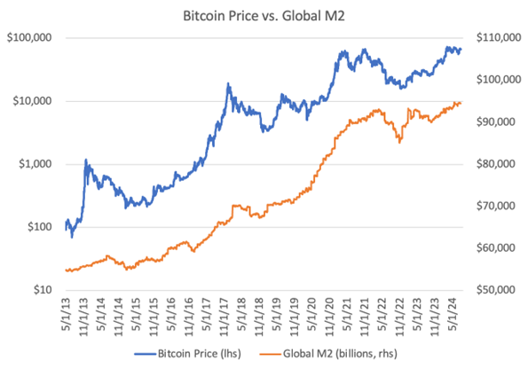

## Table of Contents

## What is Bitcoin and how does it work?

Bitcoin is a type of digital money that you can use to buy things online. It was created in 2009 by someone using the name Satoshi Nakamoto. Unlike regular money from banks, Bitcoin is not controlled by any government or central bank. Instead, it uses a technology called blockchain, which is like a public record book that keeps track of all Bitcoin transactions.

When you want to send Bitcoin to someone, you use a special computer program called a wallet. You type in how much Bitcoin you want to send and the address of the person you're sending it to. The transaction is then checked by many computers around the world, called miners. These miners solve complex math problems to add the transaction to the blockchain. Once it's added, the Bitcoin is sent to the other person's wallet. This process helps keep Bitcoin secure and prevents people from spending the same Bitcoin twice.

## What is the total market capitalization of Bitcoin?

The total market capitalization of Bitcoin is the total value of all the Bitcoin in existence. It changes all the time because the price of Bitcoin goes up and down. You can find out the current market capitalization by looking at websites that track cryptocurrency prices.

As of my last update, the market capitalization of Bitcoin was over a trillion dollars. But remember, this number can be different now because the price of Bitcoin can change a lot in a short time. If you want to know the exact number right now, you should check a live [cryptocurrency](/wiki/cryptocurrency) market data website.

## How is the global money supply measured?

The global money supply is measured by looking at all the money in the world, including cash, coins, and money in bank accounts. Economists use different ways to measure it, but the most common way is to break it down into categories like M0, M1, M2, and M3. M0 is the most basic measure and includes only physical money like coins and notes. M1 includes M0 plus money in checking accounts that you can use easily. M2 adds savings accounts and money market funds to M1, and M3 includes everything in M2 plus larger time deposits and institutional money market funds.

Each country has its own central bank that keeps track of its money supply. To get a global picture, you add up the money supply from all countries. This can be tricky because different countries use different methods to measure their money supply. Also, the global money supply changes all the time because of things like inflation, economic growth, and changes in how people use money. Keeping an eye on the global money supply helps economists understand the health of the world economy and make predictions about the future.

## What percentage of the global money supply is currently held in Bitcoin?

Bitcoin is just a small part of all the money in the world. The global money supply is really big and includes all the cash, coins, and money in bank accounts everywhere. Bitcoin's total value, or market capitalization, is much smaller than the global money supply. As of my last update, Bitcoin's market cap was over a trillion dollars, but the global money supply is in the hundreds of trillions of dollars. So, Bitcoin makes up only a tiny percentage of the total money in the world.

To figure out the exact percentage, you would need to know the current total global money supply and the current market cap of Bitcoin. Both of these numbers change all the time. The global money supply can grow because of things like inflation or more money being printed by governments. Bitcoin's value goes up and down based on what people are willing to pay for it. Right now, Bitcoin is less than 1% of the global money supply, but that number can change as Bitcoin's value and the global money supply change.

## How has the percentage of global money in Bitcoin changed over time?

When Bitcoin started in 2009, it was worth very little and only a few people knew about it. Back then, the total value of all Bitcoin was tiny compared to the huge amount of money in the world. As more people learned about Bitcoin and started using it, its value went up. By 2017, Bitcoin's value had grown a lot, and it started to make up a bigger part of the global money supply. At its peak that year, Bitcoin's market cap reached almost $300 billion, which was still a small percentage of the global money supply but much bigger than when it started.

Since then, Bitcoin's value has gone up and down a lot. In 2021, Bitcoin's market cap hit over a trillion dollars for the first time, which was a big jump from where it was before. Even though this was a huge increase, Bitcoin still only made up a tiny part of the global money supply, less than 1%. The percentage of global money in Bitcoin changes all the time because the value of Bitcoin can change a lot in a short time, and the global money supply also grows over time. So, while Bitcoin has become more important in the world of money, it is still just a small piece of the global money puzzle.

## What factors influence the percentage of global money in Bitcoin?

The percentage of global money in Bitcoin changes because of many things. One big thing is the price of Bitcoin. When more people want to buy Bitcoin and the price goes up, the total value of all Bitcoin, called the market cap, gets bigger. This makes Bitcoin a bigger part of the global money supply. But if people start selling Bitcoin and the price goes down, the market cap gets smaller, and Bitcoin becomes a smaller part of the global money supply.

Another thing that affects this percentage is how much money there is in the world. The global money supply grows when governments print more money or when people save more money in banks. If the global money supply grows faster than Bitcoin's market cap, Bitcoin will be a smaller percentage of the total money. Also, things like new laws about cryptocurrencies or big news stories can make people want to buy or sell Bitcoin, which changes its price and its part of the global money supply.

## How do different countries' adoption rates affect the global percentage of money in Bitcoin?

When more people in a country start using Bitcoin, it can make the price of Bitcoin go up. If lots of countries start using Bitcoin more, the total value of all Bitcoin, called the market cap, gets bigger. This means Bitcoin becomes a bigger part of the global money supply. For example, if a big country like the United States or China starts using Bitcoin a lot, it can really change the global percentage of money in Bitcoin because these countries have a lot of money.

But if some countries don't let people use Bitcoin or make it hard to use, it can keep the price from going up as much. If many countries do this, it can make Bitcoin a smaller part of the global money supply. So, the way different countries treat Bitcoin can push its value up or down, which changes how much of the world's money is in Bitcoin.

## What are the potential impacts of increasing the percentage of global money in Bitcoin?

If more of the world's money is in Bitcoin, it could change how people think about money and how they use it. Right now, most money is controlled by governments and banks. But Bitcoin is different because no one controls it. If more people start using Bitcoin, it might make people trust banks and governments less. They might start using Bitcoin for more things, like buying stuff online or even paying for things in stores. This could make Bitcoin more important and maybe even change how the world's money system works.

But there could also be problems if a lot more money goes into Bitcoin. Bitcoin's price can go up and down a lot, which can be risky. If people keep a lot of their money in Bitcoin and the price drops, they could lose a lot. Also, if too much money goes into Bitcoin, it might make it harder for governments to control the economy. They use things like interest rates to help the economy grow or slow down, but Bitcoin doesn't work with these tools. So, a big increase in Bitcoin's share of the world's money could make the economy more unpredictable and harder to manage.

## How do regulatory changes around the world impact the percentage of global money in Bitcoin?

When countries change their rules about Bitcoin, it can make a big difference in how much of the world's money is in Bitcoin. If a country makes it easier to use Bitcoin, more people might start using it. This can make the price of Bitcoin go up because more people want to buy it. When the price goes up, the total value of all Bitcoin, called the market cap, gets bigger. This means Bitcoin becomes a bigger part of the global money supply. For example, if a big country like the United States or China makes it easier to use Bitcoin, it can really change the global percentage of money in Bitcoin because these countries have a lot of money.

On the other hand, if a country makes it harder to use Bitcoin or even bans it, it can make the price go down. When the price goes down, the market cap gets smaller, and Bitcoin becomes a smaller part of the global money supply. If many countries do this, it can keep Bitcoin from growing and make it a smaller part of the world's money. So, the way different countries change their rules about Bitcoin can push its value up or down, which changes how much of the world's money is in Bitcoin.

## What are the economic theories behind the movement of money into Bitcoin?

One economic theory behind the movement of money into Bitcoin is the idea of store of value. People might see Bitcoin as a good way to keep their money safe from things like inflation or problems in their country's economy. If they think their own money might lose value, they might move it into Bitcoin, hoping it will keep its value or even grow. This is similar to how people might buy gold or other things that they think will hold their value over time. As more people see Bitcoin this way, more money moves into it, which can make its price go up and increase its share of the global money supply.

Another theory is about speculation and investment. Some people buy Bitcoin because they think its price will go up in the future. They might not plan to use it to buy things but instead want to sell it later for a profit. This kind of buying can drive up the price of Bitcoin, making it a bigger part of the world's money. Also, big investors like hedge funds or companies might start putting some of their money into Bitcoin, which can move a lot of money into it quickly. This can make Bitcoin's price go up a lot and change how much of the world's money is in Bitcoin.

## How do institutional investments affect the percentage of global money in Bitcoin?

When big investors like hedge funds, companies, and banks start putting their money into Bitcoin, it can make a big difference in how much of the world's money is in Bitcoin. These big investors have a lot of money, so when they decide to buy Bitcoin, it can push the price up a lot. When the price of Bitcoin goes up, the total value of all Bitcoin, called the market cap, gets bigger. This means Bitcoin becomes a bigger part of the global money supply. For example, if a big company like Tesla decides to buy a lot of Bitcoin, it can make the price go up quickly and change how much of the world's money is in Bitcoin.

But it's not just about buying Bitcoin. When these big investors start treating Bitcoin like a real investment, it can make more people think Bitcoin is important and safe to invest in. This can lead to more people buying Bitcoin, which keeps pushing the price up. As more money moves into Bitcoin from these big investors, it can make Bitcoin a bigger part of the world's money. But if these big investors start selling their Bitcoin, it can make the price go down and make Bitcoin a smaller part of the global money supply. So, what big investors do with Bitcoin can really change how much of the world's money is in it.

## What are the future projections for the percentage of global money in Bitcoin based on current trends?

Based on current trends, the percentage of global money in Bitcoin could keep growing. More and more people and big investors are starting to see Bitcoin as a good way to keep their money safe or make a profit. If this keeps happening, the price of Bitcoin might go up, making it a bigger part of the world's money. Also, if more countries start making it easier to use Bitcoin, more people might start using it for buying things or saving money. This could make Bitcoin's share of the global money supply grow even more.

But there are also things that could stop Bitcoin from growing as much. If governments start making it harder to use Bitcoin or if big investors start selling their Bitcoin, the price could go down. This would make Bitcoin a smaller part of the world's money. Also, if new kinds of money or investments come along that people like better than Bitcoin, it might not grow as much. So, while it looks like Bitcoin could become a bigger part of the global money supply, a lot depends on what happens with laws, big investors, and new technology.

## References & Further Reading

[1]: Antonopoulos, A. M. (2014). ["Mastering Bitcoin: Unlocking Digital Cryptocurrencies."](https://books.google.com/books/about/Mastering_Bitcoin.html?id=IXmrBQAAQBAJ) O'Reilly Media.

[2]: Narayanan, A., Bonneau, J., Felten, E., Miller, A., & Goldfeder, S. (2016). ["Bitcoin and Cryptocurrency Technologies: A Comprehensive Introduction."](https://press.princeton.edu/books/hardcover/9780691171692/bitcoin-and-cryptocurrency-technologies) Princeton University Press.

[3]: Peters, G. W., & Panayi, E. (2015). ["Understanding Modern Banking Ledgers through Blockchain Technologies: Future of Transaction Processing and Smart Contracts on the Internet of Money."](https://papers.ssrn.com/sol3/papers.cfm?abstract_id=2692487) arXiv preprint arXiv:1511.05740.

[4]: Bornholdt, S., & Sneppen, K. (2014). ["Do Bitcoins make the world go round? On the dynamics of Bitcoin’s price."](https://www.researchgate.net/publication/261100860_Do_Bitcoins_make_the_world_go_round_On_the_dynamics_of_competing_crypto-currencies) arXiv preprint arXiv:1403.6676.

[5]: Gandal, N., & Halaburda, H. (2014). ["Can We Predict the Winner in a Market with Network Effects? Competition in Cryptocurrency Market."](https://papers.ssrn.com/sol3/papers.cfm?abstract_id=2506463) Games.

[6]: Yermack, D. (2015). ["Is Bitcoin a real currency? An economic appraisal."](https://www.sciencedirect.com/science/article/pii/B9780128021170000023) Journal of Financial Economics, 117(3), 615-627.

[7]: Biais, B., Bisiere, C., Bouvard, M., & Casamatta, C. (2019). ["The Blockchain Folk Theorem."](https://academic.oup.com/rfs/article/32/5/1662/5427771) American Economic Journal: Microeconomics, 11(4), 1-25.

[8]: Harvey, C. R., Liu, Y., & Zhu, H. (2016). ["... and the Cross-Section of Expected Returns."](https://academic.oup.com/rfs/article/29/1/5/1843824) The Journal of Finance, 71(1), 129-174.