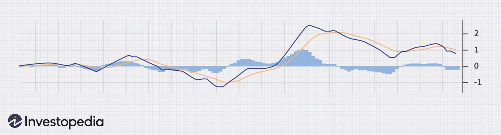

## Table of Contents

## What is the Percentage Price Oscillator (PPO) and how does it work?

The Percentage Price Oscillator (PPO) is a technical indicator used in stock market analysis to measure the difference between two moving averages as a percentage of the larger moving average. It is similar to the Moving Average Convergence Divergence (MACD) but uses percentages instead of absolute values, making it easier to compare the momentum of different stocks or indices, regardless of their price levels.

The PPO is calculated by taking the difference between a shorter-term moving average and a longer-term moving average, then dividing that difference by the longer-term moving average and multiplying by 100 to get a percentage. Traders use the PPO to identify potential buy or sell signals. When the PPO line crosses above the signal line, it may indicate a good time to buy, and when it crosses below, it might suggest a time to sell. The PPO can also help traders spot divergences between the indicator and the price, which can signal potential trend reversals.

## How is the PPO calculated?

The Percentage Price Oscillator (PPO) is calculated by first finding two moving averages of a stock's price. One is a shorter-term moving average, and the other is a longer-term moving average. You subtract the longer-term moving average from the shorter-term moving average to get the difference between them.

Next, you take that difference and divide it by the longer-term moving average. This gives you a ratio that shows how much the shorter-term average differs from the longer-term average relative to the longer-term average. Finally, you multiply this ratio by 100 to turn it into a percentage. This percentage is the PPO, which helps traders see the [momentum](/wiki/momentum) of a stock's price in a way that's easy to compare across different stocks.

## What is the difference between PPO and the Moving Average Convergence Divergence (MACD)?

The Percentage Price Oscillator (PPO) and the Moving Average Convergence Divergence (MACD) are both technical indicators used to analyze stock market trends, but they have key differences. The main difference is how they present their data. The PPO shows the difference between two moving averages as a percentage of the longer-term moving average. This makes it easier to compare the momentum of different stocks, no matter their price. On the other hand, the MACD shows the difference between the two moving averages as an absolute value, which can make it harder to compare stocks with different price levels.

Another difference is how they are calculated. To calculate the PPO, you subtract the longer-term moving average from the shorter-term moving average, then divide by the longer-term moving average and multiply by 100 to get a percentage. The MACD calculation is similar, but it doesn't involve dividing by the longer-term moving average or converting to a percentage. Instead, the MACD just subtracts the longer-term moving average from the shorter-term moving average to get a raw number. Both indicators can be used to spot buy and sell signals and identify trend reversals, but the PPO's use of percentages makes it more versatile for comparing different stocks.

## How can the PPO be used to identify bullish and bearish market trends?

The PPO helps traders spot bullish and bearish trends by looking at how its line moves compared to its signal line. When the PPO line crosses above the signal line, it's a sign that a bullish trend might be starting. This means that the shorter-term moving average is getting bigger faster than the longer-term moving average, showing that the stock's price is [picking](/wiki/asset-class-picking) up speed. Traders might see this as a good time to buy because the stock could keep going up.

On the other hand, when the PPO line crosses below the signal line, it can mean a bearish trend is starting. This happens when the shorter-term moving average starts to get smaller faster than the longer-term moving average, showing that the stock's price is losing speed. Traders might see this as a signal to sell because the stock's price could keep going down. By watching these crossovers, traders can make better choices about when to buy or sell based on the PPO's hints about the market's direction.

## What are the typical settings for the PPO and how can they be adjusted?

The typical settings for the PPO are a 12-day short-term moving average and a 26-day long-term moving average. These numbers are used because they give a good balance between being sensitive to price changes and showing a clear trend. The signal line for the PPO is often set at a 9-day moving average of the PPO itself. This helps traders see when the PPO line might cross the signal line, giving them signals to buy or sell.

You can adjust these settings to fit what you need. If you want the PPO to react faster to price changes, you might use a shorter number of days for the moving averages, like 5 days for the short-term and 10 days for the long-term. But if you want the PPO to be less jumpy and show longer trends, you could use longer periods, like 20 days for the short-term and 50 days for the long-term. The signal line can also be changed; using a shorter period like 5 days will make it react quicker, while a longer period like 15 days will make it smoother. Adjusting these settings helps you see the market the way you want, depending on how fast or slow you want your signals to be.

## How can traders use the PPO to generate buy and sell signals?

Traders use the PPO to find good times to buy or sell stocks by watching how the PPO line moves compared to the signal line. When the PPO line crosses above the signal line, it's a sign that the stock might start going up. This is called a bullish crossover. Traders see this as a good time to buy the stock because it could keep going up. They look for this signal to get in on the upward trend early.

On the other hand, when the PPO line crosses below the signal line, it's a sign that the stock might start going down. This is called a bearish crossover. Traders see this as a good time to sell the stock because it could keep going down. They use this signal to get out of the stock before it loses more value. By paying attention to these crossovers, traders can make better choices about when to buy and sell based on the PPO's hints about the market's direction.

## What are the advantages of using the PPO over other momentum indicators?

One big advantage of using the PPO over other momentum indicators is that it shows the difference between moving averages as a percentage. This makes it easier to compare how different stocks are doing, no matter their price. For example, if you're looking at a stock that costs $10 and another that costs $100, the PPO lets you see their momentum in a way that's fair to both. Other indicators, like the MACD, use raw numbers, which can make it hard to compare stocks with different price levels.

Another advantage is that the PPO can help traders spot trends and make decisions faster. Because it uses percentages, the PPO can pick up on changes in a stock's momentum more clearly. This can help traders see when it's a good time to buy or sell a stock. Plus, the PPO's signal line helps traders see when these changes are happening, making it easier to act on the information quickly.

## How does the PPO help in smoothing out price movements and reducing market noise?

The PPO helps in smoothing out price movements by using moving averages. Moving averages take the average price of a stock over a certain number of days, which makes the price line less jumpy. Instead of looking at the price every day, which can go up and down a lot, the PPO looks at these averages. This helps traders see the bigger trend without getting distracted by small, daily changes in the price. By focusing on the averages, the PPO makes it easier to understand what the stock is really doing over time.

The PPO also reduces market noise by showing the difference between a short-term and a long-term moving average as a percentage. This percentage helps traders see the momentum of the stock more clearly. When the short-term average is higher than the long-term average, it means the stock's price is moving up faster. When it's lower, it means the price is moving down faster. By using these percentages, the PPO cuts out a lot of the small, random changes in the stock's price, helping traders focus on the main trends and make better decisions.

## Can the PPO be used effectively in different market conditions, such as trending and ranging markets?

Yes, the PPO can be used effectively in both trending and ranging markets. In a trending market, where the stock's price is clearly moving up or down over time, the PPO helps traders spot when the trend might be getting stronger or weaker. When the PPO line crosses above the signal line in an uptrend, it can show that the trend is getting stronger and it might be a good time to buy. If it crosses below in a downtrend, it can mean the trend is getting stronger on the downside, signaling a good time to sell. This way, traders can use the PPO to join or leave a trend at the right times.

In a ranging market, where the stock's price moves sideways without a clear up or down trend, the PPO can still be useful. It helps traders see when the price might be getting ready to break out of the range. If the PPO line starts to move away from the signal line and then crosses it, it could mean the price is about to start trending. Traders can use these signals to get ready for a possible move up or down. By watching the PPO, traders can make better choices in different market conditions, whether the market is trending or just moving sideways.

## What are common pitfalls and mistakes to avoid when using the PPO?

One common mistake when using the PPO is relying too much on just the crossovers between the PPO line and the signal line. While these crossovers can show good times to buy or sell, they don't always work perfectly. Sometimes, the market can be choppy, and the PPO might give false signals that make traders buy or sell at the wrong times. It's important to use other tools and information along with the PPO to make better decisions.

Another pitfall is not adjusting the PPO settings to fit the market or the stock you're looking at. The usual settings of 12 and 26 days for the moving averages work well a lot of the time, but they might not be the best for every situation. If you're looking at a stock that moves a lot, you might want to use shorter periods to catch changes faster. If the stock moves slowly, longer periods might work better. Not changing the settings can make the PPO less useful and lead to missing good chances or making bad trades.

## How can the PPO be combined with other technical indicators to improve trading strategies?

Combining the PPO with other technical indicators can help traders get a better picture of the market and make smarter choices. One way to do this is by using the PPO along with the Relative Strength Index (RSI). The RSI shows if a stock is overbought or oversold, which can help traders see if a price move is likely to keep going or if it might turn around soon. When the PPO shows a bullish crossover and the RSI is not in overbought territory, it can be a strong sign to buy. On the other hand, if the PPO shows a bearish crossover and the RSI is not in oversold territory, it might be a good time to sell.

Another useful combination is using the PPO with trend lines or support and resistance levels. These can help traders see where the price might stop moving or start moving the other way. If the PPO shows a bullish crossover near a strong support level, it can be a good sign that the price might go up from there. If it shows a bearish crossover near a strong resistance level, it can mean the price might go down from there. By looking at the PPO along with these other tools, traders can get a clearer idea of what might happen next and make better trading decisions.

## What advanced techniques can be applied to the PPO for expert analysis and decision-making?

One advanced technique for using the PPO is to look for divergences between the PPO and the stock's price. A divergence happens when the stock's price goes one way, but the PPO goes the other way. For example, if the stock's price keeps going up but the PPO starts going down, it might mean the price is about to turn around and start going down too. This can help traders see when a trend might be getting weak and get ready to make a move before everyone else does.

Another technique is to use multiple time frames with the PPO. Traders can look at the PPO on a daily chart, a weekly chart, and even a monthly chart to get a fuller picture of what's going on. If the PPO shows a bullish crossover on all three time frames, it can be a very strong sign that the stock's price is about to go up a lot. By looking at different time frames, traders can see both the short-term and long-term trends and make better decisions about when to buy or sell.

## How is the Calculation of PPO performed?

To calculate the Percentage Price Oscillator (PPO), follow these steps:

1. **Compute the Exponential Moving Averages (EMAs):**
   - Calculate the 12-day EMA and the 26-day EMA of the price data. These EMAs are typically calculated using the closing prices of a security.

2. **Calculate the Percentage Difference:**
   - Subtract the 26-day EMA from the 12-day EMA.
   - Divide the result by the 26-day EMA to convert the difference into a percentage:
$$
     \text{PPO} = \left( \frac{\text{EMA}_{12} - \text{EMA}_{26}}{\text{EMA}_{26}} \right) \times 100

$$

3. **Determine the Signal Line:**
   - Calculate the 9-day EMA of the PPO. This line serves to smooth the PPO, making it easier to identify the direction and strength of trends.

4. **PPO Histogram:**
   - The histogram is derived from the difference between the PPO and its signal line. It provides a visual aid in determining the momentum and potential reversals in price direction:
$$
     \text{Histogram} = \text{PPO} - \text{Signal Line}

$$

Here is an example of how these calculations can be implemented using Python with the `pandas` library:

```python
import pandas as pd

def calculate_ema(prices, days):
    return prices.ewm(span=days, adjust=False).mean()

def calculate_ppo(prices, short_window=12, long_window=26, signal_window=9):
    ema_short = calculate_ema(prices, short_window)
    ema_long = calculate_ema(prices, long_window)

    ppo = ((ema_short - ema_long) / ema_long) * 100
    signal = calculate_ema(ppo, signal_window)
    histogram = ppo - signal

    return ppo, signal, histogram

# Assume 'prices' is a pandas Series of closing prices
# closing_prices = pd.Series([...])
# ppo, signal_line, ppo_histogram = calculate_ppo(closing_prices)
```

By using these steps, traders and analysts can leverage the PPO to assess momentum and trend strength in different securities.

## What is the comparative analysis of PPO versus MACD?

The Percentage Price Oscillator (PPO) and the Moving Average Convergence Divergence (MACD) are both prominent tools in technical analysis that help traders assess momentum and identify trends. Despite their similarities, there are distinct differences between these indicators that influence their respective applications in trading strategies.

PPO is a momentum oscillator that calculates the difference between two moving averages as a percentage of the larger moving average. The formula for PPO is:

$$
\text{PPO} = \left( \frac{\text{EMA}_{\text{short}} - \text{EMA}_{\text{long}}}{\text{EMA}_{\text{long}}} \right) \times 100
$$

where typically $\text{EMA}_{\text{short}}$ is the 12-day exponential moving average (EMA) and $\text{EMA}_{\text{long}}$ is the 26-day EMA. This percentage-based approach allows PPO to be particularly useful in comparing assets that may have vastly different price levels or in analyzing securities over different time frames. Its relative measurement is beneficial when evaluating stocks with varying volatilities or assessing market indices.

In contrast, MACD operates with absolute price differences. Its primary calculation involves subtracting the 26-day EMA from the 12-day EMA, without adjusting for the scale of the longer EMA:

$$
\text{MACD} = \text{EMA}_{\text{short}} - \text{EMA}_{\text{long}}
$$

The preference for either PPO or MACD largely hinges on the trader's specific requirements. For traders concerned with comparative analysis across various securities or time periods, PPO may offer superior insights thanks to its normalized values. Conversely, MACD's use of raw price levels makes it a fitting choice for traders who focus on the absolute valuations of securities, such as when making assessments in single-stock trading where relative comparisons are less critical.

Additionally, both indicators incorporate signal lines (typically a 9-day EMA of their respective main line) to detect potential buy or sell signals when the main line crosses the signal line. However, the effectiveness of these signals can vary depending on market conditions and the selected asset.

Therefore, selecting between PPO and MACD should consider the nature of the assets being analyzed, the importance of relative versus absolute price information, and the overall goals of the trading strategy. Incorporating either effectively necessitates an understanding of their properties and applying them in contexts where they excel.

## References & Further Reading

[1]: Murphy, J. J. (1999). ["Technical Analysis of the Financial Markets: A Comprehensive Guide to Trading Methods and Applications."](https://archive.org/details/technicalanalysi0000murp) New York Institute of Finance.

[2]: Appel, G. (2005). ["Technical Analysis: Power Tools for Active Investors."](https://www.amazon.com/Technical-Analysis-Power-Active-Investors/dp/0132930048) FT Press.

[3]: Pring, M. J. (2014). ["Technical Analysis Explained: The Successful Investor's Guide to Spotting Investment Trends and Turning Points."](https://www.amazon.com/Technical-Analysis-Explained-Fifth-Successful/dp/0071825177) McGraw-Hill Education.

[4]: Kirkpatrick II, C. D., & Dahlquist, J. R. (2010). ["Technical Analysis: The Complete Resource for Financial Market Technicians."](https://ptgmedia.pearsoncmg.com/images/9780134137049/samplepages/9780134137049.pdf) FT Press.

[5]: Elder, A. (1993). ["Trading for a Living: Psychology, Trading Tactics, Money Management."](https://www.amazon.com/Trading-Living-Psychology-Tactics-Management/dp/0471592242) Wiley.