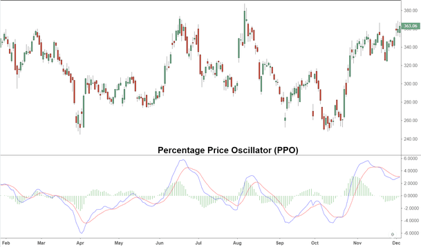

The stock market is a dynamic arena where investors continually seek tools to gain an edge. Among the myriad of approaches, technical analysis stands out with its array of valuable indicators for evaluating market trends and making informed decisions. One such indicator is the Percentage Price Oscillator (PPO), renowned for its adaptability and precision.

The PPO is a momentum oscillator that offers traders insights into the strength and direction of a security's price movement. It distinguishes itself by comparing relative changes, making it suitable for trading a diverse range of securities, regardless of their price levels. Unlike traditional momentum indicators that rely on absolute price differences, the PPO utilizes percentage differences between two Exponential Moving Averages (EMAs). This unique characteristic enables traders to perform cross-market analysis and compare securities with distinct price scales on equivalent terms.



This article focuses on the facets of the Percentage Price Oscillator, including its calculation, relevance in algorithmic trading, and the reasons it’s regarded as an "elegant indicator." In a world where precision and adaptability are key, understanding the PPO can empower traders to make more strategic, data-driven decisions.

## Table of Contents

## Understanding the Percentage Price Oscillator

The Percentage Price Oscillator (PPO) is a technical analysis tool widely used by traders and investors to assess the momentum and trend strength of securities. As a momentum oscillator, the PPO operates by comparing two exponential moving averages (EMAs) of a security's price, demonstrating its effectiveness in capturing the rate of change in price movements.

Unlike the Moving Average Convergence Divergence (MACD), which utilizes absolute price differences, the PPO employs percentage values to express these differences. This distinction is crucial, as it allows for the normalization of the indicator, making it particularly versatile and beneficial for comparing the momentum across different securities or indices. The normalization through percentage values enables analysts to apply the PPO to any security, regardless of its price level, ensuring consistent and meaningful comparative analysis.

The ability to express changes in percentage terms makes the PPO especially valuable in scenarios where comparing securities of significantly different price levels is needed. For instance, while the MACD might find it challenging to equate the momentum of a high-priced stock with a low-priced one, the PPO's percentage basis facilitates this analysis seamlessly. This feature is particularly useful for traders and investors working with diversified portfolios, as it aids in identifying relative strength or weakness across various holdings.

By serving as a [momentum](/wiki/momentum) oscillator, the PPO assists in capturing both the direction and the rate of price movements. This dual capacity positions it as an essential tool for determining entry and [exit](/wiki/exit-strategy) points, identifying potential trend reversals, and confirming the strength of existing trends. In essence, the PPO provides traders with a robust framework to interpret price dynamics through a percentage lens, enhancing the accuracy and effectiveness of trading strategies.

## Calculation of PPO

To calculate the Percentage Price Oscillator (PPO), follow these steps:

1. **Compute the Exponential Moving Averages (EMAs):**
   - Calculate the 12-day EMA and the 26-day EMA of the price data. These EMAs are typically calculated using the closing prices of a security.

2. **Calculate the Percentage Difference:**
   - Subtract the 26-day EMA from the 12-day EMA.
   - Divide the result by the 26-day EMA to convert the difference into a percentage:
$$
     \text{PPO} = \left( \frac{\text{EMA}_{12} - \text{EMA}_{26}}{\text{EMA}_{26}} \right) \times 100

$$

3. **Determine the Signal Line:**
   - Calculate the 9-day EMA of the PPO. This line serves to smooth the PPO, making it easier to identify the direction and strength of trends.

4. **PPO Histogram:**
   - The histogram is derived from the difference between the PPO and its signal line. It provides a visual aid in determining the momentum and potential reversals in price direction:
$$
     \text{Histogram} = \text{PPO} - \text{Signal Line}

$$

Here is an example of how these calculations can be implemented using Python with the `pandas` library:

```python
import pandas as pd

def calculate_ema(prices, days):
    return prices.ewm(span=days, adjust=False).mean()

def calculate_ppo(prices, short_window=12, long_window=26, signal_window=9):
    ema_short = calculate_ema(prices, short_window)
    ema_long = calculate_ema(prices, long_window)

    ppo = ((ema_short - ema_long) / ema_long) * 100
    signal = calculate_ema(ppo, signal_window)
    histogram = ppo - signal

    return ppo, signal, histogram

# Assume 'prices' is a pandas Series of closing prices
# closing_prices = pd.Series([...])
# ppo, signal_line, ppo_histogram = calculate_ppo(closing_prices)
```

By using these steps, traders and analysts can leverage the PPO to assess momentum and trend strength in different securities.

## Why Use PPO in Trading?

The Percentage Price Oscillator (PPO) is a beneficial tool in trading because it is not dependent on the absolute price of a security, allowing for accurate comparison across various price levels. This characteristic is particularly valuable when evaluating securities with significant price disparities, as it facilitates a normalized view of momentum and trend strength. By expressing changes as a percentage, PPO allows traders to more easily gauge the performance of one asset relative to another, standardizing analysis across different markets or asset classes.

PPO's primary utility lies in its ability to identify trends and measure momentum. Traders often rely on PPO to discern the direction and strength of a market trend, making it a crucial part of technical analysis. As a momentum oscillator, PPO helps traders to anticipate changes in price direction by examining the crossover events between the PPO line and its signal line. A positive PPO suggests upward momentum, while a negative value indicates downward momentum.

To enhance trading decisions, traders frequently use the PPO in conjunction with other indicators. For instance, pairing PPO with a trend-confirmation tool like the Average Directional Index (ADX) can improve the accuracy of trend assessments. This combined approach helps traders verify the strength of a trend, thereby reducing the risk of false signals.

Furthermore, many traders integrate PPO with oscillators such as the Relative Strength Index (RSI) to better identify overbought or oversold market conditions. This synergetic use of multiple indicators allows traders to capture both the broader market trend and potential reversal points, leading to more informed and strategic trading decisions.

The application of PPO in various trading strategies underscores its role as an insightful tool for dissecting market momentum and developing informed entry and exit strategies. By incorporating PPO into a broader set of technical indicators, traders can glean a multidimensional view of the market dynamics, ultimately enhancing their trading outcomes.

## PPO Algo Trading Strategies

Algorithmic trading, commonly abbreviated as algo trading, harnesses the power of computational algorithms to evaluate and execute trades at speeds and frequencies that human traders cannot match. The Percentage Price Oscillator (PPO) is effectively utilized in algo trading by focusing on signal line crossovers and zero-line crossovers, among other strategies.

### Signal Line Crossovers
A signal line crossover occurs when the PPO line crosses its signal line, which is typically a 9-day Exponential Moving Average (EMA) of the PPO. Traders interpret a PPO line crossing above the signal line as a buy signal, indicating bullish momentum, and a crossover below the signal line as a sell signal, indicating bearish momentum. In an algorithmic context, these conditions can be programmed to automate entry and exit decisions. 

For example, a basic Python code snippet to detect PPO signal line crossovers can be implemented using the pandas and numpy libraries as follows:

```python
import pandas as pd
import numpy as np

def calculate_ppo(price_data):
    ema_12 = price_data.ewm(span=12, adjust=False).mean()
    ema_26 = price_data.ewm(span=26, adjust=False).mean()
    ppo = (ema_12 - ema_26) / ema_26 * 100
    signal = ppo.ewm(span=9, adjust=False).mean()
    return ppo, signal

price_data = pd.Series([...])  # Your closing price data here
ppo, signal = calculate_ppo(price_data)

# Identifying crossovers
buy_signals = (ppo > signal) & (ppo.shift(1) <= signal.shift(1))
sell_signals = (ppo < signal) & (ppo.shift(1) >= signal.shift(1))

```

### Zero-Line Crossovers
Zero-line crossovers occur when the PPO line crosses the zero level. A movement from below to above the zero line suggests a shift to positive momentum and can be interpreted as a buy signal. Conversely, crossing from above to below the zero line indicates negative momentum and could trigger a sell signal.

### Divergence Analysis
Divergence analysis with PPO is a powerful method for identifying potential reversals. Bullish divergence arises when price forms a lower low, but the PPO forms a higher low, indicating waning bearish momentum. Conversely, bearish divergence occurs when the price makes a higher high, but the PPO forms a lower high, suggesting a potential reversal. These divergence patterns are strategic signals often integrated into algorithmic systems to pinpoint optimal entry points.

### Consistent Results through Strategy Testing
For robustness, algo-trading strategies built around PPO should be empirically tested through [backtesting](/wiki/backtesting) and forward testing. This involves assessing how the strategy performs with historical data and then evaluating its effectiveness in live market conditions without actual capital risk.

By systematically incorporating PPO-based strategies through effective signal line crossovers, zero-line crossovers, and divergence analysis, traders can develop automated trading systems that optimize decision-making and enhance trading outcomes. Regular performance adjustments and optimizations further ensure that these strategies remain well-calibrated to the complexities of dynamic market environments.

## Comparative Analysis: PPO vs. MACD

The Percentage Price Oscillator (PPO) and the Moving Average Convergence Divergence (MACD) are both prominent tools in technical analysis that help traders assess momentum and identify trends. Despite their similarities, there are distinct differences between these indicators that influence their respective applications in trading strategies.

PPO is a momentum oscillator that calculates the difference between two moving averages as a percentage of the larger moving average. The formula for PPO is:

$$
\text{PPO} = \left( \frac{\text{EMA}_{\text{short}} - \text{EMA}_{\text{long}}}{\text{EMA}_{\text{long}}} \right) \times 100
$$

where typically $\text{EMA}_{\text{short}}$ is the 12-day exponential moving average (EMA) and $\text{EMA}_{\text{long}}$ is the 26-day EMA. This percentage-based approach allows PPO to be particularly useful in comparing assets that may have vastly different price levels or in analyzing securities over different time frames. Its relative measurement is beneficial when evaluating stocks with varying volatilities or assessing market indices.

In contrast, MACD operates with absolute price differences. Its primary calculation involves subtracting the 26-day EMA from the 12-day EMA, without adjusting for the scale of the longer EMA:

$$
\text{MACD} = \text{EMA}_{\text{short}} - \text{EMA}_{\text{long}}
$$

The preference for either PPO or MACD largely hinges on the trader's specific requirements. For traders concerned with comparative analysis across various securities or time periods, PPO may offer superior insights thanks to its normalized values. Conversely, MACD's use of raw price levels makes it a fitting choice for traders who focus on the absolute valuations of securities, such as when making assessments in single-stock trading where relative comparisons are less critical.

Additionally, both indicators incorporate signal lines (typically a 9-day EMA of their respective main line) to detect potential buy or sell signals when the main line crosses the signal line. However, the effectiveness of these signals can vary depending on market conditions and the selected asset.

Therefore, selecting between PPO and MACD should consider the nature of the assets being analyzed, the importance of relative versus absolute price information, and the overall goals of the trading strategy. Incorporating either effectively necessitates an understanding of their properties and applying them in contexts where they excel.

## Application of PPO in Different Market Conditions

The Percentage Price Oscillator (PPO) is particularly effective in trending markets, where its ability to measure momentum and identify trends shines the brightest. By comparing two exponential moving averages (EMAs), traders can gauge the prevailing market trend and make informed decisions. In such markets, the PPO can help confirm the strength and direction of a trend, assisting traders in making strategic entry and exit decisions.

Despite its effectiveness in trending markets, the PPO also offers valuable insights in range-bound conditions. In these scenarios, where price movement is confined within a horizontal channel, the PPO may assist in identifying potential [breakout](/wiki/breakout-trading) points or highlight areas of momentum divergence. This capability makes it a versatile tool, even when markets are not exhibiting clear directional trends.

However, in volatile markets, the application of PPO can become more challenging. Frequent price swings often lead to whipsaws—false signals that can result in premature trades. Traders need to exercise caution and possibly combine PPO signals with other indicators to reduce the risk of these false signals.

Ultimately, understanding the market context is crucial when employing the PPO. Traders should be aware of the current market conditions—whether they are trending, range-bound, or volatile—and adjust their PPO strategy accordingly. Additionally, the incorporation of complementary technical analysis and fundamentals can enhance the effectiveness of the PPO, providing a comprehensive view that informs more robust trading decisions.

## Integrating PPO with Other Indicators

Pairing the Percentage Price Oscillator (PPO) with other indicators creates a more robust framework for trading strategies. One effective method is to combine PPO with the Average Directional Index (ADX) to enhance the reliability of signals. The ADX, a trend strength indicator, helps determine whether a security is trending and how strong that trend is. When used alongside PPO, traders can validate whether a perceived trend indicated by PPO is solid and worth acting upon. A common strategy is to look for PPO signal line crossovers that coincide with ADX readings above a certain threshold, typically 20 or 25, suggesting a strong trend.

In swing trading, where identifying extreme price conditions is crucial, integrating PPO with oscillators such as the Relative Strength Index (RSI) or the Stochastic Oscillator can increase the accuracy of entry and exit points. While PPO evaluates the momentum and trend direction, oscillators help identify overbought or oversold conditions. For instance, if the PPO indicates a bullish momentum, and the RSI shows that the market is oversold, this confluence can be a strong buy signal.

Building a comprehensive trading strategy often requires combining PPO with broader market indicators like moving averages or [volume](/wiki/volume-trading-strategy) indicators. Incorporating moving averages, such as the 50-day or 200-day averages, can offer longer-term trend perspectives that align with the momentum insights provided by PPO. Meanwhile, coupling PPO with volume indicators, such as On-Balance Volume (OBV), can verify the strength of the price movement by assessing whether the price action is supported by corresponding volume changes.

This strategic integration necessitates backtesting to optimize parameters and ensure the chosen indicators align effectively in various market conditions. By diversifying indicator inputs, traders can mitigate risks associated with relying on a single analytical tool, thereby achieving a balanced approach to market analysis.

## Limitations of PPO

The Percentage Price Oscillator (PPO) is a useful tool in technical analysis, yet it exhibits certain limitations, particularly in volatile or erratic market conditions. During such times, the PPO may produce frequent and misleading signals due to its sensitivity to price movements. This sensitivity can lead to "whipsaws," where the indicator generates numerous false signals, causing traders to enter or exit positions prematurely.

Due to its susceptibility to misinterpretation during volatile markets, it is not advisable to rely solely on the PPO for trading decisions. Instead, complementary analysis should be employed. This could involve combining PPO with other technical indicators or forms of analysis to confirm signals. For instance, using a trend-following indicator like the Average Directional Index (ADX) or a momentum indicator such as the Relative Strength Index (RSI) alongside PPO can help traders filter out false signals and better gauge market conditions.

Moreover, understanding the limitations of PPO entails rigorous backtesting and strategy optimization. By testing different market scenarios and tuning the parameters of the strategy using historical data, traders can identify the contexts in which PPO performs best and adapt it to suit diverse trading environments. This process often requires the use of [algorithmic trading](/wiki/algorithmic-trading) platforms that allow for the dynamic adjustment of strategies based on historical performance metrics.

For example, using Python, traders can backtest a strategy that integrates PPO with other indicators:

```python
import pandas as pd
import numpy as np
from talib import PPO, ADX

# Load your historical stock data
data = pd.read_csv('stock_data.csv')

# Calculate PPO and ADX
ppo = PPO(data['Close'], fastperiod=12, slowperiod=26, matype=0)
adx = ADX(data['High'], data['Low'], data['Close'], timeperiod=14)

# Define a simple strategy: Buy when PPO crosses above its signal line and ADX is above 20
signal_line = ppo.rolling(window=9).mean()
buy_signals = (ppo > signal_line) & (adx > 20)

# Resulting signals
data['Buy'] = np.where(buy_signals, 1, 0)

# Output the strategy's buy signals
print(data[data['Buy'] == 1])
```

Through comprehensive backtesting and integration with other analytical techniques, traders can better harness the benefits of PPO while mitigating its limitations, ultimately enhancing the robustness of their trading strategies.

## Conclusion

The Percentage Price Oscillator (PPO) stands out as a powerful tool for traders, offering critical insights into momentum and trend strength. Its percentage-based approach means that it's adaptable across various securities, irrespective of their absolute price levels, which is a significant advantage over other indicators. When incorporated wisely into trading strategies, PPO can significantly enhance a trader's ability to make informed decisions, providing clearer signals on market trends and potential reversals.

In addition to its inherent benefits, the future promises further advancements in the customization and integration of PPO within automated trading systems. By tailoring the parameters of the PPO, traders can fine-tune their strategies to meet specific market conditions and personal investment goals. The integration of PPO into automated trading platforms allows for the execution of trades with speed and precision, further solidifying its role as a cornerstone in a trader's analytical toolkit.

With these considerations, the PPO's adaptability and functionality offer potential for continuous improvement and innovation within modern trading methodologies. As traders seek to optimize their techniques, the exploration of advanced algorithms and system integration can lead to even finer results and a better understanding of market dynamics.

## References & Further Reading

[1]: Murphy, J. J. (1999). ["Technical Analysis of the Financial Markets: A Comprehensive Guide to Trading Methods and Applications."](https://archive.org/details/technicalanalysi0000murp) New York Institute of Finance.

[2]: Appel, G. (2005). ["Technical Analysis: Power Tools for Active Investors."](https://www.amazon.com/Technical-Analysis-Power-Active-Investors/dp/0132930048) FT Press.

[3]: Pring, M. J. (2014). ["Technical Analysis Explained: The Successful Investor's Guide to Spotting Investment Trends and Turning Points."](https://www.amazon.com/Technical-Analysis-Explained-Fifth-Successful/dp/0071825177) McGraw-Hill Education.

[4]: Kirkpatrick II, C. D., & Dahlquist, J. R. (2010). ["Technical Analysis: The Complete Resource for Financial Market Technicians."](https://ptgmedia.pearsoncmg.com/images/9780134137049/samplepages/9780134137049.pdf) FT Press.

[5]: Elder, A. (1993). ["Trading for a Living: Psychology, Trading Tactics, Money Management."](https://www.amazon.com/Trading-Living-Psychology-Tactics-Management/dp/0471592242) Wiley.