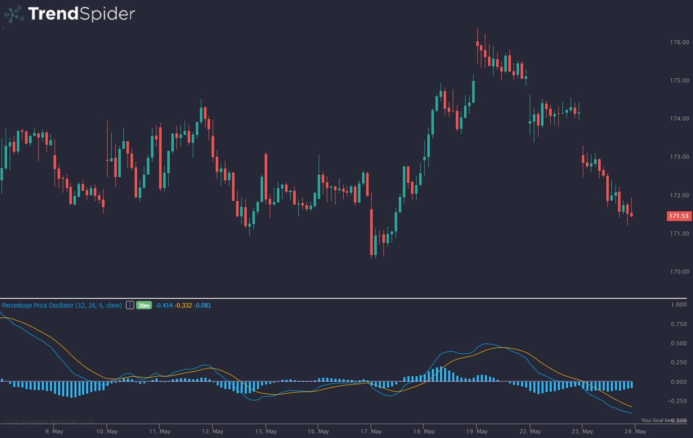

## Table of Contents

## What is the Percentage Price Oscillator (PPO) and how does it work?

The Percentage Price Oscillator (PPO) is a technical indicator used in trading to measure the difference between two moving averages of a stock's price, but it shows this difference as a percentage. This makes it easier to compare the momentum of different stocks, no matter their price. The PPO is similar to the more common MACD (Moving Average Convergence Divergence) indicator, but it uses percentages instead of absolute numbers, which helps when comparing stocks with different price levels.

To calculate the PPO, you first find the difference between a short-term moving average and a long-term moving average. Then, you divide this difference by the long-term moving average and multiply by 100 to get a percentage. Traders watch the PPO line and its signal line (which is a moving average of the PPO) to spot buy or sell signals. If the PPO line crosses above the signal line, it might be a good time to buy. If it crosses below, it might be a good time to sell. This helps traders understand the momentum and potential trend changes in a stock's price.

## How is the PPO calculated and what are its components?

The Percentage Price Oscillator (PPO) is calculated by first figuring out the short-term and long-term moving averages of a stock's price. You take the short-term moving average and subtract the long-term moving average from it. This gives you the difference between the two averages. Then, you divide this difference by the long-term moving average. Finally, you multiply the result by 100 to turn it into a percentage. This percentage is the PPO value.

The components of the PPO are the short-term moving average, the long-term moving average, and the PPO line itself. The short-term moving average is usually calculated over a shorter period, like 12 days, while the long-term moving average is calculated over a longer period, like 26 days. The PPO line is what you get after doing the calculation mentioned above. Traders also use a signal line, which is a moving average of the PPO line, usually over 9 days, to help them spot trading opportunities.

## What are the default settings for the PPO and can they be adjusted?

The default settings for the Percentage Price Oscillator (PPO) are usually set to use a 12-day short-term moving average and a 26-day long-term moving average. The signal line, which helps traders spot buy or sell signals, is typically a 9-day moving average of the PPO line. These settings are common because they work well for many traders, but they can be changed if needed.

Yes, the settings can be adjusted to fit different trading styles or timeframes. If you want to see quicker changes in the PPO, you might use shorter periods for the moving averages. If you want to see slower, more stable changes, you might use longer periods. Adjusting these settings can help you better match the PPO to the specific stocks or markets you are trading.

## How can the PPO be used to identify bullish and bearish trends?

The PPO can help spot bullish trends when the PPO line moves above the signal line. This is called a bullish crossover. It suggests that the stock's short-term momentum is getting stronger compared to its long-term momentum. Traders see this as a sign that it might be a good time to buy the stock because the price could go up. They also look for the PPO line to be above zero, which means the short-term moving average is higher than the long-term moving average, adding to the bullish signal.

On the other hand, the PPO can show bearish trends when the PPO line moves below the signal line. This is known as a bearish crossover. It indicates that the stock's short-term momentum is weakening compared to its long-term momentum. Traders might see this as a warning that it could be a good time to sell the stock because the price might go down. They also pay attention if the PPO line is below zero, which means the short-term moving average is lower than the long-term moving average, reinforcing the bearish signal.

## What is the significance of the PPO line crossing above or below the signal line?

When the PPO line crosses above the signal line, it's a sign that the stock's short-term momentum is getting stronger compared to its long-term momentum. This is called a bullish crossover. Traders see this as a good time to buy the stock because it might mean the price will go up soon. They also look to see if the PPO line is above zero, which adds to the signal that the stock could be on an upward trend.

On the flip side, when the PPO line crosses below the signal line, it's a sign that the stock's short-term momentum is getting weaker compared to its long-term momentum. This is known as a bearish crossover. Traders might see this as a warning to sell the stock because the price might go down. They also check if the PPO line is below zero, which strengthens the signal that the stock could be on a downward trend.

## How can divergence between the PPO and price action be used as a trading signal?

Divergence between the PPO and price action can be a strong hint for traders to make a move. When the price of a stock is going up, but the PPO is going down, it's called bearish divergence. This means the stock's upward momentum might be weakening, even though the price is still rising. Traders might see this as a warning sign that the price could start to fall soon, so it might be a good time to sell or get ready to sell.

On the other hand, when the price of a stock is going down, but the PPO is going up, it's called bullish divergence. This suggests that the downward momentum of the stock might be losing strength, even if the price keeps dropping. Traders could see this as a signal that the price might start to rise soon, so it could be a good time to buy or get ready to buy. By watching for these divergences, traders can get a heads-up on possible trend changes before they happen.

## What are the key differences between the PPO and the Moving Average Convergence Divergence (MACD)?

The Percentage Price Oscillator (PPO) and the Moving Average Convergence Divergence (MACD) are both used to spot trends and momentum in stock prices, but they have some key differences. The main difference is how they show the difference between two moving averages. The PPO shows this difference as a percentage, which makes it easier to compare the momentum of different stocks, no matter their price. On the other hand, the MACD shows the difference in absolute numbers, which can make it harder to compare stocks with different price levels.

Another difference is how they are calculated. Both use a short-term moving average (usually 12 days) and a long-term moving average (usually 26 days), but the PPO divides the difference between these averages by the long-term average and then multiplies by 100 to get a percentage. The MACD just subtracts the long-term average from the short-term average. This means the PPO can be more useful for comparing stocks with different price ranges, while the MACD might be better for traders who prefer working with actual price differences.

## How can the PPO be integrated into a broader trading strategy?

The PPO can be a helpful part of a bigger trading plan. It can show you when a stock might start going up or down by looking at the short-term and long-term trends. When the PPO line goes above the signal line, it's a sign that the stock might be ready to go up, so you might want to buy. When the PPO line goes below the signal line, it's a warning that the stock might go down, so you might want to sell. You can also use the PPO to spot times when the stock's price and its momentum are not moving in the same direction, which can be a good hint about future price changes.

To make the most of the PPO, you can use it with other tools and indicators. For example, you might look at the stock's price chart, other technical indicators like the Relative Strength Index (RSI), or even news and events that could affect the stock's price. By combining the PPO with these other pieces of information, you can make smarter choices about when to buy or sell. This way, the PPO becomes just one part of a bigger picture that helps you trade more confidently.

## What are common pitfalls or misinterpretations when using the PPO?

One common pitfall when using the PPO is relying too much on it alone. The PPO can give you signals about when to buy or sell a stock, but it's not perfect. Sometimes, the PPO might suggest a trend change, but the stock's price might not follow. This can happen because the PPO only looks at the stock's price and not other important factors like news or market changes. So, it's a good idea to use the PPO with other tools and information to make better trading decisions.

Another mistake is misunderstanding the signals from the PPO. For example, a bullish crossover (when the PPO line crosses above the signal line) doesn't always mean the stock's price will go up right away. It's just a hint that the short-term momentum might be getting stronger. Traders can get into trouble if they jump into a trade too quickly without waiting for more signs that the trend is really changing. It's important to be patient and look at the bigger picture before making a move based on the PPO.

## How can the PPO be used in different market conditions, such as trending vs. ranging markets?

In a trending market, the PPO can be very helpful. When the market is clearly going up or down, the PPO can show you when the trend might be getting stronger or weaker. If the PPO line goes above the signal line during an uptrend, it's a sign that the upward momentum is still strong, and you might want to keep holding or buy more. If it goes below the signal line during a downtrend, it suggests the downward momentum is still going, and you might want to keep selling or hold off on buying. The PPO can help you stay in the trend longer by giving you signals about when to adjust your trades.

In a ranging market, where the price moves sideways without a clear trend, the PPO can still be useful but in a different way. Here, you might look for times when the PPO line crosses the signal line, but you need to be careful. These crossovers can happen more often in a ranging market, and they might not always lead to big price moves. So, you might use the PPO to spot small trading opportunities within the range. For example, buying when the PPO goes above the signal line and selling when it goes below can help you make small profits as the price bounces between the range's highs and lows.

## Can the PPO be effectively used in conjunction with other technical indicators, and if so, which ones?

The PPO can work well with other technical indicators to help you make better trading choices. One good match is the Relative Strength Index (RSI), which shows if a stock is overbought or oversold. If the PPO shows a bullish crossover and the RSI is below 70, it might be a strong sign to buy. On the flip side, if the PPO shows a bearish crossover and the RSI is above 30, it might be a good time to sell. By using both indicators together, you get a fuller picture of the stock's momentum and whether it might be due for a price change.

Another useful indicator to use with the PPO is the Moving Average Convergence Divergence (MACD). Even though the PPO and MACD are similar, they can give you different views on the stock's momentum. If both the PPO and MACD show the same kind of crossover at the same time, it can be a stronger signal to buy or sell. You can also look at the stock's price chart along with these indicators. For example, if the price breaks out of a pattern and the PPO and MACD both show a bullish crossover, it might be a good time to buy because all these signs point to the stock's price going up.

## What advanced techniques can be applied to enhance the effectiveness of the PPO in expert trading scenarios?

In expert trading scenarios, one advanced technique to enhance the effectiveness of the PPO is to use multiple timeframes. Traders can look at the PPO on different chart timeframes, like daily, weekly, and monthly charts, to get a better understanding of the stock's momentum across various periods. If the PPO shows a bullish crossover on all timeframes, it can be a strong signal to buy, as it suggests a solid upward trend. Conversely, if bearish crossovers appear across multiple timeframes, it might be a clear sign to sell. This approach helps traders see the bigger picture and make more informed decisions.

Another technique is to combine the PPO with [volume](/wiki/volume-trading-strategy) analysis. By looking at the trading volume when the PPO line crosses the signal line, traders can gauge the strength of the signal. If a bullish crossover happens with high trading volume, it suggests strong buying interest and could mean the price will go up more confidently. On the other hand, if a bearish crossover occurs with low volume, it might not be as reliable a signal to sell. Additionally, experts can use custom settings for the PPO, adjusting the periods of the moving averages to fit the specific stock or market they are trading. This customization can help fine-tune the PPO to better match their trading strategy and the market conditions they are facing.

## What is the Percentage Price Oscillator (PPO) and how does it work?

The Percentage Price Oscillator (PPO) is a robust momentum indicator used by traders to analyze financial markets more effectively. It calculates the percentage difference between two exponential moving averages (EMAs) — commonly the 12-period and 26-period EMAs. This calculation allows traders to assess the rate of change in an asset's price, aiding in the detection of momentum shifts.

The formula for calculating the PPO is:

$$
\text{PPO} = \left( \frac{\text{EMA}_{\text{short}} - \text{EMA}_{\text{long}}}{\text{EMA}_{\text{long}}} \right) \times 100
$$

where $\text{EMA}_{\text{short}}$ is typically the 12-period EMA and $\text{EMA}_{\text{long}}$ is the 26-period EMA. 

PPO offers several advantages. It measures [momentum](/wiki/momentum) by reflecting how the short-term EMA relates to the long-term EMA in percentage terms. This allows traders to identify divergences, where price movements diverge from the PPO, signaling potential reversals. For example, if the price of an asset is making a new high but the PPO is not, it might indicate a weakening trend and a possible upcoming reversal.

Compared to the Moving Average Convergence Divergence (MACD), the PPO is calculated in percentage terms rather than absolute values. This characteristic makes it better suited for comparing momentum across different assets, irrespective of their price levels. Because it's percentage-based, the PPO remains consistent when analyzing assets of varying prices, whereas MACD might require adjustment when applied to different price scales.

In summary, the PPO serves as a versatile tool for assessing momentum and identifying potential trend reversals, offering a percentage-based approach that is particularly useful for evaluating assets with differing price levels.

## How do you calculate and interpret PPO?

The Percentage Price Oscillator (PPO) is a widely used technical momentum indicator that helps traders understand an asset's price dynamics. Calculating the PPO involves a straightforward mathematical process. The derivation of PPO begins with determining two key exponential moving averages (EMAs): a short-term EMA, typically over 12 periods, and a long-term EMA, usually over 26 periods. 

The formula for calculating the PPO is as follows:

$$
\text{PPO} = \left( \frac{\text{EMA}_{12} - \text{EMA}_{26}}{\text{EMA}_{26}} \right) \times 100
$$

This equation shows the percentage difference between the two EMAs, providing insights into the momentum and strength of the current price trend relative to the 26-period EMA.

Interpreting the PPO involves monitoring the PPO line itself and a signal line. The signal line is typically a 9-period EMA of the PPO, used to smooth out price movements. Traders focus on crossovers between the PPO line and the signal line to derive actionable trading signals:

1. **Bullish Signal (Buy):** This occurs when the PPO line crosses above the signal line. It indicates that the momentum is strengthening in the upward direction, suggesting a potential buy opportunity.
2. **Bearish Signal (Sell):** This occurs when the PPO line crosses below the signal line. It indicates that the momentum is weakening, suggesting a potential sell opportunity.

Additionally, the position of the PPO relative to a baseline of zero provides further interpretation:

- If the PPO is above zero, it suggests an uptrend. This indicates that the short-term EMA is greater than the long-term EMA, a sign of strength.
- If the PPO is below zero, it indicates a downtrend, meaning the short-term EMA is less than the long-term EMA, a sign of weakness.

Utilizing the PPO effectively requires traders to observe these crossovers and take the zero baseline into account, confirming the robustness of potential trend reversals or continuations in conjunction with other indicators and trading strategies.

## How does PPO compare with MACD and other momentum indicators?

The Percentage Price Oscillator (PPO) and the Moving Average Convergence Divergence (MACD) are closely related momentum indicators used by traders to assess trend strength and direction. However, the PPO distinguishes itself by presenting data in percentage terms, whereas MACD uses absolute price values. This characteristic provides PPO with the advantage of consistency across assets with diverse price ranges, making it especially useful for comparing the momentum of assets with significantly different prices.

The PPO is calculated as:

$$
\text{PPO} = \left( \frac{\text{EMA}_{12} - \text{EMA}_{26}}{\text{EMA}_{26}} \right) \times 100
$$

In comparison, the MACD is derived from the difference between the 12-period and 26-period EMAs, without normalization by the larger EMA. This fundamental difference allows the PPO to express momentum changes as a percentage, rendering it more adaptable to securities of varying prices by leveling the playing field in evaluating price movements.

Unlike the Relative Strength Index (RSI), which is designed to gauge overbought or oversold conditions by oscillating between set boundaries (usually 0 to 100), the PPO focuses on the momentum and direction of the trend. The RSI’s bounded range informs traders of extreme conditions, while the PPO provides insights into the relative strength and direction of the price trend without constraints, allowing for more flexible interpretation.

The choice between utilizing PPO or other indicators like MACD and RSI largely depends on the trader's specific goals and the prevailing market conditions. For instance, if a trader is assessing an asset where the price range significantly varies over time, the percentage-based measurement of the PPO could offer more valuable insights than the absolute value assessment provided by MACD. Conversely, in markets or scenarios where identifying overbought or oversold conditions is paramount, the RSI might be more appropriate.

Ultimately, traders often consider using a combination of these indicators to mitigate the limitations inherent in each one. By employing tools like PPO in conjunction with MACD or RSI, traders can enhance their understanding of market trends and improve decision-making processes.

## References & Further Reading

[1]: Pring, M. J. (2002). ["Technical Analysis Explained: The Successful Investor's Guide to Spotting Investment Trends and Turning Points"](https://www.amazon.com/Technical-Analysis-Explained-Fifth-Successful/dp/0071825177). McGraw-Hill.

[2]: Murphy, J. J. (1999). ["Technical Analysis of the Financial Markets: A Comprehensive Guide to Trading Methods and Applications"](https://archive.org/details/technicalanalysi0000murp). New York Institute of Finance.

[3]: Appel, G. (2008). ["Technical Analysis: Power Tools for Active Investors"](https://www.amazon.com/Technical-Analysis-Power-Active-Investors/dp/0132930048). FT Press.

[4]: Cooper, J. (2010). ["Advanced Technical Analysis of ETFs"](https://onlinelibrary.wiley.com/doi/book/10.1002/9781118531884). Bloomberg Press.

[5]: Kirkpatrick, C. D., & Dahlquist, J. R. (2010). ["Technical Analysis: The Complete Resource for Financial Market Technicians"](https://ptgmedia.pearsoncmg.com/images/9780134137049/samplepages/9780134137049.pdf). FT Press.