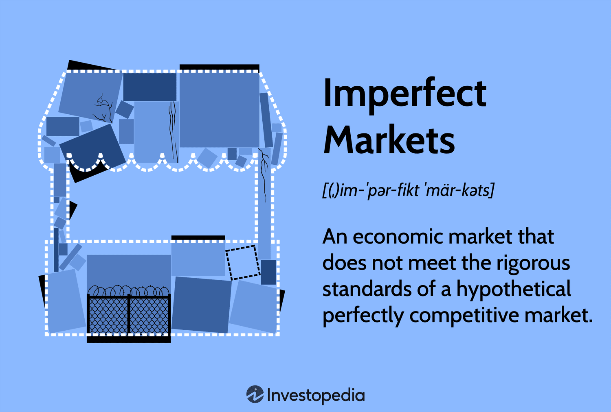

Market structures are fundamental to economics and trading, significantly influencing how businesses operate and compete. These structures are largely defined by the characteristics of perfect and imperfect competition, which determine the dynamics observable in various markets. Perfect competition represents an ideal market scenario with numerous small firms offering identical products, leading to standardized prices. In contrast, imperfect competition encompasses a range of market situations like monopolies and oligopolies, where individual firms wield more control over pricing and market entry is often restricted.

Recently, algorithmic trading, commonly known as algo trading, has emerged as a significant force in financial markets. This method utilizes advanced computer algorithms to automate trading decisions, executing trades at unprecedented speeds and volumes. The rise of algo trading has introduced a new facet to market competition, where technological prowess can be as crucial as price or product quality. Algo trading influences both perfectly competitive and imperfectly competitive markets, reshaping traditional patterns of market behavior.

This article explores the characteristics of perfect and imperfect competition while examining the growing influence of algorithmic trading within these market structures. By analyzing these elements, the article aims to provide insights into how businesses and traders can navigate the evolving landscape of modern markets.

## Table of Contents

## Understanding Perfect Competition

Perfect competition represents an idealized market structure where numerous small firms operate within the same industry, selling identical or homogeneous products. In this context, no individual firm possesses the power to influence market prices, effectively making all firms price takers. This equality in market power, theoretically, ensures optimal distribution of resources and fosters an environment of utmost efficiency.

Key characteristics of perfect competition include the presence of homogeneous products, which means that the goods offered by various sellers are identical and interchangeable. Consequently, consumers are indifferent to the source of a product, focusing solely on price. Additionally, perfect competition is marked by the absence of barriers to entry and [exit](/wiki/exit-strategy). This implies that firms can freely enter or leave the market based on their economic interests, fostering perpetual competition.

Another critical aspect is the availability of perfect information. All market participants, both buyers and sellers, have complete and instantaneous knowledge of prices, product quality, and technological advancements. This transparency negates any competitive advantage based on information asymmetry and ensures that prices always reflect true supply and demand dynamics.

One real-world example of a market approximating perfect competition is the agricultural sector. In this domain, products such as wheat or corn are largely standardized, with minimal differentiation between different producers' outputs. Farmers, acting as individual sellers, have little to no influence on the market price and must accept prevailing rates.

However, perfect competition remains largely theoretical, as achieving such an ideal condition in real markets is challenging due to factors like product differentiation and imperfect information. Nonetheless, understanding this model helps in evaluating market efficiency and the degree to which real markets deviate from this benchmark.

## The Reality of Imperfect Competition

Imperfect competition represents a market scenario wherein conditions diverge from those of perfect competition. Unlike perfect competition, where countless small firms sell identical products and act as price takers, imperfect competition encompasses market structures such as monopolies, oligopolies, and monopolistic competition. These structures allow firms to wield some market power, enabling them to influence prices and engage in non-price competition through strategies like advertising and product differentiation.

### Market Power and Non-Price Competition

In monopolies, a single firm dominates the entire market, often resulting in significant control over prices due to a lack of competition. This dominance permits the monopolist to set prices above marginal cost, leading to higher profits. Monopolies can arise from unique control over a resource, government regulation, or economies of scale that prevent new entrants.

Oligopolies, on the other hand, feature a small number of large firms that hold significant market power. These firms often engage in strategic interactions, where the actions of one firm influence the decisions of others. Oligopolistic firms tend to focus on non-price competition, utilizing advertising and product innovation to differentiate themselves. The game theory concept of Nash equilibrium often applies, as firms make decisions based on the expected actions of competitors.

Monopolistic competition involves many firms selling differentiated products. Each firm holds some market power, allowing price setting above marginal cost, but with less control than a monopoly. Product differentiation, either real or perceived, is crucial here, leading to vigorous non-price competition, primarily through marketing and quality improvements.

### Barriers to Entry

Imperfectly competitive markets typically have higher barriers to entry compared to perfectly competitive markets. Barriers can be structural, such as high initial investment costs or complex technology, or strategic, where incumbent firms take actions to deter new entrants, like price wars or creating customer loyalty through branding.

These barriers enable firms to sustain market power and earn economic profits over time. Economic profit, defined as total revenue minus total cost (including both explicit and implicit costs), is a key feature distinguishing these markets from perfect competition, where firms can only achieve normal profits in the long run.

### Real-World Examples

The technology sector exemplifies imperfect competition, particularly demonstrating characteristics of oligopoly and monopoly. Companies like Google command significant market shares, leveraging network effects and vast resources to maintain their positions. Google's dominance in search engines showcases how high barriers to entry, such as proprietary algorithms and massive user bases, protect its market power. Consequently, Google's ability to influence prices for advertising and control the dissemination of information highlights the profound implications of imperfect competition.

By understanding imperfect competition, stakeholders can better comprehend how firms operate and compete in markets where not all participants are equal. Recognizing the dynamics of market power and entry barriers is essential for navigating such landscapes effectively.

## Market Structures and Their Impact on Competition

Market structures greatly influence how firms compete and operate within an economy. Each structure presents unique characteristics that dictate the strategic behavior of firms and the overall market dynamics. 

In a perfectly competitive market, efficiency and price competition are paramount. Firms in such environments are price takers due to the homogeneity of products and the sheer number of competitors, each holding a minor share of the market. This structure encourages firms to operate at optimal efficiency to survive, as they must offer the lowest possible prices to attract consumers. The equation for the marginal cost $MC$, typically used in this context, aligns with the market price $P$:

$$
MC = P
$$

This ensures that resources are allocated in the most efficient manner possible, driving economic welfare. Agricultural markets and online platforms selling standardized products often display characteristics close to perfect competition.

Conversely, imperfect competition, which includes monopolistic competition, oligopoly, and monopoly, provides a breeding ground for innovation and product differentiation. Firms have significant market power and can set prices above marginal cost to earn economic profits. This freedom allows them to invest in research and development, creating differentiated products that cater to niche markets or customer preferences. Common strategies include branding and marketing to create perceived value among consumers. The Lerner Index is a useful measure in such markets, indicating the degree of market power:

$$
L = \frac{P - MC}{P}
$$

where $L$ represents the Lerner Index, $P$ the price set by the firm, and $MC$ the marginal cost. A higher Lerner Index suggests greater market power and deviation from perfect competition.

Understanding these market structures is crucial for businesses in formulating their competitive strategies. In perfect competition, strategies revolve around cost minimization and scale efficiency. Meanwhile, in imperfectly competitive markets, strategies focus on differentiation, innovation, and overcoming barriers to entry. Businesses tailoring their approaches based on the market structure they operate within can achieve competitive advantage and sustain profitability.

## The Rise of Algorithmic Trading

Algorithmic trading, often referred to as algo trading, represents a paradigm shift in the financial markets by employing computer algorithms to execute trades at unprecedented speeds and volumes. Unlike human traders, these algorithms can analyze vast amounts of data in real-time, optimize trading strategies, and react to market fluctuations within milliseconds. This capability significantly enhances the efficiency of trading operations and lowers transaction costs, presenting both challenges and opportunities across different market structures.

Algo trading operates in both perfect and imperfect markets, altering the competitive landscape by focusing on speed, technological prowess, and data analytics rather than merely on the traditional competitive variables like product quality and pricing. In perfect competition, where firms are price takers and products are homogeneous, algo trading can enhance market [liquidity](/wiki/liquidity-risk-premium) and price accuracy. It allows small traders to access market opportunities quickly, thereby reducing the bid-ask spread and enhancing the overall market efficiency. 

Conversely, in imperfectly competitive markets, which include structures like monopolies and oligopolies, algos can potentially accentuate dominant players' advantages. Large firms with substantial resources can develop more sophisticated algorithms, giving them a competitive edge in executing large volumes of trades while maintaining minimal impact on market prices. This can reinforce existing market structures and barriers to entry, as smaller firms may struggle to compete on the same technological level.

Furthermore, [algorithmic trading](/wiki/algorithmic-trading) is often reliant on high-frequency trading ([HFT](/wiki/high-frequency-trading-strategies)) strategies, which leverage minimal price differentials to execute numerous trades over short periods. This strategy aims for profit margins on small price changes and involves high turnover rates, which can only be realized with the speed and precision of computer algorithms. However, these activities also raise concerns about market [volatility](/wiki/volatility-trading-strategies) and fairness, as rapid trading could lead to flash crashes or create systemic risks. 

In summary, algorithmic trading is reshaping the financial markets by integrating speed and technology into the trading process. While it democratizes market participation to some extent, it also necessitates robust regulatory frameworks to prevent potential abuses and ensure that market advantages do not disproportionately favor technologically superior entities.

## How Algo Trading Interacts with Market Structures

Algorithmic trading, known as algo trading, plays a significant role in shaping interactions within different market structures by utilizing sophisticated computer algorithms to execute trades rapidly and efficiently. In a perfect competition market, algo trading primarily contributes to increased efficiency and reduction of transaction costs. These markets, characterized by numerous small firms and homogenous products, benefit from the automated systems that algo trading offers, as these systems allow for streamlined execution of trades without human intervention, thus minimizing human error and reaction time. Consequently, this enhances liquidity and narrows bid-ask spreads, ultimately leading to cost savings for traders and investors. 

The role of algo trading in imperfect competition is more complex, as it may reinforce existing market power dynamics. In markets where companies hold significant influence, such as monopolies or oligopolies, large firms with extensive resources can leverage algo trading to maintain or enhance their market dominance. This advantage arises from the capability to execute a large [volume](/wiki/volume-trading-strategy) of trades quickly, analyze market data in real time, and react faster than smaller competitors. For example, high-frequency trading, a subset of algo trading, can exacerbate discrepancies between large institutional investors and smaller market participants, potentially leading to unfair competitive edges in the market.

Regulation and ethical considerations are crucial in managing the impact of algo trading within these market structures. Effective regulatory frameworks are necessary to prevent practices that could lead to market manipulation or unfair advantages. For instance, regulations could include restrictions on certain types of high-frequency trading strategies or the implementation of circuit breakers during extreme market volatility. Ensuring ethical conduct and transparency in algorithmic strategies is essential for maintaining fair competition and protecting smaller entities from being unduly disadvantaged.

In summary, while algo trading enhances efficiency in perfect competition, it poses the risk of entrenching power imbalances in imperfect markets, underscoring the need for careful regulatory oversight.

## Conclusion

Market structures are instrumental in framing economic dynamics and competition, with perfect and imperfect competition serving as the foundational concepts. These structures influence how businesses strategize, compete, and ultimately succeed or fail in the market. In the context of perfect competition, firms become price takers in environments characterized by homogeneity and transparency. Conversely, imperfect competition, evidenced by monopolies and oligopolies, allows for greater market power and potential for economic profits.

Algorithmic trading has emerged as a transformative force within these market structures, offering both opportunities and challenges. It introduces a paradigm shift by emphasizing technology and speed over traditional factors such as product differentiation and price negotiation. This shift has implications for all market participants. Algo trading enhances market efficiency in structures akin to perfect competition by reducing transaction costs and enabling rapid trade execution. However, in monopolistic or oligopolistic environments, it may exacerbate existing inequalities by fortifying the dominance of large players through technological superiority.

The evolution of markets necessitates that businesses and investors remain vigilant and informed about these structural dynamics and the role of technologies like algorithmic trading. Being equipped with up-to-date knowledge and strategic insights allows for better navigation of the competitive landscape, ensuring informed decision-making processes. As market conditions and technologies continue to evolve, maintaining a robust understanding of these foundational concepts remains crucial for success and sustainability in the economic arena.

## References & Further Reading

[1]: Sutton, J. (1991). ["Sunk Costs and Market Structure: Price Competition, Advertising, and the Evolution of Concentration"](https://archive.org/details/sunkcostsmarkets0000sutt). MIT Press.

[2]: Varian, H. R. (1992). ["Microeconomic Analysis"](https://archive.org/details/microeconomicana00vari_0). W.W. Norton & Company.

[3]: ["The Econometrics of Financial Markets"](https://press.princeton.edu/books/hardcover/9780691043012/the-econometrics-of-financial-markets) by John Y. Campbell, Andrew W. Lo, and A. Craig MacKinlay

[4]: Harris, L. (2003). ["Trading and Exchanges: Market Microstructure for Practitioners"](https://academic.oup.com/book/52292). Oxford University Press.

[5]: O'Hara, M. (1995). ["Market Microstructure Theory"](https://www.semanticscholar.org/paper/Market-Microstructure-Theory-O'Hara/2bd0833b023f3270a2a6bf301e86b8e02e2f28ed). Blackwell Publishers.

[6]: Hasbrouck, J. (2007). ["Empirical Market Microstructure: The Institutions, Economics, and Econometrics of Securities Trading"](https://academic.oup.com/book/52241). Oxford University Press.

[7]: Fabozzi, F. J., Focardi, S. M., & Jonas, C. (2008). ["High Frequency Trading: New Realities for Traders, Markets and Regulators"](https://www.semanticscholar.org/paper/Quantitative-Equity-Investing%3A-Techniques-and-Fabozzi-Focardi/1c49a2a53919f7e65cb96f16691b8ff726fd3cd7)

[8]: ["Flash Boys: A Wall Street Revolt"](https://en.wikipedia.org/wiki/Flash_Boys) by Michael Lewis

[9]: Malkiel, B. G. (1999). ["A Random Walk Down Wall Street"](https://yourknowledgedigest.org/wp-content/uploads/2020/04/a-random-walk-down-wall-street.pdf). W.W. Norton & Company.