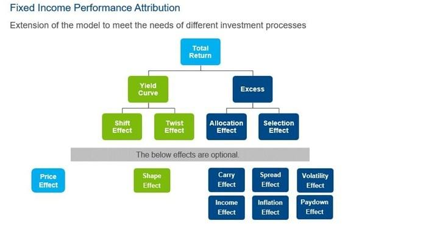

## Table of Contents

## What is performance attribution?

Performance attribution is a way to figure out why an investment did well or not so well. It helps investors understand which parts of their choices, like which stocks they picked or how they spread their money, made a difference in their overall results. By breaking down the performance, investors can see if their decisions were smart or if they got lucky because of market trends.

For example, if an investor's portfolio did better than a general market index, performance attribution can show if this was because they chose stocks that did better than average, or if it was because they invested more in a sector that happened to do well that year. This information is useful because it helps investors make better choices in the future, focusing on what really works and avoiding mistakes.

## Why is performance attribution important in investment management?

Performance attribution is important in investment management because it helps investors figure out what made their investments do well or poorly. It breaks down the performance of a portfolio into different parts, like the choice of stocks, the timing of buys and sells, and how money was spread across different areas. By understanding these parts, investors can see if their good results came from smart choices or just luck. This helps them know what they did right and what they could do better next time.

Knowing the reasons behind performance also helps investors make smarter decisions in the future. For example, if performance attribution shows that picking certain stocks was the key to success, an investor might decide to focus more on choosing good stocks rather than trying to guess market trends. This way, they can improve their strategies and hopefully get better results over time. Performance attribution turns the mystery of investment performance into clear, useful information that guides better investing.

## What are the main components of performance attribution?

Performance attribution breaks down why an investment did well or not so well into a few main parts. One part is the allocation effect, which looks at how money was spread across different areas like stocks, bonds, or different industries. If an investor put a lot of money into technology stocks and those stocks did well, the allocation effect would show that this choice helped the overall performance. Another part is the selection effect, which looks at how well the individual investments, like specific stocks, performed compared to others in their category. If an investor picked a stock that did much better than other stocks in the same industry, the selection effect would highlight this as a reason for good performance.

Another important part is the interaction effect, which shows how the allocation and selection effects work together. For example, if an investor put a lot of money into a sector and also picked the best stocks within that sector, the interaction effect would show how these two choices combined to boost performance. Timing and currency effects can also play a role, especially in global portfolios. Timing effect looks at whether buying or selling investments at certain times helped or hurt performance, while currency effect considers how changes in exchange rates affected returns from investments in different countries. By understanding these components, investors can see exactly what drove their investment results and make smarter decisions in the future.

## How does performance attribution differ from performance measurement?

Performance measurement is like looking at the final score of a game. It tells you the overall result of how an investment did over a certain time. For example, if you invested in a bunch of stocks, performance measurement would show you if you made money or lost money, and by how much. It's a straightforward way to see if your investments did well compared to a benchmark, like a stock market index.

Performance attribution, on the other hand, is like figuring out which players on a team helped win the game and how. It goes deeper than just the final score. It breaks down the overall performance into different parts to show why the investment did well or poorly. For instance, it can tell you if picking certain stocks or putting more money into a specific industry was what made your investment successful. By understanding these details, investors can learn from their choices and make better decisions next time.

## What are the common methods used for performance attribution?

One common method for performance attribution is the Brinson model. This method breaks down performance into three parts: allocation effect, selection effect, and interaction effect. The allocation effect looks at how spreading money across different areas, like stocks or bonds, affected performance. The selection effect checks how well the individual investments, like picking specific stocks, did compared to others in the same group. The interaction effect shows how these two choices worked together. The Brinson model is popular because it helps investors see exactly where their good or bad results came from.

Another method is the multi-factor model. This approach uses different factors, like size of companies, value versus growth, or momentum, to explain why investments performed the way they did. It's like saying, "Did your stocks do well because you picked big companies, or because they were growing fast?" This method can be more detailed and helps investors understand how different market conditions affected their choices. Both the Brinson model and the multi-factor model are useful tools for investors to learn from their past decisions and improve their strategies in the future.

## Can you explain the difference between top-down and bottom-up attribution approaches?

Top-down and bottom-up are two ways to do performance attribution, and they look at things from different angles. In a top-down approach, you start by looking at the big picture, like how you spread your money across different types of investments or industries. For example, if you put a lot of money into tech stocks and they did well, the top-down approach would focus on how this choice helped your overall performance. It's like saying, "I did well because I invested in the right areas." This method is useful for understanding how your big decisions affected your results.

On the other hand, the bottom-up approach starts with the smaller details, like the performance of individual stocks or bonds. It asks, "Did my stocks do well because I picked the best ones, or did they just happen to be in a sector that did well?" For instance, if you picked a stock that did much better than other stocks in its industry, the bottom-up approach would highlight this as a reason for your good performance. This method helps you see if your success came from smart choices at the individual investment level. Both approaches are important because they give you different insights into what drove your investment results.

## How do you calculate the contribution of asset allocation to portfolio performance?

To calculate the contribution of asset allocation to portfolio performance, you need to compare how much of your money was put into different types of investments, like stocks or bonds, with how those types of investments did overall. Let's say you put 60% of your money into stocks and 40% into bonds. If stocks did better than bonds during that time, and your portfolio did better than a benchmark, the extra performance might come from your decision to put more money into stocks. You figure out this contribution by looking at the difference between the actual return of your portfolio and what it would have been if you had invested the same way as the benchmark.

For example, if the benchmark had 50% in stocks and 50% in bonds, and stocks returned 10% while bonds returned 5%, your portfolio with 60% stocks would have a higher return just because of the allocation. To find out exactly how much asset allocation helped, you calculate the return of your portfolio based on the benchmark's allocation and then subtract that from your actual portfolio return. The difference is the contribution from your asset allocation decision. This helps you see if your choice to invest more in stocks, for instance, was a smart move that boosted your performance.

## What role does sector selection play in performance attribution?

Sector selection is a big part of performance attribution. It looks at how choosing to invest in certain industries, like tech or healthcare, affected how your whole investment did. If you put a lot of money into a sector that did really well, like tech stocks during a boom, your overall performance might be better because of that choice. Sector selection helps you see if your decision to focus on certain areas was a smart move that made your investments do better.

Understanding sector selection is useful because it tells you if your good results came from picking the right industries or if it was just luck. For example, if you invested heavily in energy stocks and they did well because oil prices went up, knowing this can help you decide if you should keep focusing on energy or if you were just lucky. By breaking down your performance this way, you can make better choices in the future and hopefully get even better results.

## How can performance attribution help in identifying the sources of excess returns?

Performance attribution helps investors figure out where the extra money they made came from. It breaks down their investment results into different parts, like choosing the right stocks or putting money into the best industries. By looking at these parts, investors can see if their extra returns came from smart choices or just because the market was doing well. For example, if someone's portfolio did better than a general market index, performance attribution could show if it was because they picked stocks that did better than average or because they invested more in a sector that happened to do well that year.

Understanding where the extra returns came from is important because it helps investors make better decisions in the future. If performance attribution shows that picking certain stocks was the key to success, an investor might focus more on choosing good stocks rather than trying to guess market trends. This way, they can keep doing what worked well and avoid repeating mistakes. By knowing exactly what drove their investment results, investors can turn their past performance into useful lessons for making smarter choices going forward.

## What are the challenges and limitations of performance attribution models?

Performance attribution models have some challenges and limitations. One big challenge is that they can be hard to use correctly. These models need a lot of data and math to work right, and if you make a mistake with the numbers or the way you do the math, you might get the wrong answers. Also, these models often look at past performance, but what happened before might not tell you what will happen next. The market can change in ways that are hard to predict, so even if a model says you did well because of certain choices, those choices might not work the same way in the future.

Another limitation is that performance attribution models can miss some important details. For example, they might not fully account for things like how much risk you took or how much it cost to buy and sell investments. These models also assume that you can easily separate the effects of different choices, like picking stocks versus picking industries, but in real life, these things are often connected and hard to pull apart. So while performance attribution models can help you understand your past investments, they are not perfect and should be used carefully, knowing they might not catch everything that affects your results.

## How do multi-factor models enhance performance attribution analysis?

Multi-factor models make performance attribution analysis better by looking at more than just the big choices like which stocks or industries to invest in. They consider different things, or "factors," that can affect how investments do. These factors could be the size of the companies you invest in, whether they are growing fast or not, or if they are doing better than others recently. By using these factors, multi-factor models help investors see why their investments did well or not so well in a more detailed way. For example, if your portfolio did better than a general market index, a multi-factor model might show that it was because you picked companies that were growing fast, not just because you invested in the right industry.

Using multi-factor models can help investors understand the different reasons behind their investment results. This makes it easier to figure out if their good performance came from smart choices or just luck. By knowing which factors made a difference, investors can focus on what worked and try to do more of that in the future. For instance, if the model shows that picking stocks based on their momentum was key to your success, you might decide to pay more attention to that when making future investments. This way, multi-factor models give a clearer picture of what drives investment performance, helping investors make better decisions.

## What advanced techniques can be used to improve the accuracy of performance attribution in complex portfolios?

To improve the accuracy of performance attribution in complex portfolios, one advanced technique is using risk-adjusted performance attribution. This method looks at how much risk you took to get your returns. It helps you see if your good results came from smart choices or just from taking bigger risks. For example, if your portfolio did well but you took a lot of risk, this technique would show that your success might not be as great as it looks because of the extra risk. By considering risk, you get a clearer picture of what really drove your performance.

Another technique is using machine learning and artificial intelligence. These tools can handle a lot of data and find patterns that might be hard for people to see. For instance, machine learning can look at tons of information about stocks, industries, and market trends to figure out what made your investments do well or poorly. It can also keep learning and getting better over time, which means it can give you more accurate insights as it gets more data. Using these advanced techniques can help you understand your complex portfolio better and make smarter investment decisions in the future.

## What is Understanding Performance Attribution?

Performance attribution is a methodical analysis examining how each element of a trading strategy influences its overall success. The core objective is to discern the decisions or actions leading to either positive or negative trading outcomes. By breaking down the strategy into individual components, traders can pinpoint which aspects are effective and which need refinement.

Key metrics are instrumental in performance attribution. The Sharpe Ratio, for instance, measures the return of a trading strategy relative to its risk. Mathematically, the Sharpe Ratio is given by:

$$
\text{Sharpe Ratio} = \frac{E[R_p - R_f]}{\sigma_p}
$$

where $E[R_p - R_f]$ is the expected return of the portfolio minus the risk-free rate, and $\sigma_p$ is the standard deviation of the portfolio's excess return. A higher Sharpe Ratio indicates a more favorable risk-adjusted return.

Another important metric is Maximum Drawdown, which quantifies the largest peak-to-trough decline in the portfolio value over a specific period. It provides insights into the potential risks and capital loss a strategy might experience, guiding risk management decisions. 

Win Rate and Profit Factor are also crucial. Win Rate measures the percentage of profitable trades versus total trades, offering a perspective on the strategy's reliability. Profit Factor, the ratio of gross profits to gross losses, assesses the overall profitability of the algorithm.

These metrics collectively enable traders to dissect their algorithm's performance. By understanding how each component contributes to the strategy's overall effectiveness, traders can make informed adjustments, enhancing their algorithms' robustness and adaptability in dynamic markets. Thus, performance attribution serves not only to evaluate past performances but also to optimize future trading strategies.

## What are the Key Metrics for Performance Attribution?

One of the most important metrics in performance attribution for [algorithmic trading](/wiki/algorithmic-trading) is the Sharpe Ratio. This metric evaluates the returns generated by a trading strategy relative to the risk taken. It is calculated by subtracting the risk-free rate from the average return of the portfolio and dividing the result by the standard deviation of the portfolio returns. Mathematically, the Sharpe Ratio is expressed as:

$$
\text{Sharpe Ratio} = \frac{R_p - R_f}{\sigma_p}
$$

where $R_p$ is the average return of the portfolio, $R_f$ is the risk-free rate, and $\sigma_p$ is the standard deviation of the portfolio returns. A higher Sharpe Ratio indicates a more favorable risk-adjusted return, making it a critical tool for assessing the risk-efficiency of trading strategies.

Maximum Drawdown is another crucial metric, offering insights into the largest peak-to-trough decline in a trading strategy’s portfolio value. This measure is essential for evaluating potential risks, as it highlights the worst cumulative loss an investor could have experienced. Maximum Drawdown helps traders adjust their risk management strategies to mitigate substantial losses.

Win Rate and Profit Factor are pivotal in understanding the efficiency and profitability of trading algorithms. The Win Rate is the ratio of successful trades to the total number of trades, providing a straightforward measure of a strategy’s success rate. However, a high win rate alone does not guarantee profitability, which is where the Profit Factor becomes significant. The Profit Factor is the ratio of the gross profit to the gross loss, calculated as:

$$
\text{Profit Factor} = \frac{\text{Gross Profit}}{\text{Gross Loss}}
$$

A Profit Factor greater than one indicates that the strategy is profitable, while a value less than one implies losses.

Together, these metrics—Sharpe Ratio, Maximum Drawdown, Win Rate, and Profit Factor—facilitate a comprehensive evaluation of each component of a trading algorithm, enabling traders to discern what positively or negatively impacts performance. By analyzing these metrics, traders can effectively optimize their strategies, ensuring better risk management and improved financial outcomes.

## References & Further Reading

[1]: Bergstra, J., Bardenet, R., Bengio, Y., & Kégl, B. (2011). ["Algorithms for Hyper-Parameter Optimization."](https://papers.nips.cc/paper/4443-algorithms-for-hyper-parameter-optimization) Advances in Neural Information Processing Systems 24.

[2]: ["Advances in Financial Machine Learning"](https://www.amazon.com/Advances-Financial-Machine-Learning-Marcos/dp/1119482089) by Marcos Lopez de Prado

[3]: ["Evidence-Based Technical Analysis: Applying the Scientific Method and Statistical Inference to Trading Signals"](https://www.amazon.com/Evidence-Based-Technical-Analysis-Scientific-Statistical/dp/0470008741) by David Aronson

[4]: ["Machine Learning for Algorithmic Trading"](https://github.com/stefan-jansen/machine-learning-for-trading) by Stefan Jansen

[5]: ["Quantitative Trading: How to Build Your Own Algorithmic Trading Business"](https://www.amazon.com/Quantitative-Trading-Build-Algorithmic-Business/dp/0470284889) by Ernest P. Chan