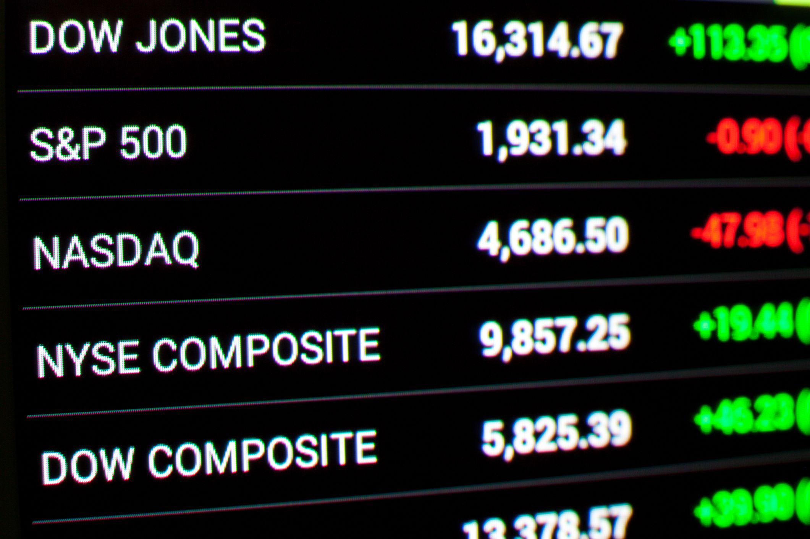

The article explores the intersection of financial index investment, performance indices, and algorithmic trading, three pivotal components that are reshaping modern financial strategies. As global markets become increasingly complex, investors and financial professionals are leveraging these elements to optimize investment outcomes and maintain a competitive edge. Understanding the synergy between these components is crucial for achieving superior trading performance in today's fast-paced financial environment.

Financial index investment, rooted in the analysis of aggregated performance data, serves as a cornerstone in creating broad exposure to market activities. By investing in indices such as the S&P 500 or the Dow Jones Industrial Average, traders can gain insights into the overall health and trends of markets. These indices act as benchmarks, allowing investors to evaluate and compare their portfolio's performance against general market movements.



Performance indices add another layer of sophistication to market analysis. Unlike traditional indices that focus on price movements, performance-based indices incorporate total return factors, including dividends and capital gains. This approach provides a more comprehensive view of an investment's value, enabling a deeper understanding of potential returns.

Algorithmic trading, a product of advances in technology and data analytics, integrates seamlessly with index data to enhance investment strategies. Algorithms process large volumes of data at unprecedented speeds, executing trades with precision and efficiency. By automating decision-making based on predefined criteria and complex mathematical models, algorithmic trading minimizes human error and capitalizes on fleeting market opportunities.

This article aims to provide a comprehensive guide to leveraging index data and algorithmic tools to achieve superior trading performance. Readers will gain insights into how financial index investment, performance indices, and algorithmic strategies converge to form the backbone of effective modern-day investment techniques. The exploration includes detailed discussions on the mechanisms, benefits, and challenges associated with each component, backed by practical examples and insights into future trends.

Structured strategically, the article begins with foundational knowledge on financial indexes, proceeds to explore the intricacies of performance-based indices, and investigates into index investment strategies. Further sections focus on algorithmic trading and its integration with index data, examining both the advantages and potential pitfalls of this high-tech approach. Finally, the article projects future directions for these intertwined elements, encouraging readers to stay informed and adaptive in the technologically driven financial world.

## Table of Contents

## Understanding Financial Indexes

A financial index is a statistical representation that aggregates performance data from a particular sector of the financial market, including stocks, bonds, or commodities. These indices serve as benchmarks, enabling investors and analysts to evaluate both the performance of specific investments and broader market trends. Financial indices are composed of selected securities that together aim to reflect the market or a market sector's performance.

### Types of Financial Indexes

There are several types of financial indices, each designed to meet specific analytical needs and objectives. Some of the most common types include:

1. **Price-Weighted Indexes:** These indices, such as the Dow Jones Industrial Average (DJIA), weight constituent stocks by their price per share. The index value is calculated by adding the prices of all constituent stocks and dividing by a divisor.

2. **Market Capitalization-Weighted Indexes:** In a market capitalization-weighted or value-weighted index, like the S&P 500, each stock's weight is proportional to its market capitalization. This method reflects the total market value of a company rather than its price per share. 
$$
   \text{Market Capitalization} = \text{Share Price} \times \text{Total Number of Shares}

$$

3. **Equal-Weighted Indexes:** Each constituent of an equal-weighted index, such as the S&P 500 Equal Weight Index, is given the same weight, regardless of its market capitalization or price. This approach provides a balanced exposure to all constituents.

4. **Sector and Industry Indexes:** These indices track specific sectors or industries, allowing investors to assess sector-specific performance. Examples include the Nasdaq Biotechnology Index or the S&P 500 Information Technology Index.

5. **Bond and Commodity Indexes:** Composed of various bonds or commodities, these indices reflect the performance of their respective markets. The Bloomberg Barclays U.S. Aggregate Bond Index is a notable example.

### Applications in Economic Performance Evaluation

Financial indices are essential for evaluating economic performance and guiding investment strategies. They offer insights into market conditions, helping investors make informed decisions. For instance, the S&P 500 is often viewed as a barometer of the U.S. economy due to its wide market capitalization coverage.

### Index Composition Criteria

The composition of financial indices is governed by specific criteria, ensuring their relevance and accuracy:

- **Market Capitalization:** Larger companies typically have a greater influence in market cap-weighted indices. 

- **Liquidity:** Stocks must have sufficient trading volume to be included, facilitating smooth index tracking and trading.

- **Sector Representation:** Indices often seek to represent a proportionate share of various sectors within an economy.

- **Geographic Coverage:** Some indices focus on specific countries or regions, providing localized economic insights.

Understanding these factors enables investors to effectively utilize indices as tools for benchmarking and developing strategic investment portfolios. As financial markets evolve, indices continue to adapt, encompassing a wider array of asset classes and investment strategies.

## The Concept of Performance-Based Indices

Performance-based indices are distinguished from standard price indices by incorporating comprehensive factors such as dividends and capital gains. This comprehensive approach offers a more complete picture of financial market performance, beyond simply tracking asset price movement. Unlike standard indices, which may only reflect price changes, performance-based indices provide insight into the total returns an investor can expect, which includes incomes earned from dividends and reinvested gains.

One of the chief benefits of using performance-based indices is achieving a fuller financial analysis. For investors, understanding the total return—rather than just price movements—offers a more accurate depiction of investment outcomes. For instance, during periods of market stability, dividends may contribute significantly to overall portfolio performance, a detail that would be missed when exclusively focusing on price. This distinction provides investors with a clearer understanding of the true performance of their investments, especially when comparing similar assets or strategies.

A comparison between non-performance indices and performance-based indices highlights these differences. Consider the S&P 500, a non-performance index that tracks the price of 500 leading publicly traded companies in the United States. This index provides a snapshot of market trends but does not account for the dividends these companies pay to their shareholders. In contrast, the DAX (Deutscher Aktienindex) in Germany is a performance-based index that includes dividends in its calculations. By reflecting dividends, the DAX provides a measure of total return, which often presents a more favorable picture of investment performance compared to a mere price index like the S&P 500.

Total return indices, which integrate dividends and capital gains, hold essential significance in delivering a holistic view of portfolio performance. Such indices offer vital insights into the overall effectiveness of investment strategies over time. For portfolio managers and investors, these indices allow for a deeper analysis of financial markets by presenting data that encompass both price appreciation and periodic income benefits.

However, the adoption of performance-based index calculations comes with certain challenges and considerations. Calculating total returns involves accounting for reinvested dividends, which requires accurate data collection and adjustment methodologies. Moreover, the complexity of calculating capital gains requires precise tracking of asset sales and purchases to ensure that indices accurately reflect performance after accounting for all relevant factors. Furthermore, the varying frequency and irregular announcement of special dividends can introduce additional complexity.

In conclusion, performance-based indices offer an intricate and comprehensive means of evaluating investment performance by incorporating elements that traditional price indices overlook. Understanding the benefits and challenges of these indices is crucial for investors and financial analysts aiming to attain a complete and accurate picture of market dynamics and investment outcomes.

## Exploring Index Investment Strategies

Index investing entails constructing a financial portfolio that replicates the composition of a specific financial index, such as the S&P 500 or the Dow Jones Industrial Average. This approach aligns investments with the index's performance, providing a straightforward method to track market trends and capture broad market returns. Index investing's appeal lies in its potential to offer diversification, cost-effectiveness, and simplicity.

One of the primary advantages of index investing is diversification. By investing in a wide array of securities that comprise an index, investors reduce the risk associated with holding individual stocks. This diversification helps mitigate the impact of poor performance from a single company since each security in the index has a limited influence on the portfolio's overall performance.

Index investing is also recognized for its cost-effectiveness. Traditional active management strategies require frequent buy-and-sell actions to exploit market anomalies, incurring higher transaction costs and management fees. In contrast, index funds and exchange-traded funds (ETFs) that follow an index have lower turnover rates, leading to reduced fees and less tax liability over time. This attribute makes index investing particularly appealing to cost-sensitive investors seeking long-term investment growth.

Mutual funds and ETFs are two primary vehicles for index investing. Mutual funds pool money from multiple investors to purchase a basket of assets that mirror an index. These funds often have a minimum investment requirement and are traded at the end of the trading day at the net asset value. ETFs, on the other hand, trade like stocks on an exchange and provide the flexibility of buying and selling shares throughout the trading day. Unlike mutual funds, ETFs usually have lower expense ratios, making them an increasingly popular choice for index investors seeking [liquidity](/wiki/liquidity-risk-premium) and cost efficiency.

Passive investment strategies stand out in index investing for their role in risk reduction and efficient market participation. Instead of attempting to outperform the market through active management, passive strategies focus on achieving returns consistent with the market. This approach assumes that markets efficiently price securities, and thus efforts to outperform are typically futile over the long term. Research has shown that a majority of active managers underperform broad market indices, solidifying the validity of passive strategies designed to match, rather than beat, the market.

Historical evidence provides successful examples of index investment strategies. Consider the case of Warren Buffett's 2008 challenge to hedge funds via a 10-year bet. He wagered that a low-cost S&P 500 index fund would outperform a collection of hedge funds over a decade. By 2017, the index fund had generated notably higher returns than the hedge funds, illustrating the power of passive investing and the efficiency of index funds in capturing broader market movements.

Index investing strategies, therefore, rely on harnessing the collective wisdom of the market while emphasizing broad diversification and reduced costs. This investment approach not only simplifies the investment process but also aligns with the efficient market hypothesis, offering investors a robust foundation for achieving competitive returns over the long haul.

## Algorithmic Trading: Enhancing Investment Outcomes

Algorithmic trading refers to the use of computer algorithms to automate trading orders based on predefined criteria. This technique plays a pivotal role in modern finance by enhancing the speed and accuracy of trading operations, thus allowing financial institutions and individual traders to capitalize on market fluctuations with increased efficiency.

By integrating [algorithmic trading](/wiki/algorithmic-trading) with index data, traders can make strategic decisions that align closely with market dynamics. Index data provides real-time performance metrics of specific sections of the market, making it a valuable input for developing robust trading algorithms. For instance, an algorithm could be designed to buy stocks when an index indicates an upward market trend and sell when a downturn is predicted, thereby optimizing investment outcomes.

The primary benefits of algorithmic trading include speed, efficiency, and precision. Automated systems can execute trades in fractions of a second, far quicker than a human trader could, thereby capitalizing on short-lived market opportunities. Efficiency is enhanced as algorithms can process vast amounts of data without fatigue and execute trades across multiple markets and Exchanges simultaneously. Precision in executing trades is also improved, as algorithms can automatically execute orders that meet predefined conditions without the risk of human error.

Despite these advantages, algorithmic trading brings potential challenges and risks. High-frequency trading ([HFT](/wiki/high-frequency-trading-strategies)), a subset of algorithmic trading, can contribute to market [volatility](/wiki/volatility-trading-strategies) and may lead to significant price swings caused by the rapid execution of transactions. Automated decision-making can also result in considerable losses if algorithms are poorly designed or if they fail to adapt to unforeseen market scenarios or changes in regulatory policies.

Common algorithmic trading strategies include trend-following and index [arbitrage](/wiki/arbitrage). Trend-following strategies attempt to capture gains through the analysis of an asset's [momentum](/wiki/momentum) in a particular direction. For example, a moving average crossover strategy is a basic form of trend-following. Conversely, index arbitrage involves taking advantage of price discrepancies between a stock index futures contract and the actual stocks in that index. If the futures price deviates from the index price beyond a certain threshold, an arbitrage opportunity arises where traders simultaneously buy or sell the assets to exploit the difference.

Algorithmic trading continues to evolve, driven by advancements in technology and increased market data availability. Robust algorithms, when combined with comprehensive index data, have the potential to significantly enhance trading performance, although traders must remain vigilant about the risks of automation and market volatility.

## Leveraging Index Data in Algorithmic Trading

Algorithmic trading systems utilize index data to enhance the precision and efficiency of trade execution. By integrating comprehensive datasets from financial indices, these systems can generate actionable insights and automate trading decisions. Key indices provide a benchmark, assisting algorithms in identifying market trends and aligning trading strategies with index movements.

The primary benefit of employing algorithmic trading methods with index data lies in their capability to streamline the trading process. Algorithms can process vast amounts of index data at speeds unattainable by human traders, ensuring rapid response to market changes. This capability is crucial in capturing short-lived opportunities and maintaining competitive edge in fast-paced financial markets.

Python is a widely-used programming language for developing trading algorithms due to its simplicity and extensive libraries, such as NumPy for numerical computations and Pandas for data manipulation. These tools facilitate the implementation of trading strategies that react dynamically to index data.

A common example of using Python to build a trading strategy is the moving average crossover. This strategy involves two moving averages: a shorter-term moving average and a longer-term one. The basic idea is to place a buy order when the shorter-term moving average crosses above the longer-term moving average and a sell order when it crosses below.

Here is a simplified Python example implementing a moving average crossover strategy:

```python
import pandas as pd
import numpy as np

# Load index data
data = pd.read_csv('index_data.csv')
data['Date'] = pd.to_datetime(data['Date'])
data.set_index('Date', inplace=True)

# Calculate moving averages
short_window = 40
long_window = 100

data['Short_MA'] = data['Close'].rolling(window=short_window, min_periods=1).mean()
data['Long_MA'] = data['Close'].rolling(window=long_window, min_periods=1).mean()

# Generate signals
data['Signal'] = 0
data['Signal'][short_window:] = np.where(data['Short_MA'][short_window:] > data['Long_MA'][short_window:], 1, 0)
data['Position'] = data['Signal'].diff()

# Print signals for trades
print(data[(data['Position'] == 1) | (data['Position'] == -1)])
```

In this code, the strategy generates a 'buy' signal when the short moving average exceeds the long moving average and a 'sell' signal when it falls below. This simplistic approach helps illustrate the potential for algorithmic systems to leverage index data in identifying trading signals.

However, strategy calibration is critical to ensure algorithms provide reliable outcomes. Backtesting with historical index data enables developers to tune parameters and evaluate the strategy's robustness. It is essential to consider potential overfitting and adapt algorithms to handle unforeseen market volatility. Unexpected shifts can lead to significant deviations in performance if not accounted for, emphasizing the importance of adaptive strategy refinement.

## Advantages and Disadvantages of Algo-Trading with Indexes

Algorithmic trading, in conjunction with index investments, offers several advantages, notably enhancing trading efficiency and execution precision. Algorithms can handle large volumes of data at high speed, enabling traders to seize opportunities within milliseconds, a feat unattainable through manual trading approaches. This rapid execution capability can be particularly beneficial when tracking indices, which comprise numerous underlying assets. The cost-effectiveness of algorithmic trading is another advantage, as it reduces the need for extensive human resource allocation and minimizes emotional biases, leading to more consistent decision-making.

However, the reliance on automated systems introduces potential risks and volatility. One significant risk is the exposure to market flash crashes, which are sudden price drops caused by automated trades triggering one another. Additionally, algorithms may misinterpret market data due to unforeseen events, leading to substantial financial losses. Technical failures can also halt trading operations, highlighting the vulnerability of systems that lack manual intervention.

Mitigation strategies are crucial in managing these risks. First, deploying circuit breakers can prevent extreme losses by pausing trading during abnormal market conditions. Second, rigorous testing and [backtesting](/wiki/backtesting) of algorithmic models ensure they perform robustly under various market scenarios. Regular audits and updates of trading algorithms are also vital to address evolving market dynamics and regulatory requirements.

In comparing human trading strategies with algorithmic methods, algorithms generally outperform humans in terms of speed and efficiency. They can process vast amounts of data simultaneously, execute trades instantaneously based on predefined criteria, and operate continuously without fatigue or emotional interference. Human traders, conversely, bring intuition and strategic adaptability to the table, which can be crucial in dynamic or unforeseen market conditions.

Human oversight remains indispensable in maximizing the benefits of algo-trading. Humans provide critical judgment that complements algorithmic processes, ensuring that trading models align with strategic objectives and ethical standards. Continuous monitoring allows for adaptive interventions when market environments change rapidly or when algorithms behave unpredictably. Ultimately, a synergistic approach that combines algorithmic precision with human insight can lead to optimal trading outcomes.

## Future Directions for Index Investment and Algorithmic Trading

As the landscape of financial markets continues to evolve, index investment and algorithmic trading strategies are poised to undergo significant transformations driven by technological advancements and shifting investment paradigms. The integration of emerging technologies such as [artificial intelligence](/wiki/ai-artificial-intelligence) (AI), [machine learning](/wiki/machine-learning) (ML), and blockchain promises to redefine how investors approach markets, offering both new opportunities and challenges.

AI and ML technologies are increasingly being integrated into investment strategies to enhance decision-making processes through data analysis and predictive modeling. These technologies facilitate the assessment of large datasets, enabling the identification of hidden patterns and trends that traditional analysis might overlook. By employing AI and ML, algorithmic trading systems can improve their predictive accuracy and adaptability, leading to more informed trading decisions. For instance, machine learning algorithms can be trained to recognize complex market signals, using historical data to predict future price movements with a level of sophistication that exceeds conventional methods.

Blockchain technology also presents transformative potential for index investment and algorithmic trading. Its decentralized nature and ability to ensure transparency and security could revolutionize how transactions are settled and recorded. Smart contracts, self-executing contracts with the terms of the agreement directly written into code, are poised to automate a variety of processes within trading strategies, reducing the time and costs associated with traditional financial transactions. This could enhance the efficiency and reliability of trading systems, particularly in terms of clearing and settlement operations.

As financial markets evolve, investors and institutions must adapt to a rapidly changing environment. The transition towards algorithmic investments will necessitate updates in regulatory frameworks to effectively manage risks associated with automated systems. In response, there is a growing focus on the development of robust risk management practices and the importance of maintaining human oversight to ensure that algorithmic strategies align with overarching investment goals and ethical standards.

Looking ahead, the integration of index investment strategies with automated trading systems is likely to become more seamless, leveraging AI and ML to achieve greater levels of precision and profitability. The ongoing expansion of decentralized finance (DeFi) platforms, which use blockchain technology, may further facilitate the democratization of investment access and innovation in financial products.

Investors are encouraged to embrace these new technological tools, adapting their strategies to harness the potential benefits of enhanced efficiency and market insights. Continuous learning and proactive engagement with emerging technologies will be vital, enabling investors to stay ahead of market trends and capitalize on new opportunities as they arise. As the financial landscape continues to transform, the integration of advanced technologies will likely redefine the dynamics of index investment and algorithmic trading, shaping the strategies of tomorrow's markets.

## Conclusion

The symbiotic relationship between index investment, performance indices, and algorithmic trading forms a cornerstone of modern financial strategies. These components, when combined, create a robust framework for optimizing investment outcomes. Index investments provide the foundation by offering diversification and aligning with market benchmarks. Performance indices enhance this by incorporating factors like dividends and capital gains, providing a more comprehensive measure of market performance. Algorithmic trading, meanwhile, leverages technology to analyze and execute trades with speed and precision, utilizing data from these indices for informed decision-making.

The integration of index data with algorithmic trading strategies significantly enhances investment results. By incorporating comprehensive market information, investors can better anticipate market trends and execute trades that align with their strategic goals. This collaboration allows for more sophisticated risk management and the potential for higher returns. However, the fast-paced nature of algorithmic trading necessitates a commitment to staying informed and adaptive. The financial landscape is continuously evolving with technological advancements, and success hinges on the ability to adapt to these changes.

Leveraging indexes and algorithmic trading effectively requires an emphasis on continuous learning and proactive strategy development. Investors are encouraged to deepen their understanding of these tools and remain vigilant in their application. Engaging with new research, enhancing programming skills, and participating in educational opportunities can provide valuable insights and capabilities. Additionally, maintaining human oversight in automated processes ensures that the benefits of technology are fully realized while mitigating associated risks.

Ultimately, the combined use of index investment, performance indices, and algorithmic trading offers a powerful approach for achieving financial success. Through informed decisions and adaptive strategies, investors can harness these tools to navigate the complexities of modern financial markets and achieve their investment objectives.

## References & Further Reading

### References & Further Reading

To further your understanding of index investment, algorithmic trading, and financial market strategies, consider the following resources:

**Books:**
1. **"A Random Walk Down Wall Street" by Burton G. Malkiel**  
   This book provides comprehensive insights into index funds and market efficiency, advocating for index investing as a reliable approach for individual investors.

2. **"Algorithmic Trading: Winning Strategies and Their Rationale" by Ernie Chan**  
   Ernie Chan discusses algorithmic trading strategies with practical case studies and Python code examples, making it a valuable resource for both novices and experienced traders.

3. **"The Little Book of Common Sense Investing" by John C. Bogle**  
   John Bogle, the father of index funds, explains the power of index investing for accumulating wealth over the long term.

**Articles and Research Papers:**
1. **"The Origins and Evolution of High-Frequency Trading" - Journal of Applied Finance**  
   This paper explores the development and impact of high-frequency trading on modern markets.

2. **"Trading Strategies with Predictive Machine Learning Models" - Quantitative Finance and Economics**  
   Explores the integration of machine learning with algorithmic trading, including the use of predictive models for market strategies.

3. **"The Performance of Performance-Based Indices"**  
   A comparative study examining the benefits and limitations of performance-based indices versus traditional indices like the S&P 500.

**Online Courses and Workshops:**
1. **Coursera: "Machine Learning for Trading" offered by Georgia Institute of Technology**  
   A practical exploration of using machine learning algorithms to design and implement trading strategies.

2. **edX: "Algorithmic Trading and Finance Models with Python, R, and Stata Essential Training"**  
   This [course](/wiki/best-algorithmic-trading-courses) includes practical training on using programming tools for developing and backtesting trading models.

**Professional Networks and Communities:**
1. **CFA Institute**  
   Provides access to a range of resources including articles, webinars, and networking opportunities for finance professionals.

2. **Algorithmic Traders Association**  
   A community focused on providing resources, workshops, and networking events for trading professionals interested in algorithmic methodologies.

By exploring these resources, readers can gain a deeper understanding of the complex interplay between index investments and algorithmic trading, while enhancing their professional knowledge and skills.

