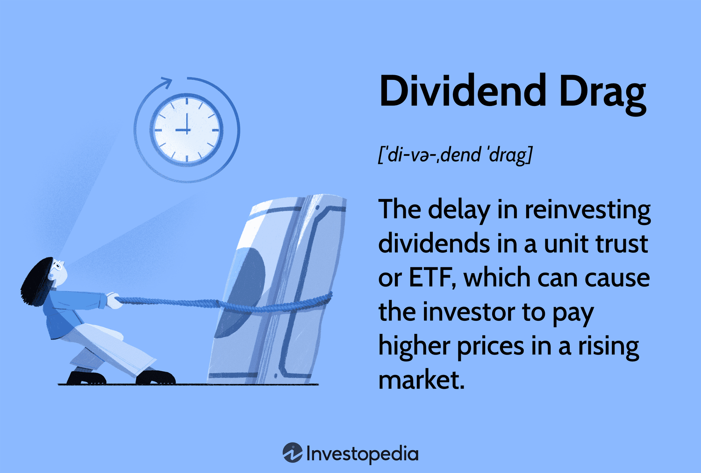

In the fast-paced world of trading, algorithmic trading, also known as algo trading, has carved out a significant niche. This method leverages computer algorithms to execute trades at speeds and frequencies unreachable by human traders, resulting in heightened efficiency and swiftness. Algo trading employs strategies that can analyze vast amounts of data and execute decisions within fractions of a second, giving traders a substantial edge in the financial markets.

However, much like any trading strategy, algo trading is not without its challenges. A key challenge faced by traders is the concept of performance drag. This phenomenon refers to the shortfall in returns due to various unaccounted trading costs, which can undermine the intended performance of algorithmic strategies. Performance drag represents the contrast between the theoretical returns from an algorithmic strategy and the actual returns once all associated expenses are considered. These costs can significantly reduce efficiency, thus becoming a critical aspect for traders to address.



This article aims to explore performance drag in algorithmic trading, examining its causes, providing concrete examples, and discussing strategies to mitigate its impact. Understanding these elements can assist traders in optimizing their returns and maintaining a competitive advantage, ultimately enhancing the net effectiveness of their algorithmic trading activities.

## Table of Contents

## Understanding Performance Drag

Performance drag is a crucial aspect to consider in algorithmic trading, as it denotes the disparities between anticipated investment returns and the actual results after accounting for various trading costs. These costs can significantly hinder the efficiency and effectiveness of an algorithmic trading system, making it vital for traders to be cognizant of their impact.

The theoretical return of an investment is calculated based on ideal conditions, often without factoring in real-world expenses associated with trading. However, when these associated expenses are included, such as transaction costs, market impact, and opportunity costs, the realized return tends to be lower than initially expected. This shortfall is what is known as performance drag.

Mathematically, performance drag can be expressed as:

$$
\text{Performance Drag} = \text{Theoretical Return} - \text{Realized Return}
$$

Where:
- $\text{Theoretical Return}$ is the expected gain from a trading strategy under optimal conditions.
- $\text{Realized Return}$ is the actual profit after all trading costs and market impacts have been accounted for.

These factors are multidimensional, with transaction costs such as commissions and the bid-ask spread being among the most direct contributors. Meanwhile, indirect costs, like the opportunity cost of holding cash or missed investment opportunities due to execution delays, further exacerbate the issue.

In [algorithmic trading](/wiki/algorithmic-trading), where high-frequency and high-[volume](/wiki/volume-trading-strategy) trading strategies are prevalent, even small inefficiencies or costs can accumulate, significantly affecting net returns over time. Therefore, understanding and managing these costs is critical for optimizing the performance and profitability of algorithmic trading systems. Enhanced awareness and strategic management of performance drag are necessary for maintaining a competitive edge in the trading industry.

## Common Causes of Performance Drag

A variety of factors contribute to performance drag in algorithmic trading. Below are some common contributors:

1. **Transaction Costs:** Regular fees such as commissions and the bid-ask spread consume a portion of returns. Algorithmic trading often involves high-frequency transactions, which can substantially increase these costs. For example, if an algorithm executes thousands of trades per day, even a small commission per trade can accumulate into a significant expense that reduces net returns. Similarly, the bid-ask spread—the difference between the buying price (ask) and the selling price (bid)—represents an implicit transaction cost that traders need to overcome to achieve profitability.

2. **Execution Delays:** Time lags in executing trades can lead to differences between expected and actual outcomes. Algorithms often rely on real-time data to make decisions, but network latency, exchange processing times, or inefficient algorithm design can cause delays. These timing discrepancies may prevent trades from being completed at the anticipated prices, leading to slippage. Slippage occurs when the actual transaction price deviates from the expected price, generally resulting in less favorable trade execution.

3. **Taxes:** Tax obligations can take a heavy toll on realized returns. Different jurisdictions impose various tax rates and structures on financial gains, and frequent trading can trigger short-term capital gains taxes, which are often higher than long-term capital gains taxes. The tax impact can be particularly significant for high-frequency traders who realize gains quickly and frequently, as these gains are typically taxed at ordinary income rates.

4. **Cash Drag:** Holding a significant portion of a portfolio in cash can lead to forgone investment opportunities and diminished returns. In algorithmic trading, maintaining cash reserves is sometimes necessary to manage liquidity and meet margin requirements. However, excessive cash holding limits the amount of capital actively working in the market, reducing potential returns. This situation highlights the importance of effectively balancing cash with active investments to optimize a trading strategy's performance.

## Examples of Performance Drag in Algo Trading

Consider a scenario where a trader incurs brokerage commissions to execute trades. Over time, these fees accumulate and significantly impact net returns. Brokerage commissions represent a constant outflow, reducing the overall profit margin. For instance, a trader engaged in high-frequency trading ([HFT](/wiki/high-frequency-trading-strategies)) might execute thousands of trades in a single day. If each trade incurs a commission fee, even as low as $0.01 per trade, the cumulative cost over the [course](/wiki/best-algorithmic-trading-courses) of a trading day can be substantial, leading to noticeable performance drag.

Another example of performance drag arises from execution delays. Algorithmic trading systems rely on precise timing to exploit market inefficiencies. However, these systems can experience lags due to various factors such as network latency or the processing speed of trading infrastructure. Such delays can result in missed opportunities, as the price at the time of order execution may differ from the price anticipated by the algorithm. This discrepancy can yield suboptimal trading outcomes.

For instance, consider an algorithm designed to buy a security at $100 and sell at $105. If an execution delay causes the buy order to be executed at $102 instead, the potential profit margin reduces significantly, illustrating how critical timing is in algorithmic trading.

In addition, taxes form another pivotal example of performance drag. In some jurisdictions, frequent trading activities can lead to a higher tax burden, particularly if short-term capital gains are taxed at a higher rate than long-term gains. This tax impact needs careful consideration when trying to generate consistent net returns, as it can erode the gains that strategies seek to achieve. Understanding these examples of performance drag is crucial for traders to refine their strategies and enhance the actual returns of their trading portfolios.

## Strategies to Mitigate Performance Drag

While performance drag is a persistent [factor](/wiki/factor-investing) in algorithmic trading, several strategies can help traders minimize its impact:

1. **Cost Management**: Efficiently managing transaction costs is crucial for reducing performance drag. Traders can optimize execution by employing advanced order types such as limit orders, which can help in securing better prices, or by executing bulk transactions to lower the per-trade fees. Here's a simple Python code snippet to illustrate how bulk ordering could be calculated for transaction cost savings:

    ```python
    def calculate_bulk_order_cost(order_size, price_per_unit, discount_factor):
        initial_cost = order_size * price_per_unit
        discounted_cost = initial_cost * (1 - discount_factor)
        return discounted_cost

    order_size = 1000
    price_per_unit = 50
    discount_factor = 0.02  # 2% discount for bulk order
    print("Bulk Order Cost:", calculate_bulk_order_cost(order_size, price_per_unit, discount_factor))
    ```

2. **Tax Efficiency**: Implementing strategies to minimize tax liabilities can play a significant role in mitigating performance drag. Traders might consider tax-efficient funds or employing tax-loss harvesting strategies to offset gains with losses, thus reducing taxable income.

3. **Performance Monitoring**: Continuously assessing and refining algorithms are essential practices for ensuring optimal execution efficiency. Regular backtesting and real-time performance reviews can help identify inefficiencies or discrepancies. Traders can adjust algorithm parameters based on performance data analyses, thus enhancing execution accuracy.

4. **Cash Utilization**: Maintaining an optimal balance between cash and invested assets is important to minimize cash drag. Excessive cash holdings might result in forgone investment opportunities, whereas insufficient liquidity could hamper trade execution. Traders should determine a strategic reserve ratio that aligns with their risk tolerance and market conditions, maintaining flexibility to capitalize on market movements while ensuring liquidity to safeguard execution efficiency.

By implementing these targeted strategies, traders can significantly reduce performance drag, enhancing the overall effectiveness of their algorithmic trading systems.

## Conclusion

Performance drag presents a significant challenge in algorithmic trading, critically impacting trading effectiveness. Understanding the multifaceted nature of performance drag is vital for traders aiming to optimize their strategies and achieve enhanced returns. This involves recognizing factors such as transaction costs, execution delays, and tax obligations, all of which collectively diminish the actual returns from algorithmic trading systems.

Adopting comprehensive strategies to mitigate performance drag can substantially improve the efficiency of trading algorithms. Traders must prioritize diligent management of trading costs, focusing on minimizing fees through optimized execution. Techniques like using advanced order types and bulk transactions can be effective in reducing transaction costs. Additionally, employing tax-efficient strategies can help lessen the financial impact of taxes on returns.

Efficient performance monitoring and continual refinement of trading algorithms are crucial. Regular assessment of algorithm parameters can ensure that trades are executed with maximal efficiency, helping to avoid suboptimal outcomes related to execution delays. Maintaining an optimal balance between cash and invested assets is equally important to minimize cash drag.

The potential of algorithmic trading hinges on a trader's ability to accurately identify and address the causes of performance drag. Through strategic adjustments and a proactive approach to cost management, traders can significantly enhance the net effectiveness of their algorithmic trading operations, thereby maximizing their competitive advantage in financial markets.

## References & Further Reading

[1]: Bergstra, J., Bardenet, R., Bengio, Y., & Kégl, B. (2011). ["Algorithms for Hyper-Parameter Optimization."](https://dl.acm.org/doi/10.5555/2986459.2986743) Advances in Neural Information Processing Systems 24.

[2]: ["Advances in Financial Machine Learning"](https://www.amazon.com/Advances-Financial-Machine-Learning-Marcos/dp/1119482089) by Marcos Lopez de Prado

[3]: ["Evidence-Based Technical Analysis: Applying the Scientific Method and Statistical Inference to Trading Signals"](https://www.amazon.com/Evidence-Based-Technical-Analysis-Scientific-Statistical/dp/0470008741) by David Aronson

[4]: ["Machine Learning for Algorithmic Trading"](https://github.com/stefan-jansen/machine-learning-for-trading) by Stefan Jansen

[5]: ["Quantitative Trading: How to Build Your Own Algorithmic Trading Business"](https://www.amazon.com/Quantitative-Trading-Build-Algorithmic-Business/dp/1119800064) by Ernest P. Chan