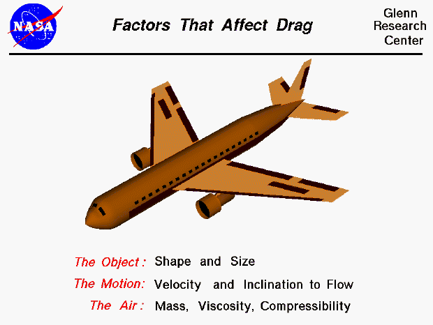

## Table of Contents

## What is performance drag?

Performance drag is when a company's profits or earnings go down because of extra costs or inefficiencies. It's like a weight that slows down a car, making it harder for the company to do well. These extra costs can come from many places, like high employee turnover, outdated technology, or poor management decisions.

For example, if a company keeps losing good workers and has to train new ones all the time, it spends a lot of money and time on training. This can make the company less efficient and less profitable. By figuring out where the performance drag is coming from, a company can try to fix these problems and do better in the future.

## What are common causes of performance drag in software?

Performance drag in software often happens because of inefficient code. This means the software uses more computer power or memory than it needs to. For example, if a program keeps checking the same thing over and over without needing to, it wastes time and slows down. Another common cause is when software is not updated to work well with new operating systems or hardware. Old software might not use the new features of a computer, making it run slower than it could.

Another cause of performance drag is poor database management. If a database is not set up well, it can take a long time to find and use the information it stores. This slows down the whole software. Also, if too many users are trying to use the software at the same time, it can get overwhelmed and slow down. This is called a scalability issue, where the software can't handle a lot of users without getting slow.

Lastly, performance drag can come from external factors like network issues. If the software needs to get information from the internet and the connection is slow, it will make the software slow too. Security measures can also add performance drag if they are not set up well. For example, if every action in the software needs to be checked for security, it can slow things down a lot.

## How can outdated hardware contribute to performance drag?

Outdated hardware can slow down software because it doesn't have the power or speed that new software needs. For example, if a computer has an old processor, it might take a long time to do simple tasks. This is like trying to run a new video game on an old console; the game might work, but it will be slow and might even freeze. When software gets updates, it often needs more power to run smoothly. If the hardware is old, it can't keep up, causing the software to run slowly and creating performance drag.

Another way outdated hardware causes performance drag is through limited memory. New software often needs a lot of memory to work well. If a computer has old, small memory, it can't hold all the information the software needs at once. This means the computer has to keep going back and forth to get the information it needs, which slows everything down. It's like trying to read a book with missing pages; you have to keep going back to the library to get the pages you need, making it take much longer to finish the book.

## What role does inefficient code play in causing performance drag?

Inefficient code can make software run slower and use more computer power than it needs to. This happens when the code is written in a way that makes the computer do extra work. For example, if the code keeps checking the same thing over and over without needing to, it wastes time. It's like asking someone the same question again and again instead of remembering the answer. This extra work slows down the software and makes it use more memory and processing power, causing performance drag.

Another way inefficient code causes performance drag is by not using the computer's resources well. If the code is not written to take advantage of the computer's abilities, like using multiple processors at the same time, it can make the software run slower. It's like having a big team but only letting one person work at a time. By not using all the available resources, the software can't work as fast as it could, leading to performance drag.

## Can network issues lead to performance drag? How?

Network issues can cause performance drag by making software slow and unresponsive. When software needs to get information from the internet or another computer, a slow or unreliable network can make it take a long time. It's like trying to fill a bucket with a leaky hose; even if the bucket is ready, the water comes too slowly. If the network keeps cutting out or is too busy, the software has to wait, making everything take longer and causing performance drag.

Another way network issues lead to performance drag is by making the software use more resources. When the network is slow, the software might try to get the same information over and over again, using up more memory and processing power. It's like a person trying to call someone who isn't answering; they keep trying and using up their phone's battery. This extra work can slow down the software even more, adding to the performance drag.

## What are some examples of performance drag in everyday applications?

In everyday applications, performance drag can be seen when a web browser takes a long time to load a webpage. This can happen if the website has a lot of pictures or videos, and your internet connection is slow. The browser has to wait for all the information to come through the network, which makes everything slow down. Another example is when you're using a smartphone app that keeps freezing or crashing. This might be because the app wasn't made to work well with your phone's hardware, or it's using too much memory and making the phone struggle.

Another common example of performance drag is when you're playing a video game on a computer or console, and it starts to lag or the frame rate drops. This can happen if the game is too advanced for your hardware, making it hard for the computer to keep up with everything that's happening in the game. Also, if you're using an old computer to run new software, like a photo editing program, it might take a long time to do simple tasks because the computer's processor and memory can't handle the work as fast as needed.

## How does memory management affect performance drag?

Memory management plays a big role in how fast or slow software runs. When software uses memory well, it can keep all the information it needs ready to use. This makes the software run smoothly and quickly. But if the memory is not managed well, the software might have to keep going back and forth to get the information it needs. This is like trying to cook a meal but having to run to the store every time you need an ingredient. It takes a lot longer and makes everything slower, causing performance drag.

Another way memory management affects performance drag is by how it handles the space it has. If the software tries to use more memory than is available, it can slow down or even crash. It's like trying to fit too many clothes into a small suitcase; everything gets messy and hard to use. Good memory management means the software only uses what it needs and keeps things organized. This helps the software run faster and reduces performance drag.

## What advanced techniques can be used to diagnose performance drag?

One advanced technique to diagnose performance drag is called profiling. Profiling is like watching a movie in slow motion to see every detail. It lets you see exactly what the software is doing at every moment, showing which parts are taking the most time or using the most memory. This helps find the slow parts of the code or where the software is using too many resources. By using profiling tools, developers can see if the software is doing extra work it doesn't need to, like checking the same thing over and over, and fix these problems to make the software run faster.

Another technique is called load testing. Load testing is like seeing how many people can fit in an elevator before it gets too crowded. It checks how the software works when a lot of users are using it at the same time. This can show if the software slows down or crashes when it gets busy, which is a sign of performance drag. By doing load tests, developers can find out where the software needs to be stronger or more efficient, so it can handle more users without slowing down. Both profiling and load testing are important tools to make software run smoothly and reduce performance drag.

## How can performance drag be mitigated in large-scale systems?

In large-scale systems, performance drag can be mitigated by using load balancing. Load balancing is like having many checkout lines at a store so customers don't have to wait too long. It spreads out the work across many computers or servers, so no single part gets too busy and slows down. By doing this, the system can handle more users and work faster, reducing performance drag. Another way to help is by using caching, which is like keeping your favorite snacks close by so you don't have to go to the store every time you want one. Caching stores information that the system uses often, so it doesn't have to get it from far away every time, making everything quicker.

Another important way to reduce performance drag in large-scale systems is through regular updates and optimizations. This means always looking for ways to make the software run better, like fixing slow code or using new technology that can handle more work. It's like tuning up a car to make it run smoother and faster. Also, good monitoring and logging help a lot. By keeping an eye on how the system is doing, you can find problems early and fix them before they cause big slowdowns. It's like checking the weather to know if you need an umbrella, so you stay dry and comfortable.

## What are the differences between performance drag in client-side vs. server-side applications?

Performance drag in client-side applications, like web browsers or mobile apps, happens when the user's device struggles to run the software. This can be because the app uses too much memory or the device's processor can't keep up with the app's demands. For example, if a web page has too many big pictures or videos, it might take a long time to load on a slow internet connection or an old computer. The user might see the page loading slowly or the app freezing, which is frustrating. To fix this, developers can make the app use less memory, simplify the code, or make sure it works well with different types of devices.

On the other hand, performance drag in server-side applications happens when the server that runs the software can't handle all the requests it gets. This can happen if too many users are trying to use the software at the same time, or if the server's hardware is old and slow. For instance, if a website gets a lot of visitors all at once, the server might get overwhelmed and slow down, making the website load slowly for everyone. To solve this, developers can use load balancing to spread the work across many servers, or they can upgrade the server's hardware to handle more work. Both client-side and server-side performance drag can be fixed, but the solutions are different because they depend on where the problem is happening.

## How do different programming languages handle performance drag?

Different programming languages handle performance drag in their own ways, depending on how they are built and what they are used for. Some languages, like C and C++, are known for being very fast because they let you control the computer's memory and resources directly. This can help avoid performance drag by making sure the software uses the computer's power in the best way possible. But these languages can be hard to use because you have to manage everything yourself. If you make a mistake, it can cause performance drag instead of fixing it.

Other languages, like Python and JavaScript, are easier to use but might be slower because they do a lot of work behind the scenes to make things simpler for the programmer. Python, for example, has something called a "garbage collector" that helps manage memory, but this can sometimes slow things down if it's working too hard. JavaScript, often used for web apps, can run into performance drag if the code is not written well or if the web page is too complex. To reduce performance drag in these languages, developers use special tools and techniques, like writing code that runs faster or using libraries that are made to be quick.

## What are the future trends in managing and reducing performance drag?

In the future, managing and reducing performance drag will likely focus more on using smart technology like [artificial intelligence](/wiki/ai-artificial-intelligence) (AI) and [machine learning](/wiki/machine-learning). These technologies can help by looking at how software is running and finding slow parts automatically. They can suggest ways to make the software run faster without needing a person to do all the work. For example, AI could watch how a web page loads and tell the developers which pictures or videos are slowing things down. This makes it easier to fix problems quickly and keep the software running smoothly.

Another trend will be better use of cloud computing. Cloud computing lets software use a lot of computers at the same time, so it can handle more work without slowing down. In the future, we might see more software that can change how it uses the cloud based on how busy it is. This means the software can use more computers when it's busy and fewer when it's quiet, which helps save money and reduce performance drag. By using these new technologies, software can run faster and be more reliable, making things better for everyone who uses it.

## What is Understanding Performance Drag?

Performance drag is a crucial aspect to consider in algorithmic trading, as it denotes the disparities between anticipated investment returns and the actual results after accounting for various trading costs. These costs can significantly hinder the efficiency and effectiveness of an algorithmic trading system, making it vital for traders to be cognizant of their impact.

The theoretical return of an investment is calculated based on ideal conditions, often without factoring in real-world expenses associated with trading. However, when these associated expenses are included, such as transaction costs, market impact, and opportunity costs, the realized return tends to be lower than initially expected. This shortfall is what is known as performance drag.

Mathematically, performance drag can be expressed as:

$$
\text{Performance Drag} = \text{Theoretical Return} - \text{Realized Return}
$$

Where:
- $\text{Theoretical Return}$ is the expected gain from a trading strategy under optimal conditions.
- $\text{Realized Return}$ is the actual profit after all trading costs and market impacts have been accounted for.

These factors are multidimensional, with transaction costs such as commissions and the bid-ask spread being among the most direct contributors. Meanwhile, indirect costs, like the opportunity cost of holding cash or missed investment opportunities due to execution delays, further exacerbate the issue.

In [algorithmic trading](/wiki/algorithmic-trading), where high-frequency and high-[volume](/wiki/volume-trading-strategy) trading strategies are prevalent, even small inefficiencies or costs can accumulate, significantly affecting net returns over time. Therefore, understanding and managing these costs is critical for optimizing the performance and profitability of algorithmic trading systems. Enhanced awareness and strategic management of performance drag are necessary for maintaining a competitive edge in the trading industry.

## References & Further Reading

[1]: Bergstra, J., Bardenet, R., Bengio, Y., & Kégl, B. (2011). ["Algorithms for Hyper-Parameter Optimization."](https://dl.acm.org/doi/10.5555/2986459.2986743) Advances in Neural Information Processing Systems 24.

[2]: ["Advances in Financial Machine Learning"](https://www.amazon.com/Advances-Financial-Machine-Learning-Marcos/dp/1119482089) by Marcos Lopez de Prado

[3]: ["Evidence-Based Technical Analysis: Applying the Scientific Method and Statistical Inference to Trading Signals"](https://www.amazon.com/Evidence-Based-Technical-Analysis-Scientific-Statistical/dp/0470008741) by David Aronson

[4]: ["Machine Learning for Algorithmic Trading"](https://github.com/stefan-jansen/machine-learning-for-trading) by Stefan Jansen

[5]: ["Quantitative Trading: How to Build Your Own Algorithmic Trading Business"](https://www.amazon.com/Quantitative-Trading-Build-Algorithmic-Business/dp/1119800064) by Ernest P. Chan