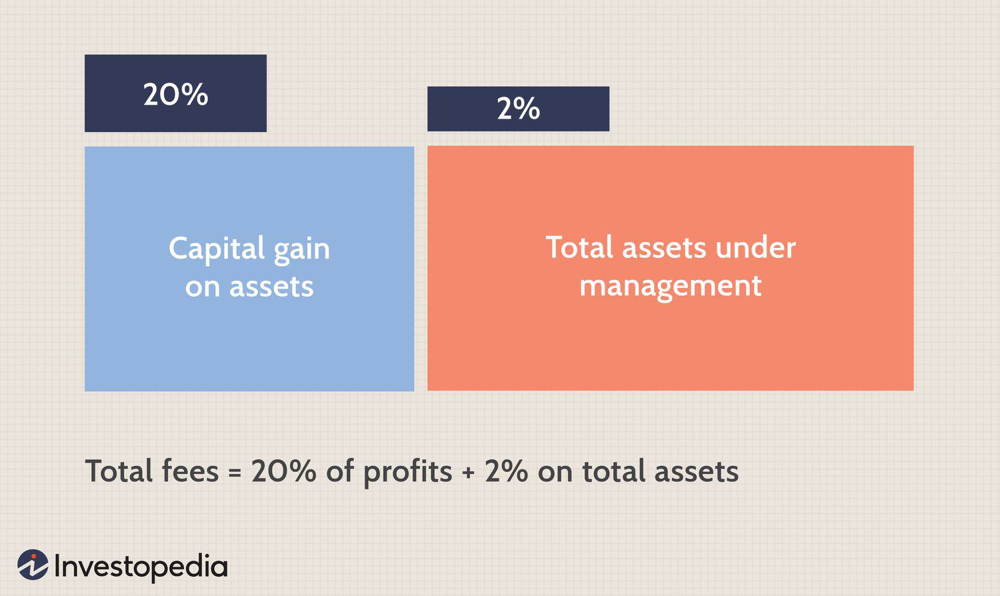

Investment fees are a critical determinant of the profitability of investment vehicles, particularly in hedge funds. These fees encompass various components, with performance fees being a significant aspect of the hedge fund fee architecture. Performance fees are strategically devised to align the financial incentives of fund managers with the interests of investors, ensuring that both parties benefit from improved investment outcomes. This symbiotic relationship encourages fund managers to achieve superior returns on investments, optimizing the financial gains for investors.

This article aims to explore the multifaceted nature of performance fees within hedge funds. Coupled with this, we will examine algo trading—an integral element in contemporary hedge fund strategies—and other associated investment costs that investors frequently encounter. The discussion will shed light on how these fees and costs impact investor returns and what pivotal factors investors should consider when assessing hedge fund investments.

Given the dynamic nature of hedge fund fee structures, understanding the intricacies of these components becomes essential for informed investment decision-making. Fee structures evolve in response to shifts in market conditions, regulatory developments, and investor demands, making it imperative for investors to stay informed about these changes. By grasping the details of performance fees and other associated costs, investors can make more strategic choices, enhancing their potential returns and ensuring that their investment decisions align with their financial objectives.

## Table of Contents

## Understanding Performance Fees in Hedge Funds

Performance fees serve as an incentive-based mechanism to reward hedge fund managers for generating profits. Typically, these fees are calculated as a percentage of the fund's profits, aligning the interests of the fund managers with those of the investors. The prevailing '2 and 20' model exemplifies a common fee structure in hedge funds, comprising a 2% management fee based on assets under management and a 20% performance fee contingent on the fund's profits.

### The '2 and 20' Model

The '2 and 20' model is designed to ensure that fund managers are motivated to produce significant returns. The 2% management fee provides a steady income stream irrespective of the fund's performance, while the 20% performance fee aligns the manager's interests with the investor's. This model encourages fund managers to pursue strategies that yield higher returns, as their compensation is directly tied to the fund's success.

### Risk and Reward Paradigm

While performance fees aim to promote high returns, they may inadvertently incentivize excessive risk-taking. Fund managers striving to maximize their performance compensation might engage in aggressive investment strategies that could lead to substantial gains or significant losses. This characteristic of performance fees necessitates a thorough understanding by investors of the fund's risk-reward dynamics and the potential implications on their investment returns.

### Calculation and Impact

Investors should comprehend how performance fees are calculated to assess their impact on net returns. Performance fees are typically calculated as follows:

$$
\text{Performance Fee} = \text{Performance Fee Rate} \times (\text{Fund's End Value} - \text{Fund's Start Value} - \text{Hurdle Rate})
$$

Here, the hurdle rate represents the minimum return a fund must achieve before any performance fees are levied. Understanding this calculation enables investors to determine the cost-effectiveness of their investment and measure the actual returns net of fees.

### Considerations for Investors

Investors need to meticulously evaluate how performance fees can affect their net returns. Essential considerations include examining the fund's past performance, understanding the risk-taking behavior of the fund managers, and the overall fee structure in comparison to similar funds. Furthermore, assessing the fund's adherence to its hurdle rate can provide insights into the potential profitability after accounting for performance fees.

In conclusion, performance fees in hedge funds play a vital role in shaping manager behavior and influencing investor returns. Understanding their structure, impact, and implications is essential for investors to make informed decisions about their [hedge fund](/wiki/hedge-fund-trading-strategies) investments.

## The Role of Algo Trading in Hedge Funds

Algorithmic trading, commonly known as algo trading, refers to the use of computer algorithms to execute trades automatically based on a set of predefined criteria. This approach has become increasingly integral to hedge fund strategies, due to its capabilities in optimizing trade execution and enhancing potential returns. Algo trading is typically utilized to improve the efficiency of trading operations, allowing for the processing of large volumes of data and rapid execution of trades. This is particularly advantageous in volatile markets where timing and precision are critical.

### Benefits of Algo Trading

Algo trading offers several key benefits to hedge funds:

1. **Speed and Efficiency**: Algorithms can analyze and execute trades faster than human traders. This speed advantage is crucial in highly competitive financial markets where milliseconds can determine profitability.

2. **Data Processing**: The ability to swiftly process vast datasets allows for more informed decision-making. Algorithms are capable of scanning multiple markets and historical data to identify optimal trading opportunities.

3. **Reduced Emotional Bias**: Automated trading systems operate based on logic and are not influenced by human emotions, which can often lead to suboptimal trading decisions.

4. **Portfolio Diversification**: Through diversification algorithms, hedge funds can manage and balance their portfolios efficiently, reducing exposure to individual asset risks.

### Challenges and Risks

Despite its advantages, [algorithmic trading](/wiki/algorithmic-trading) also presents several challenges and risks:

1. **Algorithm Complexity**: Developing robust algorithms requires both expertise in financial markets and advanced programming skills. Errors in the algorithms can lead to significant losses.

2. **Market Risks**: While algorithms are designed to mitigate risks, they are not impervious to market anomalies. Unforeseen events can disrupt algorithmic strategies and potentially lead to losses.

3. **Technological Dependencies**: Algo trading relies heavily on technology infrastructure. System failures or connectivity issues can impede trading activities and lead to financial setbacks.

4. **Regulatory Scrutiny**: The use of algorithms in trading is subject to regulatory oversight. Hedge funds must ensure compliance with relevant laws and regulations, requiring constant updates and adjustments to trading systems.

### Investor Considerations

Investors should carefully evaluate how a hedge fund uses algorithmic trading within its overall strategy. Factors to consider include:

- **Transparency**: Understanding the types of algorithms used, their purpose, and how they are monitored is crucial for assessing risk.

- **Performance Metrics**: Reviewing historical performance data can provide insights into the effectiveness of the fund’s algo trading strategies in various market conditions.

- **Risk Management**: Effective risk management practices should be in place to address potential algorithmic failures or market anomalies.

Hedge funds that employ algorithmic trading effectively may offer substantial benefits to their investors, but it is vital for investors to remain informed about the associated risks and the fund's operational framework.

## Evaluating the Costs: Performance vs. Management Fees

Management fees in hedge funds are a critical [factor](/wiki/factor-investing) for investors to consider, as they represent a consistent charge based upon the assets under management (AUM). This fixed percentage is levied annually, irrespective of the fund's performance, ensuring a reliable income stream for fund managers. For instance, a typical management fee might be 2% of AUM, ensuring that fund managers receive compensation even during periods of underperformance.

Conversely, performance fees hinge on the fund's profitability and are a percentage of the profits generated above a specified benchmark or hurdle rate. The common "2 and 20" model encapsulates this structure, where fund managers receive 20% of profits as a performance fee. This incentivizes managers to pursue higher returns, aligning their efforts with the interests of investors. However, if a fund fails to generate profits, performance fees are not awarded, which aligns manager and investor interests more effectively.

A thorough analysis of these fees necessitates a comparison of management fees against potential performance gains. Such assessments are crucial for evaluating the cost-effectiveness of hedge fund investments. High management fees can erode potential profits, especially when a fund fails to outperform its benchmarks. Investors must meticulously evaluate whether the potential for performance-based returns justifies the consistent outflow due to management fees.

Transparency in fee structures is essential for a comprehensive understanding of the investment's implications. Investors should scrutinize the fee arrangements, seeking clarity on how each component—management and performance fees—affects net returns. This ensures they are fully informed about the impact on their overall investment performance. Informed decision-making involves questioning fund managers about fee calculations, potential hidden costs, and any additional charges beyond the headline rates.

## Strategizing for Lower Investment Fees

Negotiating lower fees can significantly enhance the overall profitability of a hedge fund investment. Investors often possess a degree of bargaining power, which can be effectively utilized by comparing industry benchmarks. By presenting a well-researched case, investors may negotiate fee reductions, thereby increasing their potential returns.

Understanding the fund’s strategy, as well as typical fee arrangements within the sector, is crucial for setting realistic expectations. Different hedge funds may employ various investment strategies, each with its own cost structure. By familiarizing themselves with these nuances, investors can better evaluate whether the fees charged are justified or if there is room for negotiation.

One effective strategy to manage performance fees is the implementation of hurdle rates. A hurdle rate is a set minimum return that a hedge fund must achieve before charging performance fees. This ensures that investors only pay performance fees on returns that exceed this predetermined benchmark. For instance, if a fund sets a hurdle rate of 5%, performance fees would only apply to returns exceeding 5%. This aligns the interests of fund managers with those of investors, as managers only benefit from performance fees when they deliver additional value.

Effective fee negotiation requires clear communication and a thorough understanding of the fee structure components. Transparency in fee structures allows investors to dissect each component, assess its necessity, and negotiate accordingly. It's vital for investors to engage in open discussions with fund managers, seeking clarity on how various fees are structured and justified. This knowledge empowers investors to challenge excessive charges and propose alternative arrangements that better align with their investment goals.

In conclusion, strategic negotiation and a deep understanding of hedge fund fee structures can lead to significant cost savings and enhanced investor returns. By leveraging industry benchmarks and advocating for transparent fee arrangements, investors can better position themselves in the competitive hedge fund landscape.

## Future Trends in Hedge Fund Fees

The competitive landscape is prompting hedge funds to reevaluate their traditional fee structures. Hedge funds often relied on the "2 and 20" model—comprising a 2% management fee and a 20% performance fee—as a standard. However, this model is now being scrutinized due to evolving market dynamics and increased pressure from investors and regulatory bodies. Investors are increasingly advocating for performance-based incentives over fixed fees, as they seek to ensure that their capital produces worthwhile returns. These pressures are pushing hedge fund managers to demonstrate value through performance rather than holding onto fixed compensation structures.

Innovative fee arrangements, such as tiered fee structures and clawback provisions, are becoming more prevalent. Tiered fee structures allow for variable fees linked to the level of returns achieved, thereby offering more equitable compensation for both managers and investors. Clawback provisions, on the other hand, ensure that if a hedge fund underperforms in subsequent years after an initial high-performance period, managers might need to return part of their past performance fees. These investor-friendly alterations are appealing as they increasingly align the interests of managers and investors while providing an added layer of risk management.

Technological advancements, particularly the deployment of data analytics and algorithmic efficiency, play a significant role in shaping future hedge fund fees. Data-driven insights help managers better justify their fee structures by providing evidence of value through detailed performance analytics and transparency. These technological tools not only optimize portfolio strategies but also enable managers to offer more tailored and competitive fee arrangements, potentially lowering costs for investors.

Hedge funds capable of adapting to these emerging trends and demonstrating transparency are likely to secure a competitive edge. As the industry moves towards these flexible models, those funds that can showcase a clear link between their compensation structure and performance are better positioned to attract and retain investors. As regulatory constraints continue to shift, hedge funds that deftly navigate these changes and offer transparent, performance-linked fee structures can differentiate themselves in an increasingly scrutinized market.

## Conclusion

Investment fees associated with hedge funds are intricate and bear a substantial weight on the returns that investors ultimately achieve. These fees encompass various components, with performance fees taking center stage due to their ability to influence both the behavior of fund managers and the resulting investment outcomes. Performance fees are designed to align the interests of fund managers with those of the investors by offering compensation based on the fund's profitability. This alignment aims to motivate managers to strive for exemplary performance. However, investors must comprehend these fee structures to ensure their alignment with personal investment goals and risk tolerance.

Algorithmic trading, or algo trading, has become an integral part of many hedge funds' operations, presenting a dual-edged sword of potential benefits and hazards. On one hand, algo trading enables rapid execution and data processing, which can lead to enhanced returns, particularly in fluctuating markets. On the other hand, it introduces additional layers of complexity and risk that both fund managers and investors must prudently evaluate. The deployment of sophisticated algorithms requires constant monitoring and may contribute to higher transaction volumes, potentially impacting trading costs and, ultimately, investor returns.

Investors can bolster their potential returns by strategically negotiating investment fees and remaining attuned to emerging industry trends. The landscape of hedge fund fees is shifting towards more flexible and performance-oriented models, driven by competitive pressures and evolving regulatory requirements. This shift offers hedge funds the chance to refine their fee strategies, centering on alignment principles that synchronize manager and investor interests, such as implementing hurdle rates or employing a clawback mechanism. By maintaining an informed and proactive approach to fee negotiations and selections, investors are better positioned to make informed decisions that positively influence their net returns over time. The dynamic nature of fee structures signals opportunities for innovation and recalibration, benefiting both investors and fund managers willing to adapt to emerging practices and standards.

## References & Further Reading

[1]: Investment Company Institute. (2020). ["Trends in the Expenses and Fees of Funds, 2019."](https://www.ici.org/perspectives) 

[2]: Ang, Andrew. (2014). ["Asset Management: A Systematic Approach to Factor Investing."](https://www.amazon.com/Asset-Management-Systematic-Investing-Association/dp/0199959323) Oxford University Press.

[3]: Arnott, Robert D., et al. (2013). ["When Alpha Meets Beta: Managing Unintended Risks in Active Exchange-Traded Funds."](https://www.researchgate.net/scientific-contributions/Robert-D-Arnott-80879109) The Journal of Portfolio Management.

[4]: Narang, Rishi K. (2013). ["Inside the Black Box: A Simple Guide to Quantitative and High-Frequency Trading."](https://onlinelibrary.wiley.com/doi/book/10.1002/9781118662717) Wiley.

[5]: Hasbrouck, Joel. (2007). ["Empirical Market Microstructure: The Institutions, Economics, and Econometrics of Securities Trading."](https://archive.org/details/empiricalmarketm0000hasb) Oxford University Press.