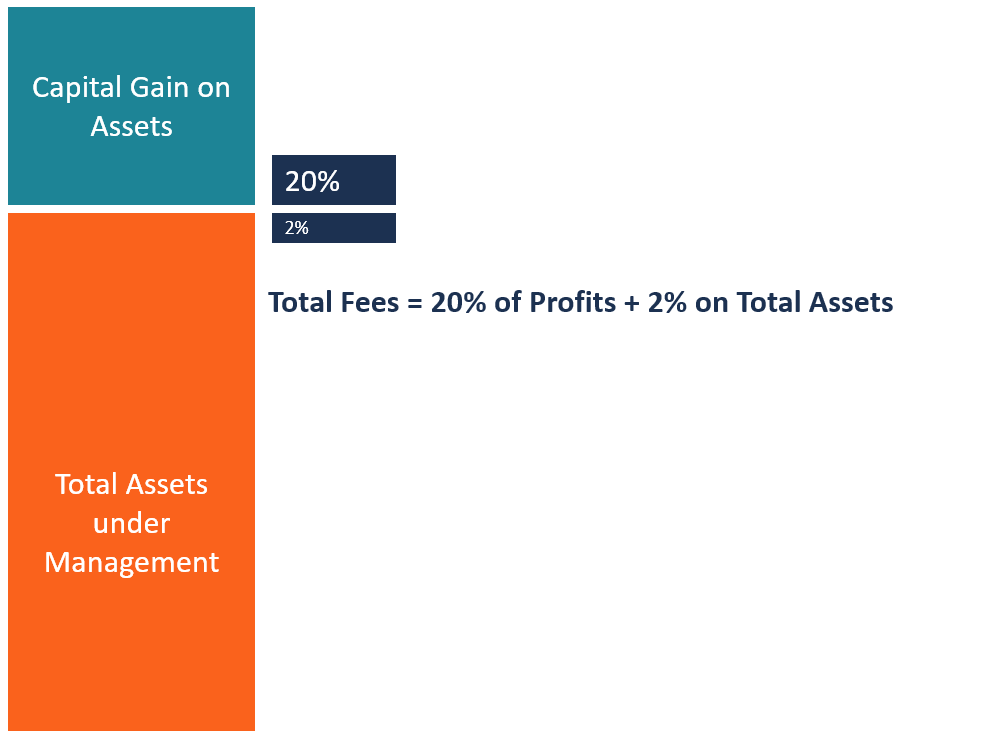

## Table of Contents

## What is a performance fee in hedge funds?

A performance fee in hedge funds is a fee that the fund manager charges based on the profits they make for investors. Instead of just charging a regular fee for managing the money, the performance fee is like a reward for doing a good job. It's usually a percentage of the profits, often around 20%. This means if the fund makes money, the manager gets a cut of those earnings.

The idea behind a performance fee is to align the interests of the fund manager with those of the investors. If the manager does well and the fund makes money, they get paid more. But if the fund loses money, the manager doesn't get this extra fee. This system is meant to motivate the manager to work hard and make smart investment choices. However, it can also encourage them to take bigger risks to earn higher fees, which might not always be in the best interest of the investors.

## How is a performance fee calculated?

A performance fee is calculated as a percentage of the profits that a hedge fund makes. Usually, this percentage is around 20%, but it can be different depending on the fund's rules. For example, if a hedge fund makes a profit of $1 million, and the performance fee is 20%, the fund manager would get $200,000 as their performance fee.

To calculate the performance fee, you first need to figure out the profit. This is done by taking the value of the investments at the end of the period and subtracting the value at the start. If the result is positive, that's the profit. Then, you multiply this profit by the performance fee percentage. It's important to note that some funds might have a "hurdle rate," which means the fund needs to make a certain amount of profit before the performance fee kicks in. If the profit is less than the hurdle rate, the manager doesn't get the performance fee.

## Why do hedge funds charge performance fees?

Hedge funds charge performance fees to give their managers a reason to do a good job. When managers earn more money when the fund makes profits, they are more likely to work hard and make smart choices. This is good for investors because it means the manager's goals are the same as theirs – everyone wants the fund to do well.

However, performance fees can also make managers take bigger risks. They might try to make a lot of money quickly to earn a bigger fee, even if it's risky. This might not be the best thing for investors who want steady, safe growth. So, while performance fees can help align interests, they can also lead to problems if not managed carefully.

## What is the typical range of performance fees in hedge funds?

The typical range for performance fees in hedge funds is usually between 15% and 20%. This means that if a hedge fund makes a profit, the manager gets to keep a part of that profit, usually around one-fifth of it. This fee is on top of any other fees the fund might charge, like management fees.

Performance fees are meant to make sure that the fund manager works hard to make money for the investors. If the fund does well, the manager gets more money. But if the fund loses money, the manager doesn't get this extra fee. This system tries to make sure that the manager's goals match the investors' goals, but it can also make managers take bigger risks to earn more fees.

## How does a high-water mark affect performance fees?

A high-water mark is a way to make sure that hedge fund managers only get performance fees when they make new profits, not just when they recover losses. Imagine you invest in a fund, and the value goes up to $110 from $100. If the manager gets a 20% performance fee, they would get $2 for making that $10 profit. But if the value then drops to $105 and later goes back up to $110, the manager shouldn't get another fee for getting back to the same $110. The high-water mark means the manager only gets a fee when the fund's value goes above $110 again.

This rule helps protect investors. It stops managers from getting paid over and over for the same work. If the fund has to recover from losses, the manager needs to make new profits before they can earn another performance fee. This encourages managers to keep growing the fund's value, not just bouncing back to where it was before.

## What is the difference between a hurdle rate and a performance fee?

A hurdle rate is like a goal that a hedge fund has to reach before the manager can get a performance fee. Think of it as a minimum profit the fund needs to make. If the fund's profit is less than the hurdle rate, the manager doesn't get the extra fee. This is good for investors because it means the manager has to work harder to earn the performance fee.

A performance fee is the extra money the manager gets when the fund makes a profit. It's usually a percentage of the profit, like 20%. The manager only gets this fee if the fund makes money, and sometimes only if it makes more money than the hurdle rate. This fee is meant to make sure the manager works hard to make the fund successful, but it can also make them take bigger risks to earn more money.

## Can performance fees be negotiated with hedge fund managers?

Yes, performance fees can sometimes be negotiated with hedge fund managers. If you are a big investor or if you have a lot of money to invest, you might be able to talk to the manager about changing the fee. They might agree to a lower performance fee because they want your investment. But if you are a smaller investor, it can be harder to negotiate because the manager might not want to change the fee just for you.

Negotiating performance fees is not always easy. It depends on how much money you are putting into the fund and how much the manager wants your investment. Some funds have strict rules and won't change their fees at all. But if you can negotiate, it's good to try because it could save you money and make the fund a better deal for you.

## How do performance fees impact investor returns?

Performance fees can make a big difference in how much money investors keep from their investments. When a hedge fund does well and makes a profit, the manager gets a part of that profit as a performance fee. This means the investors get less of the profit than they would without the fee. For example, if the fund makes $100 and the performance fee is 20%, the manager takes $20, and the investors only get $80 of the profit. So, the more the fund makes, the more the manager gets, and the less the investors keep.

On the other hand, performance fees can also help make sure the manager works hard to make the fund successful. If the manager only gets paid more when the fund does well, they have a good reason to try their best. This can lead to better returns for investors because the manager's goals are the same as the investors' goals. But, it can also make managers take bigger risks to earn more fees, which might not always be good for investors. So, while performance fees can help the fund do better, they also mean investors get to keep less of the profits.

## What are the regulatory considerations for performance fees in different jurisdictions?

Different countries have different rules about how hedge funds can charge performance fees. In the United States, the Securities and Exchange Commission (SEC) has rules that say hedge funds need to be clear about how they charge fees. They have to tell investors exactly how the performance fee is calculated and when it is charged. This helps make sure investors know what they are paying for. Some states in the U.S. might also have their own rules about fees, so hedge funds need to follow both federal and state laws.

In Europe, the rules can be different depending on the country. The European Union has the Alternative Investment Fund Managers Directive (AIFMD), which sets out rules for how hedge funds can operate, including how they charge fees. This directive makes sure that hedge funds tell investors about fees in a clear way and that the fees are fair. Countries like the UK, Germany, and France might also have their own extra rules about performance fees. So, hedge funds in Europe need to follow both the EU rules and their country's rules.

In other parts of the world, like Asia, the rules can be very different from one country to another. For example, in Singapore, the Monetary Authority of Singapore (MAS) has rules that hedge funds must follow about how they charge fees. In Hong Kong, the Securities and Futures Commission (SFC) also has its own set of rules. These rules are there to protect investors and make sure that hedge funds are clear about how they charge performance fees. So, hedge funds need to know and follow the rules in each country where they operate.

## How do performance fees align the interests of hedge fund managers and investors?

Performance fees help make sure that hedge fund managers want the same things as their investors. When a fund makes money, the manager gets a part of that money as a performance fee. This means the manager has a good reason to work hard and make smart choices to make the fund do well. If the fund does well, both the manager and the investors are happy because they both make more money. This way, the manager's goals are the same as the investors' goals, which is to make the fund grow and be successful.

However, performance fees can also make managers take bigger risks. They might try to make a lot of money quickly to earn a bigger fee, even if it's risky. This might not be the best thing for investors who want steady, safe growth. So, while performance fees can help align interests, they can also lead to problems if not managed carefully. It's important for investors to understand how performance fees work and to make sure the manager is taking the right amount of risk.

## What are the potential drawbacks of performance fees for investors?

Performance fees can make investors keep less of the money the fund makes. If a hedge fund earns a profit, the manager takes a part of that profit as a performance fee. For example, if the fund makes $100 and the performance fee is 20%, the manager gets $20, and the investors only get $80. This means the more the fund makes, the more the manager gets, and the less the investors keep. So, even though the fund might be doing well, investors might not see as much of the profit as they would without the fee.

Another problem with performance fees is that they can make managers take bigger risks. Since managers only get the extra fee when the fund makes money, they might try to make a lot of money quickly to earn a bigger fee. This can be risky and might not be good for investors who want steady, safe growth. If the risky moves don't work out, the fund could lose money, and the investors would be the ones to lose out. So, while performance fees can motivate managers to do well, they can also lead to risky behavior that might not be in the best interest of the investors.

## How have performance fee structures evolved in the hedge fund industry over the last decade?

Over the last decade, the way hedge funds charge performance fees has changed a lot. At first, most funds used a simple rule: they charged a 20% fee on any profit they made. But as more people started investing in hedge funds, some investors wanted a better deal. So, some funds started using something called a "hurdle rate." This means the fund has to make a certain amount of profit before the manager can get the performance fee. This change made it fairer for investors because the manager had to work harder to earn the fee.

Another big change is that some funds now use a "high-water mark" rule. This means the manager can only get a performance fee when the fund makes new profits, not just when it gets back to where it was before after losing money. This rule helps protect investors because it stops managers from getting paid over and over for the same work. Also, some funds have started letting investors negotiate the performance fee. Big investors with a lot of money to invest can sometimes get a lower fee. These changes show that the hedge fund industry is trying to be more fair to investors and make sure managers are working hard to make the fund successful.

## What is the understanding of performance fees in hedge funds?

Performance fees serve as an incentive-based mechanism to reward hedge fund managers for generating profits. Typically, these fees are calculated as a percentage of the fund's profits, aligning the interests of the fund managers with those of the investors. The prevailing '2 and 20' model exemplifies a common fee structure in hedge funds, comprising a 2% management fee based on assets under management and a 20% performance fee contingent on the fund's profits.

### The '2 and 20' Model

The '2 and 20' model is designed to ensure that fund managers are motivated to produce significant returns. The 2% management fee provides a steady income stream irrespective of the fund's performance, while the 20% performance fee aligns the manager's interests with the investor's. This model encourages fund managers to pursue strategies that yield higher returns, as their compensation is directly tied to the fund's success.

### Risk and Reward Paradigm

While performance fees aim to promote high returns, they may inadvertently incentivize excessive risk-taking. Fund managers striving to maximize their performance compensation might engage in aggressive investment strategies that could lead to substantial gains or significant losses. This characteristic of performance fees necessitates a thorough understanding by investors of the fund's risk-reward dynamics and the potential implications on their investment returns.

### Calculation and Impact

Investors should comprehend how performance fees are calculated to assess their impact on net returns. Performance fees are typically calculated as follows:

$$
\text{Performance Fee} = \text{Performance Fee Rate} \times (\text{Fund's End Value} - \text{Fund's Start Value} - \text{Hurdle Rate})
$$

Here, the hurdle rate represents the minimum return a fund must achieve before any performance fees are levied. Understanding this calculation enables investors to determine the cost-effectiveness of their investment and measure the actual returns net of fees.

### Considerations for Investors

Investors need to meticulously evaluate how performance fees can affect their net returns. Essential considerations include examining the fund's past performance, understanding the risk-taking behavior of the fund managers, and the overall fee structure in comparison to similar funds. Furthermore, assessing the fund's adherence to its hurdle rate can provide insights into the potential profitability after accounting for performance fees.

In conclusion, performance fees in hedge funds play a vital role in shaping manager behavior and influencing investor returns. Understanding their structure, impact, and implications is essential for investors to make informed decisions about their [hedge fund](/wiki/hedge-fund-trading-strategies) investments.

## References & Further Reading

[1]: Investment Company Institute. (2020). ["Trends in the Expenses and Fees of Funds, 2019."](https://www.ici.org/perspectives) 

[2]: Ang, Andrew. (2014). ["Asset Management: A Systematic Approach to Factor Investing."](https://www.amazon.com/Asset-Management-Systematic-Investing-Association/dp/0199959323) Oxford University Press.

[3]: Arnott, Robert D., et al. (2013). ["When Alpha Meets Beta: Managing Unintended Risks in Active Exchange-Traded Funds."](https://www.researchgate.net/scientific-contributions/Robert-D-Arnott-80879109) The Journal of Portfolio Management.

[4]: Narang, Rishi K. (2013). ["Inside the Black Box: A Simple Guide to Quantitative and High-Frequency Trading."](https://onlinelibrary.wiley.com/doi/book/10.1002/9781118662717) Wiley.

[5]: Hasbrouck, Joel. (2007). ["Empirical Market Microstructure: The Institutions, Economics, and Econometrics of Securities Trading."](https://archive.org/details/empiricalmarketm0000hasb) Oxford University Press.