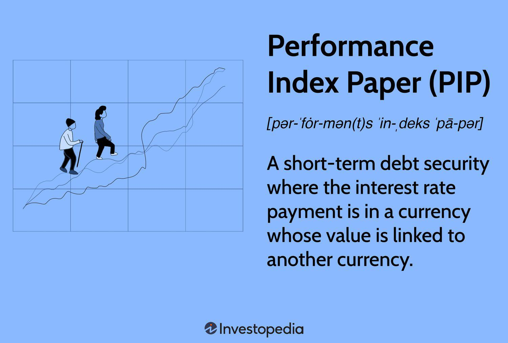

Algorithmic trading stands as a pivotal advancement in the financial markets, relentlessly reshaping trading landscapes by providing unmatched efficiency and precision. As financial transactions increasingly occur at lightning speeds, traders leverage algorithmic solutions to capitalize on fleeting opportunities while minimizing human error. At its core, successful algorithmic trading hinges on adept data analysis and interpretation, transforming raw numbers into actionable insights.

Two innovative methodologies contribute significantly to this evolving process: Performance Index Paper (PIP) and Perceptually Important Points (PIPs). Both present distinctive approaches for evaluating and refining trading strategies, playing crucial roles in navigating complex market dynamics. The Performance Index Paper serves as a practical instrument for managing currency risks through short-term commercial paper, where the interest rates are intricately tied to currency exchange fluctuations. This link to currency dynamics provides traders with a powerful hedging mechanism in the volatile world of international finance.



On the other hand, Perceptually Important Points (PIPs) prioritize critical data points over a blanket mathematical evaluation, aiding traders in uncovering salient price movements on charts. This focus on perceptual relevance empowers pattern recognition processes and automates the identification of significant technical analysis markers such as support and resistance levels. As a result, traders are equipped to make well-informed decisions, reducing information overload and honing in on impactful market signals.

Within this article, we will explore how PIP functions as a tool for volatility management and how PIPs enhance data processing within algorithmic frameworks, offering traders a dual advantage in constructing and executing trading strategies with strategic agility and insight.

## Table of Contents

## Understanding Performance Index Paper (PIP)

Performance Index Paper (PIP) offers a unique financial tool for businesses to effectively manage currency risks associated with international transactions. As a form of short-term commercial paper, PIP is instrumental for companies operating across multiple currency zones, acting as both a hedging instrument and a means to optimize financial strategy.

The primary appeal of PIP lies in its linkage to currency exchange fluctuations. The interest rate on a PIP is dynamically determined by the exchange rate between a base currency and a counter currency, which enables participants to keep track of and potentially capitalize on exchange rate movements. This link offers a dual advantage: it allows companies to secure funds through what can be a more cost-effective means of borrowing and simultaneously hedge against detrimental currency movements.

To comprehend how PIP functions in practice, consider the following: suppose a company denominated in U.S. dollars conducts significant transactions in Euros. By issuing PIPs, this company can anchor interest rates to the USD/EUR exchange rate. If the Euro appreciates against the dollar, the costs related to the PIP may increase, reflecting the associated currency risk. Conversely, a depreciation of the Euro against the dollar would decrease these costs, effectively serving as an automatic financial hedge.

The mechanics behind PIP can be understood using a simplified model: If $i_{\text{base}}$ and $i_{\text{counter}}$ represent the interest rates in the base and counter currency respectively, the [interest rate](/wiki/interest-rate-trading-strategies) on a PIP might be given as:

$$
i_{\text{PIP}} = i_{\text{base}} + f(S_t, \Delta S)
$$

Here, $S_t$ is the current exchange rate, and $\Delta S$ represents expected changes in currency value. The function $f$ reflects sensitivity to currency fluctuations, which may be modeled linearly or with more sophisticated stochastic processes, depending on market conditions and risk appetite.

Applications of PIP in financial trading are particularly beneficial in volatile currency environments. By issuing PIPs, businesses can stabilize cash flows and budget forecasts. Moreover, traders and financial strategists can harness these instruments to create more resilient portfolios, mitigate risk from currency exposure, and potentially exploit favorable currency dynamics to enhance overall asset performance. 

Thus, Performance Index Paper serves as both a shield and a tool for strategic gain in the complex world of international finance.

## Perceptually Important Points in Trading

Perceptually Important Points (PIPs) play a vital role in technical analysis by concentrating on significant price levels within financial charts, thereby moving beyond mere mathematical calculations to focus on data that carries meaningful information for traders. This method emphasizes the interpretation of visually significant points, which are crucial for understanding market dynamics.

PIPs provide traders with key insights into market patterns, assisting them in recognizing recurring price formations and identifying crucial support and resistance levels. These levels are vital as they often represent psychological barriers in the market that can influence future price movements. For instance, identifying points where the price stopped falling (support) or rising (resistance) can aid traders in predicting potential bounce-back or [breakout](/wiki/breakout-trading) scenarios, thereby enhancing their strategy formulation.

The use of PIPs extends to the automation of technical analysis, which is essential in [algorithmic trading](/wiki/algorithmic-trading). By focusing on perceptually significant points, traders can automate the recognition of patterns that humans naturally spot visually, such as double tops, head and shoulders, and trend lines. This approach not only simplifies the identification process but also reduces the noise usually encountered in financial data, thereby allowing algorithms to operate more efficiently and accurately.

Moreover, the PIPs method improves data processing capabilities by filtering out non-essential information and concentrating on elements that have a strong likelihood of impacting future price movements. For example, in Python, traders might employ a library like `pandas` to handle large financial datasets, using a PIPs-based algorithm to pinpoint the most influential data points for further analysis:

```python
import pandas as pd

# Assuming df is a DataFrame with 'Price' as one of the columns
def identify_pips(df):
    # A simplified method to identify perceptual points
    # Here, we take a rolling window approach to identify peaks and troughs
    df['PIP'] = ((df['Price'] > df['Price'].shift(1)) & (df['Price'] > df['Price'].shift(-1))) | \
                ((df['Price'] < df['Price'].shift(1)) & (df['Price'] < df['Price'].shift(-1)))
    return df[df['PIP']]

# Example usage
price_data = {'Price': [100, 102, 101, 104, 103, 107, 106, 108]}
df = pd.DataFrame(price_data)
pips = identify_pips(df)
print(pips)
```

In this code snippet, a simplified approach identifies local peaks and troughs by comparing each price point to its neighbors. This serves as a basic model for recognizing perceptual points across a price series.

By employing PIPs, traders benefit from a more nuanced method of technical analysis, enabling more informed trading decisions. This focus allows for the extraction of actionable insights from large datasets, streamlining decision-making processes, and ultimately contributing to strategic, higher-yield trades.

## Advantages of Using PIP and PIPs in Algorithmic Trading

Integrating Performance Index Paper (PIP) and Perceptually Important Points (PIPs) methods in algorithmic trading offers traders enhanced capabilities to address currency risks and analyze significant chart patterns. These methods leverage sophisticated data interpretation to improve trading efficacy and decision-making.

PIPs play a pivotal role by offering a structured approach to identify key price levels and trends in financial markets. Unlike traditional methods that depend heavily on mathematical criteria, PIPs focus on perceptual elements, filtering out market noise and highlighting pivotal points. This ability to isolate crucial price data streamlines analysis, enabling traders to capitalize on significant price movements with minimal distraction.

Moreover, these tools facilitate a simplified decision-making process. By reducing the complexity inherent in data interpretation, traders can concentrate on strategy development and execution rather than data overload. This reduction in cognitive load supports more strategic trade decisions, ultimately improving trade accuracy and efficiency.

In quantitative terms, PIPs can be applied to analyze price series $P(t)$ by selecting a subsample of points that best capture the essence of the price movements. This technique filters out the less significant fluctuations, allowing algorithms to detect important support and resistance levels more efficiently. Consequently, traders can adjust their strategies to reflect these insights, optimizing trade entry and [exit](/wiki/exit-strategy) points, and potentially leading to higher returns.

For practical implementation, PIPs' simplicity allows for easy integration into existing algorithmic trading systems. Python, with its rich ecosystem of scientific libraries, offers tools like NumPy and Pandas that can be employed to implement PIPs methods in strategy scripts. For instance, to identify significant points in a time series, a developer might calculate the change in price and select points exceeding a predefined threshold:

```python
import numpy as np

def find_pips(prices, threshold):
    pips = [prices[0]]
    for i in range(1, len(prices) - 1):
        if abs(prices[i] - prices[i-1]) >= threshold:
            pips.append(prices[i])
    pips.append(prices[-1])
    return pips

prices = np.array([100, 102, 101, 105, 104, 107, 108])
threshold = 2
pips = find_pips(prices, threshold)
print(pips)
```

This simplification enables traders to focus their attention beyond data management to the strategic aspect of trading, engaging with the market more adaptively and proactively. By utilizing these advanced methods, traders can enhance their abilities to predict market movements, manage risk effectively, and secure more profitable trading outcomes.

## Comparing PIPs with Other Methods

Perceptually Important Points (PIPs) offer a distinctive methodology for analyzing price data by identifying crucial price levels and mitigating market noise. This focus sets PIPs apart from other data analysis methods such as Rolling Window and Directional Change.

Rolling Window is a statistical method that evaluates datasets over a pre-defined period. It involves moving a fixed-size window over the data points to compute averages, variances, or other statistical metrics within the window. The primary advantage of the Rolling Window approach lies in its simplicity and ease of implementation, particularly for trend analysis in time-series data. However, the method's reliance on fixed periods can result in significant noise being introduced into the analysis, obscuring genuine market signals.

Directional Change, on the other hand, is centered around detecting changes in data direction, such as upward or downward trends. Instead of focusing on a fixed time frame, it captures data points when the market exhibits a specific percentage change from a local extremum. This approach effectively reduces market noise by highlighting significant market movements. Yet, the challenge with Directional Change is setting the appropriate threshold percentage, which can vary significantly across different market conditions and trading strategies, potentially leading to missed opportunities or false signals.

PIPs excel by filtering out extraneous data points and concentrating on the most perceptually significant price changes. By prioritizing these key price points, traders gain insights into critical trend changes and support and resistance levels without being misled by minor fluctuations. Unlike Rolling Window’s dependence on arbitrary timeframes and Directional Change’s potential sensitivity to threshold settings, PIPs maintain a focus on market-relevant data, thus enhancing the precision and reliability of trading decisions.

In practical trading environments, choosing between these methods depends on the specific strategy and market conditions. PIPs are particularly beneficial in scenarios where understanding fundamental market movements is essential, while Rolling Window might be preferred for systems where historical averages are crucial, and Directional Change may suit volatile markets where rapid price shifts are common.

To incorporate PIPs and compare them with other methods in a trading algorithm, the following Python example demonstrates how PIPs can be implemented to highlight important price movements relative to Directional Change:

```python
import numpy as np

def calculate_pips(price_series, threshold):
    pips = []
    for i in range(1, len(price_series) - 1):
        if abs(price_series[i] - price_series[i-1]) > threshold:
            pips.append(price_series[i])
    return pips

def directional_change(price_series, percentage_change):
    signals = []
    last_extreme = price_series[0]
    for price in price_series[1:]:
        if abs(price - last_extreme) / last_extreme > percentage_change:
            signals.append(price)
            last_extreme = price
    return signals

prices = np.random.normal(loc=100, scale=10, size=100)
pips = calculate_pips(prices, threshold=2)
dir_change_signals = directional_change(prices, percentage_change=0.02)

print("PIPs Identified:", pips)
print("Directional Change Signals:", dir_change_signals)
```

This code snippet illustrates the application of PIPs alongside Directional Change within a simple trading framework, helping traders discern their relative effectiveness and practical utility.

## Implementing PIP and PIPs in Trading Strategies

Successful implementation of Performance Index Paper (PIP) and Perceptually Important Points (PIPs) in trading strategies demands both a comprehensive understanding of their technical mechanics and practical applications. These methodologies can be seamlessly integrated into algorithmic trading systems, leading to enhanced data interpretation and informed decision-making. 

Algorithmic trading platforms such as 'pyalgotrading' and 'trading-strategy' libraries offer robust support for incorporating PIP and PIPs. These libraries provide the necessary framework for applying these methodologies within automated trading environments. Understanding the programming interface and the specific functions related to PIP and PIPs is essential for integrating these tools effectively.

To integrate PIP functionality in trading strategies, begin by setting up your development environment with the required Python libraries. The `pyalgotrading` library can be installed using Python's package manager:

```bash
pip install pyalgotrading
```

Once set up, utilize the library's functions to handle currency exchange risk by following the logic defined for Performance Index Paper, where interest rates are linked to currency fluctuations. Below is a simple Python snippet demonstrating how a trader might set up a PIP-based strategy:

```python
from pyalgotrading import TradingStrategy
from forex_python.converter import CurrencyRates

def pip_strategy(base_currency, counter_currency, threshold):
    rates = CurrencyRates()
    strategy = TradingStrategy()

    # Fetch currency rates and calculate interest-linked rate of PIP
    exchange_rate = rates.get_rate(base_currency, counter_currency)
    interest_rate = get_interest_rate(exchange_rate, threshold)

    strategy.add_rule('use_pip', interest_rate)

    return strategy.execute()

def get_interest_rate(exchange_rate, threshold):
    return exchange_rate * threshold  # Example calculation
```

For PIPs, the focus is on identifying perceptually significant market data points, crucial for assessing support and resistance levels and enhancing chart analysis. This can be algorithmically implemented using a series of data filtering and feature extraction steps. Below is an example of how PIPs might be incorporated into a strategy:

```python
import numpy as np
from trading_strategy import Strategy

def perceptually_important_points(data):
    important_points = []
    for i in range(1, len(data) - 1):
        if (data[i-1] < data[i] > data[i+1]) or (data[i-1] > data[i] < data[i+1]):
            important_points.append(data[i])
    return important_points

def integrate_pips(data):
    strategy = Strategy()
    pips = perceptually_important_points(data)
    strategy.add_rule('follow_trend', pips)

    return strategy.execute()

# Example of using the above function
price_data = np.array([100, 105, 102, 108, 107, 110])
strategy_result = integrate_pips(price_data)
```

Implementing PIP and PIPs requires a tailored approach, considering both the nature of the financial markets and the technology used. By leveraging advanced algorithmic trading tools, traders can develop strategies that not only manage risks and ameliorate market noise but also enhance efficiency through targeted data analysis. Such strategies can provide a significant edge in developing resilient and high-performing trading systems.

## Conclusion

The integration of Performance Index Paper (PIP) and Perceptually Important Points (PIPs) in algorithmic trading strategies serves as a robust mechanism for managing financial risk while maximizing potential returns. As financial markets grow more intricate with increasing data complexity and volatilities, these tools offer traders a way to sift through market noise and focus on impactful data points that inform better trading decisions. By using PIP and PIPs, traders are empowered not only to hedge against currency fluctuations but also to identify significant price levels that might otherwise be overlooked when relying on conventional methods.

Adoption of these methodologies enhances the ability to make data-driven decisions, promoting a structured approach to handling trades. For instance, PIPs provide a visual simplification of price trajectories, allowing traders to perceive market movements more intuitively. This capability leads to the identification of trends and reversals that are critical to executing successful trades. The strategic advantage gained by integrating PIPs into algorithmic frameworks is achieved through their ability to focus on perceptually significant changes rather than being distracted by market noise. This targeted focus on relevant price changes can aid in crafting trading strategies that are both robust and responsive.

Moreover, as the trading landscape evolves with technological advancements, incorporating PIP and PIPs within algorithmic platforms ensures that traders remain adaptable and responsive to market shifts. By leveraging these tools within popular trading software packages—such as those available in Python libraries like 'pyalgotrading'—traders can automate the detection of significant price points and build strategies that dynamically adapt to real-time market conditions. This adaptability is crucial for staying competitive in fast-paced trading environments and achieving long-term trading success.

Ultimately, the continuous refinement and application of PIP and PIPs methodologies signify a forward-thinking approach in an era where precision and analytical acumen are paramount. As a result, traders who integrate these methods into their strategies are well-positioned to navigate complex market dynamics and capitalize on profitable opportunities effectively.

## References & Further Reading

[1]: ["Advances in Financial Machine Learning"](https://www.amazon.com/Advances-Financial-Machine-Learning-Marcos/dp/1119482089) by Marcos Lopez de Prado

[2]: ["Evidence-Based Technical Analysis: Applying the Scientific Method and Statistical Inference to Trading Signals"](https://www.amazon.com/Evidence-Based-Technical-Analysis-Scientific-Statistical/dp/0470008741) by David Aronson

[3]: ["Quantitative Trading: How to Build Your Own Algorithmic Trading Business"](https://www.amazon.com/Quantitative-Trading-Build-Algorithmic-Business/dp/1119800064) by Ernest P. Chan

[4]: ["Machine Learning for Algorithmic Trading"](https://github.com/stefan-jansen/machine-learning-for-trading) by Stefan Jansen

[5]: Bergstra, J., Bardenet, R., Bengio, Y., & Kégl, B. (2011). ["Algorithms for Hyper-Parameter Optimization."](https://dl.acm.org/doi/10.5555/2986459.2986743) Advances in Neural Information Processing Systems 24.