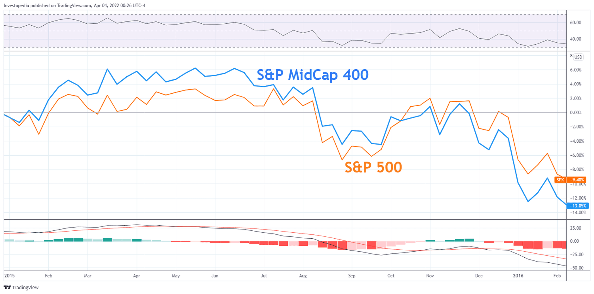

The financial markets continuously evolve, presenting investors with various opportunities and challenges. Among the investment options available, mid-cap stocks stand out as noteworthy contenders, particularly during periods of market downturns known as bear markets. Defined by their market capitalization, which ranges from $2 billion to $20 billion, mid-cap stocks strike a strategic balance between the growth potential characteristic of smaller companies and the stability often associated with large corporations.

These stocks represent companies that are typically in the stage between emerging growth and mature stability, implying they have successfully navigated early business hurdles but continue to hold substantial prospects for expansion. During bull markets, mid-cap stocks often outperform their large-cap counterparts due to this growth potential. However, the focus of this discussion is their performance during bear markets, a time when the dynamics of stock performance can shift significantly.



This article explores the behavior of mid-cap stocks in the face of bear markets, examining various factors that influence their performance. Among these factors, the impact of algorithmic trading is particularly noteworthy. Algorithmic trading, with its advanced AI-driven tools, plays a pivotal role in the modern trading landscape, influencing the liquidity and transaction costs associated with mid-cap stocks. Additionally, this type of trading can uncover opportunities and help manage risks in volatile market environments, thereby affecting the performance of mid-cap stocks during economically challenging times.

Finally, the article aims to provide investors with strategic insights into effectively incorporating mid-cap stocks into their portfolios. Understanding the risk-reward profiles and utilizing advanced analytical tools can enhance decision-making and investment outcomes. By integrating mid-cap stocks into a diversified investment strategy, investors may achieve a desirable balance of growth and stability, aligning with their long-term financial objectives.

## Table of Contents

## Understanding Mid-Cap Stocks

Mid-cap stocks, or medium-capitalization stocks, occupy a distinct space within the financial markets, serving as a bridge between the more stable, established large-cap stocks and the more volatile small-cap stocks. These stocks are defined by their market capitalization, which typically ranges from $2 billion to $20 billion. The companies that fall within this category often have successfully navigated significant growth challenges prevalent in their earlier stages. As a result, they stand on the cusp of expansion, possessing substantial potential for further growth.

In the context of market trends, mid-cap stocks offer a unique investment opportunity. During bull markets, they tend to outperform their large-cap counterparts. This is primarily because mid-cap companies are still growing, allowing them to capitalize on favorable economic conditions more aggressively. Unlike large-cap stocks, which often focus on maintaining their market position, mid-cap stocks are generally still expanding their market share, introducing new products, or entering new markets.

However, understanding their behavior in bear markets is essential for strategic investment planning. During these periods, mid-cap stocks may experience heightened [volatility](/wiki/volatility-trading-strategies), contrasting with the more stable performance of large-cap stocks, which benefit from established market positions and diversified revenue streams. The analysis of mid-cap stocks in bear markets involves understanding their correlation with larger market indices, economic indicators, and specific sector performance.

To illustrate the distinct position of mid-cap stocks, consider the following example comparing market capitalization sizes:

- Large-cap stock: $MC > \$20 \text{ billion}$
- Mid-cap stock: $\$2 \text{ billion} \leq MC \leq \$20 \text{ billion}$
- Small-cap stock: $MC < \$2 \text{ billion}$

This categorization highlights the unique balance mid-cap stocks offer, combining growth potential typically associated with smaller companies with the relative stability of larger corporations.

In summary, mid-cap stocks represent companies poised for continued expansion while maintaining a level of financial stability. This unique positioning makes them an appealing choice for investors seeking a balance between growth and risk, particularly during varying economic cycles.

## Performance of Mid-Cap Stocks in Bear Markets

Mid-cap stocks, with market capitalizations ranging between $2 billion and $20 billion, experience varying degrees of performance during bear markets. Historically, their performance has been mixed, largely due to increased volatility compared to large-cap stocks. While mid-caps can offer attractive growth potential, their higher risk profile may lead to underperformance in volatile market conditions.

The correlation between mid-cap and large-cap stocks during bear markets is influenced by several factors, including market conditions and investor sentiment. For example, during periods of economic downturns or increased market uncertainty, investors often gravitate toward large-cap stocks due to their perceived stability and solid financial foundation, thereby diminishing the appeal of riskier mid-cap stocks. This shift can reduce the demand for mid-caps, leading to underperformance relative to large-caps.

Sector concentration is another critical [factor](/wiki/factor-investing) impacting mid-cap stock performance during bear markets. Mid-cap stocks are frequently concentrated in specific industries or sectors, such as technology or healthcare, which may be more volatile or sensitive to economic fluctuations. If a bear market disproportionately affects these sectors, mid-cap stocks within them might suffer greater declines compared to a more diversified set of large-cap stocks. Conversely, if a sector within the mid-cap space is relatively insulated from economic downturns, it could provide a cushion against broader market declines.

The economic backdrop also plays a significant role in determining the performance of mid-cap stocks during bear markets. Economic indicators such as interest rates, inflation, and GDP growth can influence investor confidence and risk tolerance. For instance, a bear market characterized by rising interest rates might discourage borrowing and investment, leading to reduced growth prospects for mid-cap companies that typically rely on reinvestment of earnings for expansion. On the other hand, a bear market driven by external shocks, such as geopolitical events, might adversely impact mid-caps less severely, given their agility and potential for swift recovery post-crisis.

Overall, while mid-cap stocks can offer opportunities for significant gains, their performance in bear markets is affected by volatility, sector concentration, and macroeconomic conditions. Investors must carefully consider these factors when assessing mid-cap stocks within a strategic portfolio during economic downturns.

## Algorithmic Trading and Its Impact

Algorithmic trading, a process that uses complex mathematical models and high-speed computer programs to make trading decisions, has significantly altered the landscape of financial markets. It improves [liquidity](/wiki/liquidity-risk-premium) by allowing rapid execution of trades, thereby helping to balance supply and demand more efficiently. In addition, [algorithmic trading](/wiki/algorithmic-trading) reduces transaction costs by minimizing market impact and taking advantage of micro-opportunities within the market.

For mid-cap stocks, which are particularly sensitive to market volatility due to their moderate size and trading [volume](/wiki/volume-trading-strategy), algorithmic trading presents valuable opportunities. Algorithms can exploit small price discrepancies and execute trades with precision, enhancing performance even in turbulent market conditions. They leverage a mix of technical indicators, historical data, and [machine learning](/wiki/machine-learning) models to assess the best trading opportunities, thereby increasing the potential for profit.

AI-driven tools supplement these strategies by enabling better decision-making and risk management. By analyzing vast datasets in real-time, AI systems can predict market trends and adjust strategies accordingly. This adaptability is crucial for mid-cap stocks, which can experience rapid price changes. AI tools can optimize portfolios by evaluating risk factors and suggesting diversified investment strategies.

Moreover, algorithmic trading allows for [backtesting](/wiki/backtesting) of strategies against historical data to evaluate their effectiveness before live deployment. This process minimizes risks associated with unexpected market behavior. Consider the following Python code snippet, which demonstrates a simple backtesting framework:

```python
import pandas as pd

def backtest_strategy(prices, signal):
    returns = prices.pct_change().dropna()
    strategy_returns = returns * signal.shift(1).dropna()
    cumulative_returns = (1 + strategy_returns).cumprod()
    return cumulative_returns

# Sample data
stock_prices = pd.Series([100, 102, 101, 103, 107, 105, 110])
trading_signals = pd.Series([1, 1, -1, 1, 1, -1])

# Execute backtesting
cumulative_returns = backtest_strategy(stock_prices, trading_signals)
print(cumulative_returns)
```

In the snippet, the `backtest_strategy` function is used to apply a simple trading signal on historical stock prices, illustrating the cumulative return of the strategy. Such tools are integral for developing robust trading strategies in the often volatile environment of mid-cap stocks.

Overall, the implementation of algorithmic trading and AI-driven tools provides a competitive edge in trading mid-cap stocks, particularly during volatile market periods. By enhancing liquidity, reducing transaction costs, and improving decision-making processes, these technologies empower investors to maximize returns and effectively manage risks.

## Risk and Reward Profiles: Mid-Cap vs. Large-Cap

Investors assessing mid-cap and large-cap stocks need to comprehend the distinct risk and reward profiles these asset classes offer. Mid-cap stocks, with a market capitalization between $2 billion and $20 billion, are considered a midpoint between the stable yet often slower growth of large-cap stocks and the high growth but increased volatility of small-cap stocks.

Mid-cap stocks present a compelling case for inclusion in a risk-adjusted investment portfolio due to their balance of stability and growth potential. These companies are typically more established than small-caps, having surpassed initial growth hurdles, yet they still retain the capacity for significant expansion. This balance makes mid-caps attractive for investors seeking growth while mitigating some risks inherent in smaller companies. Historical data often show mid-cap companies delivering higher growth rates compared to their large-cap counterparts, albeit with increased risk relative to large-caps but less so than small-caps.

Conversely, large-cap stocks, generally defined as having a market capitalization of over $20 billion, are preferred for their resilience during economic downturns. These companies tend to have diversified revenue streams, strong market positions, and robust financial structures, enabling them to provide steady returns even when the broader economy faces challenges. Their size and established nature render them less susceptible to market volatility, making them an integral component for investors prioritizing stability and income, especially during bear market conditions.

To illustrate the contrasting profiles, consider the formula for the Sharpe Ratio, a measure of risk-adjusted return: 

$$

\text{Sharpe Ratio} = \frac{E[R] - R_f}{\sigma}
$$

where $E[R]$ is the expected return of the investment, $R_f$ is the risk-free rate, and $\sigma$ is the standard deviation of the investment's excess return.

Mid-cap stocks often exhibit higher expected returns $E[R]$ with a higher $\sigma$, suggesting enhanced growth potential at the cost of increased volatility. In comparison, large-cap stocks might show lower $E[R]$ with a substantially reduced $\sigma$, reflecting their stable but potentially lower returns. 

In summary, the choice between mid-cap and large-cap stocks should align with an investor’s risk tolerance and financial goals, incorporating factors such as desired balance between growth and stability and the economic outlook. Diversification across these market caps might optimize a portfolio’s risk-return profile, leveraging the growth potential of mid-caps while benefiting from the stability offered by large-caps.

## Strategic Insights for Investing in Mid-Cap Stocks

Investors looking to make informed decisions in mid-cap stocks should focus on several key strategies to optimize their portfolios. A fundamental approach is the application of trend analysis and profitability metrics. Trend analysis allows investors to identify patterns in stock price movements over time, providing insights into potential future performance. Using quantitative methods such as moving averages or the Relative Strength Index (RSI) can help in detecting consistent upward or downward trends. This analysis can be critical in deciding optimal entry and [exit](/wiki/exit-strategy) points for mid-cap stock investments.

Profitability metrics, including Return on Equity (ROE), Net Profit Margin, and Earnings Per Share (EPS), offer a snapshot of a company's financial health and its ability to generate profits. Assessing these metrics helps identify mid-cap companies with robust financial performance and growth potential. High profitability ratios typically indicate a company's efficient management and operational effectiveness, which are crucial during uncertain market conditions such as bear markets.

The integration of AI-driven tools can greatly enhance investment strategies. These tools can process vast amounts of data far more quickly and accurately than traditional methods, allowing for more precise forecasts and portfolio adjustments. Machine learning algorithms can identify emerging trends and anomalies that might not be obvious through manual analysis. By leveraging predictive analytics, investors can uncover hidden growth opportunities in mid-cap stocks that may not be immediately apparent.

Furthermore, diversification across market caps can optimize the risk-return profile of an investment portfolio. A well-diversified portfolio that includes a mix of small-cap, mid-cap, and large-cap stocks can mitigate volatility and enhance potential returns. While mid-cap stocks offer a balance between the stability of large-caps and the growth potential of small-caps, diversifying across different market caps allows investors to spread risk and capitalize on varying economic conditions.

In conclusion, by employing trend analysis, focusing on profitability metrics, utilizing AI-driven tools, and diversifying their investments, investors can strategically position themselves to achieve favorable outcomes with mid-cap stocks. This approach maximizes potential rewards while managing risks, paving the way for sustainable long-term growth.

## Conclusion

Mid-cap stocks provide a unique proposition for investors seeking a blend of growth and stability, particularly appealing during volatile market conditions such as bear markets. While large-cap stocks are often characterized by their resilience and consistent returns, mid-cap stocks strike a balance by offering the potential for significant expansion due to their stage in the corporate life cycle. This opportunity for growth, coupled with a generally acceptable degree of risk, makes mid-caps an attractive component of a diversified investment portfolio.

The performance of mid-cap stocks during bear markets can vary, influenced by their sector concentrations and economic environments. Historically, these stocks have exhibited mixed results, sometimes underperforming their large-cap counterparts. However, with advances in technology, algorithmic trading presents a viable strategy to potentially mitigate risks associated with mid-cap investments. Algorithmic strategies can enhance performance by pinpointing opportunities in volatile markets, thus improving the risk management process and decision-making for investors.

To optimize investment outcomes, it is crucial for investors to understand these dynamics and incorporate mid-cap stocks strategically within a diversified portfolio. Utilizing trend analysis, profitability metrics, and AI-driven tools can further aid investors in identifying growth opportunities and adjusting their portfolios accordingly. This strategic consideration of mid-cap stocks not only aims to harness potential returns but also strives to achieve long-term financial goals through a balanced approach to risk and reward.

## References & Further Reading

The U.S. Securities and Exchange Commission provides a comprehensive definition and explanation of bear markets, which is essential for understanding market cycles and their impact on different asset classes, including mid-cap stocks. This resource can be accessed through the SEC's official website.

Several case studies explore the influence of algorithmic trading on mid-cap stocks. These studies often highlight how technological advancements have altered market behaviors and provided new opportunities for strategic trade executions. Examples include reports by financial technology firms and independent market analysts, which are sometimes available in industry whitepapers or financial journals.

Academic research offers insights into the performance of mid-cap stocks during various economic cycles. These papers typically assess historical data to identify performance patterns and factors influencing such outcomes. Journals like The Journal of Finance or The Financial Analysts Journal often publish peer-reviewed articles on these topics, examining data spanning multiple decades to offer robust analyses of mid-cap stock movements.

