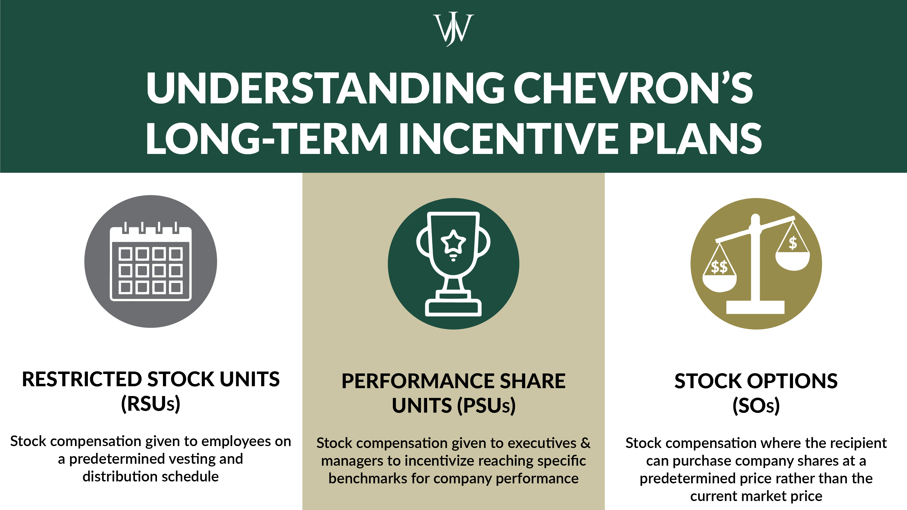

## Table of Contents

## What are performance shares?

Performance shares are a type of stock that a company gives to its employees as a reward. They are different from regular stocks because you only get them if you meet certain goals set by the company. These goals can be things like making more money for the company, doing a good job on projects, or helping the company grow.

When you get performance shares, it's like the company is saying, "If you help us do well, we'll give you more shares." This can make employees work harder and stay with the company longer. It's a way for the company to keep its workers motivated and focused on making the business successful.

## How do performance shares differ from other types of stock compensation?

Performance shares are different from other types of stock compensation because they are given to employees only if they meet specific goals set by the company. These goals might be about how well the company does, like making more money or growing bigger, or they might be about how well the employee does their job. Other types of stock compensation, like stock options or restricted stock units (RSUs), might be given just for working at the company for a certain amount of time, without needing to meet special goals.

Stock options give employees the right to buy company stock at a set price in the future, which can be good if the stock price goes up. RSUs are shares that are given to employees after they work at the company for a certain time, but they don't have to meet extra goals like with performance shares. Performance shares make employees work harder and focus on what the company wants to achieve, while stock options and RSUs are more about rewarding employees for staying with the company.

## What is the purpose of granting performance shares to employees?

The main purpose of giving performance shares to employees is to motivate them to help the company do well. When employees know they can earn more shares by meeting certain goals, they are more likely to work hard and focus on what the company needs to succeed. This can be things like making more money, growing the business, or doing a great job on projects. By linking the reward of more shares to how well the company does, performance shares make employees feel like they are part of the company's success.

Another reason for giving performance shares is to keep employees interested in staying with the company for a longer time. When employees see that their hard work can lead to more shares, they might be less likely to leave for another job. This helps the company keep talented people and build a strong team. Overall, performance shares are a way for companies to encourage their employees to do their best and stay committed to the company's goals.

## How are performance shares typically structured?

Performance shares are usually set up with clear goals that employees need to reach to get the shares. These goals can be about how well the company does, like making more money or growing bigger, or they can be about how well the employee does their job. The company decides what these goals are and how hard they should be to reach. Once the goals are set, employees work towards them over a certain time, which is called the performance period. This period can last for a few years, giving employees enough time to make a big impact.

When the performance period ends, the company checks if the goals were met. If they were, the employees get the performance shares. The number of shares they get can depend on how well they did compared to the goals. Sometimes, employees might get all the shares if they did really well, or they might get fewer shares if they just met the goals. After getting the shares, there might be a time when employees have to wait before they can sell them, which is called a vesting period. This is to make sure employees stay with the company for a bit longer after [earning](/wiki/earning-announcement) the shares.

## What common performance metrics are used to determine the vesting of performance shares?

Performance shares often use different measures to decide if employees get them. Common ones are about how much money the company makes, like earnings per share or total revenue. If the company does better than expected in these areas, employees might get more shares. Another measure is how well the company's stock does compared to other companies in the same field, called relative total shareholder return. If the company's stock does better than others, employees could earn more shares.

Other metrics can be about how the company grows, like increasing market share or expanding into new areas. If the company gets bigger in these ways, employees might get more shares. Sometimes, the goals are about how well the employee does their job, like meeting project deadlines or hitting sales targets. If employees do well in these areas, they can earn performance shares. All these measures help make sure that employees are working towards what the company wants to achieve.

## Can performance shares be awarded to all levels of employees, or are they reserved for executives?

Performance shares can be given to all levels of employees, not just executives. Companies might choose to give them to everyone to make sure everyone is working towards the same goals. This can help the whole company do better because everyone is motivated to help the company succeed.

However, it's more common for performance shares to be given to higher-level employees like managers and executives. This is because their work has a bigger impact on the company's success. By giving performance shares to these key people, the company hopes to keep them motivated and focused on big goals that can make a big difference.

## What are the tax implications of receiving performance shares?

When you get performance shares, you have to think about taxes. When the shares vest, which means you officially get them, you have to pay taxes on their value at that time. This is because the IRS sees the shares as income. The value of the shares when they vest is added to your regular income for that year, and you pay taxes on that total amount. The tax rate depends on your income and how much the shares are worth.

After the shares vest and you pay the initial taxes, if you decide to sell the shares later, you might have to pay more taxes. If you sell the shares for more than what they were worth when they vested, you'll have to pay capital gains tax on the profit. How much you pay depends on how long you held the shares before selling them. If you sell them within a year of vesting, it's a short-term capital gain, and you pay your regular income tax rate. If you hold them for more than a year, it's a long-term capital gain, and the tax rate is usually lower.

## How do restrictions on performance shares work, and what are they intended to achieve?

Restrictions on performance shares are rules that say when and how you can get and use the shares. These rules are there to make sure that employees work hard towards the company's goals and stay with the company for a while. For example, a common restriction is that you can't get the shares until you meet certain goals, like making more money for the company or doing well on projects. Another restriction might be that you have to wait a certain time after getting the shares before you can sell them, which is called a vesting period. This helps keep employees motivated and loyal to the company.

These restrictions are meant to help the company in a few ways. First, they make sure that employees are focused on doing what the company needs to succeed. If employees know they can only get the shares by meeting specific goals, they'll work harder to reach those goals. Second, the restrictions help the company keep good employees. If employees have to wait to sell their shares, they might stay with the company longer because they want to see the value of their shares grow. Overall, restrictions on performance shares help align what employees want with what the company wants, making everyone work together towards common goals.

## What happens to performance shares if an employee leaves the company before they vest?

If an employee leaves the company before their performance shares vest, what happens to those shares depends on the company's rules. Usually, if someone leaves before the shares vest, they might lose the shares. This means they won't get any of the shares they were working towards because they didn't stay long enough or meet the goals set by the company.

However, some companies might have different rules. They might let the employee keep some of the shares if they leave for a good reason, like retiring or if the company lets them go. But even then, there might be a catch. The employee might have to wait until the shares would have vested to get them, or they might only get a part of the shares based on how close they were to meeting the goals when they left.

## How can companies adjust performance share programs to align with long-term strategic goals?

Companies can adjust performance share programs to match their long-term goals by setting clear and specific targets that support what they want to achieve in the future. For example, if a company wants to grow bigger over the next few years, they might set goals for employees to increase the company's market share or enter new markets. By linking performance shares to these long-term goals, employees will focus on doing things that help the company succeed over time, not just in the short term.

Another way to align performance shares with long-term goals is to use a longer performance period. Instead of giving shares based on yearly results, companies can set a performance period that lasts several years. This encourages employees to think about the company's future and work towards goals that take time to achieve. It also helps keep employees motivated and committed to the company for a longer time, which is good for reaching long-term strategic goals.

## What are the potential pitfalls and challenges in implementing a performance share program?

One big challenge in setting up a performance share program is making sure the goals are fair and clear. If the goals are too hard or not clear, employees might get frustrated or feel like they can't reach them. This can make them less motivated instead of more. Also, if the goals are too easy, the program won't push employees to do their best. Companies need to find a good balance so that the goals are challenging but possible to reach, and everyone understands what they need to do.

Another pitfall is figuring out how to measure success. Sometimes, the things the company wants to achieve, like growing bigger or making more money, can be affected by things outside the employees' control, like the economy or competition. This can make it hard to decide if employees should get the shares or not. Companies need to pick the right ways to measure performance that are fair and show what employees can really do. If they don't, employees might feel like the system is not fair, which can hurt morale and make the program less effective.

## How do regulatory and accounting standards impact the design and reporting of performance share plans?

Regulatory and accounting standards play a big role in how companies set up and report their performance share plans. Rules from places like the Securities and Exchange Commission (SEC) and accounting standards like Generally Accepted Accounting Principles (GAAP) or International Financial Reporting Standards (IFRS) tell companies what they need to do. These rules make sure that the performance share plans are fair and that the company reports them correctly. Companies have to follow these rules carefully, or they could get in trouble. This means they need to keep good records and be clear about how they give out shares and what they are worth.

Because of these rules, companies might have to change how they design their performance share plans. For example, they might need to use certain ways to figure out the value of the shares or set up the goals in a specific way. Also, companies have to tell everyone, like shareholders and the public, about the performance share plans in their financial reports. This can be tricky because they need to explain everything clearly so people understand how the plans work and how they affect the company's finances. Following these rules helps make sure that everyone trusts the company and knows what is going on with the performance share plans.

## What is Understanding Equity Compensation?

Equity compensation serves as a strategic tool for companies aiming to align the interests of their employees with corporate objectives. This form of compensation provides a non-cash means of rewarding employees by granting them ownership stakes in the company, thereby directly linking their financial incentives with the overall success of the business. Such alignment is particularly crucial in fostering an entrepreneurial spirit and encouraging long-term commitment from employees.

One of the key benefits of equity compensation is its potential to offer substantial rewards beyond traditional salary structures. This is especially attractive to startups and companies in growth phases that might have limited cash flow but require skilled talent to achieve scalability and market penetration. By offering shares in the company, these organizations can attract and retain employees who are willing to invest in the future success of the business, betting on the potential growth of equity value.

There are two common forms of equity compensation—restricted shares and stock options—each with distinct characteristics and advantages. Restricted shares are actual shares granted to employees, subject to certain restrictions such as vesting periods. These shares become available, or "vest," based on predefined criteria or after a specific period. This vesting mechanism serves to ensure that employees remain with the company for a significant duration, enhancing retention rates.

On the other hand, stock options provide employees the right to purchase company shares at a predetermined price, known as the exercise or strike price, after a vesting period. This form of compensation is advantageous as it allows employees to potentially profit from future increases in stock price, motivating them to contribute to the company's growth and success. The intrinsic value of a stock option is expressed as:

$$
\text{Intrinsic Value} = (\text{Current Stock Price} - \text{Exercise Price}) \times \text{Number of Options}
$$

The selection between restricted shares and stock options often hinges on company strategy and the specific roles of employees within the organization. For instance, companies focused on long-term employee retention might prefer restricted shares due to their explicit vesting schedules, while those aiming to incentivize high performance and risk-taking might opt for stock options to encourage employees to drive stock value.

In conclusion, equity compensation offers versatile mechanisms for companies to align the interests of their workforce with organizational goals, providing both motivational and financial benefits. The strategic choice between different types of equity compensation must consider company objectives, cash flow constraints, and the desired employee behavior and retention outcomes.

## References & Further Reading

Bergstra, J., Bardenet, R., Bengio, Y., & Kégl, B. (2011). Algorithms for Hyper-Parameter Optimization. This paper discusses innovative approaches for optimizing hyper-parameters in [machine learning](/wiki/machine-learning), providing insights that can extend to optimizing trading algorithms.

Advances in Financial Machine Learning by Marcos Lopez de Prado. This book offers comprehensive insight into applying machine learning techniques to financial markets, emphasizing the development and deployment of advanced [algorithmic trading](/wiki/algorithmic-trading) strategies.

Evidence-Based Technical Analysis: Applying the Scientific Method and Statistical Inference to Trading Signals by David Aronson. Aronson's work rigorously evaluates technical analysis through a scientific framework, offering valuable methodologies for improving trading signal accuracy.

Machine Learning for Algorithmic Trading by Stefan Jansen. Jansen provides hands-on guidance on implementing machine learning algorithms for trading, covering data processing, model evaluation, and strategy [backtesting](/wiki/backtesting).

Quantitative Trading: How to Build Your Own Algorithmic Trading Business by Ernest P. Chan. Chan's book is a practical guide for building and maintaining a [quantitative trading](/wiki/quantitative-trading) business, offering insights into strategy development, risk management, and system execution.

These references and suggested readings provide further insights into the tools and methodologies vital for mastering the integration of equity compensation and algorithmic trading strategies.

