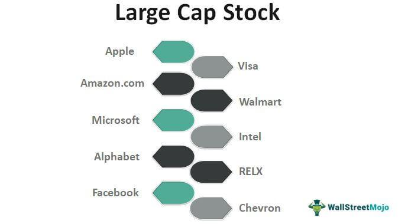

Market capitalization, often referred to as "market cap," is a crucial metric in stock investing, representing the total value of a company’s outstanding shares of stock. It serves as an indicator of a company's size, financial health, and overall market valuation. Market cap is calculated by multiplying the current share price by the total number of outstanding shares, providing investors with a quick snapshot of how a company is valued by the market.

Stocks are generally categorized into three primary groups based on their market capitalization: large-cap, mid-cap, and small-cap. Large-cap stocks pertain to companies with a market capitalization of $10 billion or more. These companies typically exhibit more stability, established histories, and well-recognized brand names. They often possess significant resources and feature prominently in mature industries, attracting investors looking for lower-risk, steady returns.



Mid-cap stocks, on the other hand, refer to companies with a market capitalization ranging between $2 billion and $10 billion. These companies often operate in emerging sectors and present themselves as potential growth opportunities. Mid-caps usually combine stability with growth potential, making them attractive to investors seeking to balance risk and potential return. Both large-cap and mid-cap stocks contribute to diversified investment portfolios, catering to investors' varied risk tolerances and economic expectations.

The focus of this article is centered on examining trends in the performance of large-cap and mid-cap stocks, with a particular emphasis on understanding the impact of algorithmic trading. Over the years, these stock categories have shown distinct performance patterns, influenced by various economic and market factors. Moreover, the advent and growth of algorithmic trading—where computers execute trades based on pre-determined criteria—have significantly reshaped the stock market landscape, influencing liquidity, trading volumes, and stock performance across market capitalizations. Understanding these dynamics can provide strategic insights for investors aiming to optimize their investment portfolios.

## Table of Contents

## Performance Trends in Large-Cap Stocks

Large-cap stocks have long been a cornerstone of investment portfolios due to their resilience and stability. Over recent decades, these stocks have demonstrated solid performance, particularly during shorter-term periods like the last 15 years. Large-cap stocks' dominance is attributed to several factors that reinforce their appeal to investors.

Key among these factors is the phenomenon of 'winner-take-all' markets, where a few dominant companies capture significant market share. Such markets are characterized by leading firms that leverage scale, network effects, and technological innovation to maintain competitive advantages. Companies like Apple, Microsoft, and Amazon exemplify this trend, consistently capturing investor interest and driving returns in the large-cap sector.

Economic slowdowns also contribute to the outperformance of large-cap stocks. During periods of economic uncertainty, large-cap companies, with their established market presence and robust financials, tend to offer a safe haven for investors. Their ability to weather economic downturns with less [volatility](/wiki/volatility-trading-strategies) compared to smaller counterparts makes them attractive during market contractions. For instance, during the financial crisis of 2008 and the COVID-19 pandemic, large-cap stocks were comparatively more resilient.

Another significant [factor](/wiki/factor-investing) impacting large-cap performance is the influx of retirement fund flows into large-cap exchange-traded funds (ETFs). As retirement portfolios seek stability and steady growth, they increasingly turn towards large-cap ETFs. This trend amplifies demand for large-cap stocks, thereby bolstering their market performance. The mechanism by which large-cap ETFs draw substantial investment is primarily due to their diversification benefits, [liquidity](/wiki/liquidity-risk-premium), and lower expense ratios, which appeal to both institutional and retail investors.

Statistical data underscores the attractiveness of large-cap stocks over the last 15 years. By examining market indices like the S&P 500, which tracks the performance of large-cap U.S. companies, investors can observe a steady upward trajectory, with an average annual growth rate that has often outpaced inflation and broader economic growth. Python can be used to analyze such trends effectively, leveraging libraries like pandas and NumPy for data manipulation and matplotlib for visualization.

Overall, large-cap stocks have showcased remarkable performance due to a combination of market dominance, resilience during economic slowdowns, and consistent inflows from retirement funds into large-cap ETFs. This sustained interest reflects investor confidence in their long-term value generation capabilities.

## Performance Trends in Mid-Cap Stocks

Mid-cap stocks, defined as companies with market capitalizations typically ranging from $2 billion to $10 billion, have historically demonstrated notable outperformance in long-term investment horizons. Over periods extending 20 to 30 years, mid-cap stocks have often surpassed their large-cap and small-cap counterparts, offering a compelling investment proposition for those focused on sustained growth and value appreciation.

Several market conditions and phases of economic growth have historically favored the robust performance of mid-cap stocks. Firstly, mid-caps often strike a balance between growth potential and stability, benefiting from increased nimbleness compared to large-cap firms. This allows them to adapt swiftly to changing market dynamics and capitalize on emerging opportunities. As these firms expand, they tend to exhibit higher growth rates than more mature large-cap corporations, yet they are generally less risky than small caps, offering an attractive risk-adjusted return profile.

During periods of economic expansion, mid-cap companies are well-positioned to harness growth opportunities, as they are often more agile and possess sufficient infrastructure to scale operations rapidly. Additionally, these companies typically have established market positions and are capable of capturing incremental market share, fueling further growth. Economic growth phases characterized by increased consumer spending and business investment tend to provide fertile ground for mid-cap expansion.

Furthermore, mid-cap stocks are perceived to be less subjected to market inefficiencies than large-caps, which can be heavily analyzed and driven by macroeconomic factors. This inefficiency can present ample opportunities for active managers and investors to identify undervalued mid-cap stocks with strong growth potential.

Looking ahead, the anticipated trajectory of global economic growth presents a potentially favorable environment for the continued strong performance of mid-cap stocks. As emerging economies evolve and technological advancements drive innovation, mid-cap companies are likely to benefit from their ability to exploit these developments effectively. They may also capitalize on industry-specific trends, such as energy transitions, healthcare innovations, and evolving consumer preferences, which can provide significant growth avenues.

For investors considering mid-cap stocks, it's crucial to analyze macroeconomic indicators and market trends that could influence mid-cap performances, such as [interest rate](/wiki/interest-rate-trading-strategies) fluctuations, inflation expectations, and fiscal policies. The balance between capturing growth potential and managing associated risks through diversified portfolio strategies can further enhance investment outcomes in this segment.

## The Role of Algorithmic Trading in Stock Performance

Algorithmic trading has become a pivotal component of contemporary stock market dynamics, characterized by the use of computer algorithms to execute trades at optimal speeds and precision. This trading method leverages cutting-edge technologies to improve both the efficiency and effectiveness of trading activities. 

At the core of [algorithmic trading](/wiki/algorithmic-trading) is the utilization of [artificial intelligence](/wiki/ai-artificial-intelligence) (AI) and advanced algorithms to enhance trading strategies and decision-making processes. These algorithms analyze vast datasets to identify patterns and trends that human traders may overlook. This computational prowess allows for the execution of trades at speeds unattainable by human effort, minimizing human error and emotional bias, which are traditional impediments to trading success.

The impact of algorithmic trading is particularly observable in its influence on the performance and liquidity of stocks. In large-cap stocks, where market depths are substantial, algorithmic trading contributes to tighter bid-ask spreads and enhanced liquidity. The efficiency brought about by algorithmic trading reduces transaction costs and enhances market depth. Conversely, in the context of mid-cap stocks, algorithmic trading plays a crucial role in optimizing performance. By analyzing liquidity conditions and trading patterns, algorithms can dynamically adjust strategies to exploit favorable conditions, thus potentially enhancing performance.

Numerous success stories highlight the transformative effects of algorithmic trading on mid-cap stock strategies. For instance, several trading firms have employed AI-driven algorithms to identify undervalued mid-cap stocks, leveraging their potential for superior returns. These strategies often involve quantitative models that assess financial ratios, growth potential, and market sentiment. Through [machine learning](/wiki/machine-learning) techniques, algorithms refine their predictions over time, enhancing the investor's ability to outperform the market.

One illustrative case study involves applying machine learning techniques to predict the short-term price movements of mid-cap stocks. By employing historical price data, sentiment analysis, and economic indicators, algorithms can be trained to predict future price movements with a degree of accuracy that improves with data accumulation. The outcome is an enhanced probability of achieving strategic investment goals, exemplifying the symbiosis of AI and financial strategy.

In summary, algorithmic trading continues to redefine the landscape of stock trading, especially concerning large-cap and mid-cap stocks. Its integration with AI provides a robust framework for implementing sophisticated trading strategies, ensuring that both market categories benefit from increased liquidity and optimized performance outcomes.

## Contrasts and Comparisons: Large-Cap vs. Mid-Cap Stocks

Large-cap and mid-cap stocks present distinct risk-reward profiles, catering to different investment strategies and preferences. Understanding these profiles is essential for investors aiming to optimize their portfolio performance by balancing potential returns with associated risks.

### Risk-Reward Profiles

**Large-Cap Stocks:**
Large-cap stocks, typically companies with a market capitalization of $10 billion or more, are generally considered to be more stable and less volatile than smaller-cap stocks. This stability arises from their established market presence, diversified operations, and steady revenue streams. As a result, large-cap stocks are often seen as lower-risk investments, making them attractive to conservative investors seeking consistent dividends and capital preservation. The blue-chip nature of large-caps, featuring well-known companies like Apple, Microsoft, and Johnson & Johnson, adds to their appeal as reliable investments.

**Mid-Cap Stocks:**
Mid-cap stocks, with market capitalizations ranging between $2 billion and $10 billion, tend to offer a balance between the stability of large-caps and the growth potential of small-caps. Historically, mid-cap stocks have provided higher returns than large-caps, albeit with more volatility. This higher risk comes from their growth-oriented nature, as they are typically in expansion phases with opportunities to capture significant market share. Consequently, mid-cap stocks can be attractive to investors willing to accept moderate risk for potentially greater returns.

### Market Conditions

**Favorable Conditions for Large-Caps:**
Large-cap stocks often perform well during periods of economic uncertainty and low interest rates. Their solid financial footing and global reach can help them weather economic downturns, making them resilient when economic growth slows. Additionally, large-caps tend to benefit from increased investments in passive index funds and exchange-traded funds (ETFs), where large retirement funds tend to flow, further stabilizing their demand and performance.

**Favorable Conditions for Mid-Caps:**
Mid-cap stocks typically thrive during periods of economic recovery and expansion. Their agility allows them to capitalize quickly on emerging opportunities, benefiting from increased consumer spending and investment in innovation. As economies grow, mid-caps often outpace their larger counterparts due to their potential for substantial market penetration and revenue growth. These stocks can also gain investor attention during bullish market cycles, where risk appetites are heightened.

### Importance of Diversification

Diversification across asset classes, industries, and market capitalizations is crucial for mitigating risk and enhancing portfolio returns. By including both large-cap and mid-cap stocks in an investment portfolio, investors can achieve a diversified exposure that balances stability with growth potential. Large-cap stocks can provide a safeguard against volatility with their steady performance, while mid-caps can introduce an element of growth, offering the possibility of higher returns.

Moreover, diversification helps smooth out the effects of market cycles. During economic slowdowns, the stability of large-cap stocks can protect the portfolio, while in booming economies, mid-caps can drive superior performance. Leveraging diversification ultimately aligns with the modern portfolio theory, which suggests that a diversified portfolio can maximize returns for a given level of risk. 

In conclusion, the contrasting characteristics of large-cap and mid-cap stocks enable investors to tailor their portfolios to align with their risk tolerance and financial goals, making a nuanced understanding of these categories indispensable for strategic asset allocation.

## Strategic Insights: Investing in Mid-Cap Stocks

Investors seeking to capitalize on growth opportunities in mid-cap stocks often employ a range of strategies that focus on trend analysis and profitability metrics. Mid-cap stocks, representing companies with a market capitalization typically between $2 billion and $10 billion, offer a balance between the stability of large-cap stocks and the high growth potential of small-cap stocks. By utilizing comprehensive analysis and leveraging advanced technological tools, investors can optimize their strategies for investing in this dynamic category.

### Using Trend Analysis and Profitability Metrics

Trend analysis is an essential component of mid-cap investment strategies, providing insights into stock performance over time and helping predict future movements. By analyzing historical price data, investors can identify patterns and trends that may indicate potential growth opportunities. Metrics such as moving averages and relative strength index (RSI) are commonly used to assess [momentum](/wiki/momentum) and identify entry and [exit](/wiki/exit-strategy) points for investments.

Profitability metrics are equally crucial, as they provide deeper insights into a company's financial health and operational efficiency. Key metrics include:

1. **Return on Equity (ROE):** Measures a company's profitability in generating returns on shareholders' equity. A higher ROE indicates more efficient use of equity investment.
$$
   \text{ROE} = \frac{\text{Net Income}}{\text{Shareholders' Equity}}

$$

2. **Earnings per Share (EPS):** Represents the portion of a company's profit attributed to each outstanding share, serving as an indicator of company profitability.
$$
   \text{EPS} = \frac{\text{Net Income} - \text{Dividends on Preferred Stock}}{\text{Average Outstanding Shares}}

$$

3. **Price-to-Earnings Ratio (P/E):** Evaluates a company's current share price relative to its per-share earnings, aiding in assessing valuation.
$$
   \text{P/E Ratio} = \frac{\text{Market Value per Share}}{\text{Earnings per Share}}

$$

Investors use these metrics in combination with trend analysis to create a robust framework for evaluating potential mid-cap investments.

### Exploration of AI-Driven Tools

Artificial intelligence (AI) has revolutionized investment strategies, providing powerful tools to enhance decision-making processes in mid-cap stock investments. AI-driven platforms offer data analysis capabilities far beyond traditional methods, enabling investors to process vast amounts of information and identify patterns that may not be apparent through conventional analysis.

Machine learning algorithms, a subset of AI, can analyze historical and real-time data to predict stock price movements and identify profitable investment opportunities. These algorithms continuously learn from new data, improving their predictions over time. For instance, neural networks can be employed to model complex relationships between various stock market factors, enhancing predictive accuracy.

Python, a popular programming language in the finance sector, is frequently used to implement AI-driven investment strategies. Here is a simple example of using Python for basic trend analysis:

```python
import pandas as pd
import numpy as np
import matplotlib.pyplot as plt

# Load historical stock price data
data = pd.read_csv('mid_cap_stock_data.csv')

# Calculate moving average
data['30_MA'] = data['Close'].rolling(window=30).mean()

# Plot stock closing prices and moving average
plt.figure(figsize=(12,6))
plt.plot(data['Date'], data['Close'], label='Close Price')
plt.plot(data['Date'], data['30_MA'], label='30 Day MA')
plt.xlabel('Date')
plt.ylabel('Price')
plt.title('Mid-Cap Stock Closing Prices and 30 Day Moving Average')
plt.legend()
plt.show()
```

This code example illustrates how to calculate a 30-day moving average, a common trend analysis technique, and visualize it alongside daily closing prices to aid in identifying trends.

By combining trend analysis, profitability metrics, and AI-driven tools, investors can build sophisticated strategies tailored specifically for mid-cap stocks. Such strategies not only enhance the potential for capitalizing on growth opportunities but also improve the overall risk management approach, helping investors navigate the complexities of the market with greater precision and confidence.

## Conclusion

In summary, the performance trends of large-cap and mid-cap stocks exhibit distinct characteristics that are essential for investors to consider. Large-cap stocks have demonstrated dominance in shorter-term periods, often driven by economic slowdowns and substantial inflows from large retirement funds into large-cap ETFs. This performance is also amplified by the rise of "winner-take-all" markets, where established companies leverage their size and resources to maintain a competitive edge. In contrast, mid-cap stocks have historically outperformed over longer periods, particularly in phases of economic growth where these companies can capitalize on expanding markets and demonstrate flexibility and innovation.

Algorithmic trading, powered by advanced algorithms and artificial intelligence, plays a significant role in shaping stock market dynamics. By enhancing decision-making processes and trading strategies, algorithmic trading increases liquidity and influences the performances of both large-cap and mid-cap stocks. The application of these technologies enables more precise execution of trades, reduces transaction costs, and optimizes the timing and selection of investments.

Investors are encouraged to adopt a balanced approach that includes both large-cap and mid-cap stocks in their portfolios. This strategy benefits from the stability and growth potential of large-caps, while also capturing the long-term appreciation prospects of mid-caps. By integrating AI-driven insights, investors can enhance their analysis and decision-making, ultimately optimizing their investment outcomes. Leveraging technological advancements in trading and data analysis enables investors to better navigate market complexities and achieve a well-rounded and resilient portfolio.

## References & Further Reading

[1]: U.S. Securities and Exchange Commission. ["Fast Answers: Market Capitalization."](https://en.wikipedia.org/wiki/U.S._Securities_and_Exchange_Commission)

[2]: Banz, R. W. (1981). ["The Relationship Between Return and Market Value of Common Stocks."](https://www.sciencedirect.com/science/article/pii/0304405X81900180) Journal of Financial Economics, 9(1), 3-18.

[3]: Fama, E. F., & French, K. R. (1992). ["The Cross-Section of Expected Stock Returns."](https://onlinelibrary.wiley.com/doi/abs/10.1111/j.1540-6261.1992.tb04398.x) Journal of Finance, 47(2), 427-465.

[4]: Jones, C. M. (2013). ["What Do We Know About High-Frequency Trading?"](https://papers.ssrn.com/sol3/papers.cfm?abstract_id=2236201) Columbia Business School Research Paper No. 13-11.

[5]: Chan, E. P. (2008). ["Algorithmic Trading: Winning Strategies and Their Rationale."](https://github.com/ftvision/quant_trading_echan_book) Wiley Trading.

[6]: ["Principles of Corporate Finance"](https://www.mheducation.com/highered/product/principles-corporate-finance-brealey-myers/M9781264080946.html) by Richard A. Brealey, Stewart C. Myers, and Franklin Allen.

[7]: ["The Little Book of Common Sense Investing: The Only Way to Guarantee Your Fair Share of Stock Market Returns"](https://www.amazon.com/Little-Book-Common-Sense-Investing/dp/1119404509) by John C. Bogle.