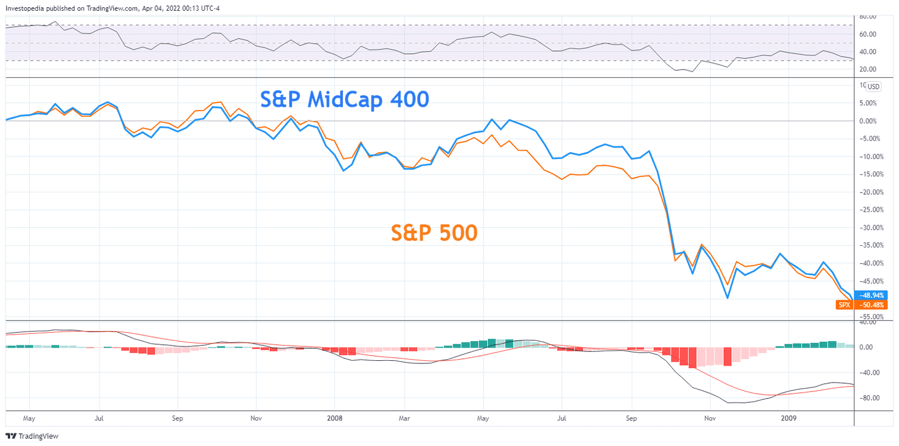

## Table of Contents

## What are mid-cap stocks?

Mid-cap stocks are shares of companies that are in the middle range of size, based on their market value. These companies are larger than small businesses but smaller than big corporations. Usually, a mid-cap company has a market value between $2 billion and $10 billion. Because they are in the middle, they can offer a good mix of growth and stability. Investors like mid-cap stocks because they might grow faster than large companies but are often more stable than small ones.

Investing in mid-cap stocks can be a good choice for people who want to balance risk and reward. These stocks can grow a lot because the companies are still expanding, but they are not as risky as very small companies. However, they can also be more volatile than large-cap stocks, meaning their prices can go up and down more. This makes them a bit riskier than big companies but potentially more rewarding. So, mid-cap stocks can be a smart part of a diverse investment plan.

## What are large-cap stocks?

Large-cap stocks are shares in big companies. These companies have a market value of more than $10 billion. Because they are so big, they are usually well-known and stable. People often think of large-cap stocks as safer investments because these companies have been around for a long time and have a lot of resources. Examples of large-cap companies include Apple, Microsoft, and Amazon.

Investing in large-cap stocks can be a good choice if you want to keep your money safe and still make some profit. These stocks usually don't grow as fast as smaller companies, but they are less likely to lose a lot of value quickly. They can also pay dividends, which means you get regular payments just for owning the stock. So, large-cap stocks are a popular choice for people who want to invest without taking too much risk.

## How do mid-cap and large-cap stocks differ in terms of market capitalization?

Mid-cap and large-cap stocks are different mainly because of their size, which is measured by market capitalization. Market capitalization is how much a company is worth on the stock market. It's calculated by multiplying the number of the company's shares by the price of one share. Mid-cap stocks come from companies that are worth between $2 billion and $10 billion. These companies are bigger than small businesses but smaller than the giants in the market.

Large-cap stocks, on the other hand, are from companies that have a market capitalization of more than $10 billion. These are the big players in the business world, like Apple, Microsoft, and Amazon. Because they are so big, large-cap companies are often seen as more stable and less risky than mid-cap companies. While mid-cap companies can grow faster, large-cap companies usually grow more slowly but are more reliable.

## What are the typical characteristics of mid-cap companies?

Mid-cap companies are businesses that are bigger than small companies but smaller than the really big ones. They usually have a market value between $2 billion and $10 billion. These companies are often in a good spot because they have grown past the risky early stages but are still small enough to keep growing quickly. They can be found in many different industries, like technology, healthcare, or manufacturing. Because they are in the middle, mid-cap companies can offer a nice balance between growth and stability.

One thing about mid-cap companies is that they might not be as well-known as the big companies, but they are not tiny either. This means they can sometimes be overlooked by investors, which can lead to good investment opportunities. Mid-cap companies often have more room to grow than large companies, so their stocks can go up a lot in value if things go well. But they can also be more up and down than large companies, which makes them a bit riskier. So, they can be a good choice for people who want to take a bit more risk for the chance of bigger rewards.

## What are the typical characteristics of large-cap companies?

Large-cap companies are the big players in the business world. They have a market value of more than $10 billion. Because they are so big, these companies are usually well-known and stable. They have been around for a long time and have a lot of resources, which makes them less risky than smaller companies. Examples of large-cap companies include big names like Apple, Microsoft, and Amazon.

Investing in large-cap companies can be a good choice if you want to keep your money safe and still make some profit. These companies usually don't grow as fast as smaller ones, but they are less likely to lose a lot of value quickly. They can also pay dividends, which means you get regular payments just for owning the stock. So, large-cap companies are a popular choice for people who want to invest without taking too much risk.

## How has the performance of mid-cap stocks compared to large-cap stocks historically?

Historically, mid-cap stocks have often done better than large-cap stocks when it comes to growth. Because mid-cap companies are still growing, their stocks can go up a lot in value if the company does well. Over the years, studies have shown that mid-cap stocks can give higher returns than large-cap stocks, especially over long periods of time. But this also means they can be more up and down, which can be scary for some investors.

Large-cap stocks, on the other hand, are usually more stable. They don't grow as fast as mid-cap stocks, but they are less likely to lose a lot of value quickly. This makes them a safer choice for people who don't want to take too much risk. Over the long term, large-cap stocks can still grow and often pay dividends, which can add to the total return for investors. So, while mid-cap stocks might offer more growth, large-cap stocks provide more stability and steady income.

## What factors influence the performance shift between mid-cap and large-cap stocks?

The performance of mid-cap and large-cap stocks can shift due to many things. One big thing is how the economy is doing. When the economy is growing fast, mid-cap stocks often do better because these companies can grow quickly too. They can take advantage of new opportunities and expand their business. But when the economy is not doing so well, people might move their money to large-cap stocks because they are seen as safer. Large-cap companies have more resources and can handle tough times better, so their stocks might not go down as much.

Another thing that can change how mid-cap and large-cap stocks do is interest rates. When interest rates go up, it can be harder for mid-cap companies to borrow money to grow their business. This can slow them down and make their stocks go down. Large-cap companies might not feel this as much because they already have a lot of money and don't need to borrow as much. Also, what's happening in the stock market itself can make a difference. Sometimes, investors might feel like taking more risk and put more money into mid-cap stocks. Other times, they might want to play it safe and stick with large-cap stocks.

## How do economic cycles affect the performance of mid-cap versus large-cap stocks?

Economic cycles have a big impact on how mid-cap and large-cap stocks perform. When the economy is growing and doing well, mid-cap stocks often do better. This is because mid-cap companies are usually in a growth phase and can take advantage of the good times to expand their business. They can grow faster than large-cap companies, which makes their stocks go up more. But when the economy is not doing so well, mid-cap stocks can go down a lot because these companies are more sensitive to economic changes. They don't have as much money saved up as large-cap companies, so they can struggle more in tough times.

On the other hand, large-cap stocks are usually more stable during different economic cycles. When the economy is booming, large-cap stocks might not grow as fast as mid-cap stocks, but they still do well. And when the economy is in a downturn, large-cap companies are better at handling the bad times because they have more resources and can keep going even when things are hard. So, people often move their money to large-cap stocks when they want to be safe during economic downturns. This makes large-cap stocks a good choice for people who want to keep their money safe no matter what the economy is doing.

## What role do sector-specific trends play in the performance shift between mid-cap and large-cap stocks?

Sector-specific trends can make a big difference in how mid-cap and large-cap stocks do. Different industries grow at different times, and this can affect which stocks do better. For example, if there's a new technology that's becoming popular, mid-cap tech companies might do really well because they can grow fast and take advantage of the new trend. But if the trend is in a sector where large-cap companies are the leaders, like big banks or big oil companies, then large-cap stocks might do better because they already have a lot of the market.

These trends can also change how investors see mid-cap and large-cap stocks. If a certain sector is doing really well, investors might want to put more money into mid-cap stocks in that sector because they think they can grow a lot. But if the sector is not doing so well, investors might move their money to large-cap stocks in other sectors that are more stable. So, knowing what's happening in different sectors can help people decide if they want to invest in mid-cap or large-cap stocks.

## How can investors use performance data to make informed decisions about investing in mid-cap versus large-cap stocks?

Investors can use performance data to make smart choices about whether to put their money in mid-cap or large-cap stocks. By looking at how these stocks have done over time, investors can see patterns and trends. For example, if mid-cap stocks have grown more than large-cap stocks in the past few years, this might mean they could be a good choice for someone who wants to grow their money quickly. But if large-cap stocks have been more stable and have paid good dividends, someone who wants to keep their money safe might prefer them. Performance data can show how much risk and reward each type of stock might offer.

Another way to use performance data is to look at how mid-cap and large-cap stocks do during different economic times. If the data shows that mid-cap stocks do well when the economy is growing but not so well when it's shrinking, investors can decide when it might be a good time to buy or sell these stocks. Large-cap stocks might be a safer bet during tough economic times because they don't go up and down as much. By understanding these patterns, investors can make plans that fit their goals and how much risk they are willing to take.

## What are some advanced metrics used to analyze the performance shift between mid-cap and large-cap stocks?

Advanced metrics can help investors see the differences between mid-cap and large-cap stocks more clearly. One important metric is the price-to-earnings (P/E) ratio, which shows how much investors are willing to pay for a company's earnings. Mid-cap stocks often have lower P/E ratios than large-cap stocks, which might mean they are undervalued and could grow more. Another useful metric is the price-to-book (P/B) ratio, which compares a company's market value to its book value. A lower P/B ratio for mid-cap stocks might suggest they are a good buy because they are cheaper compared to what the company owns. These metrics help investors see if mid-cap or large-cap stocks are a better deal.

Another metric to look at is the beta, which measures how much a stock moves compared to the overall market. Mid-cap stocks usually have a higher beta than large-cap stocks, meaning they can go up and down more. This can be good if the market is going up, but it can also be risky if the market goes down. The return on equity (ROE) is also important because it shows how well a company is using the money shareholders have invested. Mid-cap companies might have a higher ROE because they are growing fast, but large-cap companies can have a steady ROE because they are more stable. By looking at these advanced metrics, investors can get a better idea of which stocks might do better in the future.

## How can portfolio diversification strategies be adapted based on the performance trends of mid-cap and large-cap stocks?

Investors can use the performance trends of mid-cap and large-cap stocks to make their investment portfolios more balanced. If mid-cap stocks have been doing well and are expected to keep growing, investors might want to put more money into them. This can help grow the portfolio faster. But because mid-cap stocks can be more up and down, it's important to also have some large-cap stocks in the mix. Large-cap stocks can help keep the portfolio stable, especially if the economy starts to slow down. By looking at how mid-cap and large-cap stocks have been doing, investors can decide how much of each to include to balance risk and reward.

Another way to use these trends is to change the mix of stocks over time. If the economy is doing well and mid-cap stocks are growing a lot, investors might choose to have more mid-cap stocks in their portfolio. But if things start to look shaky, they might want to move some money into large-cap stocks to be safer. This kind of shifting can help investors take advantage of good times and protect their money during bad times. By keeping an eye on the performance of both mid-cap and large-cap stocks, investors can make smart changes to their portfolios to keep them strong and growing.

## What are the strategic insights for investing in mid-cap stocks?

Investors seeking to capitalize on growth opportunities in mid-cap stocks often employ a range of strategies that focus on trend analysis and profitability metrics. Mid-cap stocks, representing companies with a market capitalization typically between $2 billion and $10 billion, offer a balance between the stability of large-cap stocks and the high growth potential of small-cap stocks. By utilizing comprehensive analysis and leveraging advanced technological tools, investors can optimize their strategies for investing in this dynamic category.

### Using Trend Analysis and Profitability Metrics

Trend analysis is an essential component of mid-cap investment strategies, providing insights into stock performance over time and helping predict future movements. By analyzing historical price data, investors can identify patterns and trends that may indicate potential growth opportunities. Metrics such as moving averages and relative strength index (RSI) are commonly used to assess [momentum](/wiki/momentum) and identify entry and [exit](/wiki/exit-strategy) points for investments.

Profitability metrics are equally crucial, as they provide deeper insights into a company's financial health and operational efficiency. Key metrics include:

1. **Return on Equity (ROE):** Measures a company's profitability in generating returns on shareholders' equity. A higher ROE indicates more efficient use of equity investment.
$$
   \text{ROE} = \frac{\text{Net Income}}{\text{Shareholders' Equity}}

$$

2. **Earnings per Share (EPS):** Represents the portion of a company's profit attributed to each outstanding share, serving as an indicator of company profitability.
$$
   \text{EPS} = \frac{\text{Net Income} - \text{Dividends on Preferred Stock}}{\text{Average Outstanding Shares}}

$$

3. **Price-to-Earnings Ratio (P/E):** Evaluates a company's current share price relative to its per-share earnings, aiding in assessing valuation.
$$
   \text{P/E Ratio} = \frac{\text{Market Value per Share}}{\text{Earnings per Share}}

$$

Investors use these metrics in combination with trend analysis to create a robust framework for evaluating potential mid-cap investments.

### Exploration of AI-Driven Tools

Artificial intelligence (AI) has revolutionized investment strategies, providing powerful tools to enhance decision-making processes in mid-cap stock investments. AI-driven platforms offer data analysis capabilities far beyond traditional methods, enabling investors to process vast amounts of information and identify patterns that may not be apparent through conventional analysis.

Machine learning algorithms, a subset of AI, can analyze historical and real-time data to predict stock price movements and identify profitable investment opportunities. These algorithms continuously learn from new data, improving their predictions over time. For instance, neural networks can be employed to model complex relationships between various stock market factors, enhancing predictive accuracy.

Python, a popular programming language in the finance sector, is frequently used to implement AI-driven investment strategies. Here is a simple example of using Python for basic trend analysis:

```python
import pandas as pd
import numpy as np
import matplotlib.pyplot as plt

# Load historical stock price data
data = pd.read_csv('mid_cap_stock_data.csv')

# Calculate moving average
data['30_MA'] = data['Close'].rolling(window=30).mean()

# Plot stock closing prices and moving average
plt.figure(figsize=(12,6))
plt.plot(data['Date'], data['Close'], label='Close Price')
plt.plot(data['Date'], data['30_MA'], label='30 Day MA')
plt.xlabel('Date')
plt.ylabel('Price')
plt.title('Mid-Cap Stock Closing Prices and 30 Day Moving Average')
plt.legend()
plt.show()
```

This code example illustrates how to calculate a 30-day moving average, a common trend analysis technique, and visualize it alongside daily closing prices to aid in identifying trends.

By combining trend analysis, profitability metrics, and AI-driven tools, investors can build sophisticated strategies tailored specifically for mid-cap stocks. Such strategies not only enhance the potential for capitalizing on growth opportunities but also improve the overall risk management approach, helping investors navigate the complexities of the market with greater precision and confidence.

## References & Further Reading

[1]: U.S. Securities and Exchange Commission. ["Fast Answers: Market Capitalization."](https://en.wikipedia.org/wiki/U.S._Securities_and_Exchange_Commission)

[2]: Banz, R. W. (1981). ["The Relationship Between Return and Market Value of Common Stocks."](https://www.sciencedirect.com/science/article/pii/0304405X81900180) Journal of Financial Economics, 9(1), 3-18.

[3]: Fama, E. F., & French, K. R. (1992). ["The Cross-Section of Expected Stock Returns."](https://onlinelibrary.wiley.com/doi/abs/10.1111/j.1540-6261.1992.tb04398.x) Journal of Finance, 47(2), 427-465.

[4]: Jones, C. M. (2013). ["What Do We Know About High-Frequency Trading?"](https://papers.ssrn.com/sol3/papers.cfm?abstract_id=2236201) Columbia Business School Research Paper No. 13-11.

[5]: Chan, E. P. (2008). ["Algorithmic Trading: Winning Strategies and Their Rationale."](https://github.com/ftvision/quant_trading_echan_book) Wiley Trading.

[6]: ["Principles of Corporate Finance"](https://www.mheducation.com/highered/product/principles-corporate-finance-brealey-myers/M9781264080946.html) by Richard A. Brealey, Stewart C. Myers, and Franklin Allen.

[7]: ["The Little Book of Common Sense Investing: The Only Way to Guarantee Your Fair Share of Stock Market Returns"](https://www.amazon.com/Little-Book-Common-Sense-Investing/dp/1119404509) by John C. Bogle.