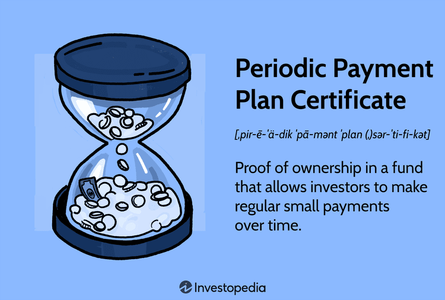

## Table of Contents

## What is a Periodic Payment Plan Certificate?

A Periodic Payment Plan Certificate is a type of investment where you pay a set amount of money regularly, usually monthly, into a fund. This fund is managed by a company, and over time, your money is used to buy shares in the company. The idea is that by paying a little bit each month, you can eventually own a full share or more, depending on how much you've paid in total.

These certificates were popular in the past, especially in the 1970s and 1980s. They were seen as a way for people to invest in the stock market without needing a lot of money upfront. However, they can be risky because the value of the shares can go up and down. Also, the fees charged by the company managing the fund can eat into your returns. Today, other investment options like mutual funds or exchange-traded funds (ETFs) are often seen as better choices for regular investors.

## How does a Periodic Payment Plan Certificate work?

A Periodic Payment Plan Certificate works by letting you pay a small amount of money each month into a fund. This fund is run by a company, and your money is used to buy shares in that company over time. The goal is that after paying regularly for a while, you'll own a full share or even more, depending on how much you've paid in total. It's like saving up to buy something big, but instead of saving for a physical item, you're saving to own part of a company.

These certificates were popular a few decades ago because they let people invest in the stock market without needing a lot of money right away. But they can be risky because the value of the shares can go up and down, and the company managing the fund might charge fees that reduce your returns. Nowadays, other ways to invest, like mutual funds or ETFs, are often seen as better options for regular people looking to grow their money over time.

## What are the benefits of using a Periodic Payment Plan Certificate?

One of the main benefits of using a Periodic Payment Plan Certificate is that it allows you to start investing without needing a lot of money upfront. Instead of having to save up a big amount to buy shares, you can pay a little bit each month. This makes it easier for people who don't have a lot of money to start investing and slowly build up their investment over time.

Another benefit is that it can help you develop a regular saving habit. By committing to pay a small amount each month, you get into the routine of saving and investing regularly. This can be good for your financial discipline and help you grow your money over the long term. However, it's important to remember that these certificates come with risks and fees, so they might not be the best choice for everyone.

## Who can issue a Periodic Payment Plan Certificate?

A Periodic Payment Plan Certificate can be issued by a company that manages investment funds. This company uses the money people pay each month to buy shares in the company. The goal is to help people own part of the company over time without needing a lot of money at the start.

These certificates were more common in the past, but they are still issued by some financial companies today. It's important to check who is issuing the certificate because the company's reputation and the fees they charge can affect how good of an investment it is. Always do your research before deciding to invest in one.

## What are the eligibility criteria for obtaining a Periodic Payment Plan Certificate?

To get a Periodic Payment Plan Certificate, you usually need to be at least 18 years old. This is because investing in these certificates involves understanding the risks and making financial decisions, which is generally allowed once you're an adult. Some companies might also ask for proof of income or a minimum amount of money to start, but this can vary depending on the company issuing the certificate.

Another thing to consider is that you might need to agree to pay a certain amount each month for a set period of time. This helps the company know how much money they will get from you regularly, which they use to buy shares. Always check the specific rules and requirements of the company offering the certificate because they can be different from one company to another.

## How is the payment schedule determined in a Periodic Payment Plan Certificate?

The payment schedule for a Periodic Payment Plan Certificate is usually set by the company that issues the certificate. They decide how much you need to pay each month and for how long. This schedule helps the company know how much money they will get from you regularly, which they use to buy shares in the company over time.

When you sign up for a Periodic Payment Plan Certificate, you agree to pay a fixed amount each month. This amount is often small, making it easier for you to start investing without needing a lot of money at once. The company might ask you to keep paying for a certain number of months or years, so it's important to be ready to stick to this schedule.

## What are the tax implications of a Periodic Payment Plan Certificate?

The tax implications of a Periodic Payment Plan Certificate can be a bit complicated. When you invest in these certificates, you pay a small amount each month. The money you pay is used to buy shares, and if those shares go up in value, you might have to pay taxes on the profit when you sell them. This profit is called a capital gain, and it's taxed differently depending on how long you held the shares before selling them.

If you hold the shares for more than a year before selling, the capital gain is usually taxed at a lower rate than if you sell them within a year. This is called long-term capital gains tax. On the other hand, if you sell the shares within a year, you'll pay short-term capital gains tax, which is the same as your regular income tax rate. It's a good idea to talk to a tax advisor to understand how these rules apply to your specific situation and to make sure you're prepared for any taxes you might owe.

## Can a Periodic Payment Plan Certificate be transferred or sold?

Yes, a Periodic Payment Plan Certificate can be transferred or sold, but it depends on the rules set by the company that issued the certificate. Some companies might let you transfer your certificate to someone else, like a family member or friend, if you decide you no longer want it. Other companies might let you sell your certificate to someone else, but they might charge a fee for doing this.

It's important to check the specific rules of the company before you try to transfer or sell your certificate. The company's rules will tell you if it's possible and what you need to do. Always read the fine print and ask questions if you're not sure, so you know exactly what you can and can't do with your certificate.

## What are the risks associated with investing in a Periodic Payment Plan Certificate?

Investing in a Periodic Payment Plan Certificate can be risky because the value of the shares you're buying can go up and down. If the stock market goes down, the value of your certificate might go down too. This means you could lose money if you need to sell your shares when the market is low. Also, these certificates often come with fees that the company charges for managing your money. These fees can eat into your returns, making it harder for you to make a profit.

Another risk is that you might not be able to get your money out quickly if you need it. Some companies have rules that make it hard to sell or transfer your certificate before a certain time. This can be a problem if you need your money for something else. It's also important to remember that these certificates might not be the best way to invest your money. Other options like mutual funds or ETFs might be safer and give you better returns over time. Always think carefully and do your research before deciding to invest in a Periodic Payment Plan Certificate.

## How does a Periodic Payment Plan Certificate compare to other investment options?

A Periodic Payment Plan Certificate lets you invest a little bit of money each month into a fund that buys shares in a company. This can be good if you don't have a lot of money to start with and want to slowly build up your investment. However, these certificates can be risky because the value of the shares can go up and down, and the company managing the fund might charge high fees that reduce your returns. Also, it might be hard to get your money out quickly if you need it.

Other investment options like mutual funds and exchange-traded funds (ETFs) might be better choices for many people. Mutual funds pool money from many investors to buy a variety of stocks, bonds, or other assets, which can help spread out the risk. ETFs are similar but can be bought and sold like stocks, giving you more flexibility. Both mutual funds and ETFs often have lower fees than Periodic Payment Plan Certificates and can offer better returns over time. They also make it easier to get your money out when you need it.

Choosing between a Periodic Payment Plan Certificate and other investments depends on your financial goals and how much risk you're willing to take. If you want to start investing with small amounts and are okay with the risks and fees, a Periodic Payment Plan Certificate might work for you. But if you're looking for a safer way to grow your money with more flexibility, mutual funds or ETFs might be a better fit. Always do your research and consider talking to a financial advisor to find the best investment for your needs.

## What legal considerations should be taken into account with a Periodic Payment Plan Certificate?

When you invest in a Periodic Payment Plan Certificate, it's important to know the legal rules that come with it. These certificates are controlled by laws that say what the company can and can't do with your money. For example, the company has to tell you about any fees they charge and how they use your money to buy shares. They also have to follow rules about how they manage the fund and report things to you. If the company doesn't follow these rules, you might be able to take legal action against them.

Another thing to think about is the contract you sign when you buy a Periodic Payment Plan Certificate. This contract will say things like how much you need to pay each month, how long you have to keep paying, and what happens if you want to stop or sell your certificate. It's really important to read this contract carefully and understand it before you sign. If you don't understand something, it's a good idea to ask the company or talk to a lawyer. This way, you can make sure you know all the legal stuff and protect yourself.

## What are the advanced strategies for optimizing returns from a Periodic Payment Plan Certificate?

To get the most out of a Periodic Payment Plan Certificate, one strategy is to keep investing regularly, even when the market goes up and down. By paying the same amount each month, you can buy more shares when prices are low and fewer when prices are high. This is called dollar-cost averaging, and it can help you get a better average price for your shares over time. Another thing to think about is reinvesting any dividends you get from the shares. Instead of taking the money out, you can use it to buy more shares, which can help your investment grow faster.

Another strategy is to watch the fees the company charges. These fees can eat into your returns, so it's a good idea to choose a company with low fees. You might also want to look at the performance of the shares the company is buying. If the shares are doing well, your certificate might do well too. But remember, the stock market can be unpredictable, so it's important to be patient and keep investing for the long term. By sticking to these strategies, you can give yourself a better chance of making more money from your Periodic Payment Plan Certificate.

## What are the benefits and considerations of exploring periodic payment plans?

Periodic payment plans are a form of investment strategy designed to accommodate regular, small contributions towards a financial goal, making them accessible for a wide range of investors. These plans allow investors to make scheduled contributions over a specified period, typically structured around a consistent timeline such as monthly or quarterly payments. The primary objective is to accumulate a substantial investment over time, leveraging the benefits of compounding and dollar-cost averaging.

### Facilitation of Regular Small Investments

Periodic payment plans are particularly appealing for individuals who do not have a significant lump sum to invest upfront but can afford to set aside smaller amounts consistently. This systematic approach allows investors to gradually build their investment portfolio while mitigating the risk associated with market [volatility](/wiki/volatility-trading-strategies). By investing a fixed amount at regular intervals, investors are able to purchase more shares when prices are low and fewer shares when prices are high, effectively averaging the cost of their investment over time.

Mathematically, the concept can be represented as:

$$
\text{Average Cost Price} = \frac{\text{Total Amount Invested}}{\text{Total Units Purchased}}
$$

For example, if an investor contributes $200 every month to purchase shares in a mutual fund, the number of shares acquired will vary along with the fluctuating share price, leading to a potentially lower average cost over time.

### Regulatory Aspects

Periodic payment plans are subject to regulatory oversight, ensuring they operate within the legal framework established for financial products. In the United States, these plans are regulated by the Securities and Exchange Commission (SEC) under the Investment Company Act of 1940. The regulation mandates transparency and investor protection, requiring disclosure of fees, charges, and the nature of investments involved. Subscribers to these plans can access detailed information about the financial instrument they are investing in, safeguarding against potential exploitative practices.

### Pros and Cons of Investing in Periodic Payment Plans

#### Pros
1. **Accessibility**: These plans lower the barrier to entry, allowing investors with limited capital to participate in the financial markets.
2. **Discipline**: By committing to regular contributions, investors cultivate disciplined saving and investing habits.
3. **Risk Mitigation**: Dollar-cost averaging reduces the impact of market volatility, as investments are spread out over time.

#### Cons
1. **Costs**: Periodic payment plans may involve specific charges or fees, including setup or management fees, which can erode returns over the long term.
2. **Limited Flexibility**: Investors are bound to the set payment schedule, which may not align with sudden increases in income or unanticipated expenses.
3. **Potential Returns**: Compared to lump-sum investments made at opportune times, periodic investing might yield lesser returns during prolonged bull markets, as investors miss out on significant capital appreciation by purchasing in installments.

In conclusion, while periodic payment plans offer a systematic and disciplined approach to investment, it is crucial for investors to weigh the potential costs and benefits and consider their financial circumstances and market conditions before commitment.

## References & Further Reading

[1]: Fabozzi, F. J. (2006). ["The Handbook of Fixed Income Securities"](https://www.amazon.com/Handbook-Fixed-Income-Securities-Ninth/dp/1260473899). McGraw-Hill Education.

[2]: Gremillion, L. (2005). ["The Mutual Fund Industry Handbook: A Comprehensive Guide for Investment Professionals"](https://archive.org/details/mutualfundindust00leeg). Wiley.

[3]: Chan, E. P. (2013). ["Algorithmic Trading: Winning Strategies and Their Rationale"](https://github.com/ftvision/quant_trading_echan_book). Wiley.

[4]: Lewis, M. (2014). ["Flash Boys: A Wall Street Revolt"](https://en.wikipedia.org/wiki/Flash_Boys). W. W. Norton & Company.

[5]: Lopez de Prado, M. (2018). ["Advances in Financial Machine Learning"](https://www.amazon.com/Advances-Financial-Machine-Learning-Marcos/dp/1119482089). Wiley.