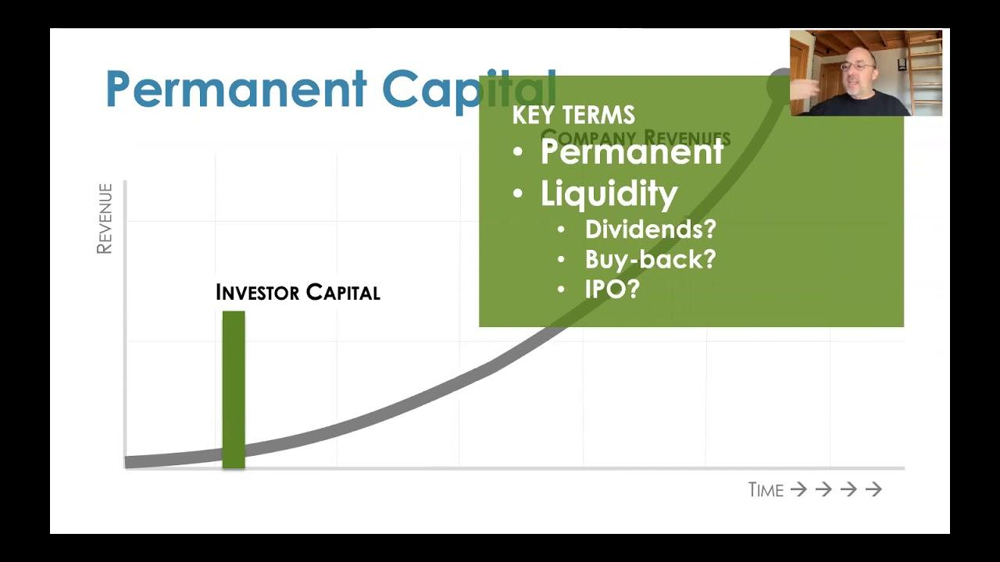

## Table of Contents

## What is a Permanent Capital Vehicle (PCV)?

A Permanent Capital Vehicle (PCV) is a type of investment fund that has a long-lasting structure, meaning it doesn't have a set end date like many other funds. This allows investors to put their money into the fund without worrying about having to take it out after a certain period. PCVs are often used by companies or investment managers who want to have a stable source of capital to invest in various projects or businesses over a long time.

Because PCVs don't have to return the money to investors at a specific time, they can focus on long-term investments that might take years to become profitable. This can be good for investors who are looking for steady, long-term growth rather than quick returns. Examples of PCVs include real estate investment trusts (REITs) and some types of publicly traded companies.

## How does a PCV differ from traditional investment funds?

A Permanent Capital Vehicle (PCV) is different from traditional investment funds because it doesn't have an end date. Traditional funds, like mutual funds or private equity funds, usually have a set time when they will close and return the money to investors. This can be after a few years. But a PCV keeps going, so investors can leave their money in for as long as they want.

Because PCVs don't have to give the money back at a certain time, they can make long-term investments. These might be in big projects that take many years to start making money. Traditional funds often need to focus on shorter-term investments because they have to return the money to investors sooner. This makes PCVs a good choice for people who want their investments to grow slowly and steadily over a long time.

## What are the main types of Permanent Capital Vehicles?

There are a few main types of Permanent Capital Vehicles. One type is a Real Estate Investment Trust, or REIT. A REIT is a company that owns or finances real estate that produces income. People can buy shares in a REIT, and it's a way to invest in real estate without having to buy property directly. REITs can keep going for a long time, so they are a type of PCV.

Another type of PCV is a publicly traded company. These are companies that anyone can buy shares in on a stock market. Some of these companies use the money they get from selling shares to make long-term investments. Because these companies don't have to give the money back to shareholders at a certain time, they can be considered PCVs. They can keep investing and growing over many years.

A third type of PCV is a Business Development Company, or BDC. BDCs invest in small and medium-sized businesses, often by giving them loans or buying part of the company. Like REITs and publicly traded companies, BDCs can keep going for a long time. This makes them another type of PCV, where investors can put their money in for the long term.

## What are the advantages of investing in a PCV for beginners?

Investing in a Permanent Capital Vehicle (PCV) can be a good choice for beginners because it's a way to keep your money in an investment for a long time without having to worry about taking it out after a few years. PCVs don't have a set end date, so you can leave your money in and let it grow slowly over many years. This is helpful if you're new to investing and want to start with something that's easy to understand and doesn't require you to make quick decisions about when to take your money out.

Another advantage for beginners is that PCVs often focus on long-term investments. This means they might invest in big projects that take a long time to start making money. For someone new to investing, this can be a safer way to start because it's less about trying to make quick profits and more about steady growth. By investing in a PCV, beginners can learn about investing over time and see how their money grows without the pressure of having to make quick decisions.

## How does a PCV provide stability to investors?

A Permanent Capital Vehicle (PCV) provides stability to investors because it doesn't have a set end date. This means that investors don't have to worry about taking their money out at a certain time. They can leave their money in the PCV for as long as they want, which can make it easier to plan for the future. When you know your investment can stay in place for a long time, it can feel more secure and less risky.

PCVs also focus on long-term investments, which can add to the stability. Instead of trying to make quick profits, PCVs invest in big projects that might take years to start making money. This long-term approach can be less stressful for investors because it's not about making fast decisions. It's about steady growth over time, which can help beginners feel more comfortable as they learn about investing.

## What role do PCVs play in long-term investment strategies?

Permanent Capital Vehicles (PCVs) are important for long-term investment strategies because they don't have a set end date. This means investors can keep their money in the PCV for as long as they want. It's good for people who want to plan for the future without worrying about when they have to take their money out. PCVs help investors feel more secure because they know their money can stay in the investment for a long time.

PCVs also focus on long-term investments, like big projects that take years to start making money. This is different from other types of funds that might try to make quick profits. By investing in PCVs, people can grow their money slowly and steadily over many years. This can be a good choice for someone who wants to build wealth over time without the stress of making fast decisions.

## How can a PCV be structured to benefit from tax advantages?

A Permanent Capital Vehicle (PCV) can be structured in ways that help investors save on taxes. For example, a Real Estate Investment Trust (REIT) is a type of PCV that can offer tax benefits. REITs don't have to pay corporate income tax as long as they give out at least 90% of their taxable income to shareholders as dividends. This means that investors in a REIT can get more money back because the company isn't losing a big part of its earnings to taxes.

Another way a PCV can be structured for tax advantages is through a Business Development Company (BDC). BDCs also don't have to pay corporate income tax if they distribute at least 90% of their income to shareholders. This can be good for investors because they get more of the profits directly, without the company paying taxes first. By choosing a PCV like a REIT or a BDC, investors can keep more of their earnings and benefit from the tax advantages these structures offer.

## What are the governance and management structures typical of PCVs?

Permanent Capital Vehicles (PCVs) usually have a board of directors that helps make big decisions. This board is made up of people who are chosen by the shareholders, the people who own parts of the PCV. The board's job is to look after the interests of the shareholders and make sure the PCV is doing well. They meet regularly to talk about the PCV's plans and how it's doing. The board also hires the top managers who run the day-to-day work of the PCV.

The management team of a PCV is in charge of the everyday running of the company. They make decisions about what to invest in and how to grow the business. The managers report to the board of directors and have to follow the rules and plans that the board sets. This structure helps make sure that the PCV is managed well and that the shareholders' money is being used in the best way possible.

## How do PCVs manage liquidity and capital deployment?

Permanent Capital Vehicles (PCVs) manage liquidity by keeping some money ready to use. This money can be used to buy new investments or to pay for any unexpected costs. PCVs don't have to give money back to investors at a certain time, so they can keep more money in long-term investments. This helps them stay stable and grow over time. If investors want to take their money out, they can sell their shares in the PCV to someone else, which doesn't affect the PCV's liquidity.

PCVs also plan carefully how to use their money, which is called capital deployment. They look for good long-term investments that will grow over many years. Because they don't have to worry about giving money back to investors quickly, they can take their time to find the best opportunities. This helps them make smart choices and grow the PCV's value slowly and steadily. By focusing on long-term growth, PCVs can build wealth for their investors over time.

## What are the potential risks and challenges associated with PCVs?

Investing in Permanent Capital Vehicles (PCVs) can have some risks. One big risk is that the value of the PCV can go up and down a lot. This is because PCVs often invest in big projects that take a long time to start making money. If these projects don't do well, the value of the PCV can drop, and investors might lose money. Another risk is that PCVs might not be as easy to sell as other investments. If you want to take your money out, you might have to wait for someone else to buy your shares, and you might not get as much money as you hoped.

There are also challenges with managing a PCV. The people in charge need to be good at finding the right long-term investments. If they make bad choices, the PCV might not grow as much as expected. Also, because PCVs don't have to give money back to investors at a certain time, the managers might not feel as much pressure to perform well. This can lead to less focus on making the PCV grow quickly. It's important for investors to understand these risks and challenges before putting their money into a PCV.

## How do regulatory environments affect the operation of PCVs?

Regulatory environments can have a big impact on how Permanent Capital Vehicles (PCVs) work. Different countries have different rules about what PCVs can and can't do. For example, some places might have strict rules about how much money PCVs can borrow or what kinds of investments they can make. These rules are there to protect investors and make sure PCVs are managed well, but they can also make it harder for PCVs to grow quickly or take advantage of certain opportunities.

Another way regulations affect PCVs is through taxes. As we talked about before, some types of PCVs like REITs and BDCs can get special tax benefits. But these benefits depend on the rules in each country. If the rules change, it could affect how much money PCVs and their investors keep. Also, PCVs have to follow rules about reporting their activities and finances to the government. This can take a lot of time and money, but it helps make sure everything is done fairly and openly.

## What are some case studies or examples of successful PCVs and their strategies?

One successful example of a Permanent Capital Vehicle is Realty Income Corporation, a Real Estate Investment Trust (REIT). Realty Income focuses on owning and leasing out properties that produce steady income, like retail stores and other commercial spaces. They have a strategy of buying properties that have long-term leases with big companies. This helps them get regular payments from rent, which they can then give to their investors as dividends. Realty Income has been able to grow steadily over many years because they focus on stable, long-term investments. They also try to keep their costs low and make smart choices about which properties to buy, which helps them stay profitable.

Another example is Ares Capital Corporation, a Business Development Company (BDC). Ares Capital invests in small and medium-sized businesses, often by giving them loans or buying part of the company. Their strategy is to help these businesses grow and become more successful, which can lead to good returns for their investors. Ares Capital looks for companies that have strong management teams and good growth potential. By focusing on these kinds of investments, Ares Capital has been able to provide steady income to its investors through dividends. Their long-term approach and careful selection of investments have helped them become a successful PCV.

## References & Further Reading

[1]: Meerkatt, H., & Vogel, P. "Permanent Capital: A Global Perspective." Available on various book retail platforms.

[2]: Chan, E. (2009). ["Algorithmic Trading: Winning Strategies and Their Rationale."](https://github.com/ftvision/quant_trading_echan_book) Wiley.

[3]: Buffet, M. & Clark, D. "Warren Buffett and the Interpretation of Financial Statements: The Search for the Company with a Durable Competitive Advantage." Available on major book retail platforms.

[4]: Lopez de Prado, M. (2018). ["Advances in Financial Machine Learning."](https://www.amazon.com/Advances-Financial-Machine-Learning-Marcos/dp/1119482089) Wiley.

[5]: Aronson, D. R. (2006). ["Evidence-Based Technical Analysis: Applying the Scientific Method and Statistical Inference to Trading Signals."](https://www.amazon.com/Evidence-Based-Technical-Analysis-Scientific-Statistical/dp/0470008741) Wiley.

[6]: Jansen, S. (2020). ["Machine Learning for Algorithmic Trading."](https://github.com/stefan-jansen/machine-learning-for-trading) Packt Publishing.

[7]: Chan, E. P. (2008). ["Quantitative Trading: How to Build Your Own Algorithmic Trading Business."](https://github.com/ftvision/quant_trading_echan_book) Wiley.

[8]: "Social Science Research Network (SSRN)" for access to various academic papers on Permanent Capital Vehicles and algorithmic trading. (https://www.ssrn.com/index.cfm/en/)