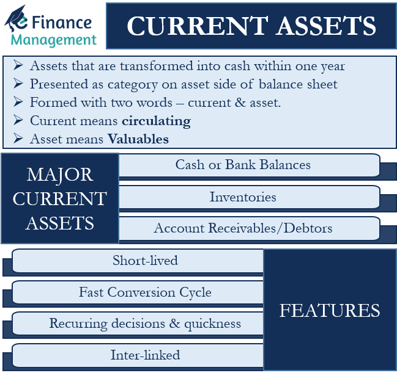

## Table of Contents

## What is a permanent current asset?

A permanent current asset is a type of asset that a company always needs to keep in its business operations. These assets are always there and never go away completely. They are part of the current assets, which means they can be turned into cash within a year. Examples of permanent current assets are things like a minimum amount of cash, basic inventory, and some accounts receivable that the business always needs to run smoothly.

Even though these assets are called "permanent," the specific items in them can change. For example, the company might sell some inventory and buy new inventory, but it will always have some inventory. The important thing is that the company needs these assets to keep working every day. They are different from temporary current assets, which the company might only need for a short time or for a special project.

## How does a permanent current asset differ from a temporary current asset?

A permanent current asset is something a business always needs to have to keep running smoothly. These are things like a little bit of cash, some basic inventory, and a few accounts receivable that the business always keeps around. They are called "permanent" because the business always needs them, even if the specific items change over time. For example, a store will always have some inventory, but the exact products might be different from one day to the next.

On the other hand, a temporary current asset is something a business only needs for a short time or for a specific project. These assets come and go and are not always needed for the day-to-day operations of the business. For example, a company might buy extra materials for a big order, but once the order is done, they don't need those materials anymore. So, temporary current assets are more like short-term helpers, while permanent current assets are always there to keep the business going.

## Can you provide examples of permanent current assets?

Permanent current assets are things a business always needs to keep running smoothly. One example is a minimum amount of cash that a company keeps on hand. This cash is needed to pay for everyday expenses like salaries, utilities, and small purchases. Without this cash, the business would struggle to operate day to day.

Another example of a permanent current asset is basic inventory. A store, for instance, always needs to have some products on its shelves to sell to customers. Even if the specific items change, there will always be some inventory that the business needs to keep operating. Similarly, a manufacturer needs to have raw materials on hand to produce goods.

Accounts receivable can also be a permanent current asset. These are amounts of money that customers owe the business for goods or services they have already received. A company will always have some accounts receivable because it sells on credit to keep customers happy and maintain sales. These receivables are essential for the ongoing operations of the business.

## Why are permanent current assets important for a business?

Permanent current assets are really important for a business because they help keep things running smoothly every day. These assets, like a little bit of cash, some basic inventory, and a few accounts receivable, are always needed. Without them, a business would have a hard time paying for everyday expenses, keeping products on the shelves, or getting money from customers. They are like the backbone of the business, making sure it can operate without any big interruptions.

Having permanent current assets also helps a business stay stable and ready for the future. Because these assets are always there, the business can plan better and feel more secure. For example, knowing that there's always some cash on hand means the business can pay bills on time and not worry about running out of money. And having basic inventory means the business can keep selling to customers without any gaps. So, permanent current assets are key to keeping a business strong and ready for whatever comes next.

## How do permanent current assets affect a company's liquidity?

Permanent current assets help a company stay liquid, which means having enough cash or things that can be turned into cash quickly. These assets, like a little bit of cash, some basic inventory, and a few accounts receivable, are always there. They make sure the company can pay its bills on time and keep running smoothly every day. Without these assets, the company might struggle to find money when it needs it, which could cause problems.

Having permanent current assets also helps a company plan better and feel more secure about its future. Because these assets are always around, the company knows it can count on them to help with any unexpected expenses or opportunities. This makes the company more stable and able to handle changes in the market or in its business. So, permanent current assets are really important for keeping a company's [liquidity](/wiki/liquidity-risk-premium) strong.

## What role do permanent current assets play in working capital management?

Permanent current assets are really important for managing a company's working capital. Working capital is the money a business uses to run its day-to-day operations. Permanent current assets, like a little bit of cash, some basic inventory, and a few accounts receivable, are always needed. They help make sure the company has enough money to pay for things like salaries, utilities, and small purchases. Without these assets, the business might not have enough money to keep going every day.

These assets also help the company plan better and stay stable. Because they are always there, the company can count on them to help with any unexpected expenses or opportunities. This makes it easier for the company to manage its working capital, because it knows it will always have some money or things it can turn into money quickly. So, permanent current assets are key to keeping a company's working capital strong and making sure it can keep running smoothly.

## How should permanent current assets be financed?

Permanent current assets should be financed with long-term sources of money. This is because these assets are always needed for the business to keep running every day. Using long-term financing, like long-term loans or equity, makes sure the company has the money it needs without having to worry about paying it back quickly. This helps the business stay stable and ready for the future.

For example, if a company uses a long-term loan to finance its basic inventory, it can keep selling products without worrying about running out of money. This way, the business can focus on growing and making profits, instead of worrying about how to pay for its everyday needs. So, using long-term financing for permanent current assets helps the company manage its money better and stay strong in the long run.

## What are the risks associated with managing permanent current assets?

Managing permanent current assets can be risky if a business doesn't do it right. One big risk is not having enough of these assets. If a company doesn't keep enough cash, inventory, or accounts receivable, it might struggle to pay its bills or keep selling products. This can lead to big problems, like not being able to pay employees or suppliers on time, which can hurt the business's reputation and ability to keep going.

Another risk is having too much tied up in permanent current assets. If a company keeps too much money in cash or too much inventory, it might miss out on other good opportunities to use that money. For example, the business could invest in new projects or pay down debts, but instead, it's just sitting on assets that aren't [earning](/wiki/earning-announcement) any extra money. This can slow down the company's growth and make it less competitive in the market. So, it's important for a business to find the right balance when managing its permanent current assets.

## How do permanent current assets impact a company's financial statements?

Permanent current assets show up on a company's balance sheet, which is a list of what the company owns and owes. These assets, like a little bit of cash, some basic inventory, and a few accounts receivable, are part of the current assets section. They are called current assets because they can be turned into cash within a year. Having these assets makes the company look healthier and more stable on its balance sheet, because it shows that the company always has some money or things it can turn into money quickly.

These assets also affect the company's income statement, which is a report of how much money the company makes and spends. For example, if the company sells some of its inventory, it will show up as revenue on the income statement. And if the company collects money from its accounts receivable, that will also show up as cash coming in. So, permanent current assets help the company keep making money and spending it in a way that keeps the business running smoothly. They are really important for showing how well the company is doing financially.

## What strategies can be used to optimize the use of permanent current assets?

To optimize the use of permanent current assets, a business should first make sure it has just the right amount of these assets. Too little cash, inventory, or accounts receivable can cause problems with paying bills or keeping products on the shelves. On the other hand, having too much money tied up in these assets can stop the business from using that money for other important things, like growing the business or paying down debts. So, the business needs to find a good balance, making sure it always has enough of these assets to keep running smoothly, but not so much that it misses out on other opportunities.

Another strategy is to keep a close eye on these assets and make adjustments when needed. For example, if the business sees that it's running low on cash, it might need to borrow some money or sell some inventory to get more cash quickly. And if it has too much inventory sitting around, it might need to have a sale or find a way to use that inventory to make more money. By staying on top of its permanent current assets and making smart decisions, the business can use these assets in the best way possible to keep its operations running smoothly and grow over time.

## How do economic conditions influence the management of permanent current assets?

Economic conditions can really change how a business manages its permanent current assets. In good times, when people are buying more and the economy is growing, a business might need to keep more cash, inventory, and accounts receivable on hand. This is because it wants to make sure it can meet the higher demand for its products or services. But if the economy starts to slow down, the business might need to be more careful with its money. It might keep less cash and inventory, because it knows people might not be buying as much. So, the business needs to watch the economy and adjust how it manages its permanent current assets to stay safe and keep running smoothly.

In tough economic times, like a recession, a business might face even bigger challenges. It might need to hold onto more cash to make sure it can pay its bills, even if fewer customers are buying things. At the same time, it might need to cut back on inventory, because it doesn't want to be stuck with a lot of products that aren't selling. And if customers are slower to pay, the business might need to be more careful about who it sells to on credit. By keeping a close eye on economic conditions and making smart changes to how it manages its permanent current assets, a business can better handle the ups and downs of the economy and stay strong.

## What advanced metrics should be used to evaluate the efficiency of permanent current assets?

To evaluate how well a business is using its permanent current assets, it can look at something called the cash conversion cycle. This metric shows how long it takes for the business to turn its inventory and accounts receivable into cash. A shorter cash conversion cycle means the business is doing a good job of managing its cash, inventory, and receivables. It can quickly sell its products and get paid by customers, which helps keep more money flowing through the business. If the cycle is too long, it might mean the business is holding onto too much inventory or waiting too long to get paid, which can tie up money that could be used for other things.

Another important metric is the inventory turnover ratio. This tells the business how many times it sells and replaces its inventory over a certain period, like a year. A higher turnover ratio means the business is selling its inventory quickly, which is good because it shows that the products are in demand and the business isn't holding onto too much stock. If the turnover is low, it might mean the business has too much inventory that isn't selling, which can tie up money and space. By keeping an eye on these metrics, a business can make sure it's using its permanent current assets in the best way possible to keep running smoothly and grow.

## What is the role of asset management?

Asset management involves the strategic oversight and optimization of a company's assets to maximize returns while minimizing risks. This process is fundamental to maintaining a balance between satisfying liquidity demands and capitalizing on investment opportunities, which directly influences a company's financial stability. 

The practice of asset management necessitates a meticulous analysis of various economic indicators, market conditions, and risk factors. Asset managers play a pivotal role in this process, utilizing a diverse set of tools and methodologies to assess the investment landscape. By evaluating factors such as interest rates, inflation, and market [volatility](/wiki/volatility-trading-strategies), asset managers develop insights that inform their investment strategies.

A key task for asset managers is to align investment portfolios with the specific financial objectives and risk profiles of their clients. This involves crafting bespoke investment strategies that take into account the clients' appetite for risk, investment horizon, and liquidity requirements. Asset allocation is central to this strategy, often employing techniques such as Modern Portfolio Theory (MPT) to optimize the distribution of assets. 

MPT seeks to create a portfolio that yields the highest expected return for a given level of risk. This is mathematically expressed as:

$$
E(R_p) = \sum_{i=1}^{n} w_i E(R_i)
$$

where $E(R_p)$ is the expected return of the portfolio, $w_i$ represents the weight of each asset in the portfolio, and $E(R_i)$ is the expected return of each asset.

Further, asset managers might use financial models and algorithms to forecast economic trends and assess potential investment outcomes. Risk management is also integral to asset management, where techniques such as Value at Risk (VaR) and stress testing are employed to anticipate and mitigate the impact of adverse market movements. 

Incorporating comprehensive risk management frameworks allows asset managers to safeguard financial assets, thereby increasing the resilience of portfolios to financial shocks. Through these efforts, asset managers not only protect the investments under their management but also position their clients to capitalize on emerging opportunities in the financial markets.

## What are Financial Terms and Metrics?

Understanding financial terms and metrics is essential for effective asset management, as they play a crucial role in evaluating a company's financial health and risk profile. Key metrics such as liquidity ratios and Value at Risk (VaR) are foundational tools for assessing a company's ability to meet its short-term and long-term obligations.

Liquidity ratios are indicators of a company's short-term financial stability and its capacity to convert assets into cash quickly. Two common liquidity ratios are the current ratio and the quick ratio. 

The **current ratio** is calculated as:

$$
\text{Current Ratio} = \frac{\text{Current Assets}}{\text{Current Liabilities}}
$$

This ratio measures a company's ability to cover its short-term obligations with its short-term assets. A higher current ratio indicates better liquidity and a lower risk of financial distress.

The **quick ratio**, also known as the acid-test ratio, refines this measure by excluding inventory from current assets, as inventory might not be as readily liquidatable. The formula for the quick ratio is:

$$
\text{Quick Ratio} = \frac{\text{Current Assets} - \text{Inventory}}{\text{Current Liabilities}}
$$

While liquidity ratios provide insights into short-term financial health, Value at Risk (VaR) quantifies the potential loss in value of an asset or portfolio over a defined period for a given confidence interval. VaR is a widely used risk management tool that aids in understanding the maximum expected loss in adverse market conditions. Though calculating VaR can be complex, it is often derived using statistical methods like historical simulation, the variance-covariance method, or Monte Carlo simulation.

These financial metrics are integral to constructing robust risk management frameworks that protect assets against volatility and unforeseen financial challenges. By accurately assessing liquidity and potential risks, financial managers can make informed decisions that promote sustainability and growth. Adopting a comprehensive approach to financial evaluation ensures a company remains adaptable and resilient in varying market conditions, ultimately safeguarding its economic interests.

## What is the conclusion?

Effective management of permanent current assets and the integration of [algorithmic trading](/wiki/algorithmic-trading) systems are crucial for achieving financial success in today's competitive markets. Maintaining a steady level of permanent current assets ensures that businesses are equipped to meet their day-to-day operational needs without disruption. This includes having sufficient cash, inventory, and accounts receivable to continue operations smoothly, which can significantly influence a company's liquidity and financial health.

The utilization of advanced financial metrics and strategies further supports businesses in enhancing their liquidity and profitability. By analyzing key financial indicators, such as liquidity ratios or Value at Risk (VaR), companies can gain valuable insights into their financial stability and potential vulnerabilities. These metrics enable financial managers to implement measures that maximize asset returns while managing associated risks effectively. For instance, the current ratio, calculated as:

$$
\text{Current Ratio} = \frac{\text{Current Assets}}{\text{Current Liabilities}}
$$

provides a snapshot of a company's ability to cover its short-term obligations, thereby aiding in liquidity management.

Furthermore, continuous advancements in technology and the adaptability of companies to these changes are vital to navigating the fast-evolving financial landscape. Incorporating sophisticated algorithmic systems into trading and asset management processes allows businesses to respond more dynamically to market fluctuations and emerging trends. Algorithmic trading, in particular, enhances decision-making by reducing human errors and biases through automated trading based on predefined criteria, thus supporting sustainable growth and competitive advantage.

Investing in these advanced systems not only empowers companies to make more informed financial decisions but also sets a foundation for scalability and resilience in the face of market volatility. The integration of [machine learning](/wiki/machine-learning) and [artificial intelligence](/wiki/ai-artificial-intelligence) with these systems offers the potential to further optimize performance and efficiency, ensuring that businesses remain at the forefront of financial innovation and success.

## References & Further Reading

Prado, M. L. (2018). *Advances in Financial Machine Learning*. Wiley. This book explores the intersection of machine learning and finance, providing insights into how machine learning algorithms can be applied to enhance financial strategies. Prado investigates into topics such as financial data structures, labeling for financial machine learning, and the intricacies of [backtesting](/wiki/backtesting).

Jansen, S. *Machine Learning for Algorithmic Trading*. Github. This resource provides an extensive take on applying machine learning techniques within algorithmic trading. It serves as a practical guide for traders who want to integrate Python programming and machine learning into trading strategies, offering hands-on tutorials and code examples.

Chan, E. P. *Quantitative Trading: How to Build Your Own Algorithmic Trading Business*. Wiley. Chan details the process of developing and running a [quantitative trading](/wiki/quantitative-trading) business. The book is invaluable for those interested in understanding the algorithmic trading landscape and offers practical advice on implementing trading strategies, managing risk, and utilizing financial models.

Aronson, D. R. *Evidence-Based Technical Analysis: Applying the Scientific Method and Statistical Inference to Trading Signals*. Aronson's work emphasizes the use of the scientific method to improve the reliability and validity of technical analysis in trading. By adopting a data-driven approach, Aronson advocates for systematic and statistically sound trading methods.

